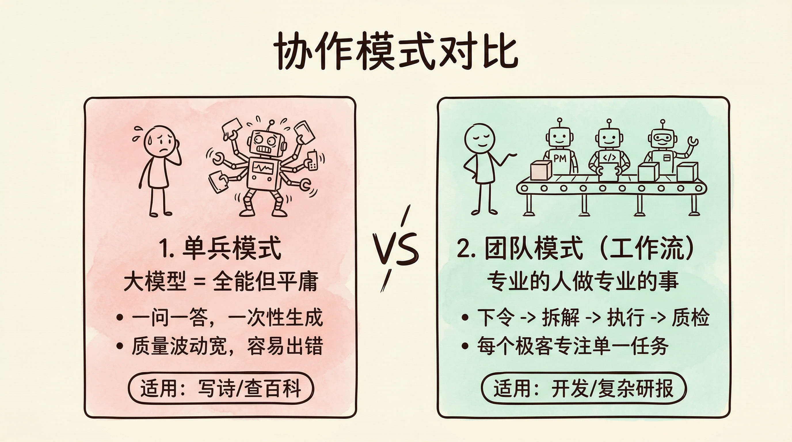
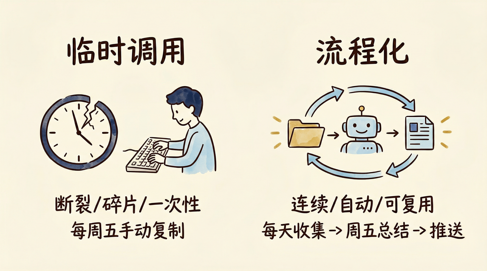

# 第2章 Agent 与普通 AI 工具的本质区别

工具是手臂的延伸，而 Agent 是大脑的延伸。
前者需要你挥动，后者需要你管理。

很多读者格刚接触 Agent 时，最困惑的问题往往是：「它和 DeepSeek 到底有什么区别？不都是一个对话框吗？」

确实，从表面看，它们长得几乎一模一样。但在皮囊之下，二者的灵魂截然不同。这一章，我们不谈技术，只谈「管理学」。

## 2.1 从「工具」到「角色」的切换

**❌ 错误反应：**
「AI 就是个加强版百度，或者个自动写稿机。」

**💥 后果：**
你永远只是在「用」它。
就像你手里拿着一把锤子，哪怕这把锤子是金子做的，你也只能用来砸钉子。你必须时刻盯着它，每一锤都要你亲自用力。你一松手，它就停了。

**✅ 正确逻辑：**
Agent 不是锤子，它是「拿着锤子的工人」。
你只需要告诉它「把墙砸了」。它会自己找锤子、找梯子，甚至会问你：「砸完要不要清运垃圾？」

**📝【认知对照表】**

| 维度 | 工具 (DeepSeek) | 角色 (Agent) |
| :--- | :--- | :--- |
| 交互方式 | 一问一答 | 你给目标，它交付结果 |
| 记忆能力 | 聊完即忘| 记住你的偏好与背景 |
| 主动性 | 被动等待 | 主动规划步骤 |
| 你的身份 | 操作员 | 管理者 |

**【心法】**
当你开始给 AI 起名字（如「文案小李」、「数据小王」）而不是叫它「那个软件」时，你就真正入门了。

## 2.2 多 Agent 协作的任务拆分方式

**❌ 错误反应：**
「我想做一个超级 AI，它既能写代码，又能画图，还能帮我订外卖。」

**💥 后果：**
你得到的一定是一个「表现拙劣的助手」。
这就好比你要求公司的行政人员，既要懂财务报表，又要会修电脑。结果是她什么都干了，但什么都干得一团糟。大模型虽然全能，但「全能」意味着「平庸」。

**✅ 正确逻辑：**
专业的人做专业的事。
把一个大任务拆碎，分给一串小 Agent，每个 Agent 只做一件事，但把它做到极致。这就是工业革命的精髓，也是 Agent 工作流的精髓。

**📝【协作模式：单兵 vs 团队】**

*   单兵模式（DeepSeek）：
    你 -> 提问 -> AI 回答。
    *适用场景*：写首诗、查个百科。

*   团队模式（Agent Workflow）：
    你 -> 下达指令 -> [产品经理 Agent] 拆解需求 -> [程序员 Agent] 写代码 -> [测试 Agent] 找 Bug -> 交付给你。
    *适用场景*：开发软件、写研报、运营账号。

**【心法】**
不要试图制造「神」，要学会组建「军队」。

## 2.3 人类与 Agent 的责任边界

把工作交给数字员工，不代表你可以当甩手掌柜。很多惨案的发生，就是因为人既不干活，也不检查。

**❌ 错误反应：**
「太好了，以后这活全归 AI 管，我再也不看了。」

**💥 后果：**
AI 可能会一本正经地产生幻觉，或者因为理解偏差而引发风险（比如给客户发了一封措辞不当的邮件）。等到出事了，责任全是你的。

**✅ 正确逻辑：**
建立 HIL（Human-in-the-loop，人在回路） 机制。
简单来说，就是「关键节点，人工确认」。

**📝【人机分工红线】**

| 任务类型 | Agent 权限 | 人类职责 |
| :--- | :--- | :--- |
| 只读不写（查数据、做分析） | ✅ 绿灯（可以随便跑，不用管） | 审阅最终结论。 |
| 内容生成（写草稿、画图） | 🟡 黄灯（可以生成，但不能直接发） | 必须修改和润色。 |
| 资金操作（付款） | 🛑 红灯（绝对禁止自动执行） | 必须二次点击确认。 |

**【心法】**
信任是建立在控制之上的。HIL 是你和 Agent 之间的安全带。

## 2.4 让 Agent 从临时使用走向流程化

这是大多数人无法突破的瓶颈。

**❌ 错误反应：**
「遇到问题 -> 想起 AI -> 打开网页 -> 临时写个 Prompt -> 得到结果 -> 关掉网页。」

**💥 后果：**
你的工作流是断裂的、碎片的、一次性的。
每次任务，你都要重新发起、重新引导。你依然被困在具体的事务中，只是换了一种更高级的工具在「低效重复劳动」。

**✅ 正确逻辑：**
把 Agent 嵌入流程。
不要让 Agent 游离在你的工作之外，要让它长在你的流程上。

**【场景对比：写周报】**

*   临时调用：周五下午，你把聊天记录复制给 DeepSeek，说「帮我总结一下」。下周五，你还得重复一遍。
*   流程化：你搭建了一个「周报工作流」。
    1.  每天晚上，你把记录丢进一个固定的文件夹。
    2.  [总结 Agent] 自动读取文件夹，生成当日小结。
    3.  周五下午，[周报 Agent] 自动抓取 5 份小结，生成周报草稿，推送到你的微信。
    4.  你只需要看一眼，点个「发送」。

**【心法】**
不要问「这个 AI 能干嘛」，要问「我的流程里，哪一步可以换成 AI」。

## 2.5 本章练习：设计你的「数字员工组」

在上一章的练习中，你已经列出了「最想自动化的 3 个任务」。现在，请挑选其中最复杂、最让你头疼的一个任务，试着用「管理者」的视角重新审视它。

请不要思考“具体的 Prompt 怎么写”，而是思考“如果我有一笔预算可以雇人，我会雇佣什么样的团队来完成它”。

请填写下方的【Agent 组队设计表】：

| 任务步骤 | 角色 (给 Agent 起个名) | 核心技能（需要会什么） | 人工是否审核 (HIL) |
| :--- | :--- | :--- | :--- |
| *例：写一篇公众号文章* | | | |
| *1. 选题策划* | *爆款选题官* | *分析热点、浏览历史数据* | ✅ *是 (决定方向)* |
| *2. 撰写初稿* | *资深文案* | *逻辑清晰、金句频出* | ❌ *否 (让它自己写)* |
| *3. 配图设计* | *插画师* | *MJ / Nano Banana 绘图* | ✅ *是 (审美把关)* |
| *你的任务步骤 1* | | | |
| *你的任务步骤 2* | | | |
| *你的任务步骤 3* | | | |

保留好这张表。在下一章，我们将学习如何把这些零散的角色，连成一张严密的**流程图**。

## 本章结语

读完这一章，希望你已经完成了一个关键的角色升级——不再把 AI 当作一把更好用的锤子，而是开始学会「带团队、排流程」。

1.  从埋头干活的操作员，变成善于分工的项目经理。
2.  从追求一把「万能瑞士军刀」，变成会配置一支「专业小分队」。
3.  从临时找工具救火的执行者，变成提前设计流水线的系统工程师。

这样的视角转变，是你真正驾驭 Agent 的起点。
有了这个基础，下一章我们将拿起纸笔，学习如何把这些角色和步骤画成清晰的流程图——因为只有画得出来的流程，才是 AI 能听懂、Agent 能稳定执行的语言。
