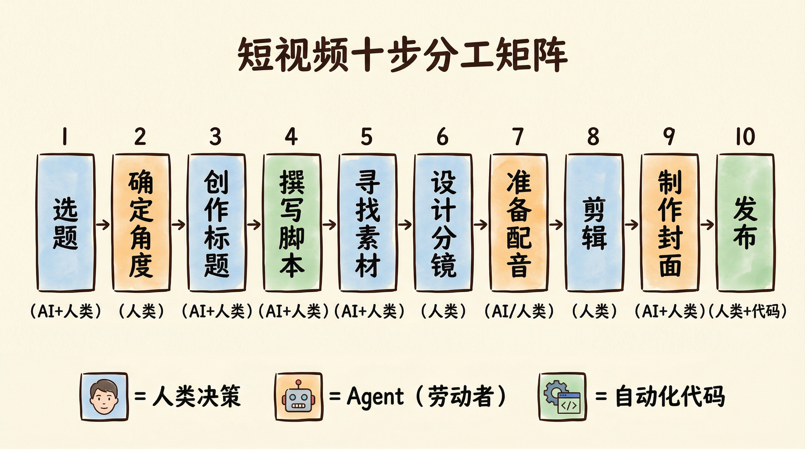
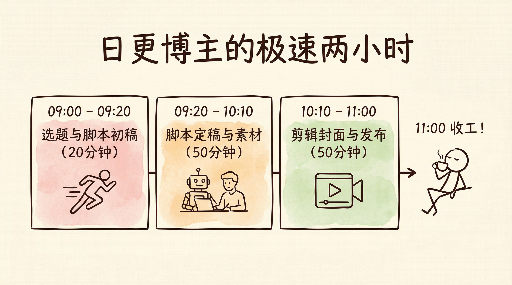

# 第7章 短视频从业者：一条视频从选题到出片的完整工作流

小陈做短视频半年了，三万粉丝，不算多，但也不少。

他的赛道是「AI 科技资讯口播」——每天用通俗易懂的大白话，给普通人讲 AI 行业发生了什么新鲜事。比如「DeepSeek 开源对打工人到底意味着什么」「苹果的 AI 为什么永远慢半拍」「月薪五千也能用上的三款 AI 工具」。

按理说，AI 赛道正处在风口，他应该做得风生水起。然而他的每一天依然像打仗。

早上九点，打开 36Kr、虎嗅和 X（Twitter），想找个今天能聊的 AI 话题。刷了四十分钟，看到三条大新闻——OpenAI 又发模型了、某大厂裁了 AI 团队、一个开源项目在 GitHub 上爆了——但每一条都觉得「别人肯定已经讲过了」，迟迟定不下来。十点半，硬着头皮选了 OpenAI 那条，开始写口播脚本。写到一半觉得角度太平，推翻重来。中午十二点，脚本终于定稿，开始找配图素材——AI 生成的图不满意，网上找的图版权不确定。下午两点半才开始剪辑，边剪边改脚本，越改越乱。晚上八点，终于导出成片，匆匆发了出去。

凌晨，他看了一眼后台数据：播放量 800，完播率 12%。

小陈叹了口气，关掉手机。他不是第一次经历这样的循环了。忙了一整天，产出一条平庸的视频。更让他焦虑的是，明天这一切还得从头再来——选题没有积累，脚本没有模板，素材没有库存。每一条视频，都是一个从零开始的「手工项目」。

**小陈以为自己缺的是灵感。其实他缺的是一条生产线。**

回忆一下前言里我们讲过的「手工作坊」和「智能工厂」的区别。小陈的状态，就是典型的手工作坊模式——他一个人身兼选题编辑、脚本作家、素材搜集员、剪辑师、封面设计师和运营专员六个角色，每个角色都在他脑子里抢占内存，每个角色都只有「凭感觉干」这一种工作方式。

这一章，我们要帮小陈（以及你）完成一次关键转变：**把"做视频"从一件混沌的创作行为，拆解成一条清晰的、可复用的、可以让 Agent 深度参与的内容生产流水线。**

而且，我们不只是纸上谈兵。这一章会手把手带你在**扣子编程**（Coze 2.0，官网 https://code.coze.cn/ ）上搭建真实可用的智能体和工作流，让你亲眼看到方法论是如何变成可运转的自动化系统的。

即使你不做短视频也没关系。这一章展示的拆解方法，适用于任何「内容生产」类工作——写文章、做播客、做直播、写方案，底层逻辑完全一样。

## 7.1 将一条视频拆成十个固定步骤

小陈的转折发生在某个周末。他偶然翻到了自己连续一周的屏幕使用记录，发现一个触目惊心的事实：他每天花在「纠结」上的时间，远远超过花在「干活」上的时间。

选题纠结一小时，角度纠结半小时，标题纠结二十分钟，脚本来回改一小时，素材反复试四十分钟……真正的「产出动作」（剪辑和发布）只占总时间的 30%。剩下 70% 的时间，他都在做同一件事：**思考"下一步该干嘛"。**

问题的根源不是效率低，而是**没有固定路径**。

于是小陈做了一件看起来很笨、但效果惊人的事：他把自己做一条视频的全过程，像第3章教的那样，逐一列成动作清单。列完之后他发现，不管聊什么 AI 话题，他做的事情其实都一样——**就是十件事，顺序几乎从不变。**

### 7.1.1 前期四步：选题 → 定角度 → 起标题 → 写脚本

前期是内容的「定义阶段」，解决的是「今天聊什么、怎么聊」。

**第一步：选题——今天聊哪条 AI 新闻？**

这是所有资讯类博主最头疼的一步。AI 行业每天都有新消息，信息量大到爆炸。大多数人的做法是「漫无目的地刷」——打开 X 刷一会儿，打开即刻看看 AI 圈，翻翻 36Kr 科技频道。刷了一小时，脑子更乱了——消息太多，反而不知道选哪条。

小陈给自己定了一套「原子级」操作（还记得第4章的原子级拆解吗？）：

1. 打开 3 个固定信息源（36Kr AI 频道、X 上关注的 AI 大V 列表、对标账号的最新视频）
2. 花 10 分钟快速浏览，不做深度阅读
3. 列出 3 个备选话题
4. 用一个标准筛选：**「这条消息，一个不懂技术的普通人听了会不会觉得'跟我有关'？」**——选 1 个

整个过程限时 15 分钟。超时未决，就选排第一的那个。

**第二步：定角度——普通人为什么要关心这件事？**

同一条 AI 新闻，可能有 200 个博主在讲。你的核心竞争力不在于「讲了什么新闻」，而在于「用什么角度切入」。

小陈的做法：

1. 对着选定话题问自己一个问题：**「如果我妈问我'这是啥'，我会怎么用一句话给她解释？」**
2. 用一句话写出核心观点（不超过 20 字）

比如，新闻是「OpenAI 发布了 GPT-5」。技术博主的角度是「参数量提升了多少」，而小陈的角度是「你花 20 美金订阅的 ChatGPT，明天开始就值 200 美金了」。一句话，切入点就出来了。

**第三步：起标题——怎么让人在信息流里停下拇指？**

标题决定了视频的打开率。这一步小陈后来交给了 Agent（7.2 会详细讲），但核心逻辑是：

1. 围绕角度写 5 个备选标题
2. 用「3 秒法则」自测：如果你在刷抖音时看到这个标题，会不会停下来？
3. 选定 1 个

**第四步：写脚本——把观点变成一段能说的话**

这一步是前期最耗时的环节。口播脚本和写文章不一样，它必须像「说话」而不是「念稿」。很多人写出来的脚本，一录制就发现磕磕巴巴，因为书面语和口语是两套系统。

小陈给自己定了一个固定的脚本骨架——所有视频都用同一个结构：

1. **钩子（前3秒）**：用一个反常识的事实或尖锐的提问开场。比如：「今天 AI 圈发生了一件大事，但 99% 的人都理解错了。」
2. **背景（15秒）**：用最简单的语言交代新闻本身
3. **解读（30-45秒）**：说清楚这件事为什么重要、对普通人有什么影响
4. **行动（5秒）**：引导关注或评论。比如：「你觉得 AI 会取代你的工作吗？评论区告诉我。」

有了这个骨架，写脚本就变成了「填空题」而不是「作文题」。

### 7.1.2 中期三步：找素材 → 设计分镜 → 准备配音

中期是内容的「物料准备阶段」，解决的是「画面用什么、声音用什么」。

**第五步：找素材/生成素材——准备视频画面**

AI 科技资讯口播有一个天然优势：大量画面可以用「新闻截图 + AI 生成图 + 产品界面录屏」来替代实拍。小陈把素材来源分成三类：

1. **新闻截图/产品界面**：直接截取相关网站、App 的画面（需注意标注来源）
2. **AI 生成素材**：用图像生成工具按描述生成概念图、配图
3. **录屏素材**：如果在讲某款 AI 产品的体验，直接录制操作过程

他的做法是逐句标注：这句话需要什么类型的画面？

**第六步：设计分镜——把脚本变成"画面脚本"**

分镜表是连接「脚本」和「剪辑」的桥梁。小陈的分镜表很简单，就是一个两列表格：


| 脚本（这句话说什么）                 | 画面（配什么画面）             |
| -------------------------- | --------------------- |
| "今天 AI 圈发生了一件大事"           | 新闻网站截图（大标题特写）         |
| "OpenAI 发布了 GPT-5，但重点不是参数" | GPT-5 发布页面截图          |
| "重点是，你手里那个 20 块的订阅……"      | AI 生成：一个人看手机，表情从惊讶变开心 |
| ……                         | ……                    |


有了分镜表，剪辑时就不用再思考「这段配什么画面」，直接对号入座。

**第七步：准备配音——录制旁白**

小陈是口播博主，大部分视频是对着镜头说话，配音在拍摄时同步完成。但当他做纯画面解说类视频时，有两个选择：

- **自己录**：按脚本逐段朗读，每段录两遍取效果好的
- **AI 配音**：把脚本喂给 TTS（文字转语音）工具，选择匹配的音色

### 7.1.3 后期三步：剪辑 → 制作封面 → 发布并记录数据

后期是内容的「交付阶段」，解决的是「怎么拼装、怎么发布、怎么复盘」。

**第八步：剪辑——拼装成品**

有了分镜表、素材和配音，剪辑就变成了一个「组装」动作：

1. 按分镜表把素材拖入时间线
2. 对齐配音/口播节奏
3. 加字幕（可用自动识别工具）
4. 加背景音乐
5. 导出

**第九步：制作封面——争夺那 0.5 秒的注意力**

封面决定了用户在信息流里会不会点击你的视频。小陈的封面公式：

1. 用一张和话题强相关的图（如 GPT-5 的 Logo、某公司CEO的照片）
2. 叠加 6-8 个大字标题（用对比色、加描边）
3. 确保在手机竖屏上清晰可辨

**第十步：发布并记录数据——收尾不是结束**

发布不是「往上一丢就完了」。小陈的固定动作：

1. 写发布文案（含 3-5 个话题标签，如 #AI #人工智能 #科技资讯）
2. 选择发布时间（他测试后固定在中午 12 点或晚上 8 点）
3. 发布后 24 小时记录核心数据：播放量、完播率、点赞率、评论数
4. 填入自己的数据追踪表

### 十步流程的全貌

把上面的内容整理成一张完整的 I/O 表——这正是第3章教你的流程图三部曲的实战版。


| 步骤      | 📥 输入（需要什么才能开始）   | 📤 输出（做完得到什么）    |
| ------- | ----------------- | ---------------- |
| ① 选题    | AI 行业新闻源 + 对标账号动态 | 1 个确定的话题         |
| ② 定角度   | 确定的话题             | 核心观点（一句话）        |
| ③ 起标题   | 话题 + 核心观点         | 1 个确定的标题         |
| ④ 写脚本   | 标题 + 核心观点         | 完整口播脚本（300-500字） |
| ⑤ 找素材   | 定稿脚本              | 全部画面素材（按脚本分段标注）  |
| ⑥ 设计分镜  | 脚本 + 素材清单         | 分镜表（脚本-画面对照表）    |
| ⑦ 准备配音  | 定稿脚本              | 配音音频文件（或口播录制）    |
| ⑧ 剪辑    | 分镜表 + 素材 + 配音     | 成片视频文件           |
| ⑨ 制作封面  | 成片视频 + 标题         | 封面图片             |
| ⑩ 发布+记录 | 成片 + 封面 + 发布文案    | 已发布视频 + 数据记录     |


现在来做第3章教过的「接口对齐检查」——上一步的输出，是否恰好等于下一步的输入？

逐一核对：「1 个确定的话题」→ 定角度需要「确定的话题」✅；「核心观点」→ 起标题需要「话题+核心观点」✅；「完整脚本」→ 找素材需要「定稿脚本」✅……一路检查下来，接口全部对齐，流水线通畅。


**【心法】**
你以为「做视频」是一件事，其实它是十件事。把它拆开之后你会发现：只有选题和定角度需要灵感，剩下八件事都是体力活。而体力活，恰恰是 Agent 最擅长的。

## 7.2 哪些环节最适合交给 Agent

小陈拿着这张十步流程图，做了一个关键动作：他在每一步旁边标注了三种颜色。

🔵 蓝色 = 人来做（需要创意判断）
🟠 橙色 = Agent 来做（信息处理或标准写作）
🟢 绿色 = 自动化脚本来做（格式转换或数据记录）

标完之后，他惊讶地发现：**十步里只有三步必须完全靠自己——定角度、设计分镜和剪辑。** 其余七步都可以全部或部分交给 Agent 和自动化工具。

这正是第4章「任务分配矩阵」的实战版。我们来看完整的分工方案：


| 步骤       | 执行者             | Agent 类型 | 为什么这样分？                              |
| -------- | --------------- | -------- | ------------------------------------ |
| ① 选题     | **Agent + 人审核** | 信息类      | AI 资讯扫描是海量信息处理，Agent 的强项；但最终选哪条必须人拍板 |
| ② 定角度    | **人**           | —        | 角度是你的人设和判断力，不可替代                     |
| ③ 起标题    | **Agent + 人筛选** | 写作类      | Agent 批量生成备选标题，人凭直觉选最好的              |
| ④ 写脚本    | **Agent + 人修改** | 写作类      | Agent 按结构出初稿，人加入口语化表达和个人风格           |
| ⑤ 找/生成素材 | **Agent + 人**   | 图像类      | AI 生成部分素材；新闻截图和录屏由人来                 |
| ⑥ 设计分镜   | **人**           | —        | 视觉叙事节奏需要人的审美判断                       |
| ⑦ 准备配音   | **Agent 或 人**   | TTS 工具   | 纯画面视频交给 AI 配音，口播由人录制                 |
| ⑧ 剪辑     | **人**           | —        | 剪辑节奏和情绪把控暂时还需要人                      |
| ⑨ 制作封面   | **Agent + 人筛选** | 图像类      | Agent 出 3 版封面，人选 1 版                 |
| ⑩ 发布+记录  | **人 + 自动化脚本**   | —        | 发布人来操作，数据记录交给脚本自动抓取                  |




你会发现一个有趣的规律：**人负责「开头」的决策和「过程中」的创意判断，Agent 负责信息搜集和文字产出的苦力活。** 这和第4章讲的「人机协作黄金比例」完全吻合。

接下来，我们重点看两个最核心的 Agent 在 AI 科技资讯场景中的具体用法——并且直接在**扣子（Coze）**平台上把它们搭建出来。

### 7.2.1 热点扫描与竞品拆解 → 选题 Agent

选题是短视频的起点，也是资讯类博主每天浪费时间最多的环节。

小陈的痛点：他每天要花 40 分钟到 1 小时刷各种科技媒体和社交平台找话题。而「刷」这个动作本身就是注意力黑洞——你打开 X 说是找 AI 新闻，结果看了半小时争吵帖，选题一个没找到。

他需要一个「AI 资讯搬运工」：每天自动扫描各路信息源，输出一份干干净净的选题清单，他只需要花 5 分钟做选择题。

**📝 小陈的选题 Agent 岗位说明书（基于第5章万能模板）**

```markdown
# Role: AI科技资讯选题分析师

## 1. Profile
- Description: 你是一名专注于人工智能领域的短视频选题分析师。
  你的任务是每天为我提供一份「可直接使用的选题推荐清单」。

## 2. Goals
- 找到当天AI行业最值得关注的新闻和动态
- 分析同领域对标账号的最新爆款内容
- 输出一份结构化的选题清单，让我5分钟内做出选择

## 3. Constraints
- 只关注近24小时内的新闻，忽略过期话题
- 不输出你的观点和评价，只陈述事实和数据
- 每个选题必须用一句话说明「为什么普通人应该关心这件事」
- 如果当天没有重大AI新闻，可以推荐AI工具测评或行业趋势类选题

## 4. Input
- 我的账号定位：AI科技资讯口播，目标粉丝是对AI感兴趣的职场人和科技爱好者
- 关注领域：大模型动态、AI产品发布、开源项目、AI政策法规、AI应用案例
- 对标账号：[账号A]、[账号B]、[账号C]

## 5. Workflow
1. 搜索近24小时AI领域的重要新闻和动态
2. 扫描对标账号的最新视频，记录标题和互动数据
3. 综合热点和竞品，筛选出5个最值得拍的选题
4. 按推荐优先级排序输出

## 6. Output Format
### 今日AI选题推荐

| 排序 | 选题话题 | 信息来源 | 热度判断 | 普通人为什么要关心 |
| 1 | [话题] | [来源] | [高/中] | [一句话] |
| 2 | ... | ... | ... | ... |

### 对标账号动态
| 账号 | 最新视频标题 | 发布时间 | 点赞数 |
| ... | ... | ... | ... |
```

这份 JD 的每一个字段，都对应第5章讲的四个要素：工作目的、输入来源、输出成果、限制条件。**同一个模板，换个场景填一遍，就是一个新的可用 Agent。**

#### 【实操：在扣子编程上创建选题 Agent】

现在，我们把上面这份 JD 变成一个真正能运行的智能体。打开 **https://code.coze.cn** （扣子编程），跟着下面的步骤操作。

扣子编程是字节跳动的 AI 开发平台，支持用**自然语言描述需求**，由 AI 自动生成智能体或工作流，无需手动画节点、配插件。

**第一步：登录并新建项目**

1. 在浏览器访问 **https://code.coze.cn** 并登录。
2. 在页面顶部选择你的工作空间。
3. 在左侧导航栏点击「**新建项目**」。
4. 选择创建「**智能体**」（或「对话应用」），项目名称可填：AI科技选题分析师。


**第二步：用自然语言描述选题 Agent 的能力**

在智能体开发界面中，你会看到用于描述需求的输入框。把「你要一个什么样的选题分析师」用一段话讲清楚即可，不必逐条贴 JD。例如：

> 请帮我搭建一个「AI科技资讯选题分析师」智能体。它的任务是：每天根据我的账号定位（AI科技资讯口播，目标粉丝是职场人和科技爱好者），**联网搜索**近 24 小时 AI 行业的热门新闻和对标账号动态，输出一份结构化的「今日选题推荐清单」。清单格式为表格：排序、选题话题、信息来源、热度判断、普通人为什么要关心（一句话）。只关注大模型动态、AI 产品发布、开源项目、政策法规和应用案例，不输出观点只陈述事实；若找不到可靠来源要写明「未找到」，不许编造。需要能调用网络搜索能力。

描述时务必写上「**需要联网搜索**」或「调用搜索能力」，这样生成的智能体会具备查最新新闻的能力。


**第三步：生成并试运行**

点击「生成」或「运行」后，扣子编程会根据你的描述自动生成智能体（含提示词与所需能力配置）。生成完成后，在预览/调试区输入一句测试语：

> 请帮我分析今天有哪些值得拍的AI选题。

看输出是否符合你要求的表格格式、是否真是近期新闻、推荐理由是否站得住脚。若选题太「硬核」，在对话里补充一句需求即可，例如：「请加一条约束：选题必须能用大白话向非技术人员解释清楚，避免纯学术话题。」系统会据此迭代。


**第四步：发布**

调试满意后，点击「发布」。发布后的智能体可被你在同一空间内随时调用，或通过豆包、网页等渠道使用。每天早上打开它问一句「今天有哪些值得拍的AI选题」，选题清单就来了。

到这里，你已经完成了第一个智能体的搭建。核心工作就是「把需求用自然语言说清楚」——**这就是第5章讲的岗位说明书在扣子编程里的用法：先想清楚再描述，描述越准，生成越准。**

### 7.2.2 脚本初稿与标题备选 → 脚本 Agent

选好题之后，下一个耗时大户是写脚本。

小陈过去的做法是对着空白文档发呆。脑子里有观点，但就是不知道怎么组织。经常写了删、删了写，一个 400 字的口播脚本能磨两小时。

他后来在扣子编程上配置了一个脚本智能体，用法非常简单：把选题卡（话题+角度+标题）喂进去，智能体按照他定好的四段式结构输出初稿，他再花 10-15 分钟改成自己的说话风格。

#### 【实操：在扣子编程上创建脚本 Agent】

在扣子编程（https://code.coze.cn） 里同样选择「新建项目」→ 创建智能体，项目名称可填：AI资讯口播脚本生成器。在描述需求时，用自然语言说明以下要点即可：

| 配置项 | 内容 |
| :--- | :--- |
| **输入** | 用户提供：话题+角度+标题+目标受众 |
| **输出结构** | 严格按「钩子→背景→解读→行动」四段式，每段标注建议时长 |
| **风格** | 口语化、短句为主，像朋友聊天；禁止「综上所述」「众所周知」「在当今社会」等书面表达 |
| **字数** | 总计 300-500 字（对应 1-2 分钟视频） |
| **红线** | 不许编造事实和数据，需引用时留 [待补充数据]；每句话不超过 25 字便于口播 |

描述示例：「请搭建一个口播脚本生成器。用户会给我话题、角度、标题和目标受众，请按四段式输出：钩子（前3秒）、背景（约15秒）、解读（约30-45秒）、行动（约5秒）。口语化、短句，禁止书面腔。300-500字，不编造数据。」生成后试运行几次，按需在对话里补充约束即可。


提示词的核心部分（你若手动微调可参考）示范：

```markdown
# Role: AI科技资讯口播脚本写手

## Profile
你是一名短视频口播脚本专家，擅长把复杂的AI科技新闻翻译成
20岁大学生也能听懂的大白话。你的脚本读起来像朋友在聊天，不像主持人在念稿。

## Output Format
请严格按以下结构输出，不要任何开场白：

**【钩子 | 前3秒】**
（用一个反常识事实或尖锐提问开场，让人停下拇指）

**【背景 | 约15秒】**
（用最简单的语言交代新闻本身，不要专业术语）

**【解读 | 约30-45秒】**
（说清楚这件事为什么重要、对普通人有什么影响）

**【行动 | 约5秒】**
（引导关注或评论）
```

小陈说，用了脚本 Agent 之后，写脚本这一步从「最痛苦的 2 小时」变成了「最轻松的 20 分钟」。Agent 出的初稿虽然不完美，但骨架是对的，他只需要做「加减法」——删掉 AI 味太重的表达，加入自己的吐槽和口头禅。

**标题生成也走同样的逻辑**：在脚本 Agent 的提示词末尾加一条「同时请输出 5 个备选标题」，或者单独创建一个标题 Agent，让它一次性输出 5-8 个风格各异的标题。人花 1 分钟挑一个最顺眼的。

### 7.2.3 分镜草图与封面设计 → 图像类 Agent

图像类 Agent 在 AI 科技资讯场景中主要有两个用途：

**用途一：生成视频配图素材**
当脚本中需要一些概念图（比如「AI 取代人类工作」的抽象场景），可以用图像生成工具按描述生成。小陈的经验是，描述越具体越好：

- ❌ "一张关于AI的图片" → 你会得到一个无聊的机器人
- ✅ "一个年轻程序员坐在电脑前，屏幕上显示着一行代码和一个AI对话框，程序员表情震惊，画风扁平插画风格，色调蓝紫色" → 直接能用

**用途二：生成封面**
封面 Agent 的配置较简单，输入视频标题和一张关键画面截图，输出 3 版不同风格的封面方案。

在扣子编程中，若你创建的智能体或工作流需要图像生成能力，在描述需求时写明「需要根据文字描述生成配图/封面图」即可，平台会为生成的应用配置相应的图像生成能力。

**【心法】**
Agent 不是来取代你的创造力的，而是来承接创造力之后的「执行苦力」。你负责决定「聊什么」和「怎么切入」，Agent 负责「写出来」和「做出来」。这个分工一旦建立，你会发现自己不是变懒了，而是终于有时间去想真正重要的事了。

## 7.3 日更账号的标准工作流长什么样

小陈把上面的分工方案落地之后，做了一件让他自己都吃惊的事：他把一天的工作排成了一张时间表，发现只要流程不变，**一上午不到两小时就能把整条视频做完。**

上午收工之后，下午的时间可以完全自由支配——研究行业趋势、深度体验 AI 新产品、和粉丝互动，甚至接品牌合作。

这一节，我把小陈的日更工作流完整展示出来。你可以把它当成一个「样板」，根据自己的实际情况调整。

### 7.3.1 上午（9:00 - 9:20）：热点监测与选题确认


| 时间   | 执行者      | 动作                                    | 产出物          |
| ---- | -------- | ------------------------------------- | ------------ |
| 9:00 | **人**    | 打开扣子编程里的「选题智能体」，发一句：「今天有哪些值得拍的AI选题？」 | —            |
| 9:02 | 选题 Agent | 联网搜索近24小时AI热点，输出选题推荐清单                | 选题清单（5条）     |
| 9:05 | **人**    | 浏览清单，选定 1 个话题                         | 确定的话题        |
| 9:08 | **人**    | 为选定话题写一句核心角度                          | 核心观点（一句话）    |
| 9:10 | 脚本 Agent | 根据话题+角度，同时生成脚本初稿和 5 个备选标题             | 脚本初稿 + 5 个标题 |
| 9:12 | **人**    | 筛选确定 1 个标题                            | 最终标题         |
| —    | —        | **产出：今日选题卡（话题+角度+标题+脚本初稿）**           | —            |


注意这里的节奏：**从 9:00 到 9:12，只用了 12 分钟，选题和脚本初稿就全部就位。** 而在改造前，光选题就要花 40 分钟到 1 小时。

还记得第5章 5.3.3 讲的「接力棒规则」吗？这里的「今日选题卡」就是整条流水线的第一根接力棒。它的格式是固定的（话题+角度+标题+脚本初稿），下游所有环节都以这张卡为起点。

### 7.3.2 上午（9:20 - 10:10）：脚本定稿与素材准备


| 时间    | 执行者           | 动作                               | 产出物     |
| ----- | ------------- | -------------------------------- | ------- |
| 9:20  | **人**         | 修改脚本初稿：调整口语化表达，加入自己的吐槽和金句，替换占位案例 | 定稿脚本    |
| 9:40  | **人**         | 根据脚本逐句标注画面类型，填写分镜表               | 分镜表     |
| 9:50  | **人 + Agent** | 按分镜表准备素材：截取新闻页面、AI 生成配图、录制产品界面   | 全部素材就位  |
| 10:05 | **人 或 TTS**   | 录制口播 / 生成AI配音                    | 配音/口播素材 |
| —     | —             | **产出：定稿脚本 + 全部素材 + 分镜表 + 配音**    | —       |


这个阶段大约 50 分钟，其中真正需要「动脑」的只有两件事：**改脚本（20分钟）和填分镜表（10分钟）**。

### 7.3.3 上午（10:10 - 11:00）：剪辑、封面与发布


| 时间    | 执行者      | 动作                        | 产出物   |
| ----- | -------- | ------------------------- | ----- |
| 10:10 | **人**    | 按分镜表剪辑：拖素材→对配音→加字幕→加音乐→导出 | 成片视频  |
| 10:45 | 封面 Agent | 根据视频标题 + 关键帧截图，生成 3 版封面   | 3 版封面 |
| 10:48 | **人**    | 选定 1 版封面                  | 最终封面  |
| 10:50 | 文案 Agent | 生成发布文案（含话题标签）             | 发布文案  |
| 10:55 | **人**    | 检查文案，发布视频                 | 已发布视频 |
| 次日    | 自动化      | 记录 24 小时数据到追踪表            | 数据记录  |


### 日更工作流全景

把三个时段拼在一起，小陈**一上午**的工作节奏是这样的：

> **9:00 - 9:20**（20分钟）：选题确认 + 脚本初稿
> **9:20 - 10:10**（50分钟）：脚本定稿 + 素材准备
> **10:10 - 11:00**（50分钟）：剪辑 + 封面 + 发布
>
> **总计：一上午约 2 小时，当日视频全部完成。**



这和他改造前「一整天忙到半夜」的状态比起来，简直是两个世界。现在他上午收工，下午的时间完全属于自己。

但更重要的不是时间本身，而是**这套流程的可复用性**。小陈每天走的是同一条路，变化的只是「选题卡」里填的内容。路径固定了，他就不再需要花精力思考「下一步该干嘛」，所有的脑力都可以集中到最重要的事情上——**想一个好角度。**

这就是第4章「五步法」的终极目标：**把「思考」和「执行」分离。你只需要做一次思考（设计流程），然后每天重复执行（跑流程）。**

#### 【进阶实操：在扣子编程里用工作流串联选题与脚本】

到目前为止，小陈的选题智能体和脚本智能体是两个独立应用，他需要把选题结果复制给脚本智能体。若想「输入一个话题就自动跑完全程」，可以用扣子编程的**工作流**能力，让 AI 根据你的自然语言描述自动生成一条流水线。

**第一步：新建工作流项目**

1. 在扣子编程（https://code.coze.cn）左侧点击「**新建项目**」。
2. 选择「**工作流**」类型。
3. 项目名称可填：AI资讯日更-选题脚本生成器。


**第二步：用开发提示词描述整条流水线**

扣子编程的工作流采用「**AI 编程**」：你在工作流页签的输入框中，用一段**开发提示词**（自然语言）描述你要的流程，AI 会自动生成包含节点与连接的工作流，无需手动画节点、拖连线。

示例开发提示词：

> 请搭建一个工作流，实现以下逻辑：
> 1. **输入**：用户传入一个 AI 话题关键词（如「GPT-5发布」）。
> 2. **第一步**：根据该关键词联网搜索近期的相关新闻与资讯，得到结构化检索结果。
> 3. **第二步**：将「话题关键词 + 检索结果」交给大模型，按固定格式生成：(1) 一段口播脚本（四段式：钩子、背景、解读、行动，300-500 字，口语化）；(2) 5 个备选视频标题。
> 4. **输出**：直接返回脚本和标题，便于用户复制使用。
>
> 大模型段的系统提示词需约定：不编造事实，数据不足时用 [待补充]；每句话不超过 25 字。

输入后点击「生成」或「运行」，平台会生成对应的工作流（通常包含开始节点、搜索/插件节点、大模型节点、结束节点及它们之间的连线）。


**第三步：试运行与调整**

在「试运行」里输入一个测试话题（如「GPT-5发布」），查看整条工作流的执行结果：搜索是否拿到近期新闻？脚本和标题格式是否符合要求？若某一步不对，可以在对话里补充说明（例如「搜索结果请只保留权威科技媒体」），让 AI 调整工作流。


**第四步：发布**

调试通过后发布该工作流。之后每天早上，你只需在扣子编程里打开这个工作流、输入当天要聊的话题关键词，即可一次性得到选题依据、口播脚本和备选标题，形成一张完整的「选题卡」。

> **💡 回扣方法论**：你刚才在扣子编程里做的事，本质就是第4章「五步法」的落地——
>
> 1. 明确目标（日更一条 AI 资讯视频）
> 2. 拆解步骤（搜索 → 整理 → 生成脚本与标题）
> 3. 定义 I/O（话题 → 检索结果 → 脚本+标题）
> 4. 分配执行者（搜索能力 + 大模型）
> 5. 沉淀为可复用资产（发布为工作流，每日直接调用）
>
> 在扣子编程里，这些步骤通过「用自然语言说清楚」就能被 AI 转成可执行的工作流。

**【心法】**
日更的秘密不是「每天都很努力」，而是「每天都走同一条路」。当路径固定了，你的精力就可以全部投入到唯一需要创造力的环节——想一个别人没想到的角度。

## 7.4 案例：用流程支撑一个 IP 的长期稳定更新

方法讲完了，最后我们用小陈的完整故事，把这一章的所有内容串起来。你会看到一个普通的 AI 科技博主，是如何从「随时可能断更」的脆弱状态，进化到「即使不在也能持续产出」的稳定状态的。

### 7.4.1 初始状态：全靠灵感，节奏不稳定

小陈做了半年 AI 科技口播视频，积累了 3 万粉丝。AI 赛道正火，他的内容是有受众的。但从体感上看，他快要撑不住了。


| 指标       | 数据                           |
| -------- | ---------------------------- |
| 每周发布频率   | 2-5 条（极不稳定，取决于他那周「有没有看到好素材」） |
| 单条视频制作时间 | 4-8 小时                       |
| 选题耗时     | 40分钟 - 2小时                   |
| 脚本耗时     | 1-2 小时                       |
| 每月断更天数   | 8-12 天                       |
| 粉丝月增长    | 1000-3000（波动极大）              |


他分析了自己断更的原因，Top 3 是：

1. **选题想不出来**（占 40%）——AI 新闻天天有，但「值得讲的」和「已经被讲烂的」分不清，刷了一小时什么都没定，干脆摆烂
2. **脚本写不下去**（占 35%）——技术概念太复杂，不知道怎么用大白话讲清楚，对着空白页发呆
3. **剪辑太累不想动**（占 25%）——前面两步已经耗完了精力，到剪辑这步已经想放弃

这三个原因有一个共同规律：**全都发生在「不知道下一步该怎么办」的时刻。** 不是他不想做，是他每次都要从零开始思考「怎么做」，光是思考过程就已经把精力消耗殆尽了。

### 7.4.2 加入关键流程节点后的明显变化

小陈的改造分三步走，完全对应第6章讲的「从 v1 到 v3 的演进路径」。

**第一步：固化十步流程（用第3章的方法）**

小陈花了一个下午，用 7.1 的方法把做视频的全过程拆成十步，画了流程图，打印贴在电脑旁。

效果立竿见影。光是「贴了一张流程图」这个动作，就让他的断更率下降了一半。原因很简单：以前一坐到电脑前就焦虑「今天该干嘛」，现在一抬头就看到十步流程——**不用想了，从第一步开始走就行。**

**第二步：在扣子编程上配置核心智能体（用第5章的方法）**

流程图解决了「知道下一步干嘛」的问题，但每一步还是要亲自动手。于是小陈按照 7.2 的方法，在**扣子编程**（https://code.coze.cn）上用自然语言描述需求，搭建了三个智能体：

- **选题智能体**：每天帮他联网搜索 AI 行业热点，输出选题清单
- **脚本智能体**：输入选题卡，输出四段式口播脚本初稿
- **封面智能体**：输入标题和关键帧截图，输出 3 版封面

后来他又进一步，用扣子编程的工作流功能，用一段开发提示词把「选题 + 脚本」串成一条自动化流水线——输入一个话题关键词，选题分析和脚本初稿一步到位。

**第三步：建立试跑和迭代机制（用第6章的方法）**

前两周并不是一帆风顺的。小陈盯着每一步 Agent 的输出，发现了一堆问题：


| 错误现象                   | 原因分析          | 修正方案（在扣子上打补丁）                                      |
| ---------------------- | ------------- | -------------------------------------------------- |
| 选题太硬核，全是论文和技术架构        | JD 里没限定受众理解门槛 | 在提示词的 Constraints 里加：「选题必须能用大白话向非技术人员解释清楚，避免纯学术话题」 |
| 脚本开头太「端着」，满篇「在当今AI浪潮下」 | JD 里没禁止书面化表达  | 在风格要求里加：「开头第一句必须像朋友聊天，禁止使用'在当今''随着''众所周知'等开头」      |
| 脚本里出现了编造的融资数据          | 红线写得不够严格      | 在 Constraints 里加：「严禁编造任何数据，如需引用数据请写[待核实：XX数据]」     |
| 搜索结果里混入了广告软文           | 没限定信息来源质量     | 在 Workflow 里加：「忽略来自营销号和软文的内容，只保留权威科技媒体来源」          |


每发现一个问题，小陈就在扣子编程里找到对应的智能体或工作流，用对话补充一句约束（例如「请加一条：选题必须能用大白话向非技术人员解释」）或修改需求描述，让 AI 重新生成一版——这就是第6章讲的「打补丁」机制。**不需要推倒重来，只需在原有描述上增加一两条约束即可。**


第三周，大部分问题消失了。第四周，他开始真正放手——一上午：20 分钟选题改脚本，50 分钟准备素材和分镜，50 分钟剪辑发布。**整条流水线稳定运转，上午收工，日更完成。**

**改造前后对比：**


| 指标       | 改造前        | 改造后                    |
| -------- | ---------- | ---------------------- |
| 每周发布频率   | 2-5 条（不稳定） | 7 条（稳定日更）              |
| 单条视频制作时间 | 4-8 小时     | 1-2 小时                 |
| 选题耗时     | 40分钟-2小时   | 5 分钟（Agent 推荐 + 人筛选）   |
| 脚本耗时     | 1-2 小时     | 20 分钟（Agent 初稿 + 人修改）  |
| 每月断更天数   | 8-12 天     | 0 天                    |
| 粉丝月增长    | 1000-3000  | 5000-8000（更新稳定，算法推荐增加） |


### 7.4.3 形成可交付给团队执行的内容流水线

小陈的粉丝涨到 10 万之后，开始有 AI 产品的品牌来找他合作。他忙不过来，决定招一名助理。

这时，流程化的价值体现得淋漓尽致。

**如果没有流程**，他需要花至少两周手把手教助理：「选题你要去看哪些网站……脚本你要用什么结构……什么样的 AI 新闻值得讲，什么样的不值得……」而且教完之后，助理做出来的东西大概率和他想的不一样，因为很多判断标准只存在于小陈的脑子里。

**有了流程之后**，小陈做了一件事：把「资产三件套」打包发给助理。

还记得第4章讲的「资产化三件套」吗？

1. **一张标准流程图**：十步流程图，标注了每一步的执行者和 I/O 格式
2. **一组经过验证的智能体**：选题、脚本、封面三个智能体都在**扣子编程**上搭好了，助理登录 https://code.coze.cn/ 就能用——而且需求描述已经过四周迭代打磨，常见坑都通过「打补丁」堵住了
3. **一条可触发的工作流**：在扣子编程里用开发提示词搭好的「选题+脚本」一体化工作流，输入话题就出结果

助理拿到这套东西，**第一天就能按流程产出内容。** 质量能达到小陈本人水平的 80%。剩下的 20%——角度的独特性、吐槽的个人风格——小陈只需要在最后审阅环节花 10 分钟调整。

这就是第3章讲的「可交接性」检验标准：**如果你休假了，能不能直接把这套东西丢给别人，让他不问你一句就跑出 80% 质量的结果？** 小陈做到了。

更深一层地说，这也印证了一个很多内容创作者不愿意承认的事实：

**95% 的资讯类视频都遵循同样的结构**——钩子、背景、解读、引导。真正让你和别人不同的，是那 5% 的独特角度和表达方式。流程化不是把你变成流水线工人——恰恰相反，它帮你把 95% 的体力活甩掉，让你 100% 的脑力都花在那最珍贵的 5% 上。

这才是「创作自由」的真正含义。

## 本章结语

这一章，我们用「AI 科技资讯口播」这个场景，完整演示了前六章方法论的落地全过程：

- 用第3章的流程图三部曲，把「做视频」拆成了十个步骤，标注了每一步的输入和输出
- 用第4章的任务分配矩阵，确定了哪些步骤交给人、哪些交给 Agent、哪些交给自动化脚本
- 用第5章的 JD 万能模板，为选题、脚本、封面三个核心 Agent 写了岗位说明书
- 用第6章的试跑和迭代机制，把工作流从 v1 调试到了稳定运转的 v3

更重要的是，我们不只是纸上谈兵——你已经看到了如何在**扣子编程**上，用自然语言描述需求，把这些智能体和工作流真正搭建出来。从新建项目、描述选题/脚本智能体能力，到用开发提示词生成「选题+脚本」一体化工作流，再到试运行和用对话打补丁，每一步都对应可执行的实操指引。

短视频只是一个缩影。你会发现，任何内容生产类的工作——写文章、做播客、做直播、写报告——都可以用完全相同的思路去拆解：先列出所有步骤，然后标注 I/O，然后分配执行者，然后在扣子上搭出来，跑通、迭代、打补丁。

如果你不做短视频，没关系。下一章我们进入另一个高频场景——电商运营。你会看到同样的方法论和同样的扣子编程，在一个完全不同的行业里，依然能产出惊人的效率提升。