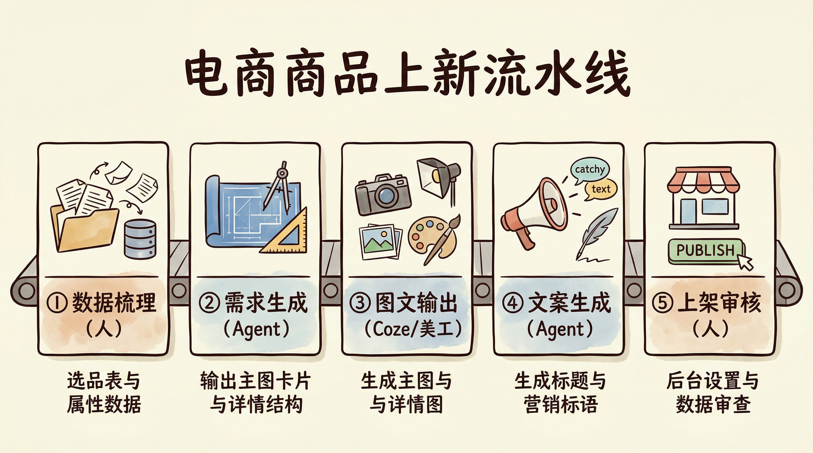
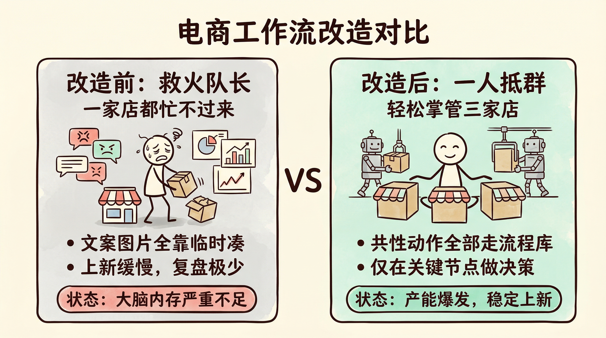

# 第8章 电商从业者：商品图到上新的完整工作流

阿珍做电商三年了，主做女装，一家淘宝店、一家拼多多店，都是自己一个人盯。

按理说，选款、拍照、上架、客服、看评价、做活动，每一样她都熟。可她的每一天依然像救火——早上起来先回一堆「什么时候发货」「有没有尺码」的客服消息，接着改主图：老板说「不够高级」，改一版；又说「不够接地气」，再改一版。中午扒拉两口饭，开始扒拉后台评价，想从里面挖点卖点或差评原因，看了两百条眼睛都花了，也没理出个头绪。下午要上新了，商品资料还没整理完，主图、详情、标题、营销语全是临时凑的。晚上报活动，发现竞品已经上了同款且价格更低，只好再调价、改文案。半夜躺下还在想：明天还有两个款要上，主图从哪来？

阿珍以为自己缺的是人手。其实她缺的是一条流水线。

回忆一下前言里我们讲过的「手工作坊」和「智能工厂」的区别。阿珍的状态，就是典型的手工作坊模式——她一个人身兼选款、美工、文案、运营、客服、复盘六个角色，每个角色都在她脑子里抢占内存，每次上新、每次看评价都是「这次再临时想办法」。

这一章，我们要帮阿珍（以及你）完成一次关键转变：把「做商品图、挖评价、上新、复盘」从一堆零散动作，拆解成一条清晰的、可复用的、可以让 Agent 深度参与的电商工作流。

而且，我们不只是纸上谈兵。这一章会手把手带你在扣子编程（官网 https://code.coze.cn ）上搭建真实可用的智能体，让你亲眼看到方法论在电商场景里是如何落地的。

这里先区分两个产品，避免后面搞混：扣子（原名「扣子空间」，官网 https://coze.cn ）是字节旗下类似 Manus 的通用智能体——能生图、做视频、写文案，什么都能干一点，你直接用它完成任务即可。

扣子编程（官网 https://code.coze.cn ）则是用来「搭建智能体」的开发平台——你在上面用自然语言描述需求，生成专属的 Agent，供自己或团队反复使用。本章在扣子编程里建的「主图需求卡 Agent」产出的需求卡，可以直接发给扣子去做生图。

即使你不做电商也没关系。这一章展示的「从资料到素材、从数据到决策」的拆解方法，适用于任何「高频重复、又要一点创意」的岗位——活动运营、用户研究、内容审核，底层逻辑完全一样。

## 8.1 用扣子生成商品图与模特换装方案

电商的第一眼竞争力，多半在主图和详情图。图不对，点击率、转化率都上不去。但很多小团队没有专职美工，主图要么外包反复改，要么自己用手机随便拍，风格不统一、卖点不清晰。

阿珍的转折，是从「把主图需求说清楚」开始的。她发现，只要先把「要什么风格的图、突出什么卖点、用在什么场景」写成一页需求，再交给扣子（或外包美工）去生图，返工率会大幅下降。而这一页需求，恰恰可以用扣子编程里的智能体来批量生成；生成出来的主图需求卡，可以直接复制给扣子，让扣子按需求出图。

### 8.1.1 用 RPA 或手工收集商品信息与核心卖点

生成主图之前，必须先有「原料」：商品的基础信息（品名、材质、尺码、颜色）和核心卖点（为什么值得买、和竞品的区别）。

阿珍的做法很直接：

1. 从后台或 ERP 拉出商品资料：品名、类目、属性、成本价、建议零售价。若没有系统，就用 Excel 维护一张「待上新商品表」。
2. 补全「卖点」一栏：每个款用 3～5 句话写清楚——材质/工艺/设计亮点/穿着场景/目标人群。这一步一开始是她自己写，后来交给智能体根据商品资料生成初稿，她只做删改。
3. 输出一份「主图需求卡」：包含商品名、3 个核心卖点、期望风格（如「简约白底」「场景穿搭」「节日氛围」）、尺寸与张数（如主图 1 张 800×800，详情 5 张 750 宽）。

有了需求卡，后面无论是用扣子生成模特换装图、白底图或场景图，还是发给美工，都有据可依。

### 8.1.2 选择模特与场景风格并生成多版图片

扣子支持「模特换装」「场景图」等生图能力：你可以把主图需求卡里的风格描述、卖点直接发给扣子，或上传服装图/参考图，让扣子按需求生成多版主图/详情图。阿珍的流程是：

1. 根据需求卡定风格：例如「秋冬针织衫」选暖色场景、偏生活化；「通勤衬衫」选简约白底或办公室场景。
2. 把需求卡发给扣子：打开扣子（coze.cn），把主图需求卡的内容粘贴进去，或按扣子界面选择模特与场景风格，生成 3～5 版不同构图/角度。
3. 初筛：先删掉明显不符合的（如比例怪、颜色偏），留下 2～3 版备用。

这一步的重点不是「学会扣子的每个按钮」，而是需求卡稳定、风格统一，这样生成结果才可控。

### 8.1.3 选定最优组合并输出主图 + 详情图方案

最后一步是「拍板」：从 2～3 版里定主图 1 张、详情图 5～6 张，并按平台要求裁剪、命名、上传。

阿珍会做一张简单的「主图+详情图方案表」：主图用哪张、详情第 1 屏放什么、第 2 屏放什么（卖点/尺码/细节/评价摘要），这样下次同类目商品可以直接套用结构，只换图与文案。

小结：8.1 的本质是「先有需求，再出图」。需求卡越清晰，扣子或美工产出越稳定。而需求卡里的「卖点提炼」「风格描述」，可以用扣子编程里的智能体批量生成；生成出来的主图需求卡，可以直接发给扣子（coze.cn）进行生图，你再微调即可。

#### 【实操：在扣子编程上创建主图需求卡 Agent】

在扣子编程（https://code.coze.cn ）里选择「新建项目」→「智能体」，项目名称可填：电商主图需求卡生成器。在描述需求时，用自然语言说明以下要点即可：

| 配置项 | 内容 |
| :--- | :--- |
| 输入 | 用户提供：商品名、类目、基础属性（如材质、颜色、尺码范围）、成本或零售价（可选） |
| 输出内容 | 一份「主图需求卡」：① 3～5 条核心卖点（可直接用于主图文案或详情）；② 期望主图风格（如白底/场景/节日氛围）；③ 详情图结构建议（第 1 屏放什么、第 2 屏放什么）；④ 建议尺寸与张数（如主图 1 张 800×800，详情 5 张） |
| 红线 | 不编造商品没有的属性；卖点要具体可执行，便于后续发给扣子生图或交美工 |

描述示例：

> 请搭建一个「电商主图需求卡生成器」智能体。用户会提供商品名、类目、基础属性（材质、颜色、尺码等），可选提供成本或零售价。请输出一份主图需求卡，包含：第一，3～5 条核心卖点，方便后续做主图文案或详情首屏；第二，主图风格建议（如简约白底、场景穿搭、节日氛围等）；第三，详情图结构建议（第 1 屏、第 2 屏各放什么内容）；第四，建议的图片尺寸与张数（如主图 1 张 800×800，详情 5 张 750 宽）。不要编造商品没有的属性，卖点要具体可执行。

智能体创建成功后，试运行：输入一个真实商品名和属性，看需求卡是否可直接交给扣子生图或美工使用。若风格选项太泛，在对话里补充「本店主要做女装，风格偏简约/通勤」等约束即可。拿到需求卡后，打开扣子（coze.cn），把需求卡内容发过去，即可让扣子按需求生成主图与详情图。

## 8.2 用 Agent 挖掘用户评价与痛点

评价区是免费的「用户调研」：买家的夸与骂里，藏着卖点、差评原因和改进方向。但评价往往几百上千条，人工一条条看，既慢又容易遗漏重点。

阿珍需要的是一个「评价分析员」：把近期评价拉出来，按情绪和问题类型分好类，再输出一页「可执行的改进建议」，她只需要做选择和拍板。

### 8.2.1 拉取近期用户评价并整理原始数据

第一步是拿到「原始数据」。通常有两种方式：

1. 后台导出：淘宝、拼多多等后台支持导出近 7 天/30 天评价，得到 Excel 或 CSV，字段一般包含：商品、评价内容、评分、时间等。
2. RPA 或接口：若平台不提供导出，可用 RPA 工具定期抓取评价页，或通过开放接口（如有）拉取，整理成结构化表格。

阿珍每周一固定导出上一周的评价，存成「评价原始表」，表头包含：商品 ID、商品名、评价内容、评分、时间。这样后续分析都有统一数据源。

### 8.2.2 用 Agent 完成情绪分类与问题聚类

有了原始表，接下来是「分类 + 聚类」：哪些是好评、中评、差评？差评里又在抱怨什么——质量、尺码、发货慢、描述不符？

阿珍在扣子编程上配置了一个「评价分析智能体」，把整张评价表（或粘贴最近 200 条评价）喂给它，由智能体完成：

- 情绪分类：每条打标签为「正面/中性/负面」；
- 问题聚类：对负面评价做主题归纳，例如「尺码偏小」「线头多」「色差」等，并统计每类出现的次数。

这样她拿到的不是一堆零散差评，而是一张「问题类型 + 出现次数」的清单，一眼能看出当前最该先改什么。

📝 评价分析 Agent 岗位说明书（要点）

| 配置项 | 内容 |
| :--- | :--- |
| 输入 | 用户提供：近期评价原始数据（表格或粘贴文本），可含商品名、评价内容、评分、时间 |
| 输出内容 | ① 情绪分布（正/中/负占比）；② 负面评价问题聚类（类型 + 次数 + 代表原文 1～2 条）；③ 正面评价中的高频夸点（可作卖点参考） |
| 格式 | 结构化列表或表格，便于直接复制到运营文档 |
| 红线 | 不编造评价内容；聚类标签必须能从原文中找到对应表述 |

#### 【实操：在扣子编程上创建评价分析 Agent】

在扣子编程（https://code.coze.cn ）里选择「新建项目」→「智能体」，项目名称可填：电商评价分析助手。在描述需求时，用自然语言说明以下要点即可：

| 配置项 | 内容 |
| :--- | :--- |
| 输入 | 用户提供：近期用户评价原始数据（可粘贴多条，含评价内容、评分、时间等） |
| 输出内容 | ① 情绪分布（正面/中性/负面占比）；② 负面评价的问题聚类（问题类型、出现次数、代表原文 1～2 条）；③ 正面评价中的高频夸点（可作卖点） |
| 格式 | 用清晰的列表或表格输出，便于复制到运营文档 |
| 红线 | 不编造任何评价内容；每个聚类标签必须能从用户提供的原文中找到对应表述 |

描述示例：

> 请搭建一个「电商评价分析助手」智能体。用户会粘贴一批商品评价（可能包含评价内容、评分、时间），请你完成三件事：第一，统计这批评价的情绪分布（正面/中性/负面各占多少）；第二，把所有负面评价做问题聚类，给出「问题类型 + 出现次数 + 1～2 条代表原文」，方便运营一眼看出差评主要在骂什么；第三，从正面评价里提炼出现频率高的夸点，方便做卖点文案。输出请用列表或表格，不要编造评价内容，每个结论都要有原文依据。

智能体创建成功后，试运行几次：粘贴一段真实评价数据，看情绪划分和聚类是否合理。若标签太细或太粗，在对话里补充约束即可（例如「问题类型不要超过 8 个」或「把『发货慢』和『包装差』合并为『物流体验』」）。

### 8.2.3 根据聚类结果输出可执行的改进建议

评价分析 Agent 的输出，是「问题清单」。要变成「可执行动作」，还需要多一步：针对每一类问题，给出 1～2 条具体改进建议（如「尺码偏小」→ 详情页增加尺码建议表、客服话术里主动提示选大一号）。

阿珍的做法是：在扣子编程里对同一智能体追加一句需求——「在问题聚类后面，为每一类问题给 1～2 条可执行的改进建议，且建议要具体到『谁、在什么环节、做什么』」。这样一份评价分析报告里就同时有「问题」和「改法」，她只需要勾选要落地的项、分配给执行人即可。

【心法】
评价不是用来「看看就完了」的。用 Agent 把零散声音变成「问题类型 + 改进建议」，你才真正把评价区变成了免费的产品与运营改进入口。

## 8.3 用固定流程完成一款商品的上新动作

上新是电商的高频动作，也是最容易乱的一环：资料不全、主图临时找、标题和营销语现想，结果就是拖延、风格不统一、活动总赶不上趟。

阿珍后来把「一款商品从资料到上架」固定成一条流水线：每一步有输入、有输出、有执行人（自己或 Agent），上新就变成了「按表填空」，不再临时抱佛脚。

### 8.3.1 从商品资料到图文素材再到上架设置

她把上新拆成一段「标准路径」：

| 步骤 | 📥 输入 | 执行 | 📤 输出 |
| :--- | :--- | :--- | :--- |
| ① 资料整理 | 选款表/ERP 数据 | 人 或 智能体 | 商品资料表（品名、属性、成本、卖点） |
| ② 主图/详情需求 | 商品资料表 | 智能体 | 主图需求卡 + 详情结构要点 |
| ③ 主图/详情图 | 需求卡 + 风格参考 | 扣子 / 美工 | 主图 1 张 + 详情图 5～6 张 |
| ④ 标题与营销语 | 商品资料 + 卖点 + 活动节点 | 智能体 | 标题备选 3～5 个 + 营销短文案 3～5 条 |
| ⑤ 上架设置 | 主图、详情、标题、文案、价格、库存 | 人 | 后台已上架商品 |

这样，每个环节的「输入」都来自上一步的「输出」，接口对齐，就不会出现「图做好了却不知道配什么文案」的断档。

### 8.3.2 生成营销语与活动方案的多版本备选

标题和营销语（如主图上的促销文案、活动页的卖点句）是影响点击和转化的关键，但很多人要么写得很平，要么每次上新都现想，耗时且不稳定。

阿珍在扣子编程上配置了一个「电商营销文案」智能体：输入商品名、核心卖点、活动节点（如「双 11」「换季清仓」），输出多组标题备选和多条营销短句，她从中挑一条或组合成一条使用。

#### 【实操：在扣子编程上创建营销文案 Agent】

在扣子编程里同样选择「新建项目」→「智能体」，项目名称可填：电商营销文案生成器。在描述需求时，用自然语言说明以下要点即可：

| 配置项 | 内容 |
| :--- | :--- |
| 输入 | 用户提供：商品名、核心卖点（3～5 条）、目标人群或场景、活动节点（若有，如双 11、上新） |
| 输出内容 | ① 商品标题备选 3～5 个（符合平台字数与规范）；② 营销短句 3～5 条（可用于主图文案、详情首屏、活动页） |
| 风格 | 贴合类目与平台调性，避免违禁词和夸张承诺 |
| 红线 | 不编造未提供的卖点；不出现「第一」「最」等极限词 |

描述示例：

> 请搭建一个「电商营销文案生成器」智能体。用户会提供：商品名、3～5 条核心卖点、目标人群或穿着/使用场景、以及可选的活动节点（如双 11、换季清仓）。请输出：第一，3～5 个商品标题备选（符合常见电商平台字数，突出卖点与搜索词）；第二，3～5 条营销短句（可用于主图文案、详情首屏、活动页），每条控制在 15 字以内更佳。风格要贴合女装/日用品等类目，不用「第一」「最」等极限词，不编造用户没给的卖点。

智能体创建成功后，试运行：输入一个真实商品名和卖点，看标题是否可用、营销句是否顺口。若偏长或偏书面，在对话里补充「标题控制在 XX 字内」「营销句要口语化」即可。

### 8.3.3 上线后一周进行固定化的数据复盘流程

上新不是「上架就结束」。阿珍会在一款商品上架满一周后，做一次固定复盘：看销量、点击率、转化率、评价里新出现的夸与骂，并更新「主图/详情/标题/营销语」的迭代清单。需要的话，她会把这一周的新评价再丢给「评价分析 Agent」，和上一周对比，看问题有没有改善。

复盘结果她会记在一张简单的「上新复盘表」里：商品、上架日、一周数据摘要、待优化点、下次同类款改进动作。这样下次上新同类型商品时，可以直接套用「上次踩的坑别再来」。

> 💡 回扣方法论：8.3 这条上新流水线，本质就是第 4 章「五步法」的落地——
>
> 1. 明确目标（一款商品从资料到可售）
> 2. 拆解步骤（资料 → 需求卡 → 图 → 文案 → 上架 → 复盘）
> 3. 定义 输入/输出（每一步的接口对齐）
> 4. 分配执行者（人做拍板与上架，Agent 做需求卡、评价分析、营销文案）
> 5. 沉淀为可复用资产（需求卡模板、主图详情结构、复盘表）
>
> 在扣子编程里，需求描述、评价分析、营销文案都可以用自然语言说清楚，由 AI 生成智能体来执行。

【心法】
上新不是「这次再想想办法」，而是「每次都走同一条路」。路固定了，你才能把精力用在选款、定价和活动策略这些真正需要判断的事上。

## 8.4 案例：一个人同时运营三家店的工作流设计

方法讲完了，最后用阿珍的完整故事，把这一章串起来。你会看到一个普通的电商运营，是如何从「一家店都忙不过来」到「一人稳定运营三家店」的。

阿珍最初只做一家淘宝店，主做女装。每天从早忙到晚：回客服、改主图、看评价、上新、报活动。主图经常返工三四轮，评价看了半天也总结不出几条可执行的改进，上新总是拖到最后一刻才凑齐图文。她觉得自己缺人手，但招人成本高，又怕招来的人不熟悉她的款和客群。当时的状态大致是：店铺 1 家、每周上新 2～3 款且不稳定、主图/详情依赖外包或临时做且返工多、评价复盘偶尔做且很少形成改进清单、日均 10～12 小时仍觉得事做不完。

### 8.4.1 将店铺运营拆成若干个相同的流程模块

阿珍后来想通了一件事：不管是这家店还是下一家店，要做的事其实是一样的——都是「商品资料 → 主图详情 → 标题文案 → 上架 → 评价复盘」。区别只是商品不同、平台规则略有不同。所以她先不急着开新店，而是把「单店单款」的流程固化下来：

1. 资料与需求：每款商品先填齐资料表和卖点，再让智能体生成主图需求卡和详情要点。
2. 图文产出：按需求卡用扣子或美工出图，自己只做「选版」和「微调」——主图需求卡可直接发给扣子（coze.cn）生图。
3. 文案与上架：用营销文案智能体出标题和营销句，自己选一条或改一句，然后上架。
4. 评价与复盘：每周固定把评价导出，丢给评价分析智能体，得到问题聚类和改进建议，再更新复盘表。

她在扣子编程上搭好了三个智能体：主图/详情需求生成（根据商品资料输出需求卡）、评价分析、营销文案。三个都经过几轮「打补丁」（例如「需求卡里必须包含 3 个卖点」「评价聚类不超过 8 类」），输出稳定后，她才考虑接第二家店。

### 8.4.2 将共性流程交给 Agent，个性化部分自己处理

第二家、第三家店接进来之后，阿珍的节奏是：共性动作全部走流程、用智能体；个性化动作自己来。

- 共性：商品资料表结构、主图需求卡格式、评价分析报告结构、营销文案的输入输出，三家店共用同一套智能体和模板。只是每家店填进去的商品名、卖点、评价数据不同。
- 个性化：选款、定价、最终选哪张主图、哪条标题、活动报不报，这些仍然由她拍板。智能体只负责「多给几版备选」，不替她做最终决策。

这样，她不需要为每家店「重新想一遍流程」，只需要为每家店「执行同一套流程、换不同的数据」。

改造前后对比：

| 指标 | 改造前 | 改造后 |
| :--- | :--- | :--- |
| 店铺数 | 1 家 | 3 家（稳定运营） |
| 每周上新数 | 2～3 款（不稳定） | 每店 2～3 款，共 6～9 款 |
| 主图/详情 | 反复返工、临时凑 | 需求卡 + 扣子/美工，一次通过率高 |
| 评价复盘 | 偶尔看、难总结 | 每周固定跑评价分析 Agent，有改进清单 |
| 日均耗时 | 10～12 小时 | 6～8 小时（流程固定后，重复劳动交给智能体） |

### 8.4.3 使用工作流后，实现一人运营多店的稳定产能

阿珍没有招人，只是把「一家店的流程」变成了「可复制到多店的流水线」。三家店共用同一套智能体与表格模板，她每天的工作从「什么都自己盯」变成了「盯关键节点」：看需求卡是否过关、选主图与文案、看评价分析报告并勾选要改进的项。稳定性上来了，产能也上来了，她才敢接更多款、更多店。

这就是第 3 章讲的「可交接性」在电商里的体现：若她休假，可以把「评价导出 → 丢给评价分析 Agent → 按报告勾选改进项」这一整段交给兼职或助理执行，对方不需要懂选款，只要会导出评价、会复制粘贴、会按表勾选即可。

资产三件套在电商场景下就是：① 一张「上新流水线」流程图（从资料到上架到复盘）；② 在扣子编程上搭好的三个智能体（需求卡、评价分析、营销文案）；③ 一套固定表格（商品资料表、主图需求卡、复盘表）。有了这三件，开新店或带新人，都是「照着流程跑、换数据不换结构」。

## 本章结语

这一章，我们用电商场景完整演示了前几章方法论的落地：

- 用第 3 章的流程图思路，把「主图从哪来、评价怎么用、上新怎么走」拆成了可复用的步骤与 输入/输出。
- 用第 4 章的任务分配，把「需求卡、评价分析、营销文案」交给 Agent，把「选款、选图、拍板」留给人。
- 用第 5 章的岗位说明书思路，为评价分析、营销文案等智能体写了清晰的需求描述，并在扣子编程上用自然语言搭建出来。

更重要的是，我们不只是纸上谈兵——你已经看到了如何在扣子编程上，用自然语言描述需求，把「主图需求卡」「评价分析」「营销文案」等智能体真正搭起来；主图需求卡可以直接发给扣子（coze.cn）生图，和你的表格流程组合成一条完整流水线。

电商只是一个缩影。任何「高频、有数据、又要一点创意」的工作——活动运营、用户反馈分析、内容审核——都可以用同样的思路：先拆步骤、定 输入/输出、把能交给 Agent 的环节交给 Agent，人只做决策与拍板。

如果你不做电商，没关系。下一章我们进入教育场景——备课、出题、批改、反馈。你会看到同样的方法论和扣子编程，在老师与培训师的工作流里，依然能产出实实在在的提效与可控。
