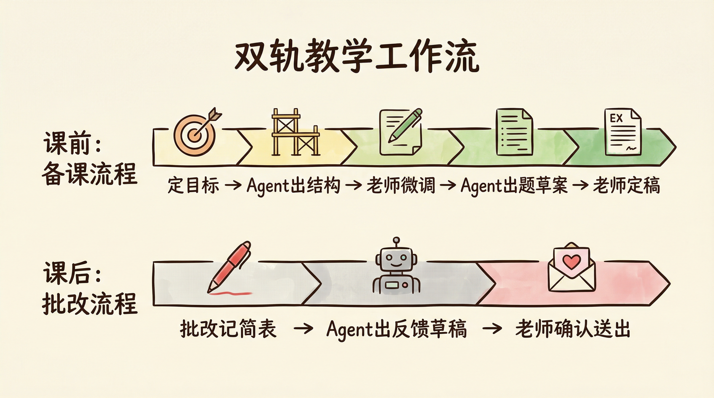

# 第9章 教育工作者：备课、出题、批改、反馈的连贯工作流

林老师教初中数学五年了，带两个班，还兼年级的竞赛辅导。

按理说，备课、出题、批改、反馈，每一样她都熟。可她的每一天依然像打仗——白天上课、盯自习、开会，晚上才能坐下来备课。备到一半发现上一单元有个知识点没讲透，又回去翻教案。周末出周练卷，从选题到排版要花大半天，题目难度和题量全靠自己「感觉」。批改作业时，看到同样的错误反复出现，想给每个孩子写两句针对性反馈，写了两页就写不动了，后面的只好写「加油」「注意审题」敷衍过去。期中期末更夸张：两个班一百多份卷子，批改、登分、写评语，几乎占满整个周末。

林老师以为自己缺的是时间。其实她缺的是一条流水线。

回忆一下前言里我们讲过的「手工作坊」和「智能工厂」的区别。林老师的状态，就是典型的手工作坊模式——她一个人身兼课程设计、出题人、批改员、反馈撰写四个角色，每个角色都在她脑子里抢占内存，每次备课、每次出题、每次批改都是「这次再想想办法」。

这一章，我们要帮林老师（以及你）完成一次关键转变：把「备课、出题、批改、反馈」从一堆靠感觉的零散动作，拆解成一条清晰的、可复用的、可以让 Agent 深度参与的教学工作流。重点在于区分「必须由老师判断的环节」和「可以交给 Agent 出初稿的部分」——这样既提效，又不牺牲教学质量。

而且，我们不只是纸上谈兵。这一章会手把手带你在扣子编程（官网 https://code.coze.cn ）上搭建真实可用的智能体，让你亲眼看到方法论在教育场景里是如何落地的。

即使你不做老师也没关系。这一章展示的「先定目标、再拆步骤、人做判断、Agent 出初稿」的思路，适用于任何「内容+质量把关」类工作——写方案、做评审、写报告，底层逻辑完全一样。

## 9.1 从教学目标到课程内容的工作流

备课的第一步不是「找课件」或「写教案」，而是想清楚：这一单元要让学生学会什么？能力目标不清晰，后面的内容编排和例题选择都会飘。

林老师的转折，是从「把每单元的能力目标写成一页纸」开始的。目标明确之后，教学结构、知识点顺序、案例安排就有了依据；而「教学结构草案」和「案例建议」恰恰可以用扣子编程里的智能体来生成初稿，她只做筛选和调整。

### 9.1.1 明确本单元要培养的能力目标

在动笔写教案之前，先回答三个问题：本单元学完后，学生应该能做什么？和上一单元、下一单元如何衔接？重点和难点分别是什么？

林老师的做法很直接：

1. 写出一句话的单元目标：例如「能利用一元一次方程解决实际生活中的行程、工程类问题」，而不是笼统的「掌握一元一次方程」。
2. 列出 3～5 个可检核的能力点：例如「能列方程」「能检验解的合理性」「能区分行程中的相遇与追及」。这些能力点会直接对应后面的练习题和测验题。
3. 标出重点与难点：重点=必须掌握、会反复考；难点=学生容易卡住、需要设计台阶。这样在选例题和出题时就有侧重。

有了这一页「能力目标卡」，后面无论是自己写教案还是让 Agent 生成教学结构草案，都有统一的锚点。

### 9.1.2 用 Agent 生成多版教学结构草案

教学结构指的是：这一单元分几课时？每课时的主题是什么？知识点按什么顺序出现？每个知识点配什么类型的例题（概念辨析、计算、应用）？

林老师以前全靠经验和教材目录，有时会漏掉衔接或重复。后来她在扣子编程上配置了一个「教学结构助手」：输入单元名称、能力目标、教材版本与章节，智能体根据这些信息生成 2～3 版教学结构草案（如「三课时版」「四课时版」），每版都包含课时划分、每课主题、建议的知识点顺序和例题类型。她从中选一版或合并两版的优点，再微调，大大减少了「从零想结构」的时间。

#### 【实操：在扣子编程上创建教学结构 Agent】

在扣子编程（https://code.coze.cn ）里选择「新建项目」→「智能体」，项目名称可填：教学结构助手。在描述需求时，用自然语言说明以下要点即可：

| 配置项 | 内容 |
| :--- | :--- |
| 输入 | 用户提供：单元/章节名称、本单元要培养的能力目标（一句话或几条）、教材版本与年级（可选） |
| 输出内容 | 2～3 版教学结构草案，每版包含：① 建议课时数及每课主题；② 知识点出现顺序及与能力的对应；③ 每课时建议的例题类型（概念/计算/应用等） |
| 格式 | 用清晰的列表或表格，便于老师勾选、合并、删改 |
| 红线 | 不编造教材中不存在的知识点；结构要符合「先概念后应用」等教学逻辑 |

描述示例：

> 请搭建一个「教学结构助手」智能体。用户会提供某一单元或章节的名称、本单元要培养的能力目标（一句话或几条），以及可选的教材版本与年级。请根据这些信息，输出 2～3 版教学结构草案。每版需包含：第一，建议的课时数与每课时的主题；第二，知识点的出现顺序，并标明与能力目标的对应关系；第三，每课时建议的例题类型（如概念辨析、计算练习、应用题等）。输出请用列表或表格，便于老师选用或合并。不要编造教材中没有的知识点，结构要符合常见的教学逻辑（如先概念后应用）。

智能体创建成功后，试运行：输入一个真实单元名和能力目标，看生成的课时划分和知识点顺序是否合理。若课时偏多或偏少，在对话里补充「我们学校每单元通常 3～4 课时」等约束即可。

### 9.1.3 确认知识点顺序与案例安排

Agent 给出的是草案，最终拍板的是老师。林老师会拿着选定的那一版结构，对照教材和教参，确认三点：知识点顺序是否和教材一致、有没有漏掉必讲内容、例题类型是否覆盖重点和难点。需要的话，她会手动增删或调序，再把「每课时需要的例题数量与难度」记下来，作为 9.2 出题时的输入。

这样，备课的「骨架」就固定下来了：能力目标 → 教学结构 → 知识点与案例安排。后面出题、写教案、做课件，都沿着这条骨架走，不会跑偏。

【心法】
备课不是「找一堆材料再拼」。先定能力目标，再要结构草案，最后才填内容。Agent 擅长在既定目标下给出多版结构供你选，你擅长判断哪一版更贴合自己的学生和课时。

## 9.2 从出题到讲解的成套题制作流程

有了教学结构和每课时的例题需求，下一步就是「出题」：题目本身、难度与题型搭配、标准答案与讲解提纲。这三件事都可以拆开——题目草案和答案讲解可以由 Agent 生成，老师负责筛选、改表述、定最终版。

### 9.2.1 让 Agent 按难度与题型生成题目草案

林老师的需求很明确：某一课时需要「2 道概念辨析 + 3 道计算 + 2 道应用题」，难度以中等为主、配 1 道稍难。她不再自己翻练习册一道一道挑，而是把「课时主题 + 知识点 + 难度与题型要求」发给在扣子编程上搭好的「出题助手」智能体，由智能体生成一整套题目草案。她再从中筛掉不合适的、改一改表述不清或超纲的，大大缩短了组卷时间。

#### 【实操：在扣子编程上创建出题 Agent】

在扣子编程里同样选择「新建项目」→「智能体」，项目名称可填：出题助手。在描述需求时，用自然语言说明以下要点即可：

| 配置项 | 内容 |
| :--- | :--- |
| 输入 | 用户提供：课时/单元主题、涉及的知识点、需要的题型与数量（如选择题 2 道、填空 3 道、解答 2 道）、难度要求（如以中等为主、含 1 道较难） |
| 输出内容 | 按题型分组的题目草案，每题包含题干、选项（若有）、参考答案（可简写），并标注建议难度 |
| 格式 | 题目编号清晰，便于老师复制到试卷或练习卷中修改 |
| 红线 | 不超出用户给出的知识点范围；题干表述要严谨、无歧义；避免与常见教辅雷同到逐字一致 |

描述示例：

> 请搭建一个「出题助手」智能体。用户会提供：某一课时或单元的主题、涉及的知识点列表、需要的题型及数量（例如选择题 2 道、填空题 3 道、解答题 2 道）、以及难度要求（如以中等为主、含 1 道较难）。请按题型输出题目草案，每题需包含题干、选项（若有）、以及简要参考答案，并标注建议难度（易/中/难）。输出格式要清晰，便于老师复制到试卷中再修改。不要超出用户给出的知识点范围，题干表述要严谨无歧义，避免与常见教辅逐字雷同。

智能体创建成功后，试运行：输入一个真实课时主题和题型要求，看题目是否贴合知识点、难度是否合理。若发现偏难或偏易，在对话里补充「我们班是普通班，难度以中等偏下为主」即可。

### 9.2.2 由老师筛选题目并修改关键表述

Agent 出的题是草案，不能直接拿来就用。林老师会逐题过一遍：题干有没有歧义、数字是否合理、是否超纲、是否和教材例题过于相似。不合适的删掉或替换，表述不清的改一句话，难度不对的调一调数据。这一步是「人的把关」，不能省，但因为有草案，她只需要做「选择和修改」，而不是「从零想题」。

### 9.2.3 用 Agent 输出标准答案与讲解提纲

题目定稿之后，还需要标准答案和讲解提纲——改卷时要对照，讲评课时要按提纲讲。林老师在扣子编程上配置了「答案与讲解助手」：把定稿题目（或题目编号 + 题干）发过去，智能体输出每题的参考答案、关键步骤、易错点提醒和 1～2 句讲解要点。她再核对答案是否正确、讲解要点是否贴合自己班上的常见错误，略作修改即可用于改卷和讲评。

#### 【实操：在扣子编程上创建答案与讲解 Agent】

在扣子编程里同样选择「新建项目」→「智能体」，项目名称可填：答案与讲解助手。在描述需求时，用自然语言说明以下要点即可：

| 配置项 | 内容 |
| :--- | :--- |
| 输入 | 用户提供：题目全文（或题干 + 题型），可多题一起提供 |
| 输出内容 | 每题：① 参考答案或标准解法；② 关键步骤（便于给分）；③ 易错点或常见错误提醒；④ 1～2 句讲解提纲（讲评时用） |
| 格式 | 按题号分块，便于对照题目使用 |
| 红线 | 答案必须与题目匹配，不擅自改题；讲解要点要具体，不说空话 |

描述示例：

> 请搭建一个「答案与讲解助手」智能体。用户会提供一道或若干道题目（含题干和题型）。请为每题输出：第一，参考答案或标准解法；第二，关键步骤（便于批改时给分）；第三，易错点或学生常见错误提醒；第四，1～2 句讲解提纲，供讲评课时使用。输出请按题号分块，便于老师对照题目。答案必须与题目严格匹配，不擅自改动题目条件；讲解要点要具体，避免「注意审题」这类空话。

智能体创建成功后，试运行：贴入一道真实题目，看答案是否正确、步骤是否清晰、讲解要点是否可用。若学科有特殊符号或格式，在对话里补充「数学公式用 LaTeX」等约束即可。

【心法】
出题和答案讲解都可以让 Agent 出初稿，但「题目是否合适」「答案对不对」「讲评重点是否贴合学情」必须由老师把关。用 Agent 省下的是「从零构思」的时间，省不下的是「判断与负责」。

## 9.3 批改与反馈的结构化流程

批改不只是打勾打叉，还要让学生知道「错在哪、为什么错、下次怎么改」。一对一的个性化反馈最能帮助学生，但老师时间有限，很难给每一份作业都写长评语。解决办法是：先把批改结果结构化，再让 Agent 根据结构生成反馈草稿，老师做最后修改和确认。

### 9.3.1 将批改记录结构化为：对错 → 错因 → 类型

林老师会把每次作业或试卷的批改结果整理成一张简表（或固定格式的笔记）：每道题的对错、错因简述（如「列式错误」「计算失误」「概念混淆」）、以及错因类型（如「审题」「运算」「概念」）。这样既方便统计「这一班在哪个类型上错得多」，也方便下一步让 Agent 按「错因类型 + 具体错因」生成针对性的反馈句。

表格不必复杂，例如：

| 题号 | 对/错 | 错因简述 | 错因类型 |
| :--- | :--- | :--- | :--- |
| 1 | 错 | 移项时未变号 | 运算 |
| 2 | 对 | — | — |
| 3 | 错 | 未理解「相向而行」 | 概念/审题 |

有了这张表，Agent 就有了「输入」：知道学生哪里错了、属于什么类型，才能写出「有的放矢」的反馈草稿。

### 9.3.2 让 Agent 根据分类生成个性化反馈草稿

林老师在扣子编程上配置了一个「批改反馈助手」：输入学生姓名（或匿名 ID）、本次作业/试卷的批改结构（对错、错因、类型），智能体为这名学生生成一段个性化反馈草稿——既概括本次的主要问题，又按错因类型给 1～2 条具体建议（如「注意移项时变号」「下次先圈出关键词再列式」）。她再根据自己对这名学生的了解，改一两句话或补一句鼓励，然后发给学生或家长。

#### 【实操：在扣子编程上创建批改反馈 Agent】

在扣子编程里同样选择「新建项目」→「智能体」，项目名称可填：批改反馈助手。在描述需求时，用自然语言说明以下要点即可：

| 配置项 | 内容 |
| :--- | :--- |
| 输入 | 用户提供：学生标识（姓名或 ID）、本次批改的结构化信息（每题对错、错因简述、错因类型），可多题 |
| 输出内容 | 一段面向该生的反馈草稿：① 本次整体表现简述；② 按错因类型归纳的主要问题；③ 每条问题对应的 1～2 条具体改进建议；④ 一句简短鼓励（可选） |
| 风格 | 语气温和、具体可执行，避免空洞批评或泛泛表扬 |
| 红线 | 不编造批改记录中没有的错因；建议要和学生实际错误对应 |

描述示例：

> 请搭建一个「批改反馈助手」智能体。用户会提供：学生标识（姓名或匿名 ID）、以及本次作业或试卷的批改结构化信息（每道题的对错、错因简述、错因类型，如审题/运算/概念等）。请根据这些信息，为该生生成一段个性化反馈草稿，包含：第一，本次整体表现的一句话简述；第二，按错因类型归纳的主要问题；第三，针对每个问题给出 1～2 条具体、可执行的改进建议；第四，一句简短的鼓励。语气要温和、建议要具体，不要编造用户未提供的错因，不要写「注意审题」这类空话。

智能体创建成功后，试运行：输入一份真实的批改结构（可匿名），看反馈是否贴合错因、建议是否可执行。若希望反馈更简短或更详细，在对话里补充「反馈控制在 80 字以内」或「每个错因类型都要给建议」即可。

### 9.3.3 老师进行最后修改并确认反馈内容

Agent 生成的是草稿，最终对学生说的话必须由老师确认。林老师会快速扫一遍：有没有不符合事实的表述、建议是否适合这名学生（例如有的孩子需要更直接的提醒）、语气是否合适。改完再发出去，既保证了个性化，又不会因为逐字写而耗尽时间。

> 💡 回扣方法论：9.1～9.3 这条教学流水线，本质就是第 4 章「五步法」的落地——
>
> 1. 明确目标（本单元学生能做什么、本次作业要反馈什么）
> 2. 拆解步骤（备课：目标→结构→案例；出题：题目→筛选→答案讲解；批改：结构化→反馈草稿→老师确认）
> 3. 定义 输入/输出（每步的接口对齐，例如批改表→反馈草稿）
> 4. 分配执行者（人定目标、选结构、把关题目与反馈；Agent 出结构草案、题目草案、答案讲解、反馈草稿）
> 5. 沉淀为可复用资产（能力目标卡、教学结构模板、出题与反馈的智能体）
>
> 在扣子编程里，教学结构、出题、答案讲解、批改反馈都可以用自然语言说清楚，由 AI 生成智能体来执行初稿，老师把时间花在「判断」和「负责」上。

【心法】
批改反馈不是「写得越多越好」。先结构化批改结果，再让 Agent 按类型生成建议，老师只做最后一道「是否贴合这个孩子」的把关，就能在有限时间里给出更高质量、更可执行的反馈。

## 9.4 案例：两条流程让一位老师节省 60% 时间

方法讲完了，最后用林老师的完整故事，把这一章串起来。你会看到一位普通老师，是如何从「备课与批改全部挤到晚上和周末」到「两条流程稳住质量、明显省时」的。

### 9.4.1 之前的状态：备课与批改全部挤到晚上和周末

林老师带两个班，每周正课 10 节，加上自习、会议、竞赛辅导，白天几乎没整块时间。备课只能放在晚上，经常备到十一点；出题和批改集中在周末，有时一份周练卷从选题到排版就要半天，两个班的作业批改加反馈要一整天。她试过减少反馈字数，又觉得对不起学生；试过用现成练习册，又和本校进度、难度不完全匹配。结果就是：要么牺牲睡眠，要么牺牲质量，要么牺牲自己的休息时间。

| 项目 | 改造前（估算） |
| :--- | :--- |
| 每单元备课 | 3～4 小时（含想结构、找例题） |
| 每份周练/小测出题+答案 | 2～3 小时 |
| 每轮作业批改+反馈 | 两个班约 4～5 小时 |
| 周末可用于自己的时间 | 很少，多数被备课和批改占用 |

### 9.4.2 启用「备课流程」和「批改流程」后的明显变化

林老师没有增加人手，只是把「备课」和「批改反馈」固定成两条流程，并把能出初稿的环节交给扣子编程上的智能体。

备课流程：每单元先写能力目标卡（约 15 分钟）→ 用教学结构助手生成 2～3 版结构草案（约 5 分钟）→ 自己选定一版并微调知识点与案例（约 30 分钟）→ 需要出题时，用出题助手按课时生成题目草案（约 10 分钟）→ 自己筛选和改题（约 30～40 分钟）→ 用答案与讲解助手生成答案和讲解提纲（约 5 分钟）→ 自己核对并略改（约 15 分钟）。整单元备课 + 配套练习从原来的 5～6 小时压到约 2.5 小时，省下来的时间她用来做学情分析和个别辅导。

批改流程：批改时按「对错→错因→类型」记成简表（她已习惯，不额外增加太多时间）→ 把表按学生整理好，分批粘贴给批改反馈助手（约 10 分钟可处理一个班）→ 自己快速过一遍草稿，改一两句或补一句（每生约 1～2 分钟）→ 确认后发给学生或录入家校平台。两个班的反馈从「写不动就敷衍」变成「每人都有针对性建议」，时间反而比之前「想一句写一句」更可控。

改造前后对比：

| 项目 | 改造前 | 改造后 |
| :--- | :--- | :--- |
| 每单元备课+配套题 | 5～6 小时 | 约 2.5 小时 |
| 每份周练/小测出题+答案 | 2～3 小时 | 约 1 小时 |
| 每轮作业批改+反馈（两班） | 4～5 小时，且后半段敷衍多 | 约 2.5～3 小时，反馈更具体 |
| 周末可用于自己的时间 | 很少 | 明显增加，且质量不降 |

### 9.4.3 为什么使用工作流后，教学质量反而提高了

林老师最初也担心：用 Agent 出初稿，会不会让备课和反馈变「水」？实践下来发现，恰恰相反。以前时间紧，结构想得不细、题目凑合着用、反馈写不动就写「加油」。现在有了「能力目标→结构→题目→答案」这条线，每一步都有依据；Agent 出的初稿逼着她把「要什么」想清楚，她只做筛选和把关，反而更容易发现题目是否超纲、反馈是否贴合学情。质量从「凭感觉赶工」变成了「有标准、有初稿、有人把关」，学生和家长的反馈也更好。

这就是第 3 章讲的「可交接性」在教育场景的体现：若她请假，代课老师只要会按「能力目标卡 + 教学结构 + 出题/反馈智能体」操作，就能在短时间内接住备课和批改，而不必从零理解她的习惯。

资产三件套在教学场景下就是：① 一条「备课流程」和一条「批改反馈流程」（目标→结构→题目→答案；批改结构化→反馈草稿→老师确认）；② 在扣子编程上搭好的四个智能体（教学结构、出题、答案与讲解、批改反馈）；③ 固定表格与模板（能力目标卡、批改结构表、反馈用语库）。有了这三件，新老师或代课老师也能较快上手，教学质量可复制、可迭代。

## 本章结语

这一章，我们用教育场景完整演示了前几章方法论的落地：

- 用第 3 章的流程图思路，把「备课、出题、批改、反馈」拆成了可复用的步骤与 输入/输出，并区分了「人做判断」和「Agent 出初稿」的边界。
- 用第 4 章的任务分配，把教学结构草案、题目草案、答案讲解、反馈草稿交给 Agent，把能力目标、结构选定、题目与反馈的最终把关留给人。
- 用第 5 章的岗位说明书思路，为教学结构、出题、答案讲解、批改反馈等智能体写了清晰的需求描述，并在扣子编程上用自然语言搭建出来。

更重要的是，我们不只是纸上谈兵——你已经看到了如何在扣子编程上，用自然语言描述需求，把「教学结构」「出题」「答案与讲解」「批改反馈」四个智能体真正搭起来，让备课和批改从「全部自己扛」变成「有初稿、有把关、有流程」。

教育只是一个缩影。任何「内容+质量把关」类工作——写方案、做评审、写报告、做用户反馈——都可以用同样的思路：先定目标、再拆步骤、让 Agent 出初稿、人做最后判断与负责。

如果你不做老师，没关系。下一章我们进入职场场景——开会、汇报、跨部门沟通。你会看到同样的方法论和扣子编程，在职场人士的日常协作里，依然能产出清晰、可执行的工作流。
