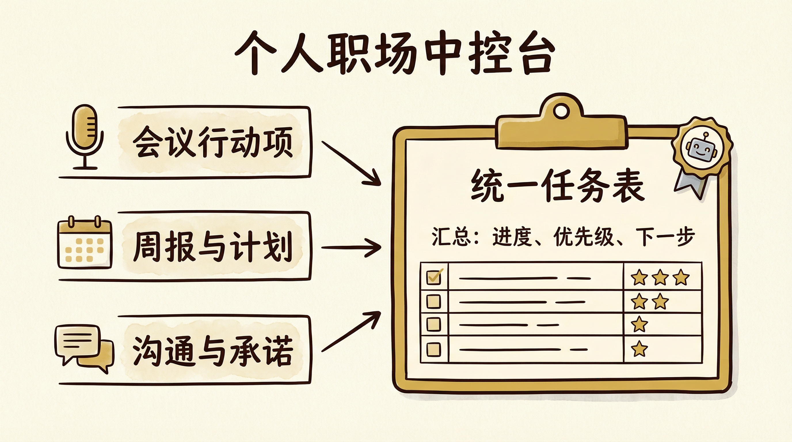

# 第10章 职场人士：开会、汇报、跨部门沟通的清晰工作流

小周在一家中型公司做产品运营，日常要开会、写周报、和研发、设计、市场跨部门对齐需求。

按理说，会议、汇报、沟通，每一样都是职场基本功。可他的每一天依然像在信息流里打捞——上午开完会，下午就忘了会上到底定了哪几条行动；周五写周报，对着空白文档想半天「这周干了啥」，翻聊天记录和邮件才勉强拼出一版。跨部门要资源或催进度时，要么写一大段话对方看不懂重点，要么口头说了一通对方记不住，事后还要反复扯皮。他觉得自己已经够忙了，可老板还是说「你的进展不够透明」「和别的部门对齐再清楚一点」。

小周以为自己缺的是时间。其实他缺的是一条流水线。

回忆一下前言里我们讲过的「手工作坊」和「智能工厂」的区别。小周的状态，就是典型的手工作坊模式——他一个人身兼会议记录员、周报撰写人、跨部门沟通者多个角色，每个角色都在他脑子里抢占内存，每次开会、每次写周报、每次发邮件都是「这次再临时组织一下」。

这一章，我们要帮小周（以及你）完成一次关键转变：把「开会、汇报、跨部门沟通」从一堆靠感觉的零散动作，拆解成一条清晰的、可复用的、可以让 Agent 深度参与的工作流。通过固定结构与流程节点，让信息表达更清晰，协作成本更低，执行效率更高。

而且，我们不只是纸上谈兵。这一章会手把手带你在扣子编程（官网 https://code.coze.cn ）上搭建真实可用的智能体，让你亲眼看到方法论在职场场景里是如何落地的。

即使你不做产品运营也没关系。这一章展示的「先结构、再填充、人做判断」的思路，适用于任何需要开会、写汇报、做对齐的岗位——项目经理、销售、职能岗，底层逻辑完全一样。

## 10.1 开会工作流：从录音到行动项清单

开会的价值不在于「开过了」，而在于「谁在什么时间前要做什么」被记下来、被跟进。很多人开完会就散，会议结论和行动项留在各自脑子里，过两天就对不上号。小周的转折，是从「每次开会都有可执行的产出」开始的：录音或笔记 → 转成结构化文字 → 提炼议题、结论与行动项 → 为每个行动项标注负责人与截止时间。其中「转写」和「提炼」都可以交给 Agent 出初稿，他只做核对和补充。

### 10.1.1 用 Agent 将录音转写成结构化文字

会议一结束，小周的第一件事不是立刻去忙别的，而是把录音（或自己的速记要点）交给在扣子编程上搭好的「会议纪要助手」：输入录音或文字片段，智能体先转写成连贯文字（若输入已是文字则做整理），并按「时间线」或「议题块」做简单分段。这样他就有一份可读的会议底稿，而不是一堆零散的「谁说了啥」。

#### 【实操：在扣子编程上创建会议纪要 Agent】

在扣子编程（https://code.coze.cn ）里选择「新建项目」→「智能体」，项目名称可填：会议纪要助手。在描述需求时，用自然语言说明以下要点即可：

| 配置项 | 内容 |
| :--- | :--- |
| 输入 | 用户提供：会议录音转写文本（或现场速记、语音转写后的原始文字），可含多段、多人发言 |
| 输出内容 | ① 按议题或时间线整理的结构化会议记录；② 每个议题下的主要讨论点与结论；③ 待确认或待跟进事项（若有） |
| 格式 | 分段清晰，便于后续提炼行动项；可要求输出为「议题—讨论—结论」三栏或列表 |
| 红线 | 不编造会议中未出现的内容；若听不清或无法判断，标注「待确认」 |

描述示例：

> 请搭建一个「会议纪要助手」智能体。用户会提供会议录音转写后的文字（或现场速记、语音转写原始稿），可能包含多段、多人发言。请先整理成结构化会议记录：按议题或时间线分段，每个议题下写出主要讨论点和结论；若有待确认或待跟进事项，单独列出。输出格式要清晰，便于下一步提炼行动项。不要编造会议中未出现的内容，无法判断的地方请标注「待确认」。

用户可先用其他转写工具（比如千问/飞书妙记等）得到文字，再粘贴进来。智能体创建成功后，试运行几次：贴入一段真实会议文字，看分段和结论提炼是否合理。若公司有固定会议模板（如「议题—结论—行动项」），在描述中补充即可。

### 10.1.2 提炼出议题、结论与行动项

有了结构化会议记录，下一步是「提炼」：这场会讨论了哪几个议题？每个议题的结论是什么？有哪些事需要有人去做、谁做、什么时候前完成？小周在扣子编程上对同一智能体（或再建一个「行动项提炼」智能体）追加需求：输入会议记录，输出「议题—结论—行动项」清单。行动项格式为：具体事项 + 负责人 + 截止时间（若记录中未体现则标「待补充」）。这样他拿到的不再是一篇长文，而是一张可直接发给参会人的待办表。

### 10.1.3 为每个行动项标注负责人与截止时间

Agent 提炼出的行动项里，负责人和截止时间可能不全——会议里有时只说了「这事谁跟一下」没点名，或只说「尽快」没给日期。小周会在这一环节做人工补全：对照参会名单和项目节奏，给每条行动项标上负责人与截止时间，必要时和当事人确认一遍。确认后的清单他会发到会议群或项目文档里，作为后续跟进的依据。这样「开会」和「落地」就打通了：会开完，行动项就出来了；行动项出来了，跟进就有据可查。

【心法】
开会工作流的本质是「信息从无序到有序」。先用 Agent 把录音或杂乱的笔记变成结构化记录，再提炼出议题、结论与行动项，最后人补全负责人与截止时间并发出。你省下的是「从零组织语言」的时间，换来的是「每次会议都有可执行的产出」。

## 10.2 把周报、月报、复盘写成"填空题"

周报、月报、项目复盘，很多人最头疼的是「不知道写啥」和「写起来像流水账」。小周的解决办法是：先给自己建一个固定结构的模板（就像填空题），再让 Agent 根据他提供的素材（本周完成的事、数据、遇到的问题）辅助填充并优化表述，最后由自己补上关键的个人判断部分（如优先级、风险、下一步重点）。

### 10.2.1 为自己建立固定结构的周报模板

小周给自己定了一个周报骨架，每周只换内容不换结构。例如：

- 本周完成：3～5 条，每条一句话说清「做了什么、结果如何」（可带关键数据）。
- 进行中：2～3 条，说明当前进度与卡点。
- 下周计划：3～5 条，按优先级排序。
- 需要支持/风险：0～2 条，需要谁配合、有什么风险需要同步。

有了这个骨架，写周报就变成了「往格子里填」：他只需要把本周做过的事、数据、卡点零散地列出来（甚至从聊天记录里复制几句），交给 Agent 去归纳、压缩成符合结构的句子，自己再补上「个人判断」——比如哪条是重点、哪个风险要特别提醒老板。

### 10.2.2 让 Agent 辅助填充数据并优化表述

小周在扣子编程上配置了一个「周报助手」：输入本周的零散事项（列表或几段话）、关键数据（若有），智能体按用户指定的结构（如上面的「完成—进行中—计划—支持/风险」）输出一版周报草稿，表述简洁、每条控制在合理长度。他再根据实际情况删减、调序、改一两句，最后补上「个人判断」部分（如「下周重点是 XXX，建议优先资源」），一份周报就完成了。

#### 【实操：在扣子编程上创建周报助手 Agent】

在扣子编程里同样选择「新建项目」→「智能体」，项目名称可填：周报助手。在描述需求时，用自然语言说明以下要点即可：

| 配置项 | 内容 |
| :--- | :--- |
| 输入 | 用户提供：本周完成的事项（列表或段落）、进行中的工作及进度/卡点、下周计划要点、需要支持或风险（可选）；可附带关键数据 |
| 输出内容 | 按固定结构输出的周报草稿：本周完成、进行中、下周计划、需要支持/风险，每条简洁、可读 |
| 风格 | 客观、简洁，避免空话；每条一句话说清「做了什么/结果如何」或「计划做什么」 |
| 红线 | 不编造用户未提供的事项；若某类无内容则输出「无」或略过，不凑字数 |

描述示例：

> 请搭建一个「周报助手」智能体。用户会提供：本周完成的事项（可零散列表或几段话）、进行中的工作及进度与卡点、下周计划要点、以及可选的需要支持或风险。请按以下结构输出周报草稿：一、本周完成（3～5 条，每条一句话，可带关键数据）；二、进行中（2～3 条）；三、下周计划（3～5 条，按优先级）；四、需要支持/风险（0～2 条）。表述要客观简洁，不写空话，不编造用户未提供的内容，某类无则标「无」或略过。

智能体创建成功后，试运行：输入一份真实的本周事项（可打码敏感信息），看结构是否清晰、表述是否可用。若公司有统一周报格式，把格式要求写进描述即可。月报、复盘也可用同一思路：先定结构（如「目标—完成情况—差距分析—下阶段重点」），再让 Agent 按结构从用户提供的素材中生成草稿。

### 10.2.3 由自己补上关键的个人判断部分

Agent 能做好「归纳和表述」，但「哪条最重要」「风险有多大」「下一步该押注哪里」必须由人判断。小周会在周报草稿最后加一小段「个人判断」：本周最大的进展是什么、最需要关注的风险是什么、下周建议优先做哪几件事。这部分不交给 Agent，完全自己写，通常也就两三句话，但能让老板和协作方一眼看到「你的思考」，而不只是「你做了啥」。

【心法】
周报、月报、复盘的价值，一半在「事实与结构」，一半在「判断与优先级」。把事实和结构交给模板和 Agent，把判断和优先级留给自己，既省时间，又突出你的思考。

## 10.3 跨部门沟通：先理清背景、诉求与配合点，再发送

跨部门要资源、催进度、对齐需求，最怕两件事：对方看不懂你在说什么，对方记不住你要他做什么。小周的解决办法是：先把沟通内容拆成「背景—诉求—配合点」三类，再让 Agent 优化语言、确保简洁清晰，同一件事给不同对象（如研发、设计、老板）可以准备不同版本，但结构一致，重点突出。

### 10.3.1 将沟通内容拆成背景、诉求与配合点三类

发邮件或发消息前，小周先在心里（或草稿里）过一遍：背景——对方需要知道什么前提（项目进展、为什么现在要沟通）；诉求——你希望对方做什么、什么时候前完成、交付标准是什么；配合点——对方需要你提供什么信息或资源、你会怎么配合。这三类写清楚，再长的需求也不会变成「写了一屏对方还不知道要干啥」。他有时会先把零散的想法列出来，交给 Agent 按「背景—诉求—配合点」重新组织成一版草稿，再自己改一两句发出去。

### 10.3.2 让 Agent 优化语言，确保简洁清晰

很多人跨部门沟通写得很长，是因为把背景、诉求、配合点混在一起，又加了很多「客气话」和重复解释。小周在扣子编程上配置了一个「跨部门沟通助手」：输入你要表达的核心意思（可以是一段零散的话），智能体按「背景—诉求—配合点」结构重写，语言简洁、一句是一句，并去掉冗余。他再根据对方身份和关系，微调语气（更正式或更简短），然后发送。

#### 【实操：在扣子编程上创建跨部门沟通助手 Agent】

在扣子编程里同样选择「新建项目」→「智能体」，项目名称可填：跨部门沟通助手。在描述需求时，用自然语言说明以下要点即可：

| 配置项 | 内容 |
| :--- | :--- |
| 输入 | 用户提供：本次沟通的核心意思（可零散、可啰嗦），以及沟通对象或场景（如研发/设计/上级，邮件/即时消息） |
| 输出内容 | 按「背景—诉求—配合点」结构重写的一版沟通草稿，简洁清晰，便于对方快速理解并行动 |
| 风格 | 根据对象调整：对同事可简短直接，对上级可稍正式、突出结论与需求 |
| 红线 | 不改变用户的核心诉求与事实；不编造对方未授权承诺的内容 |

描述示例：

> 请搭建一个「跨部门沟通助手」智能体。用户会提供：本次沟通的核心意思（可以是一段零散或啰嗦的表述），以及沟通对象或场景（如研发同事、设计、上级；邮件或即时消息）。请按「背景—诉求—配合点」结构重写：背景用 1～3 句话说清对方需要知道的前提；诉求写清希望对方做什么、何时完成、交付标准；配合点写清对方需要你提供什么、你会如何配合。语言要简洁，一句是一句，便于对方快速理解并行动。根据对象可调整语气（同事可简短，上级可稍正式）。不要改变用户的核心诉求与事实，不要编造对方未授权的内容。

智能体创建成功后，试运行：输入一段真实的需求描述，看结构是否清晰、诉求是否突出。若经常需要「催进度」「要资源」等类型，可在描述中增加「可输出简短版（适合聊天框）或完整版（适合邮件）」等选项。

### 10.3.3 同一事项为不同对象准备不同版本

同一件事，对研发要说清技术边界和排期，对设计要说清体验目标和交付物，对老板要说清结论、风险和你要什么支持。小周的做法是：先有一份「完整版」（背景—诉求—配合点都写全），再根据对象剪裁或改写。例如给研发发工作消息时只保留「诉求 + 截止时间」，给老板发邮件时保留背景和诉求、加一句「需要您支持的是 XXX」。跨部门沟通助手可以根据「对象」生成不同版本：同一输入，输出「给研发的简短版」和「给上级的正式版」，他选一版或合并使用即可。

> 💡 回扣方法论：10.1～10.3 这条职场工作流，本质就是第 4 章「五步法」的落地——
>
> 1. 明确目标（会议要有行动项、周报要透明、沟通要对方能懂能执行）
> 2. 拆解步骤（会议：转写→提炼→标注负责人与时间；周报：模板→Agent 填充→人补判断；沟通：背景诉求配合点→Agent 优化→按对象出不同版本）
> 3. 定义 输入/输出（每步的接口对齐）
> 4. 分配执行者（人做拍板、补全、判断；Agent 做转写整理、结构填充、语言优化）
> 5. 沉淀为可复用资产（会议纪要模板、周报模板、沟通结构 + 三个智能体）
>
> 在扣子编程里，会议纪要、周报、跨部门沟通都可以用自然语言说清楚，由 AI 生成智能体来执行初稿，人把时间花在「核对」和「判断」上。

【心法】
跨部门沟通不是「说得越多越好」。先理清背景、诉求、配合点，再让 Agent 帮你把话写短、写清楚，同一件事为不同对象准备不同版本。信息清晰了，协作成本自然下来。

## 10.4 案例：一个普通员工搭建的个人"职场中控台"

方法讲完了，最后用小周的完整故事，把这一章串起来。你会看到一个普通员工，是如何把会议、周报、跨部门沟通收拢成一套简易的「职场中控台」——进度、优先级、下一步都清晰，职场价值更容易被看见。

小周之前的状态是：会议结论记在笔记本里，周报要写时再翻聊天记录和邮件拼凑，跨部门沟通有时口头说了没留痕、有时写很长对方还是问「你到底要啥」。老板问「某某事进展如何」时，他要现找；同事问「上次说的那个需求咋样了」时，他也要现想。信息都在，但分散在会议、邮件、IM、文档里，没有统一入口，也没有固定流程去更新「进度—优先级—下一步」。

### 10.4.1 将会议、邮件与任务集中到统一入口

小周没有上大系统，只是给自己定了一个「个人中控」习惯：一个地方记会议产出，一个地方记周报与任务，一个地方存跨部门沟通的关键结论。例如：会议一结束就把录音或笔记交给会议纪要助手，得到行动项清单后，把清单贴到自己的任务表（可以是飞书/Notion/Excel，随你习惯）里，并标上负责人和截止时间。周报用固定模板 + 周报助手生成草稿，写完后把「下周计划」里自己负责的几条同步到同一张任务表。跨部门沟通的重要结论（如「设计下周三前给稿」）也记进任务表，并注明「待谁交付」。这样，他的「进度—优先级—下一步」都集中在一张表里，随时可查、可同步给老板或协作方。

### 10.4.2 用简易流程管理"进度—优先级—下一步"

小周的任务表很简单：事项 | 负责人 | 截止时间 | 状态 | 备注。他每周一根据「上周会议行动项 + 上周周报里的下周计划 + 跨部门沟通的承诺」更新这张表，并标出本周的 3～5 个重点。每天下班前花 5 分钟扫一眼：哪些快到截止时间了、哪些卡住了、明天优先推进哪几件。这样他就不会「忙了一天却说不清自己干了啥」，也不会在老板问进展时临时翻聊天记录。会议纪要助手、周报助手、跨部门沟通助手，都服务于同一目标：让信息从散乱变成「可检索、可跟进、可汇报」的结构化产出。

改造前后对比：

| 项目 | 改造前 | 改造后 |
| :--- | :--- | :--- |
| 会议结论与行动项 | 散落在笔记本，易遗漏 | 转写→提炼→清单，进任务表 |
| 周报 | 周五现想、现翻记录，耗时长 | 固定模板 + Agent 填充，人补判断，半小时内完成 |
| 跨部门沟通 | 长文或口头，对方常问「要啥」 | 背景—诉求—配合点 + Agent 优化，按对象出不同版本 |
| 进度与优先级 | 在脑子里，老板问要现找 | 统一任务表，进度—优先级—下一步一目了然 |

### 10.4.3 使用工作流后，让自己的职场价值更明显

小周发现，当会议有行动项、周报有结构、沟通有重点之后，老板和协作方更容易看到「他靠谱」：事情有跟进、进展可查、需要配合时说得清楚。他并没有多加班，只是把原来散乱的信息用流程和 Agent 收拢了，把「判断」和「优先级」留给自己表达。这就是第 3 章讲的「可交接性」在职场中的体现：若他休假或转岗，接手的同事只要按同一套「会议→行动项→任务表」「周报模板→周报助手」「沟通结构→沟通助手」操作，就能快速接住他的工作习惯，信息不断档。

资产三件套在职场场景下就是：① 一条「开会工作流」（录音/笔记→转写→提炼行动项→标注负责人与时间→进任务表）和一条「周报/沟通」流程（模板+Agent 填充/优化→人补判断）；② 在扣子编程上搭好的三个智能体（会议纪要、周报助手、跨部门沟通助手）；③ 一张个人任务表（或等价入口），用来集中「进度—优先级—下一步」。有了这三件，你的职场信息流就从「散装」变成「可管理、可展示、可交接」。

## 本章结语

这一章，我们用职场场景完整演示了前几章方法论的落地：

- 用第 3 章的流程图思路，把「开会、汇报、跨部门沟通」拆成了可复用的步骤与 输入/输出，并让每类任务都有固定结构。
- 用第 4 章的任务分配，把会议转写与提炼、周报填充、沟通语言优化交给 Agent，把行动项确认、个人判断、对象与版本选择留给人。
- 用第 5 章的岗位说明书思路，为会议纪要、周报、跨部门沟通等智能体写了清晰的需求描述，并在扣子编程上用自然语言搭建出来。

更重要的是，我们不只是纸上谈兵——你已经看到了如何在扣子编程上，用自然语言描述需求，把「会议纪要」「周报助手」「跨部门沟通助手」三个智能体真正搭起来，让开会、写周报、做对齐从「临时组织」变成「有结构、有初稿、有跟进」。

职场沟通只是一个缩影。任何需要「把信息整理清楚、把诉求说明白、把进度可追溯」的工作——项目管理、客户对接、内部汇报——都可以用同样的思路：先定结构，再让 Agent 辅助填充和优化，人做判断和拍板。

如果你不做产品运营，没关系。下一章我们进入创业者与管理者场景——信息收集、方案生成、决策推演。你会看到同样的方法论和扣子编程，在决策与复盘场景里，如何让每一次选择都有据可依、可分析、可复用。
