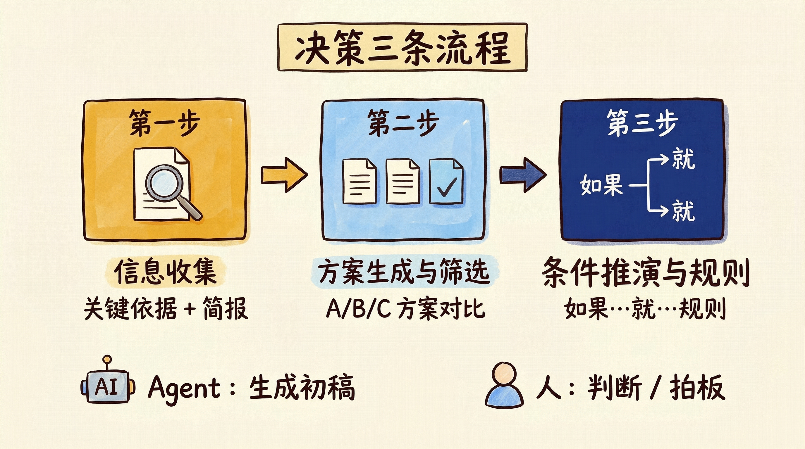
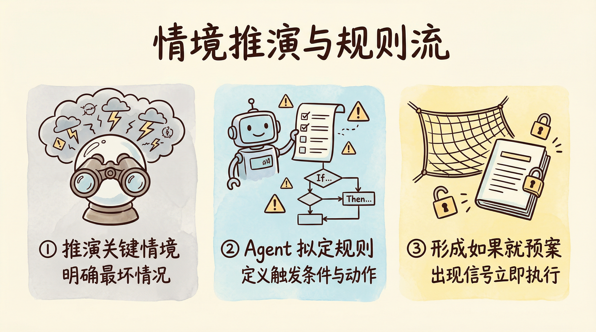

# 第11章 创业者与管理者：建立可复用的决策流程体系

老杨创业三年，公司二十来人，做企业级 SaaS。他既是创始人也是实际的产品与战略负责人，每天要做一堆「选哪条路、押多少资源、什么时候收手」的决策。

按理说，做决策是管理者的本分。可他的真实状态是：行业信息从投资人、客户、竞品、媒体各处涌来，他来不及整理就堆在脑子里或聊天记录里，真要做重大决策时往往「凭感觉」——上次为什么选了 A 没选 B，半年后自己也说不清。方案也一样：要不要开拓新品类、要不要加大某条产品线的投入、要不要裁掉一条亏损业务线，他经常自己憋一两个方案就拍了板，事后复盘时才发现当时根本没系统想过 B 方案、C 方案长什么样。更头疼的是「万一搞砸了怎么办」：最坏情况想到过，但没写下来、没定好「到什么条件就止损或转向」，真出了事又陷入被动应对。

老杨以为自己缺的是「更多信息」和「更果断」。其实他缺的是一套可复用的决策流程。

回忆一下前言里我们讲过的「手工作坊」和「智能工厂」的区别。老杨的状态，就是典型的手工作坊模式——他一个人身兼信息收集员、方案构思者、风险评估员、拍板人多个角色，每个角色都在他脑子里抢占内存，每次重大决策都是「这次再想想、再问问人、再拍一下」。

这一章，我们要帮老杨（以及你）完成一次关键转变：把「做决策」从一件依赖直觉和零散信息的动作，拆解成三条可复用、可复盘的流程——信息收集、方案生成与筛选、条件推演与应对规则。通过结构化方式降低决策的不确定性，使每一次选择都有据可依、可分析、事后可回溯。

而且，我们不只是纸上谈兵。这一章会手把手带你在扣子编程（官网 https://code.coze.cn ）上搭建真实可用的智能体，让你亲眼看到方法论在决策与管理场景里是如何落地的。

即使你不是创业者或带团队的管理者也没关系。这一章展示的「先收信息、再出多版方案、再推演条件与规则」的思路，适用于任何需要做重要选择的场景——选方向、选资源分配、选合作方、选止损点，底层逻辑完全一样。

## 11.1 建立结构化的信息收集流程

决策质量首先取决于「你依据什么做判断」。信息散落在各处、没有定期整理，决策时就容易凭印象或最近听到的几句话拍板。老杨的转折，是从「把信息收集固定成每周动作」开始的：让 Agent 每周给出一份行业简报，自己再整理成决策专用的信息文档，并明确「当前这类决策最依赖哪几项关键判断依据」。这样再做方案和拍板时，就有统一的「信息底座」。

### 11.1.1 让 Agent 每周给你一份行业简报

老杨不可能每天泡在行业报告和新闻里，但他需要持续感知：竞品在做什么、客户在抱怨什么、政策或技术有什么新动向。他在扣子编程上配置了一个「行业简报助手」：每周一输入本周关心的主题（如「本行业融资与并购」「主要竞品功能更新」「客户反馈高频词」），智能体根据这些主题联网检索或基于已有知识生成一份简明简报——每条一两句话，带来源或时间点（若可获取），便于他快速扫一眼抓住重点。他不需要 Agent 替自己下结论，只需要 Agent 把「值得关注的信息」按时、按主题整理好，省下自己到处翻的时间。

#### 【实操：在扣子编程上创建行业简报 Agent】

在扣子编程（https://code.coze.cn ）里选择「新建项目」→「智能体」，项目名称可填：行业简报助手。在描述需求时，用自然语言说明以下要点即可：

| 配置项 | 内容 |
| :--- | :--- |
| 输入 | 用户提供：本周或本阶段关心的主题（如行业融资、竞品动态、客户反馈、政策与技术动向等），可 3～5 个主题；可选提供行业或公司类型以便聚焦 |
| 输出内容 | 一份简明简报：按主题分块，每块下列 3～8 条要点，每条一两句话概括「发生了什么、与谁相关、可能的影响」；若有来源或时间可标注 |
| 格式 | 列表或短段落，便于 5～10 分钟扫读；可要求「每条不超过 50 字」 |
| 红线 | 不编造未核实的事件；若某主题无可靠信息则标注「本周暂无显著动态」 |

描述示例：

> 请搭建一个「行业简报助手」智能体。用户会提供本周或本阶段关心的 3～5 个主题（例如：本行业融资与并购、主要竞品产品/功能更新、客户或用户反馈的高频词、政策或技术新动向），以及可选的行业或公司类型。请按主题输出一份简明简报：每个主题下列 3～8 条要点，每条用一两句话概括「发生了什么、与谁相关、可能的影响」，若有来源或时间可标注。整体格式要便于 5～10 分钟扫读，每条不超过 50 字。不要编造未核实的事件，若某主题本周无可靠信息则标注「本周暂无显著动态」。

智能体创建成功后，试运行几次：输入真实关心的主题，看简报是否聚焦、是否有明显编造。若希望更偏「竞品」或「客户」，在描述中加重对应主题的权重即可。

### 11.1.2 制作决策专用的信息整理文档

简报是「输入」，但要支撑具体决策，还需要把信息沉淀成「决策专用文档」：当前要做的决策是什么、和它相关的关键事实有哪些、这些事实从哪里来、更新时间是什么。老杨会每周或每双周把简报里的要点、加上自己从客户沟通和内部讨论里听到的关键信息，整理成一张简表或一页文档，按「决策类型」或「当前在做的战略议题」分块。例如：正在考虑「是否加大某条产品线投入」时，文档里就集中放「该产品线近期数据、竞品同类产品动态、客户对该方向的反馈、内部资源与成本约束」。这样开会或独自拍板时，不用再临时翻聊天记录，直接对着这份文档讨论和判断。

### 11.1.3 明确决策所依赖的三项关键判断依据

同一类决策，往往反复出现（例如「要不要投新渠道」「要不要砍某条业务线」）。老杨给自己定了一个习惯：每做一类重大决策前，先明确「这次决策最依赖哪三项关键判断依据」。例如：投新渠道时，三项依据可能是「渠道 ROI 预估」「团队现有带宽」「与现有渠道的冲突程度」；砍业务线时，可能是「该线现金流与亏损幅度」「战略协同度」「团队与客户影响」。写下来之后，信息收集和方案分析就都有了靶心——Agent 生成的简报和方案，都可以围绕这三项依据来组织和呈现；自己做最终拍板时，也清楚「我是基于哪几件事在选」，事后复盘时能回溯「当时那三项依据分别是什么结论」。

【心法】
决策不是「信息越多越好」，而是「关键依据清晰、信息为依据服务」。用 Agent 做定期简报、用文档沉淀决策相关信息、用「三项关键依据」锁定判断锚点，你就能从「凭感觉」变成「有据可依」。

## 11.2 生成多版本方案并完成人工筛选

有了信息底座和关键判断依据，下一步是「方案」：不要只憋一个选项，而是让 Agent 生成 A/B/C 多版可行方案，再让 Agent 分析各方案的优势与风险，最后由人做选择和组合。这样既避免「只想到一个方案就拍板」的狭隘，又保留「最终决策必须由人负责」的边界。

### 11.2.1 让 Agent 生成 A/B/C 多版可行方案

老杨以前做重大选择时，经常只深入想了一个方向，其他选项要么没认真想、要么想得比较浅。后来他在扣子编程上配置了一个「方案生成助手」：输入「当前要做的决策是什么、约束条件是什么、希望看到几版不同思路的方案」，智能体根据用户提供的信息（可结合 11.1 的简报或决策文档）生成 2～3 版可行方案，每版包含：方案概要、主要动作、预期结果、所需资源与时间、前提假设。方案之间要有明显差异（例如 A 偏保守、B 偏激进、C 偏折中），而不是换汤不换药。老杨拿到多版方案后，先快速扫一遍，淘汰明显不符合自己战略或资源的，再对剩下的做深入比较和人工筛选。

#### 【实操：在扣子编程上创建方案生成 Agent】

在扣子编程里同样选择「新建项目」→「智能体」，项目名称可填：方案生成助手。在描述需求时，用自然语言说明以下要点即可：

| 配置项 | 内容 |
| :--- | :--- |
| 输入 | 用户提供：当前要做的决策（一句话）、约束条件（资源、时间、不可突破的红线）、可选的关键信息摘要；以及希望得到的方案数量（如 2～3 版）与差异类型（如保守/激进/折中） |
| 输出内容 | 2～3 版可行方案，每版包含：方案概要、主要动作步骤、预期结果、所需资源与时间、前提假设；各版之间要有清晰差异 |
| 格式 | 分方案编号（A/B/C），每版用列表或短段落，便于对比 |
| 红线 | 不编造用户未提供的约束；方案要在用户给出的约束内可行；若信息不足则标注「需补充 XXX 方可进一步细化」 |

描述示例：

> 请搭建一个「方案生成助手」智能体。用户会提供：当前要做的决策（一句话描述）、约束条件（如预算、时间、团队、不可突破的红线）、以及可选的关键信息摘要（如行业简报要点）。请生成 2～3 版可行方案，每版需包含：方案概要、主要动作步骤、预期结果、所需资源与时间、前提假设。各版之间要有明显差异（例如 A 偏保守、B 偏激进、C 偏折中）。输出请按方案编号（A/B/C）分块，便于对比。不要编造用户未提供的约束，方案必须在用户给出的约束内可行；若信息不足无法细化，请标注「需补充 XXX 方可进一步细化」。

智能体创建成功后，试运行：输入一个真实的决策场景，看生成的方案是否真的「多版」且「有差异」、是否在约束内。若方案过于空泛，在描述中补充「方案要具体到可执行的动作级别」等约束即可。

### 11.2.2 让 Agent 分析不同方案的优势和风险

多版方案生成之后，还需要系统对比：每个方案的优势在哪、风险在哪、和「三项关键判断依据」的匹配度如何。老杨在扣子编程上配置了一个「方案分析助手」（可与方案生成助手合并或分开）：输入几版方案（或方案概要），智能体输出一份对比分析，包含：各方案优势归纳、各方案主要风险与不确定性、对用户事先给出的「关键判断依据」的满足程度（若用户有提供）、简要建议（如「若更看重 X 则倾向 A，若更看重 Y 则倾向 B」）。老杨不看分析做最终决定，但会借助这份分析补全自己可能没想全的风险点，再做人工决策。

#### 【实操：在扣子编程上创建方案分析 Agent】

在扣子编程里同样选择「新建项目」→「智能体」，项目名称可填：方案分析助手。在描述需求时，用自然语言说明以下要点即可：

| 配置项 | 内容 |
| :--- | :--- |
| 输入 | 用户提供：2～3 版方案（概要或全文）、可选的关键判断依据或决策目标 |
| 输出内容 | 对比分析：各方案优势、各方案主要风险与不确定性、与关键依据的匹配度（若有）、简要倾向建议（注明「仅供参考，最终由人决策」） |
| 格式 | 按方案分块或按维度（优势/风险/匹配度）分块，便于阅读 |
| 红线 | 不替用户做最终决策；风险分析要具体，避免「存在一定风险」等空话 |

描述示例：

> 请搭建一个「方案分析助手」智能体。用户会提供 2～3 版方案（概要或全文），以及可选的关键判断依据或决策目标。请输出对比分析：第一，各方案的优势归纳；第二，各方案的主要风险与不确定性（要具体，避免空话）；第三，若用户提供了关键依据，分析各方案与这些依据的匹配程度；第四，简要倾向建议（如「若更看重 X 则倾向 A」），并注明「仅供参考，最终由人决策」。输出格式要便于对比阅读。不要替用户做最终决策，风险要写到可感知、可讨论的程度。

智能体创建成功后，试运行：输入之前方案生成助手输出的 A/B/C 方案，看分析是否真的在对比、风险是否具体。若分析太笼统，在描述中补充「每个方案至少列出 2～3 条具体风险」即可。

### 11.2.3 由人工完成决策：选择方案并做组合

Agent 只负责「出方案」和「分析优劣」，不负责「拍板」。老杨会在看完多版方案和分析之后，结合自己的战略判断、团队状态、外部不可控因素，选一个主方案或做组合（例如「主体选 A，但在某某环节采用 B 的做法」）。选定之后，他会把「最终选了啥、主要理由是什么」记下来，放进决策文档或复盘表，方便日后回溯：当时为什么这么选、依据是否变了、若重来会否还选这个。这样决策就从「拍完就忘」变成「可复盘、可迭代」。

【心法】
方案生成和分析可以交给 Agent，但「选哪条路、押多少、什么时候收手」必须由人负责。用 Agent 拓宽选项、补全风险视角，用人的判断做最终选择并留下记录，决策质量与可复盘性都会上去。

## 11.3 对关键条件进行推演并制定应对规则

决策做完不等于结束，还要想清楚「万一没按预期走怎么办」：未来几个月可能出现哪些关键情境、最坏情况是什么、触发条件是什么、到了什么条件就执行「止损」或「转向」。老杨会把这类推演固定成流程：先推演未来两三个月的关键情境，再明确最坏情况及其触发条件，最后设定「如果……就……」的可执行规则。其中情境推演和规则草案可以由 Agent 辅助生成，但「哪些情境算关键、哪些规则真的会执行」必须由人定。

### 11.3.1 推演未来三个月的关键情境

重大决策落地后，环境会变：市场、竞品、政策、内部执行都可能和预期不一致。老杨会定期（例如每季度或每个重大决策后）做一次「情境推演」：未来两三个月，最可能出现的 3～5 种关键情境是什么？每种情境下，当前决策或当前业务会受到什么影响？他在扣子编程上配置了一个「情境推演助手」：输入当前决策或业务重点、时间范围（如未来三个月）、关心的外部与内部变量，智能体输出 3～5 种情境描述（如「竞品推出同质产品且价格更低」「核心客户续约率低于 X%」「某关键人才离职」），并简要说明每种情境对当前决策的影响。老杨再根据自己对行业的理解，删减或补充情境，并挑出「必须提前想好应对」的那几种。

### 11.3.2 明确最坏情况及其触发条件

在推演出的情境中，要单独把「最坏情况」拎出来：具体是什么、什么信号出现就算「触发了」、触发后会影响多大。老杨会要求自己（或和核心团队一起）把最坏情况写成一两段话，并列出 2～3 个「触发条件」——例如「连续两个月某产品线收入低于 X 万」「某大客户明确表示不续约」。这样一旦后续真的出现这些信号，就不会再临时慌乱，而是按事先想好的规则行动。

### 11.3.3 设定「如果……就……」的可执行决策规则

有了最坏情况和触发条件，下一步是定规则：「如果出现 A，就做 B」。例如：「如果某产品线连续两季度收入低于 X，就收缩投入并评估是否砍线」；「如果某大客户不续约，就启动 Y 预案并同步调整年度目标」。老杨在扣子编程上配置了一个「决策规则助手」：输入当前决策或业务、已明确的最坏情况与触发条件，智能体生成一版「如果……就……」的规则草案，每条规则要具体到「谁、在什么条件下、做什么动作」。老杨再根据公司实际情况修改或精简，把最终版规则写进决策文档或团队共识，并定期回顾：这些规则是否还适用、有没有新情境需要补充。

#### 【实操：在扣子编程上创建情境推演与决策规则 Agent】

在扣子编程里同样选择「新建项目」→「智能体」，项目名称可填：情境推演与决策规则助手。在描述需求时，用自然语言说明以下要点即可：

| 配置项 | 内容 |
| :--- | :--- |
| 输入 | 用户提供：当前决策或业务重点、推演时间范围（如未来三个月）、关心的外部/内部变量；以及可选的最坏情况描述与触发条件 |
| 输出内容 | ① 3～5 种关键情境描述及对当前决策的影响；② 最坏情况与触发条件归纳（若用户已提供则整理成条）；③ 「如果……就……」的可执行规则草案，每条具体到条件与动作 |
| 格式 | 情境、最坏情况、规则分块列出，便于人删改和定稿 |
| 红线 | 不替用户承诺具体数字或承诺；规则草案需注明「需经人确认后执行」 |

描述示例：

> 请搭建一个「情境推演与决策规则助手」智能体。用户会提供：当前决策或业务重点、推演时间范围（如未来三个月）、关心的外部与内部变量（如竞品、客户、成本、人才）；以及可选的最坏情况描述与触发条件。请输出：第一，3～5 种关键情境描述，并简要说明每种情境对当前决策的影响；第二，最坏情况及其触发条件（若用户已提供则整理成条，若未提供则根据情境归纳建议）；第三，「如果……就……」的可执行规则草案，每条要具体到「在什么条件下、谁、做什么动作」，并注明「需经人确认后执行」。不要替用户承诺具体数字或对外承诺，规则要可操作、可检查。

智能体创建成功后，试运行：输入一个真实的决策或业务重点，看情境是否合理、规则是否具体。若规则太泛，在描述中补充「每条规则必须包含可观察的触发条件和明确动作」即可。

> 💡 回扣方法论：11.1～11.3 这条决策流程，本质就是第 4 章「五步法」的落地——
>
> 1. 明确目标（每次决策要「有据可依、可分析、可复盘」）
> 2. 拆解步骤（信息收集→方案生成与分析→条件推演与规则）
> 3. 定义 输入/输出（简报、决策文档、方案、分析、规则草案）
> 4. 分配执行者（人定关键依据、拍板、定规则；Agent 出简报、多版方案、优劣分析、情境与规则草案）
> 5. 沉淀为可复用资产（简报模板、决策文档结构、方案与规则模板 + 四个智能体）
>
> 在扣子编程里，行业简报、方案生成、方案分析、情境推演与决策规则都可以用自然语言说清楚，由 AI 生成智能体来执行初稿，人把时间花在「判断、选择和负责」上。

【心法】
决策不是「拍完就结束」。把「万一没按预期走」提前推演好，把最坏情况和触发条件写清楚，把「如果……就……」的规则定下来，你就从「被动应对」变成了「有预案、可执行、可复盘」。

## 11.4 案例：用流程完成一次完整的管理决策

方法讲完了，最后用老杨的一次完整决策经历，把这一章串起来。你会看到一位创业者，是如何从「凭感觉拍板、事后说不清」变成「信息—方案—规则」三条流程走完、决策可复盘的。

### 11.4.1 原始决策方式的问题与成本

老杨公司有一条产品线做了两年，一直不温不火：有收入但不够覆盖投入，团队也累。要不要继续押注、要不要砍掉、要不要先收缩再观察，他拖了半年没决断。每次想到这个话题，要么信息太杂（客户反馈、竞品数据、内部成本混在一起），要么只想到「再撑一撑」和「干脆砍了」两个极端选项，没有系统想过「中间态」——比如先收缩到最小可维持规模、设一个止损线、到线就砍。事后复盘时他也说不清：当时为什么没早点定规则、为什么没把 A/B/C 方案写出来对比。这种决策方式的问题很典型：信息散、方案少、无推演、无规则，成本和机会成本都高，且无法沉淀成「下次类似决策怎么做的」经验。

### 11.4.2 三步流程带来的结构化改善

老杨后来用本章的三条流程，对「这条产品线怎么办」做了一次完整决策。

**第一步：信息收集**。他先明确这次决策依赖的三项关键依据：① 该线未来 6 个月的现金流与成本预测；② 与主战略的协同度（资源若腾出来能干什么）；③ 团队与客户若收缩或砍线的影响。然后让行业简报助手按「本行业类似产品线收缩案例」「客户对该线依赖度」等主题生成简报，自己把内部数据、客户反馈整理进决策文档，形成「信息底座」。

**第二步：方案生成与筛选**。他把「当前决策：是否继续/收缩/砍掉该产品线；约束：团队与预算上限、不可影响主战略」输入方案生成助手，得到 A（继续押注）、B（收缩到最小可维持）、C（半年内有序砍线）三版方案。再用方案分析助手得到各版优势与风险对比，自己结合团队心态和战略重心，选了 B（收缩到最小可维持），并写下选择理由：「当前现金流不足以支撑全量投入，但完全砍掉会丢失部分客户与口碑，先收缩到可维持规模，设半年观察期与止损线。」

**第三步：条件推演与规则**。他把「当前决策：收缩该线；时间范围：未来三个月；关心变量：该线收入、主战略资源需求、关键客户续约」输入情境推演与决策规则助手，得到几种情境和规则草案。他从中定稿三条规则：① 若该线连续两季度收入低于 X 万，则启动砍线预案；② 若主战略新项目需要抽调该线核心人员，则优先保证主战略；③ 每季度复盘一次该线数据与规则适用性。写进团队共识文档，并和核心团队同步。

改造前后对比：

| 项目 | 改造前 | 改造后 |
| :--- | :--- | :--- |
| 信息 | 散落在聊天、记忆、零散报告里 | 简报 + 决策文档 + 三项关键依据 |
| 方案 | 多为「再撑」或「砍掉」两个极端 | A/B/C 多版 + 优劣分析，人做选择并记录理由 |
| 风险与规则 | 想到过最坏，但未写清、未定规则 | 情境推演 + 最坏情况与触发条件 + 「如果……就……」规则 |
| 可复盘性 | 事后说不清当时依据与选项 | 决策文档与规则可回溯、可迭代 |

### 11.4.3 让决策具备可复盘性的具体做法

老杨的决策文档现在会保留几类内容：① 本次决策是什么、三项关键依据是什么；② 当时有哪些方案、选了哪个、主要理由；③ 最坏情况与触发条件、定稿的「如果……就……」规则；④ 决策日期与参与人（若为集体决策）。每季度或每半年，他会翻一遍近期重大决策，看「依据是否变了、规则是否还适用、若重来会否还选同一方案」。这样决策就从一个「一次性动作」变成了「可积累、可复用的流程资产」。

这就是第 3 章讲的「可交接性」在决策场景的体现：若老杨休假或交棒，接手的联合创始人或高管只要按同一套「信息—方案—规则」流程走，就能理解过去决策的逻辑，并在新决策时复用同一套方法，而不是从零凭感觉。

资产三件套在决策与管理场景下就是：① 三条流程（信息收集→方案生成与筛选→条件推演与规则）及对应模板（简报主题、决策文档结构、规则表）；② 在扣子编程上搭好的四个智能体（行业简报、方案生成、方案分析、情境推演与决策规则）；③ 决策与复盘文档（关键依据、方案与选择理由、规则与触发条件）。有了这三件，同类决策可以反复走同一套流程，质量与可复盘性都会上去。

## 本章结语

这一章，我们用创业者与管理者的决策场景，完整演示了前几章方法论的落地：

- 用第 3 章的流程图思路，把「做决策」拆成了可复用的三条流程（信息收集、方案生成与筛选、条件推演与规则），并让每一步都有 输入/输出 和 执行者。
- 用第 4 章的任务分配，把简报生成、多版方案、方案分析、情境与规则草案交给 Agent，把关键依据、拍板、规则定稿与复盘留给人。
- 用第 5 章的岗位说明书思路，为行业简报、方案生成、方案分析、情境推演与决策规则等智能体写了清晰的需求描述，并在扣子编程上用自然语言搭建出来。

更重要的是，我们不只是纸上谈兵——你已经看到了如何在扣子编程上，用自然语言描述需求，把「行业简报」「方案生成」「方案分析」「情境推演与决策规则」四个智能体真正搭起来，让决策从「凭感觉、难复盘」变成「有信息底座、有多版方案、有规则预案、可回溯可迭代」。

决策与管理只是一个缩影。任何需要「在不确定下做选择、并希望选择有据可依、可分析、可复盘」的场景——战略方向、资源分配、合作与止损——都可以用同样的思路：先收信息、再出多版方案、再推演条件与规则，人做判断与负责，Agent 做初稿与补全视角。

到这里，第三篇「五类人群」的五个章节就全部结束了。从短视频博主、电商从业者、教育工作者、职场人士到创业者与管理者，我们用的都是同一套方法论和同一套扣子编程实操：拆步骤、定 输入/输出、分配执行者、用自然语言搭智能体、人做最终判断与负责。下一章我们会进入第四篇，把你已经拥有的「几条流程」升级成一整套可运转的「个人工作系统」——流程盘点、统一入口、节奏机制与持续进化，让这些流程真正长在你日常工作的节奏里。
