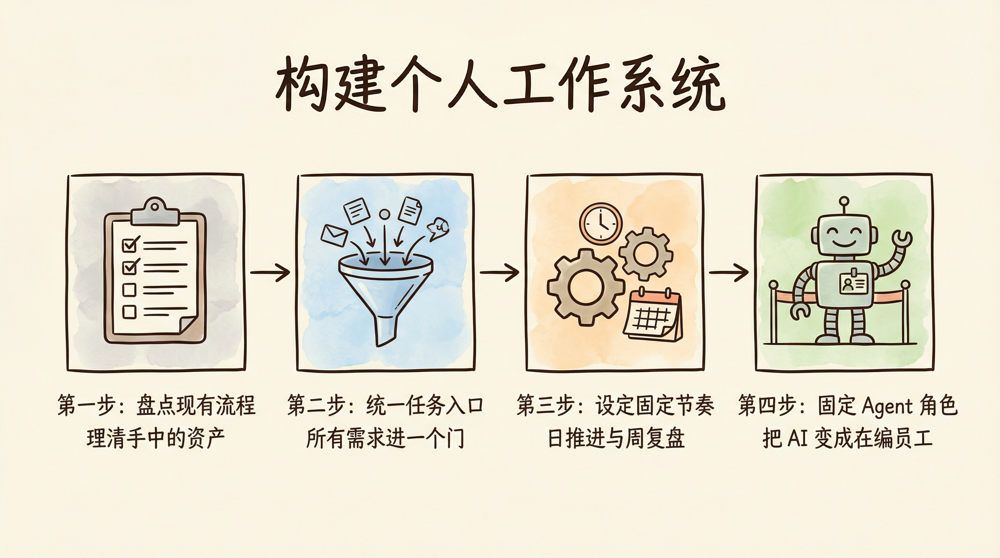

# 第12章 从「几条流程」到一整套可运转的「个人工作系统」

你在第三篇已经见过各种场景下的智能体，甚至亲手搭过一批智能体。也许你像小陈一样，在扣子编程上创建了选题、脚本、封面三个智能体，每天按「选题→脚本→素材→发布」的节奏走；也许你像阿珍一样，用主图需求卡、评价分析、营销文案三条流程撑起了上新和复盘；也许你像林老师、小周或老杨，把备课批改、会议周报、决策推演都拆成了有 Agent 参与的固定路径。无论你从哪一章来、做了哪几类，你现在拥有的都是「几条可复用的流程」。这一章要做的事只有一件：把这几条流程收拢成一整套可运转的个人工作系统——有盘点、有统一入口、有固定节奏、有稳定嵌入的 Agent 角色。这样，流程才不会散落在各处、想起来才用，而是长在你日常工作的节奏里，可持续、可进化。

本章不要求你再新建一堆智能体，而是帮你在「系统层面」做四件事：盘点你已经拥有的可复用工作流 → 为所有任务建立一个统一入口 → 为你的工作系统设定固定节奏 → 让 Agent 成为流程体系中的固定角色。每一步都会给出可执行的清单和表格，你只要按自己的实际情况填一填、选一选，就能搭出个人工作系统的雏形。

## 12.1 盘点你已经拥有的可复用工作流

系统搭建的第一步不是「再建什么」，而是「先看清自己已经有什么」。很多人脑子里和工具里其实已经有一条条流程——有的写在文档里，有的只在心里、没写下来；有的在扣子编程上搭了智能体，有的还在用通用 AI 随手问。盘点的作用，就是把这些散落的流程显性化，为后面的统一入口和节奏打基础。盘点不是为了完美无缺，而是为了看得见、选得出、排得出优先级。

### 12.1.1 整理所有现有流程

先拿出一张表（可以用 Excel、飞书多维表格、Notion 或一张纸），把所有你已经在用、或打算固定下来的「可复用工作流」列出来。每条流程只需要记四类信息：流程名称、主要步骤（不必写全，写主干即可）、使用场景（什么时候会跑这条流程）、当前工具/平台（在哪执行、有没有对应的智能体）。

下面是一张示例表，你可以直接复制结构，按自己的情况填：

| 流程名称       | 主要步骤（主干）           | 使用场景           | 当前工具/平台        |
| :------------- | :------------------------- | :----------------- | :------------------- |
| 日更视频流程   | 选题→脚本→素材→剪辑→发布  | 每天做一条口播     | 扣子编程（选题/脚本/封面）+ 剪辑软件 |
| 商品上新流程   | 资料→需求卡→主图→文案→上架 | 每款新品上线       | 扣子编程（需求卡/评价/文案）+ 店铺后台 |
| 会议纪要流程   | 录音/笔记→转写→提炼行动项→进任务表 | 每次重要会议后     | 扣子编程（会议纪要助手）+ 任务表 |
| 周报流程       | 零散事项→周报助手→人补判断→提交 | 每周五             | 扣子编程（周报助手）+ 公司模板 |
| 决策流程       | 信息→多版方案→分析→选方案→规则 | 重大战略或资源决策 | 扣子编程（简报/方案/分析/规则） |

如果你只做过其中一类（比如只做了会议+周报），就只列这两条；如果你还没在扣子编程上搭任何智能体，但已经有一套「心里有数」的固定步骤（比如每周固定时间看竞品、写复盘），也可以先写下来，工具栏填「暂无」或「手动」。关键是：先列全你认知范围内的可复用路径，不追求一次穷尽，以后可以随时往表里加。

### 12.1.2 标记流程使用频次

在同一张表里另起一列，为每条流程标上使用频次：是每天都会跑、每周跑、每月跑，还是按需（有任务才跑）。例如：日更视频可能是「日」；商品上新、会议纪要是「按需」但可能很密；周报是「周」；决策流程是「按需」且相对低频。频次的作用有两个：一是后面选「主要流程」时，高频的往往优先；二是设定节奏（后面12.3节会详细讲解）时，你知道哪些流程需要每日留时间、哪些只需每周或按需触发。

### 12.1.3 为不同流程添加标签

再为每条流程加一两个标签，方便以后筛选和归类。标签可以按场景来：例如「内容生产」「运营/电商」「沟通/汇报」「决策/管理」。也可以按使用角色来：例如「仅自己用」「会跟团队/同事一起用」。这样当你的流程越来越多时，你可以快速找到「所有和沟通相关的流程」或「所有需要团队配合的流程」，便于统一入口（12.2）里按流程归类任务。

### 12.1.4 选出 3～5 条主要流程

盘点完以后，不要试图「每条都重点照顾」。先从中选出 3～5 条主要流程，作为你个人工作系统的「主菜单」。主要的判断标准可以是：使用频次高（日或周）+ 对结果影响大（不做就会明显影响产出或协作）。例如：若你是内容创作者，可能选「日更视频流程」；若你是电商运营，可能选「商品上新流程」和「评价复盘」；若你是职场人，可能选「会议纪要」和「周报」；若你是管理者，可能选「决策流程」和「周报/汇报」。选出的这几条，会在 12.2 和 12.3 里成为你「统一入口」和「固定节奏」的重点对象；其他流程可以暂时放在表里，需要时再纳入节奏。

【心法】  
盘点不是为了列出一份完美清单，而是为了「看得见、选得出、排得出优先级」。先有一张表、再标频次和标签、再选出 3～5 条主流程，你的系统就有了第一批「在编流程」。

## 12.2 为所有任务建立一个统一入口

流程盘点是「有什么」；统一入口解决的是「新任务和待办从哪进、从哪看」。如果任务和待办散落在邮件、聊天、脑子、多个 App 里，你就很难回答「今天到底要跑哪几条流程、先做哪几件事」。统一入口的原则很简单：选定一个主入口，所有新任务一律先进入口，在入口里标注任务属于哪条流程，让入口成为你「今天要跑的流程清单」的来源。这样你不是在「多建一个系统」，而是在少一个焦虑源——所有事先进一个门，再在门里分流程、排优先级。

### 12.2.1 选定你的任务入口工具

先选定一个任务入口工具：可以是一个待办 App（如 Todoist、滴答清单、Things）、一个看板（如 Trello、飞书多维表格的看板视图）、一个文档（如 Notion 的待办列表、飞书文档里的任务表），甚至是一张每天更新的 Excel 或纸质清单。选什么不重要，重要的是：只选一个作为主入口，并约定「所有需要我跟进的事，最后都要出现在这里」。如果你已经在用某个工具记任务，就把它升级为「唯一主入口」，其他渠道（邮件、群消息、会议）只作为「信息来源」，真正要做的动作都汇总到入口里再处理。

不必追求功能最全或最「高级」——能列任务、能标属性（如所属流程、截止时间）、能按条件筛选，就够用。关键是你愿意每天打开它、先从这里看「今天要干嘛」。一旦选定，就尽量坚持用同一处，避免任务又分散到多个 App 里。

### 12.2.2 所有新任务一律先进入口

定一条简单规则：无论任务从哪来（邮件、会议、老板一句话、自己想到的），先进入口再处理。具体可以是：收到需求或想到一件事时，先花 10 秒在入口里新建一条任务（标题可先写一句话），再决定什么时候做、归到哪条流程。这样你就不会依赖「记得住」——记在入口里，就不会忘；也不会依赖「翻聊天记录」——入口才是你的待办真相。一开始可能会觉得多了一步，习惯之后会发现，少了很多「我是不是漏了什么」的焦虑。

### 12.2.3 在入口标注任务属于哪条流程

在入口工具里，为每条任务增加一个属性：这条任务属于哪条流程（或「无流程」）。流程名称可以直接用 12.1 盘点表里的名字，例如「日更视频流程」「会议纪要流程」「周报流程」。这样你可以随时筛选「本周所有和会议纪要相关的任务」「今天要跑的上新流程有几件」。任务和流程的对应关系，是后面「今天要跑哪几条流程」的基础：你不需要靠脑子想「今天该做啥」，而是从入口里按流程筛选，就能看到「今天要推进的流程清单」。

### 12.2.4 让入口成为今天要跑的流程清单

每天（或每周）有一个固定时刻，从入口里「拉出」今天要执行的流程或流程中的步骤。例如：早上开工前花 5 分钟看入口，按「今日要做」或「按流程」筛选，得到「今天要跑：日更视频流程（选题+脚本）、会议纪要流程（昨天那场会）」。把这几条当作当天的「流程清单」，优先安排时间；其他零散任务再插空。这样入口就不只是「待办堆」，而是今天要跑的流程清单的来源，你的工作节奏会自然围绕「流程」转而不是围绕「杂事」转。

【心法】  
统一入口不是「多一个系统」，而是「少一个焦虑源」——所有事先进一个门，再在门里分流程、排优先级。入口 + 流程标注，就是你个人工作系统的「前台」。

## 12.3 为你的工作系统设定固定节奏

有流程、有入口，还要有节奏：什么时候做哪类事、什么时候检查流程。否则流程和入口很容易被日常琐事冲散，用一阵就断。固定节奏的作用，是让「系统」而不是「心情」驱动工作——到点就切换、到点就检查，习惯成自然。

### 12.3.1 设定每天的固定切换时刻

为每一天设定一两个固定切换时刻，把不同流程或不同类型的工作「绑」到固定时间段。例如：上午 9:00～12:00 专注「内容生产类」流程（如日更视频的选题和脚本），下午 14:00～16:00 处理「沟通与汇报」类（会议纪要、周报、跨部门沟通），周五下午留 1 小时做「流程检查」（见 12.3.2）。具体怎么切分可以根据你的主业调整，原则是：同一类流程尽量在固定时段做，减少「现在该干嘛」的纠结，也便于形成节奏感。

如果暂时做不到「每天固定时段」，可以先把「每天有一个固定时刻看入口、勾出今天要跑的流程」定下来——例如每天早上的前 10 分钟，只做一件事：打开入口，按「今日」或「按流程」筛一遍，在心里或纸上列出「今天要跑哪几条流程、每条做到哪一步」。这个小动作本身就会慢慢形成节奏感，再逐步细化到具体时段。

### 12.3.2 为每周留出一次流程检查时间

每周留出一次流程检查时间（建议 30 分钟～1 小时）：这段时间不执行具体任务，只做一件事——检查本周哪条流程跑了、哪条没跑、为什么。可以对着 12.1 的流程盘点表，逐条过：这条本周跑了几次？如果没跑，是没需求还是忘了、被挤掉了？如果跑了，有没有卡点或断点？检查的目的不是批评自己，而是让「流程状态」可见，为下一步调整（12.3.4）提供依据。

### 12.3.3 用三个问题检查流程的状态

在流程检查时间里，对每条主流程（你选出的 3～5 条）用三个问题过一遍，并把答案简单记下来（可在流程表旁加一列「本周检查备注」）：

1. 这条流程本周跑了几次？（和预期频次是否一致？）
2. 卡点或断点在哪？（哪一步总拖、哪一步容易忘、哪一步工具不好用？）
3. 需要调整的是步骤、工具还是人？（是流程设计要改、要换/加一个 Agent、还是自己或协作方的习惯要改？）

三个问题问完，你会得到一批「改进点」——有的可以立刻改，有的需要记下来下次迭代。这就是 12.3.4 要做的：把改进点变成入口里的小任务，避免「检查完就忘」。

| 流程名称     | 本周次数 | 卡点/断点           | 待调整（步骤/工具/人） |
| :----------- | :------- | :------------------ | :-------------------- |
| 日更视频流程 | 5/7      | 封面有时来不及做    | 考虑把封面步骤再提前  |
| 会议纪要流程 | 3        | 无                  | —                     |
| 周报流程     | 1        | 周五下午总被挤掉    | 改到周五上午 30 分钟  |

### 12.3.4 将发现的调整点记成小任务

流程检查得到的「待调整」项，不要只写在表里就结束。每一条都变成入口里的一条小任务，例如：「优化日更流程：把封面步骤提前到脚本之后」「周报时间改为周五上午」。这样下次你有空时，可以从入口里按「流程优化」或「系统维护」筛选，逐条做掉；做完了再在流程表或流程文档里更新一版。节奏 + 检查 + 改进任务，形成闭环，你的工作系统才会持续进化而不是搭完就静止。

【心法】  
节奏比单次完美更重要。固定节奏才能让「系统」而不是「心情」驱动工作；每周检查 + 三问 + 改进任务，让系统可持续、可迭代。

## 12.4 让 Agent 成为流程体系中的固定角色

你在第 7～11 章在扣子编程上搭好的那些智能体——选题、脚本、封面、主图需求卡、评价分析、营销文案、会议纪要、周报、跨部门沟通、行业简报、方案生成、方案分析、情境推演与决策规则——都不是「偶尔用用的工具」，而应该成为你流程体系里的固定角色。也就是说：在流程的哪一步、由哪个智能体执行、输入输出是什么，都要写进「流程版本」里，每次跑这条流程时都按同一套来，Agent 才真正被纳入系统。这一节讲四件具体的事：标记由 Agent 执行的步骤、统一关键步骤的 Agent 角色、把稳定 Agent 写入流程版本、让 Agent 长期稳定嵌入流程。

### 12.4.1 标记必须由 Agent 执行的步骤

在 12.1 的流程清单或你画过的流程图里，明确标出「这一步由 XX 智能体执行」。例如：日更视频流程里，「选题」由选题智能体出初稿、「脚本」由脚本智能体出初稿、「封面」由配图/封面智能体出图；会议纪要流程里，「转写与整理」由会议纪要助手完成，「提炼行动项」可以由同一助手或再建一个行动项提炼助手完成。标清楚之后，你就知道：哪些步骤是「人做」、哪些是「Agent 做」、哪些是「人+Agent 协作」（Agent 出初稿、人把关）。这样流程和 Agent 的对应关系一目了然，不会出现「有时用有时不用」的随意状态。

### 12.4.2 为关键步骤统一 Agent 角色

同一类步骤，尽量用同一个 Agent 角色。例如：所有「周报初稿」都交给周报助手，所有「跨部门沟通草稿」都交给跨部门沟通助手；不要今天用 A 明天用 B，否则你很难形成稳定习惯，流程版本也不好写。所谓「统一角色」，不是说你只能有一个智能体，而是说「同一类任务对应同一类智能体」——这样认知负担小，也便于在流程文档里写「步骤 2：调用周报助手，输入本周事项列表，输出周报草稿」。

### 12.4.3 将稳定 Agent 写入流程版本

为每条主流程维护一个流程版本（可以是一份短文档或一张表）：写清这条流程的步骤顺序、每一步的输入、输出、执行者（人还是哪个智能体）。例如：

- **步骤 1**：人整理本周完成事项与下周计划要点（输入：零散记录；输出：要点列表）。
- **步骤 2**：调用周报助手，输入要点列表，输出周报草稿（执行者：周报助手）。
- **步骤 3**：人补个人判断与优先级，定稿并提交（执行者：人）。

把智能体的名字、输入输出写进流程版本，有三大好处：一是你自己每次跑流程时不会忘「这一步该开哪个智能体」；二是交接或带人时，对方能按文档操作；三是复盘时能看清「是步骤设计问题还是 Agent 输出问题」。你在扣子编程上搭好的智能体，在这里就是这些「固定角色」；把它们的名字、输入输出写进流程版本，你的系统就真正把 Agent 纳入了。

若你希望「一眼看到所有在用的智能体」，可以在扣子编程里建一个「我的工作流总览」项目：不新建智能体，只新建一个文档或列表，把你在 12.1 盘点表里用到的智能体名称、对应流程、主要输入输出列进去。以后每次加新流程或新智能体时，顺手更新这份总览，和 12.1 的流程盘点表对应起来，你的「系统菜单」就更清晰了。

### 12.4.4 让 Agent 长期稳定嵌入流程

最后一步是用流程版本约束自己的行为：每次跑这条流程时，都按同一套步骤、同一批 Agent 来执行，不临时换、不跳过。这样 Agent 才是「流程里的固定角色」，而不是「想起来了才用一下」的临时工具。长期稳定嵌入之后，你才会真正体会到「系统」的威力：流程在转、Agent 在固定位置出力、你只需要在关键节点做判断和拍板，而不是每一步都从零想。

【心法】  
Agent 只有写进流程版本、每次跑流程都按同一套调用，才是「系统里的固定角色」。你在第 7～11 章搭好的智能体，在这一章的任务就是「挂进系统」——标记步骤、统一角色、写入流程版本、长期按版本跑。

## 本章结语

这一章我们做了四件事，把「几条流程」升级成了「个人工作系统」的雏形：

1. **盘点**：整理所有现有流程、标频次与标签、选出 3～5 条主流程，让「有什么」可见、可选、可排优先级。
2. **统一入口**：选定一个任务入口、新任务一律先进入口、在入口标注所属流程、让入口成为「今天要跑的流程清单」的来源，少一个焦虑源、多一个控制点。
3. **固定节奏**：设定每日切换时刻、每周留出流程检查时间、用三问检查流程状态、把改进点记成入口里的小任务，让系统而不是心情驱动工作，并可持续迭代。
4. **Agent 固定化**：在流程里标记由 Agent 执行的步骤、统一关键步骤的 Agent 角色、将稳定 Agent 写入流程版本、按版本长期跑，让扣子编程上搭好的智能体真正成为系统里的固定角色。

这四件事合起来，就是「个人工作系统」的骨架：有在编流程、有统一入口、有节奏与检查、有稳定嵌入的 Agent。系统搭起来之后，下一步是让这套方式长在你身上——变成你的默认工作方式、用小动作持续变强、开始影响他人，并且不依赖某一种工具。下一章我们会聊：如何形成「先想流程再动手」的习惯、如何用五分钟复盘和每月优化一条流程让系统变强、如何让你的工作方式成为可复用的价值输出，以及为什么「工具会更新，方法论会留下」——你的工作方式 2.0，将从这里真正开始。
