# 《效率倍增的 AI Agent 工作流：从零搭建一套你的智能体工作方式》
## 前言

### 集体的“AI焦虑”与“AI瓶颈”

ChatGPT横空出世，至今已逾两年。在这两年里，我们经历了一场从“震惊”到“焦虑”，再到“平淡”的集体心理历程。

起初，我们被它写诗、写代码、通过图灵测试的能力所震撼，惊呼“奇点已来”。紧接着，焦虑感如潮水般涌来：我会不会失业？我的技能是否一夜之间变得一文不值？于是，人们纷纷注册账号、学习Prompt（提示词）、收藏各类“100个必用AI工具”的清单。

然而两年后的今天，情况却变得有些微妙。

环顾四周，你会发现大多数人对AI的使用，依然停留在浅层阶段。他们把ChatGPT当作“加强版搜索引擎”，用来查询资料；或者将其视为“翻译工具”，翻译几段外文；偶尔让它撰写周报，还需自己修改大半天。

更令人沮丧的是，许多人发现，使用AI之后，自己并没有变得更轻松。相反，为了让AI输出一个满意的结果，需要反复调整提示词，不断纠正错误输出，最后还要花费大量时间核对事实。一番操作下来，效率甚至不如自己直接完成。

这就是我们当前面临的“AI瓶颈”：工具越来越强大，但我们的效率并没有随之倍增。

问题出在哪里？是AI还不够聪明吗？是模型参数还不够大吗？

答案是否定的。问题不在于工具本身，而在于我们使用工具的方式。

### 认知的错位：拿着核武器炸鱼

我们正在犯一个巨大的认知错误：我们试图用旧时代的工作方式，去驾驭新时代的生产力工具。

想象一下，你手里有一把全自动突击步枪，但你却把它当成烧火棍，用来捅灶台里的柴火。虽然它也能把柴火捅进去，但这显然不是它被设计出来的目的，更发挥不出它万分之一的威力。

目前的绝大多数人，就是在使用“烧火棍”模式使用AI。这种模式我称之为“手工作坊”模式。


在“手工作坊”模式下，工作流程是这样的：遇到一个具体问题 \> 掏出AI工具 \> 输入指令 \> 等待结果 \> 人工修改 \> 结束。

在这个过程中，人依然是绝对的执行主体，AI只是一个随叫随到的临时助手。每一次任务，都需要你重新发起、重新引导。你的工作流是断裂的、碎片的、一次性的。你依然被困在具体的事务中，只是换了一种更高级的工具在进行「机械重复」。

而真正的高手，早已切换到了“智能工厂”模式。

在“智能工厂”模式下，人不再是直接的执行者，而是系统的设计者。他们不再盯着某一个具体的任务（比如“写一篇公众号文章”），而是盯着一类任务的生产流程（比如“搭建一套自动化的公众号内容生产流水线”）。

他们会把一个复杂的任务，拆解成若干个标准的步骤；然后为每一个步骤，寻找最合适的AI模型或工具；接着，通过精心设计的提示词（Prompt）和编排（Orchestration），把这些步骤串联起来，形成一个自动运转的闭环。

在这个模式下，AI不再是一个被动的问答机器，而是一群被赋予了特定角色、技能和记忆的“数字员工”（Agent）。它们在你的指挥下，各司其职，流水线作业。

这就是本书的核心命题：如果你想真正实现效率倍增，你必须完成从“工具思维”到“系统思维”的跃迁。你不能只满足于做一个熟练的“操作员”，你必须进化为一名能够驾驭AI Agent的“架构师”。

### 这本书能给你带来什么？

这不是一本罗列AI工具说明书的“黄页”，也不是一本深奥晦涩的技术理论书。这是一本实战手册，一本教你如何把AI落地到真实工作场景中的行动指南。

在接下来的章节中，我将带你完成以下三个层面的进化：


第一层：掌握一套通用的工作流搭建方法论。 我会毫无保留地分享我总结的“工作流五步法”：明确目标、拆解步骤、定义角色、编排流程、测试迭代。无论你是写文章、做视频、写代码，还是做数据分析，这套心法都通用。你将学会如何像产品经理一样思考，把模糊的需求转化为精确的流程图。

第二层：学会给Agent写一份清楚的“岗位说明书”。 很多人觉得AI笨，是因为自己没把任务说清楚。我会教你如何用结构化的方式定义Agent的角色。你将不再是给AI下指令（Instruction），而是在给AI写岗位描述（Job Description）。你会发现，当你把AI当成一个有独立思考能力的员工去尊重、去培养时，它给你的回报将超乎想象。

第三层：建立属于你自己的“个人智能工作系统”。 本书精选了短视频、电商、教育、职场办公、创业管理等五个高频领域的真实案例。我不会只给你展示结果，我会把每一个案例深度拆解，带你从零开始搭建。你会看到，一个日更的短视频博主，是如何用一套工作流把每天的制作时间从8小时压缩到0.5小时的；一个电商运营，是如何用Agent自动监控竞品、生成上新文案的。

通过这些案例，我希望你能举一反三，把你手头那些重复、繁琐、低价值的工作，统统交给AI，从而把你的时间和精力，释放到真正需要创造力、需要情感连接、需要战略思考的高价值领域中去。

### 本书学习建议

**一、先打地基，再盖房子** 

前四章是本书的方法论基座，建议按顺序通读：第1章帮你分清「AI、Agent、工作流」这三个最容易混淆的概念；第2章教你像带团队一样管理多个 Agent；第3章手把手教你画流程图；第4章则用「五步法」把图纸变成真正能跑起来的自动化流水线。这四章是后续所有案例的基础，跳过任何一章，后面读起来都会吃力。

**二、光看不练，等于白学** 

每章末尾都有一道练习题，而且它们是串联的——第1章让你列出想自动化的任务，第2章让你为这个任务配备「数字员工」，第3章让你画出流程图，第4章让你把它搭成工作流。强烈建议跟着做完这四道题。说实话，学会驾驭 Agent 没有捷径，唯一的方法就是亲手搭一条属于自己的流水线。

**三、案例章节，挑着读就好** 

从第五章开始，本书会进入短视频、电商、教育、职场办公、创业管理五个领域的实战案例。这些案例彼此独立，你完全可以根据自己的行业或兴趣，挑感兴趣的先读。

**四、读不懂的地方，翻回去就行** 

书中会反复出现一些核心概念（比如 HIL、输入/输出接口等），如果在案例里遇到陌生的术语，随时翻回前四章复习。我也会在关键处标注「参见第X章」，方便你快速定位。

**五、不必一口气读完。** 

我更推荐的节奏是这样的：读完前四章后，立刻拿手头的一个真实任务练手；遇到卡壳的地方再回来翻书；等第一条工作流跑通了，再进入案例章节找灵感。用「做」来消化「学」，这才是掌握 AI 协作最快的路径。

### 致谢

一本书的诞生，从来不是一个人的独行。

首先要感谢我的家人。写作是一件极其消耗心力的事情，尤其是在工作之余挤出时间来完成一本书。没有你们的理解与支持，这本书不可能完成。

感谢本书的策划编辑和出版团队。从最初的选题讨论，到框架的反复打磨，再到文字的逐句校对，你们的专业与耐心让这本书的质量有了质的提升。尤其感谢编辑老师提出的诸多修改建议——有些是我反复斟酌后仍未察觉的表述问题，有些是站在读者视角给出的结构优化，每一条修改建议都切中要害。

感谢那些在 AI 社区、社群和博客里无私分享经验的开发者、产品经理和内容创作者。你们的实践案例，是本书案例章节的重要灵感来源。知识的价值在于流动，我从你们那里汲取，也希望通过这本书回馈更多人。

最后，感谢正在阅读这段文字的你。一本书只有被打开、被阅读、被实践，才真正拥有了生命。感谢你愿意花时间读到这里，更期待你能带着书中的方法论，去搭建属于自己的智能工作流。

如果这本书对你或你的家人朋友有所帮助，那便是对我最好的回报。

让我们一起，用系统思维驾驭 AI，把时间还给真正重要的事。


---

## 第一篇　为什么你需要一套 AI Agent 工作流

### 第1章 重新认识 AI、Agent 与工作流

你现在到底是在「用 AI」，还是在「用工作方式」？

这是一个听起来有点绕口，但至关重要的问题。
为什么有人用 AI 效率翻了 10 倍，而你用 AI 只是多了一个聊天的窗口？

答案不在于你订阅了多少服务，而在于你是否真正理解了这三个概念：AI、Agent（智能体） 和 工作流（Workflow）。

#### 1.1 AI、Agent 与工作流：智能时代的「电力系统」

在开始一切操作之前，我们必须先统一语言。

##### 1. AI：能力底座，像电力

当我们谈论“AI”时，通常指的是像 ChatGPT、Deepseek、通义千问（Qwen）这样的大语言模型（LLM）。它们是整个智能时代的基础设施。

你可以把 AI 想象成电力。电力本身是无形的、通用的。它蕴含着巨大的能量，可以驱动机器运转，可以点亮灯泡，可以加热食物。但电力本身并不直接解决问题——你不能直接用电去炒菜，你得用电磁炉；你不能直接用电去冷藏食物，你得用冰箱。

AI 也是一样。它拥有强大的推理能力、生成能力和总结能力，但它是一个通用的“大脑”。如果你直接问它：“帮我把工作做完”，它会一脸茫然。因为它不知道你的工作是什么，不知道你的标准是什么，也不知道你手头有哪些资源。

##### 2. Agent：角色机制，像设备或工人

为了让电力（AI）发挥作用，我们需要把它输入到具体的设备中。在 AI 领域，这个设备就是 Agent（智能体）。

Agent 是被赋予了特定角色、技能和记忆的 AI。

*   **角色（Role）**：它不再是一个全知全能的“神”，而是一个有具体职位的“人”。比如“资深 Python 工程师”、“小红书爆款文案写手”或“法律合同审核专员”。
*   **技能（Skills）**：它被配置了特定的工具。比如联网搜索的能力、读取 PDF 的能力、运行代码的能力。在扣子等平台，这类能力正以「技能」的形式被做成可复用模块，可被多个智能体共用或单独调用；本书主要教你创建智能体，Skill 作为延伸概念你可在熟悉智能体后自行了解。
*   **记忆（Memory）**：它记住了你的偏好、你的项目背景、你过去的历史数据。

如果说 AI 是电力，那么 Agent 就是电器（如冰箱、洗衣机），或者是工厂里的工人（如焊工、质检员）。它们专注解决某一类具体的问题，并且越做越熟练。

##### 3. 工作流：任务路径，像生产线

有了电（AI），有了机器（Agent），工厂就能运转了吗？还不行。如果机器乱放，工人乱跑，生产出来的只能是废品。

你需要把这些机器和工人，按照特定的顺序组织起来，形成一条生产线。这就是 工作流（Workflow）。

工作流定义了任务的流转路径，举个例子：

1.  **第一步**：由“信息收集 Agent”从网上抓取最新的行业新闻（输入）。
2.  **第二步**：将抓取到的内容传递给“内容清洗 Agent”，去掉广告和无关信息（处理）。
3.  **第三步**：交给“摘要生成 Agent”，提炼出核心观点（加工）。
4.  **第四步**：最后由“排版 Agent”生成一张精美的日报图片，发送到你的邮箱（输出）。

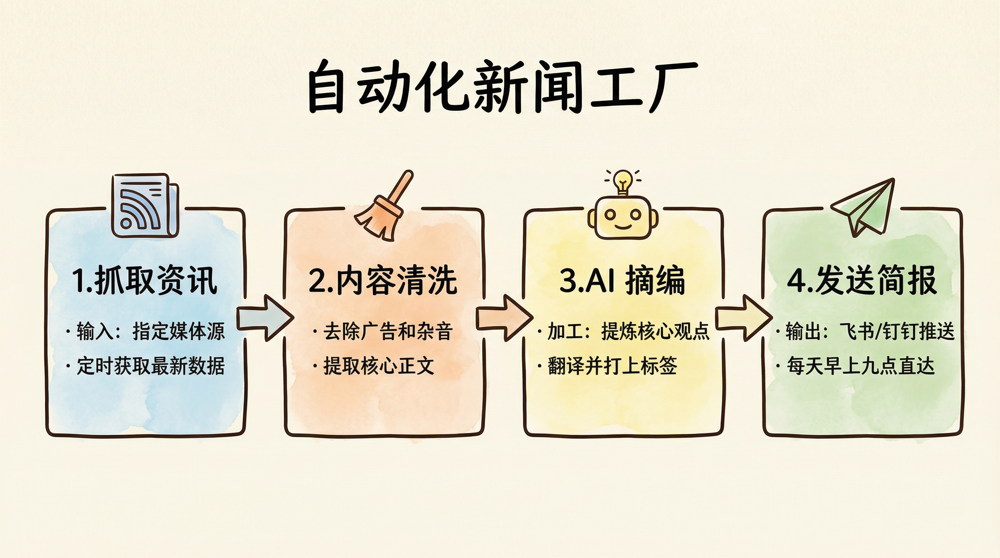

在这个过程中，每一个 Agent 只负责自己最擅长的那一小块，而工作流负责把它们串联起来，确保信息像流水一样顺畅地流转。

---

**💡 总结一下：**

*   **AI** = 电力（提供基础能力）
*   **Agent** = 工人（具备特定技能的角色）
*   **工作流** = 生产线（完成复杂任务的路径）

只有当你开始思考如何搭建“生产线”，而不是仅仅思考如何“用电”时，你的效率才会发生质的飞跃。

**📝【核心概念三位一体图】**

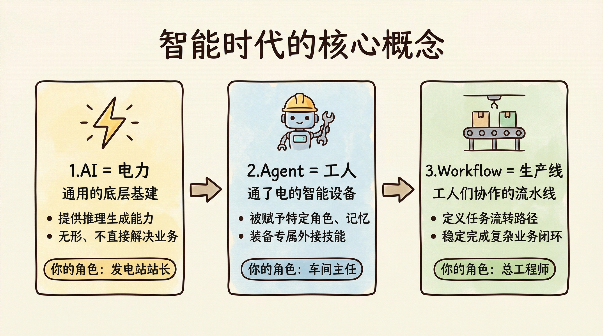

| 概念 | **类比** | **定义** | **你的角色** |
| :--- | :--- | :--- | :--- |
| **AI (大模型)** | **⚡️ 电力** | 通用的能源。提供推理、生成、总结的基础能力。 | **发电站站长**<br>(选哪个模型便宜好用) |
| **Agent (智能体)** | **🤖 电器/工人** | 通了电的设备。被赋予了角色（比如客服）、技能（比如联网搜索）和记忆。 | **车间主任**<br>(给它派活、定标准) |
| **Workflow (工作流)** | **🏭 流水线** | 把电器串联起来的生产线。让信息像水流一样自动流转。 | **总工程师**<br>(设计整个业务闭环) |

**【场景演示】**

*   **用 AI**：你问 ChatGPT「怎么写日报」。它给你一段模板。（你还得自己填内容）
*   **用 Agent**：你对「日报助手」说「生成日报」。它自动读取你今天的**日程安排和会议记录**，填好模板。（你只需要检查）
*   **用 Workflow**：**你什么都不用做**。每天晚上 6 点，系统自动抓取数据 -> 生成日报 -> 发送到老板邮箱。

#### 1.2 为什么「单点交互」会锁死你的上限

理解了这三个概念，我们再来看看大多数人是怎么用AI的，以及为什么这种方式限制了他们的产出上限。

**❌ 错误反应：**
「打开 Deepseek 的对话框，输入一段话，等待回复。如果不满意，再追问，再等待。」

**💥 后果：**
你陷入了「手工作坊」模式。
你就是那个路由器，你负责把任务拆解，你负责判断结果好坏，你负责把上一步的结果复制粘贴到下一步。你一天不干活，AI 也就停了。

**✅ 正确逻辑：**
要从「作坊」升级为「智能工厂」。
高手不直接干活，高手只负责「造机器」。一旦机器造好，按一下开关，它就能 24 小时自己跑。

**📝【效率公式对比】**

*   **手工作坊（Chat 模式）**：
    $$产出 = 个人时间 \times AI 响应速度$$

    *   **局限性**：你的时间和精力是线性的。你一天不睡觉也只能聊那么多句。
    *   **隐性风险**：极度依赖你当下的状态——如果你今天累了，或者提示词没写好，AI 的输出质量就会直线下降。

*   **智能工厂（Workflow 模式）**：
    $$产出 = (Agent 组合 \times 流程编排)^{复用次数}$$

    *   **可复用**：一次搭建，长久受益。今天搭建的流程，明天、下个月、明年都能自动运行。
    *   **可扩展**：想增加产量？增加并发进程即可。无需你多长脑袋，只需多开几条流水线。
    *   **质量稳定**：Agent 会严格执行你的 SOP（标准作业程序），没有情绪波动，输出极其稳定。

**【心法】**
如果你只是想写一封邮件，用单点交互的 Chat 模式就够了。
但如果你想每天自动筛选 1000 条新闻，并总结整理好发到你的邮箱里，那么 Workflow 模式是你唯一的选择。

#### 1.3 Agent 产品与 Agent 开发平台有何区别

当我们决定开始使用 Agent 时，市场上琳琅满目的选择往往让人眼花缭乱。简单来说，我们可以把它们分为两类：Agent 产品和 Agent 开发平台。

理解它们的区别，就像理解“去餐厅点菜”和“进厨房做饭”的区别一样重要。

---

##### 1. Agent 产品：开箱即用的“成品菜”

你可能已经在 ChatGPT 的 GPTs 商店，或者豆包、Kimi 的智能体中心里，看到过各种各样的 Bot。比如“小红书文案生成器”、“卡通头像生成器”、“塔罗牌占卜师”。这些就是典型的 Agent 产品。

它们的特点是开箱即用。开发者已经为你预设好了所有的提示词、技能和工作流。你只需要点击“开始对话”，就能直接享受服务。这就像去餐厅点一道“宫保鸡丁”，你不需要知道厨师是怎么炒的，也不需要自己准备食材，坐下吃就行。

*   **✅ 优点**：
    *   **门槛极低**：没有任何技术负担，会打字、会拍照就能用。
    *   **快速验证**：能迅速判断这个场景 AI 到底能不能做，效果好不好。
*   **❌ 缺点**：
    *   **无法定制**：如果这道菜太咸了（输出风格太严肃），或者你想加点辣（增加特定步骤），你几乎无法调整。
    *   **黑盒运行**：你不知道它背后是如何工作的，一旦出错，很难定位问题所在。

##### 2. Agent 开发平台：丰俭由人的“大厨厨房”

如果你发现市面上的成品都不能完美满足你的需求，或者你想把自己的独门秘籍变成工具，那么你需要的就是 Agent 开发平台。典型代表有字节跳动的 Coze（扣子）、开源利器 Dify，以及工作流自动化神器 n8n。

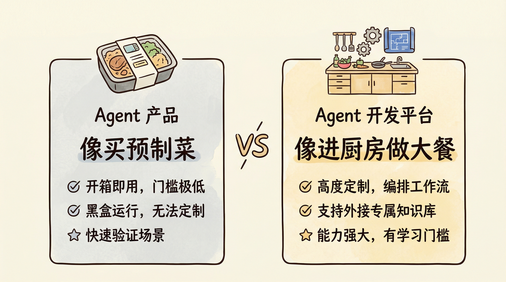

在这些平台上，你就是主厨。你可以：

*   **自定义人设**：给 Agent 写一段几千字的详细岗位说明书。
*   **挂载知识库**：上传你公司内部的 PDF 文档、Excel 表格，让 Agent 基于私有数据回答。
*   **配置工作流**：像搭积木一样，把“搜索”、“大模型”、“代码运行”、“API 调用”等模块串联起来。

*   **✅ 优点**：
    *   **高度定制**：完全按照你的业务逻辑来设计，100% 契合你的需求。
    *   **能力强大**：可以调用外部工具（如飞书、钉钉、Notion），实现真正的跨平台自动化。
*   **❌ 缺点**：
    *   **有学习门槛**：需要你具备一定的逻辑思维能力，甚至需要理解一些基础的参数配置。

 **【建议】**：对于初学者，可以先从 Agent 产品入手，找找感觉；但如果你想真正实现“效率倍增”，最终必须掌握 Agent 开发平台，打造属于你自己的专属兵器。

---

#### 1.4 主流的 Agent 开发平台怎么选

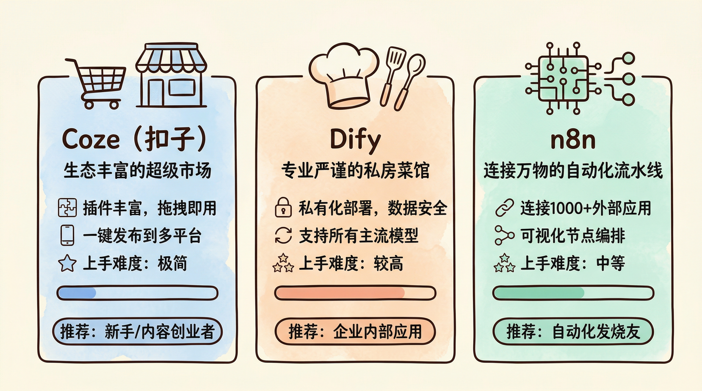

既然要进厨房，选一套顺手的厨具就很关键。目前市面上主流的平台主要有三家，各有千秋：

**📝【平台选型指南】**

##### 1. Coze（扣子）：生态丰富的“超级市场”

Coze 是字节跳动推出的 AI 应用开发平台。它的最大优势在于**生态**和**易用性**。

*   **插件丰富**：内置数以千计的插件，像搭积木一样拖拽即可使用。
*   **发布便捷**：支持一键发布至飞书、微信公众号等平台，甚至支持 API 调用。
*   **适合人群**：内容创作者、个人开发者、希望快速验证想法的职场人。

##### 2. Dify：专业严谨的“私房菜馆”

Dify 是一个开源的 LLM 应用开发平台。它的关键词是**专业**和**可控**。

*   **私有化部署**：支持部署在自有服务器，数据和知识库完全由自己掌控，安全性极高。
*   **模型中立**：支持接入市面上几乎所有主流模型，不绑定特定大厂。
*   **适合人群**：企业 IT 部门、对数据安全敏感的业务团队、进阶极客。

##### 3. n8n：连接万物的“自动化流水线”

n8n 是一个基于节点的工作流自动化工具。它的关键词是**连接**和**自由**。

*   **连接万物**：支持连接 1000+ 外部应用（Gmail, Notion, Slack 等），是整个数字世界的“胶水”。
*   **可视化编排**：画布式的操作界面，数据在各个节点间的流转路径一目了然。
*   **适合人群**：自动化极客、对跨应用数据流转有复杂需求的用户。

---

**📝【主流平台选型对比表】**

| 维度 | **Coze (扣子)** | **Dify** | **n8n** |
| :--- | :--- | :--- | :--- |
| **核心定位** | 生态丰富、C 端友好 | 专业可控、企业级 | 跨应用自动化、逻辑灵活 |
| **上手难度** | ⭐（非常简单） | ⭐⭐⭐（较高） | ⭐⭐（中等） |
| **数据安全性** | 一般（托管在平台） | 极高（可私有化部署） | 高（可私有化部署） |
| **连接能力** | 侧重内置插件与字节生态 | 侧重模型接入与知识库 | 强项是 1000+ 外部应用连接 |
| **推荐建议** | **新手/内容创业者首选** | **企业内部应用首选** | **流程自动化发烧友首选** |

---

**【本书立场】**

本书不绑定任何平台，无论你选择 Coze、Dify 还是 n8n，底层的编排逻辑和设计心法都是通用的。学会了原理，给你任何厨具，你都能做出一桌大餐。

#### 1.5 本章练习：你的「个人任务清单」

现在，请拿出纸笔，或者打开你的笔记软件。把模糊的痛点，变成具体的待办事项。

请回想过去 7 天，你工作中**最耗时、最痛苦、最重复**的 3 个任务，填入下表：

| 任务名称 | **痛点类型** | **解决方案** | **理想交付物** |
| :--- | :--- | :--- | :--- |
| *例：整理行业日报* | *缺信息/太繁琐* | *AI 搜索 + 总结* | *每天早上 9 点，一份带链接和摘要的日报推送到群里。* |
| *你的任务 1* | | | |
| *你的任务 2* | | | |
| *你的任务 3* | | | |


请保留这份清单。在接下来的章节中，我们将从这份清单出发，手把手教你把它们变成一个个自动运转的智能体工作流。

#### 本章结语

你可能已经意识到，AI 时代最大的鸿沟，不在于你是否买得起最贵的账号，而在于你是否拥有系统化的思维。

普通人把AI当搜索框，遇到问题搜一下，用完即走。 高手把AI当发电站，精心设计电网，让电力源源不断地流向每一个业务节点。

从今天起，请试着改变你的视角。当你面对一项繁琐的工作时，不要急着自己动手，也不要直接向对话框提问。请先停下来，问自己三个核心问题：

> 1. 这件事能不能拆解成一套标准流程？
> 2. 哪些环节可以交给 AI（Agent） 去自动完成？
> 3. 我该如何用 工作流（Workflow） 把它们串联起来？

要设计好这个系统，光有“电”是不够的，你还需要具体的“员工”来干活。

这些员工，就是我们下一章的主角——Agent（智能体）。让我们翻开下一页，去认识一下这位即将改变你工作方式的“数字新员工”。


---

### 第2章 Agent 与普通 AI 工具的本质区别

工具是手臂的延伸，而 Agent 是大脑的延伸。
前者需要你挥动，后者需要你管理。

很多读者格刚接触 Agent 时，最困惑的问题往往是：「它和 DeepSeek 到底有什么区别？不都是一个对话框吗？」

确实，从表面看，它们长得几乎一模一样。但在皮囊之下，二者的灵魂截然不同。这一章，我们不谈技术，只谈「管理学」。

#### 2.1 从「工具」到「角色」的切换

**❌ 错误反应：**
「AI 就是个加强版百度，或者个自动写稿机。」

**💥 后果：**
你永远只是在「用」它。
就像你手里拿着一把锤子，哪怕这把锤子是金子做的，你也只能用来砸钉子。你必须时刻盯着它，每一锤都要你亲自用力。你一松手，它就停了。

**✅ 正确逻辑：**
Agent 不是锤子，它是「拿着锤子的工人」。
你只需要告诉它「把墙砸了」。它会自己找锤子、找梯子，甚至会问你：「砸完要不要清运垃圾？」


**📝【认知对照表】**

| 维度 | 工具 (DeepSeek) | 角色 (Agent) |
| :--- | :--- | :--- |
| 交互方式 | 一问一答 | 你给目标，它交付结果 |
| 记忆能力 | 聊完即忘| 记住你的偏好与背景 |
| 主动性 | 被动等待 | 主动规划步骤 |
| 你的身份 | 操作员 | 管理者 |

**【心法】**
当你开始给 AI 起名字（如「文案小李」、「数据小王」）而不是叫它「那个软件」时，你就真正入门了。

#### 2.2 多 Agent 协作的任务拆分方式

**❌ 错误反应：**
「我想做一个超级 AI，它既能写代码，又能画图，还能帮我订外卖。」

**💥 后果：**
你得到的一定是一个「表现拙劣的助手」。
这就好比你要求公司的行政人员，既要懂财务报表，又要会修电脑。结果是她什么都干了，但什么都干得一团糟。大模型虽然全能，但「全能」意味着「平庸」。

**✅ 正确逻辑：**
专业的人做专业的事。
把一个大任务拆碎，分给一串小 Agent，每个 Agent 只做一件事，但把它做到极致。这就是工业革命的精髓，也是 Agent 工作流的精髓。

**📝【协作模式：单兵 vs 团队】**

*   单兵模式（DeepSeek）：
    你 -> 提问 -> AI 回答。
    *适用场景*：写首诗、查个百科。

*   团队模式（Agent Workflow）：
    你 -> 下达指令 -> [产品经理 Agent] 拆解需求 -> [程序员 Agent] 写代码 -> [测试 Agent] 找 Bug -> 交付给你。
    *适用场景*：开发软件、写研报、运营账号。

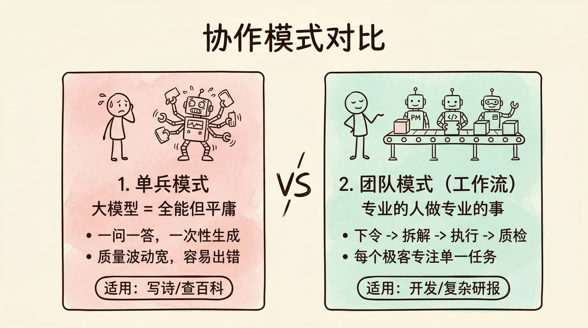

**【心法】**
不要试图制造「神」，要学会组建「军队」。

#### 2.3 人类与 Agent 的责任边界

把工作交给数字员工，不代表你可以当甩手掌柜。很多惨案的发生，就是因为人既不干活，也不检查。

**❌ 错误反应：**
「太好了，以后这活全归 AI 管，我再也不看了。」

**💥 后果：**
AI 可能会一本正经地产生幻觉，或者因为理解偏差而引发风险（比如给客户发了一封措辞不当的邮件）。等到出事了，责任全是你的。

**✅ 正确逻辑：**
建立 HIL（Human-in-the-loop，人在回路） 机制。
简单来说，就是「关键节点，人工确认」。


**📝【人机分工红线】**

| 任务类型 | Agent 权限 | 人类职责 |
| :--- | :--- | :--- |
| 只读不写（查数据、做分析） | ✅ 绿灯（可以随便跑，不用管） | 审阅最终结论。 |
| 内容生成（写草稿、画图） | 🟡 黄灯（可以生成，但不能直接发） | 必须修改和润色。 |
| 资金操作（付款） | 🛑 红灯（绝对禁止自动执行） | 必须二次点击确认。 |

**【心法】**
信任是建立在控制之上的。HIL 是你和 Agent 之间的安全带。

#### 2.4 让 Agent 从临时使用走向流程化

这是大多数人无法突破的瓶颈。

**❌ 错误反应：**
「遇到问题 -> 想起 AI -> 打开网页 -> 临时写个 Prompt -> 得到结果 -> 关掉网页。」

**💥 后果：**
你的工作流是断裂的、碎片的、一次性的。
每次任务，你都要重新发起、重新引导。你依然被困在具体的事务中，只是换了一种更高级的工具在「低效重复劳动」。

**✅ 正确逻辑：**
把 Agent 嵌入流程。
不要让 Agent 游离在你的工作之外，要让它长在你的流程上。

**【场景对比：写周报】**

*   临时调用：周五下午，你把聊天记录复制给 DeepSeek，说「帮我总结一下」。下周五，你还得重复一遍。
*   流程化：你搭建了一个「周报工作流」。
    1.  每天晚上，你把记录丢进一个固定的文件夹。
    2.  [总结 Agent] 自动读取文件夹，生成当日小结。
    3.  周五下午，[周报 Agent] 自动抓取 5 份小结，生成周报草稿，推送到你的微信。
    4.  你只需要看一眼，点个「发送」。

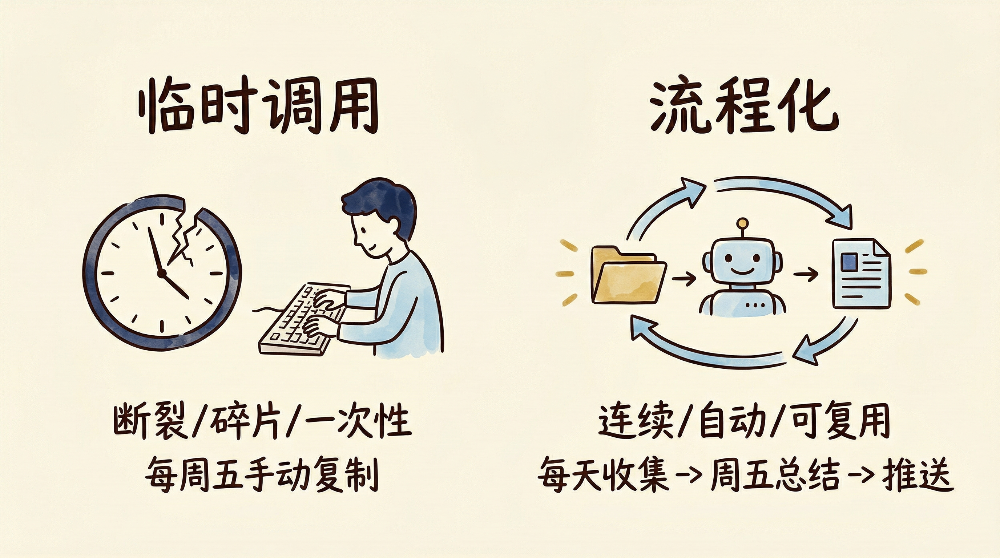

**【心法】**
不要问「这个 AI 能干嘛」，要问「我的流程里，哪一步可以换成 AI」。

#### 2.5 本章练习：设计你的「数字员工组」

在上一章的练习中，你已经列出了「最想自动化的 3 个任务」。现在，请挑选其中最复杂、最让你头疼的一个任务，试着用「管理者」的视角重新审视它。

请不要思考“具体的 Prompt 怎么写”，而是思考“如果我有一笔预算可以雇人，我会雇佣什么样的团队来完成它”。

请填写下方的【Agent 组队设计表】：

| 任务步骤 | 角色 (给 Agent 起个名) | 核心技能（需要会什么） | 人工是否审核 (HIL) |
| :--- | :--- | :--- | :--- |
| *例：写一篇公众号文章* | | | |
| *1. 选题策划* | *爆款选题官* | *分析热点、浏览历史数据* | ✅ *是 (决定方向)* |
| *2. 撰写初稿* | *资深文案* | *逻辑清晰、金句频出* | ❌ *否 (让它自己写)* |
| *3. 配图设计* | *插画师* | *MJ / Nano Banana 绘图* | ✅ *是 (审美把关)* |
| *你的任务步骤 1* | | | |
| *你的任务步骤 2* | | | |
| *你的任务步骤 3* | | | |


保留好这张表。在下一章，我们将学习如何把这些零散的角色，连成一张严密的**流程图**。

#### 本章结语

读完这一章，希望你已经完成了一个关键的角色升级——不再把 AI 当作一把更好用的锤子，而是开始学会「带团队、排流程」。

1.  从埋头干活的操作员，变成善于分工的项目经理。
2.  从追求一把「万能瑞士军刀」，变成会配置一支「专业小分队」。
3.  从临时找工具救火的执行者，变成提前设计流水线的系统工程师。

这样的视角转变，是你真正驾驭 Agent 的起点。
有了这个基础，下一章我们将拿起纸笔，学习如何把这些角色和步骤画成清晰的流程图——因为只有画得出来的流程，才是 AI 能听懂、Agent 能稳定执行的语言。


---

### 第3章 用流程图把工作结构化

你花了二十分钟，精心写了一段提示词，发给 AI：「帮我做一份竞品分析报告。」

AI 返回了一大段看似专业、实则空洞的内容。你不甘心，又追问了三轮，结果越改越偏。最终你关掉窗口，决定自己动手。

问题出在哪？不是 AI 太笨，而是**你自己也没有想清楚这件事该怎么做。**

你脑海中有一个模糊的意图：「我想要一份竞品分析。」但你从未把它拆解过——先分析谁？从哪几个维度？数据从哪来？最终交付什么格式？

当你把一团模糊的想法交给 AI 时，AI 只能回报你一团模糊的结果。

**这就是为什么你需要流程图。**

流程图不是画给领导看的汇报材料，它是你和 AI 之间的「施工蓝图」。你画得越清楚，AI 执行得越精准。你画不出来的东西，AI 一定也做不出来。


#### 3.1 为什么流程图能提升你的工作效率

**❌ 错误反应：**
「流程图是给领导看的，我自己做事不需要，太麻烦了。」

**💥 后果：**
你的大脑就像一台开了 50 个窗口的电脑，内存接近爆满。你一边写文章，一边担心素材够不够，一边惦记稍后要发给谁审阅。这种「多线程焦虑」会让你在几个任务间频繁切换，忙碌了一整天，产出却寥寥无几。

更关键的是，当你想把这些工作交给 AI 时，你会发现：自己连该怎么「下指令」都说不清楚。

**✅ 正确逻辑：**
流程图的本质是「大脑外包」+「AI 翻译器」。
你把脑海中模糊的「感觉」翻译成清晰的「步骤」，不仅自己执行更快，还能直接把这张图交给 AI 去运行。

**【场景对比：做一份竞品分析报告】**

*   **没有流程图也没用 AI 的小王**：
    1.  周一早上，领导安排「做一份竞品分析」。小王打开浏览器，开始搜索。
    2.  搜索过程中看到一篇不错的文章，顺手复制到报告里。
    3.  写了两段，发现缺少数据支撑，又回头搜索。找到了新数据，却发现之前写的角度不对，只好推翻重来。
    4.  午休时，焦虑感挥之不去。下午继续写，被领导催了一次进度。
    5.  **结果**：在「搜索」和「写作」之间反复切换，一天只产出 500 字，而且逻辑混乱。

*   **没有流程图但想用 AI 的小李**：
    1.  小李打开 DeepSeek，输入：「帮我做一份竞品分析报告。」
    2.  AI 反问：「请问需要分析哪些竞品？从哪些维度？需要什么格式？」
    3.  小李愣住了——他自己也没想清楚这些问题。于是凭感觉回复：「就……全面分析一下吧。」
    4.  AI 输出了一大段正确但空洞的模板化文字，连一个具体的公司名称都没有提到。
    5.  **结果**：和 AI 来回沟通了五轮，最后还是自己从头写起。**用了 AI，反而更慢了。**

*   **有流程图且会正确用 AI 的小张**：
    1.  小张先花 10 分钟画了一张流程图：**确定竞品名单 -> 搜集各家数据 -> 填入对比表格 -> 撰写分析结论**。
    2.  然后他按照流程逐步向 AI 下达指令：「第一步，请从以下3个维度搜集竞品A的公开数据……」
    3.  AI 每一步都输出了精准的结果，因为每一步的任务范围都很小、要求都很具体。
    4.  **结果**：一小时完成数据搜集，半小时写完报告，质量远超预期。


**【心法】**
当大脑不需要「记路」时，它才能全速「奔跑」。
而当你想让 AI 替你执行时，你必须先把路径画清楚——流程图，就是 AI 的导航地图。

#### 3.2 如何为一个任务绘制基础流程图

**❌ 错误反应：**
「我要画得专业一点，去学一下 Visio 怎么用。」

**💥 后果：**
你在「选配色」和「对齐线条」上花了两小时，最后画出来的图虽然美观，但根本无法执行。你把「画图」当成了目的，而不是手段。

**✅ 正确逻辑：**
忘掉软件，拿出一张白纸和一支笔。
我们不画「艺术品」，我们画「施工图」。

一张真正能用的流程图，只需要解决三个要素：**动作、输入、输出。**

##### 流程图绘制三部曲

我们用「工厂流水线」的逻辑来理解：每个工位都是把「原料」（输入）加工成「半成品」（输出），再传给下一个工位。

**📝 Step 1：拆解动作（找动词）**

像列清单一样，把大任务拆成几个按顺序执行的小动作。此时不要管细节，先搭骨架。

🎯 任务：写一篇公众号文章

拆解结果：**选题 -> 列大纲 -> 搜素材 -> 写初稿 -> 排版发布**

诀窍：每个步骤必须是一个**动词短语**——「选题」「列大纲」「搜素材」，而不是「关于选题的思考」「大纲部分」这种名词化的模糊表述。

**📝 Step 2：定义输入/输出（找每一步的原料和产物）**

每一个动作，问自己两个问题：

1.  **📥 Input（输入）**：需要什么原料才能开始这一步？
2.  **📤 Output（输出）**：完成这一步后，会得到什么具体产物？

🎯 以「写公众号文章」为例，逐步标注：

| 动作 | 📥 Input（原料） | 📤 Output（产物） |
| :--- | :--- | :--- |
| **选题** | 热点榜单、用户留言、历史阅读数据 | 1 个确定的文章标题 |
| **列大纲** | 文章标题 | 一份 3-5 级的结构化大纲 |
| **搜素材** | 大纲中的每个小节标题 | 每个小节对应的案例/数据/引用 |
| **写初稿** | 大纲 + 素材 | 一篇 2000 字的完整草稿 |
| **排版发布** | 完整草稿 | 排版后的公众号文章（已发布） |

**📝 Step 3：接口对齐（检查流水线能不能跑通）**

这是**最关键的一步**。
逐一检查：上一步的 Output，是否恰好等于下一步的 Input？如果对不上，说明中间缺了环节，或者颗粒度不对。

🎯 我们来验证一下：

| 上一步 Output | ➡️ | 下一步 Input | 对得上吗？ |
| :--- | :--- | :--- | :--- |
| 「1 个确定的文章标题」 | ➡️ | 列大纲需要「文章标题」 | ✅ 完美对接 |
| 「结构化大纲」 | ➡️ | 搜素材需要「每个小节标题」 | ✅ 大纲包含小节标题 |
| 「每个小节的案例/数据」 | ➡️ | 写初稿需要「大纲 + 素材」 | ⚠️ 素材有了，但大纲呢？ |

发现问题了！写初稿需要「大纲 + 素材」，但搜素材这一步只传递了素材，没有把大纲一起传过来。解决方案：在流程图上标注，写初稿这一步需要同时接收第2步的大纲和第3步的素材。

##### 完整示范：画出你的第一张流程图

经过三步法之后，一张完整的流程图长这样：


**💡 为什么要画得如此细致？因为这张图可以直接翻译成 AI 的执行指令。**

你定义的每一个 Input/Output，未来就是 Agent 之间传递的数据。比如：

*   「选题」环节 = 选题 Agent（输入：热点数据；输出：标题）
*   「列大纲」环节 = 大纲 Agent（输入：标题；输出：结构化大纲）
*   「搜素材」环节 = 搜索 Agent（输入：小节标题；输出：相关案例和数据）

你现在画的流程图，就是未来第四章搭建工作流的蓝图。

**【心法】**
画图时，时刻问自己：「如果我把上一步的输出结果交给一个陌生人（或 AI），他能不问我一句就直接开始工作吗？」
如果不能，说明中间缺了一个步骤，或者某个输出的描述还不够具体。

#### 3.3 如何判断一张流程图是否合格

画完之后，如何判断它是真正能用的「施工图」，还是一张中看不中用的「涂鸦」？

**❌ 错误反应：**
「画完了，逻辑好像挺通顺的。」（自我感觉良好）

**💥 后果：**
当你把图交给同事（或 AI）去执行时，他们每隔 5 分钟就来问你：「这里是什么意思？」「那里如果不行怎么办？」
最后你发现，解释图的时间比自己干还长。

**✅ 正确逻辑：**
一张合格的流程图，必须具备「可交接性」——把它交付给一个完全不了解背景的人，他不问你一句也能干完。

而在 AI 时代，最好的检验方法是：把你的流程图原封不动地复制给 AI，让它按步骤执行。如果它执行不下去或者跑偏了，说明你的图有问题。

**📝【流程图质检清单】**

| 检查项 | 自测问题 | 不合格 ❌ | 合格 ✅ |
| :--- | :--- | :--- | :--- |
| **闭环性** | 流程能否从头走到尾？ | 「选题 -> 列大纲 -> 搜素材 -> ???」素材搜完之后断了，没有下一步。 | 「选题 -> 列大纲 -> 搜素材 -> 写初稿 -> 排版发布 -> [交付物：公众号文章]」，每一步都有明确去向。 |
| **判断力** | 分叉路口的标准是否明确？ | 「初稿写完 -> 质量还行就发布，不行就改改。」什么叫“还行”？什么叫“改改”？ | 「初稿写完 -> 检查：错别字 < 3个 且 字数 > 1500？ -> Yes：发布 / No：返回修改并标注具体修改点」 |
| **颗粒度** | 每个动作是否具体到可立刻执行？ | 「完善方案」——怎么完善？改哪里？改成什么样？全凭执行者自己猜。 | 「根据客户反馈，将第3节的数据图表替换为2025年Q1数据，并补充同比增长率」 |
| **AI 可执行性** | 这张图能否直接变成 Agent 工作流？ | 「搜素材」——搜什么？搜多少？输出什么格式？步骤之间的数据传递全靠心照不宣。 | 「搜素材：根据大纲中的3个小节标题，每个标题搜索2-3个相关案例，输出为Markdown列表，每条包含来源链接和50字摘要」 |


**【心法】**
流程图是给「初学者」看的。如果你假设执行者很聪明，那你的流程图一定不合格。
而在 AI 时代，AI 就是那个最听话、但也最刻板的「初学者」——你说什么它就做什么，你没说的部分它绝不会主动补齐。

#### 3.4 实战：用流程图思维改造你的日常工作

方法论讲完了，接下来最重要的是落地。这一节，我们选取三个最常见的职场场景进行实战演练，帮你切实感受流程图思维带来的效率提升。

##### 场景 1：写周报

**改造前**（大多数人的做法）：

周五下午，打开文档，开始回忆这周做了什么。想到哪写到哪，零散地列了几条，觉得不够，又去翻聊天记录补充。写完发现像流水账，再花时间润色措辞。

**改造后**：

Step 1 拆动作：收集记录 -> 分类整理 -> 撰写总结 -> 提炼亮点

Step 2 定义 I/O：

| 动作 | 📥 Input | 📤 Output |
| :--- | :--- | :--- |
| 收集记录 | 本周日历、聊天记录、项目看板 | 原始事项清单（约15-20条） |
| 分类整理 | 原始事项清单 | 按项目分组的事项表 |
| 撰写总结 | 分组事项表 | 每个项目2-3句话的进展描述 |
| 提炼亮点 | 进展描述 | 本周 Top 3 成果 + 下周计划 |

Step 3 接口对齐：✅ 每一步的输出恰好是下一步的输入，流水线通畅。

**💡 AI 改造潜力**：「收集记录」可以交给 Agent 自动抓取日历和项目看板；「撰写总结」可以交给写作 Agent。你只需要在最后审阅一遍。

##### 场景 2：策划一场线下活动

**改造前**：

头脑中一片混沌——场地、嘉宾、物料、宣传、报名……所有事项搅在一起，分不清先后顺序。

**用三部曲改造后**：

Step 1 拆动作：定主题 -> 定场地和日期 -> 邀请嘉宾 -> 制作宣传物料 -> 开放报名 -> 现场执行 -> 复盘总结

Step 2 定义 I/O（节选关键环节）：

| 动作 | 📥 Input | 📤 Output |
| :--- | :--- | :--- |
| 定主题 | 业务目标、目标受众画像 | 活动主题 + 一句话简介 |
| 制作宣传物料 | 主题 + 嘉宾信息 + 场地照片 | 海报图 + 推文文案 |
| 开放报名 | 海报 + 推文 + 报名链接 | 报名人数统计表 |

Step 3 接口对齐：注意「制作宣传物料」需要同时接收前面三步的产物（主题、嘉宾信息、场地信息），这里是一个多输入汇聚节点。

**💡 AI 改造潜力**：「制作宣传物料」可以拆给两个 Agent——文案 Agent 写推文，设计 Agent 生成海报。

##### 场景 3：每日行业资讯整理

**改造前**：

每天早上手动浏览 10 个网站，将内容复制粘贴到文档中，再逐条撰写摘要。枯燥、重复，每天耗时约 1 小时。

**用三部曲改造后**：

Step 1 拆动作：抓取信息源 -> 去重筛选 -> 生成摘要 -> 排版输出

Step 2 定义 I/O：

| 动作 | 📥 Input | 📤 Output |
| :--- | :--- | :--- |
| 抓取信息源 | 10个指定网站的 URL 列表 | 原始文章标题+链接列表（约50条） |
| 去重筛选 | 原始列表 + 筛选规则（关键词白名单） | 精选文章列表（10-15条） |
| 生成摘要 | 精选文章列表 | 每篇50字摘要 + 重要程度标签 |
| 排版输出 | 带摘要的文章列表 | 一份排版好的日报（Markdown格式） |

Step 3 接口对齐：✅ 全部对接通畅。

**💡 AI 改造潜力**：这个流程的**每一步**都可以交给 Agent。事实上，这正是第1章中「自动化日报工作流」的雏形。一旦你画出了这张图，离全自动化只差一步——把它搬到 Coze 或 n8n 上。

**【心法】**
不要凭空想象「AI 能帮我做什么」。先拿起笔，把你当前的工作画成流程图。画出来之后你会发现，**哪些环节可以交给 AI，一目了然。**

#### 3.5 本章练习：画出你的第一张「可执行流程图」

在第1章的练习中，你列出了「最想自动化的 3 个任务」。
在第2章的练习中，你为其中一个任务设计了「数字员工组」。
现在，请为这个任务画出一张**完整的流程图**。

**📝【练习步骤】**

1.  **Step 1**：把任务拆成 4-6 个动作（用动词短语）。
2.  **Step 2**：为每个动作填写下方的 I/O 表格。
3.  **Step 3**：检查每一步的 Output 是否恰好等于下一步的 Input。如果对不上，补充缺失的环节。
4.  **Step 4**：用 3.3 的四项体检标准自检一遍。

| 动作（动词短语） | 📥 Input（需要什么才能开始） | 📤 Output（做完得到什么） | 对应的 Agent（来自第2章练习） |
| :--- | :--- | :--- | :--- |
| *你的步骤 1* | | | |
| *你的步骤 2* | | | |
| *你的步骤 3* | | | |
| *你的步骤 4* | | | |

**终极检验**：把你填好的表格复制给 AI（DeepSeek 或 ChatGPT），对它说：「请按照这个流程，帮我完成第一步。」如果 AI 能直接开始执行，恭喜你，你的流程图合格了。如果 AI 反问你问题，说明哪里还不够具体——改到它不问为止。

保留好这张表。下一章，我们会把它变成一套真正能自动运转的工作流。

#### 本章结语

这一章，我们解决了一个核心问题：如何把脑海中「我大概知道该怎么做」的模糊直觉，变成纸面上「任何人拿到都能执行」的清晰蓝图。

*   **3.1** 告诉了你为什么要画图——不仅是大脑外包，更是 AI 协作的前提。
*   **3.2** 手把手教你画图——三部曲：拆解动作、定输入/输出、对齐接口。
*   **3.3** 给了你检验标准——四项体检，最后一项专门检验 AI 能不能跑通。
*   **3.4** 带你实战练了三个场景——周报、活动策划、资讯整理。

流程图毕竟只是蓝图，还不是最终的产物。那么怎么把这张蓝图变成一个真正能运转的自动化工厂呢？

下一章，我们将进入全书最硬核的方法论——「工作流五步法」。你将学会如何把今天画的流程图，一步步搭建成能 24 小时自动运转的智能流水线。


---

## 第二篇　从零搭建一套属于你的 AI Agent 工作流

### 第4章 工作流五步法：从流程图到流水线

你在上一章画好了一张漂亮的流程图，兴冲冲地打开 Coze，把五个步骤配好了五个 Agent——选题 Agent、大纲 Agent、搜索 Agent、写稿 Agent、排版 Agent，全部就位。

你满怀期待地点击「运行」。

结果，选题 Agent 输出了一段 200 字的分析段落，而大纲 Agent 期望接收的是一个 10 字以内的标题关键词。两个 Agent 鸡同鸭讲，流水线在第一个接头处就卡死了。

你调了一下午，发现问题越修越多：有的步骤根本不知道该让 AI 做还是人做；有的步骤输出格式和下一步的输入格式对不上；最后好不容易跑通了一次，却没有保存配置，第二天想复现，又要从头调试。

**这就是「有蓝图、没施工规范」的典型翻车。**

流程图解决了「做什么」的问题，但还有三个关键问题没有回答：**做到什么标准？谁来做？怎么沉淀复用？** 这一章的「工作流五步法」，就是帮你把一张纸上的蓝图，变成一条真正能跑起来的流水线。


#### 4.1 第一步：明确任务的目标与交付物

这是 99% 的人第一步就走错的地方。我们太习惯于「被动接收任务」，却很少追问「终点在哪」。

**❌ 错误反应：**
接到任务：「去做一份行业研究。」
你的反应：打开搜索引擎，输入关键词，开始漫无目的地浏览。存了 50 个网页，却不知道该怎么拼成一份报告。

**💥 后果：**
你会陷入「资料的汪洋大海」。看了很多，也存了很多，但最后写出来的东西，老板只看了一眼就搁在一旁：「这不是我要的。」

更严重的是——如果你把这个模糊目标直接交给 Agent，后果会被成倍放大。在传统工作中，目标不清晰顶多导致你个人低效；而在 AI 协作中，目标不清晰会直接导致 Agent 产出垃圾。因为 AI 没有「猜老板意思」的能力，你写在目标定义里的每一个字，最终都会变成 Agent 的执行约束。你不写，它就不做。

**✅ 正确逻辑：**
在动手之前，先动脑。把「模糊的意向」翻译成「具体的交付物」。

不要问「我要做什么」，要问「做完之后，我手里拿着的那个东西长什么样？」

**📝【第一步：目标定义卡】**

| 填空项 | 填写说明 | 示范 |
| :--- | :--- | :--- |
| **任务一句话** | 动词 + 核心名词 | 输出一份新能源车行业分析报告 |
| **解决什么问题** | 这个任务为了回答谁的什么疑问？ | 回答投资总监「明年该投整车厂还是电池厂」的决策疑问 |
| **交付物形态** | 成品的具体样子，**必须定死** | 一份 PDF 幻灯片，不少于 20 页 |
| **验收标准** | 怎么才算「做完了」？ | 必须包含近 3 年市场规模数据、前 5 名竞品优劣势对比表、至少 3 条投资建议 |

**💡 为什么这一步对 AI 协作尤其关键？**

目标定义卡上的四个字段，未来会直接对应 Agent 工作流中的**全局参数**：

- 「任务一句话」= 工作流的名称和触发条件
- 「交付物形态」= 最终输出的格式约束
- 「验收标准」= 质检 Agent 的判断依据

你在这张卡上写得越精确，后面每个 Agent 的行为就越可控。


**【心法】**
如果你无法用一句话描述清楚「交付物长什么样」，那就不要开始下一步。否则你做的所有动作都是无效消耗。

#### 4.2 第二步：将动作拆解到「原子级」

在第3章中，你已经学会了把大任务拆成几个步骤。但第3章的拆解是「骨架级」的——粗线条够用，细节不够执行。

这一步，我们要把拆解做到原子级。

**❌ 错误反应：**
「步骤就是：搜集资料 -> 写报告。」

**💥 后果：**
「搜集资料」是一个巨大的黑箱。去哪搜？搜什么关键词？怎么筛选？因为步骤太粗，你每次执行时都要重新思考一遍，这就导致了拖延和内耗。而如果把这个黑箱直接交给 Agent，它会更加不知所措——Agent 不会「自行判断」，它只会「严格执行」。你给的指令越模糊，它的输出越离谱。

**✅ 正确逻辑：**
什么叫原子级？「不可再分，且不需思考就能执行」的动作。

想象一下，如果让你把任务交给一个只会按按钮的机器人，你需要给它写多少条指令？

**📝【第二步：从骨架到原子的拆解对照】**

| 第3章的骨架级 | **第4章的原子级（这才是工作流的真正骨架）** |
| :--- | :--- |
| **1. 搜集资料** | 1.1 打开 3 个指定新闻网站（36Kr、虎嗅、财新）<br>1.2 搜索关键词「新能源 + 趋势 + 2025」<br>1.3 筛选发布时间在近半年内的文章<br>1.4 取前 10 篇文章，提取每篇的核心观点段落（100-200字） |
| **2. 整理数据** | 2.1 将 10 段核心观点汇总到一个文档<br>2.2 删去重复或高度相似的观点<br>2.3 按「政策、技术、市场」三个维度分类<br>2.4 每个维度提炼出 1-2 条核心趋势结论 |
| **3. 撰写报告** | 3.1 根据核心结论生成三级标题大纲<br>3.2 每个章节按「结论 + 数据支撑 + 案例」结构扩写<br>3.3 撰写开篇摘要（200字以内）和结尾投资建议<br>3.4 统一格式、校对数据，输出 PDF |


**区分骨架级和原子级的标准是什么？**

问自己一个问题：「如果我把这条指令直接复制粘贴给 AI，它能不问我就开始执行吗？」

- 「搜集资料」——AI 会问：搜什么？去哪搜？搜多少？不合格，还是骨架级。
- 「打开36Kr，搜索'新能源+趋势+2025'，筛选近半年文章，取前10篇」——AI 可以直接动手。合格，这是原子级。

**【心法】**
流程设计的核心是：把「思考」和「执行」分离。你负责思考怎么拆，Agent 负责机械地执行每一步。思考只做一次，执行可以复用无数次。

**【提示】**
如今主流的通用 Agent 产品（比如 扣子2.0、Manus、Minimax Agent 等产品），都已经内置了「流程设计」这个「思考」环节。

#### 4.3 第三步：严格定义每步的输入与输出格式

第3章讲过输入/输出的概念，但在真正搭建工作流时，光知道「输入是什么、输出是什么」还不够，你还必须定义输入/输出的格式和精度。

这就好比工厂里的零件，光说「这个零件是圆的」没用，你必须标注直径是 5mm 还是 50mm、公差是多少。否则上一道工序出来的零件，下一道工序根本装不上去。

**❌ 错误反应：**
「第一步输出'资料'，第二步输入'资料'。」

**💥 后果：**
第一步的 Agent 输出了一堆带 HTML 标签的网页原文，第二步的 Agent 期望接收的是纯文本摘要。格式不匹配，流水线直接断裂。这是工作流搭建中最常见的翻车原因。

**✅ 正确逻辑：**
为每一步的 输入/输出 标注三个维度：内容、格式、数量。

**📝【第三步：输入/输出 精确定义表】**

| 步骤 | 📥 输入 | 加工动作 | 📤 输出 |
| :--- | :--- | :--- | :--- |
| **Step 1：搜索筛选** | 关键词列表（纯文本，3-5个关键词） | 搜索并按时间筛选 | **10 篇文章摘要**<br>格式：Markdown 列表，每条含标题、来源、发布日期、100字核心观点 |
| **Step 2：趋势提炼** | Step 1 的 10 篇摘要（Markdown 格式） | 归类并提炼趋势 | **3 个维度 × 每维度 1-2 条结论**<br>格式：Markdown 表格，含维度、结论、数据来源 |
| **Step 3：大纲生成** | Step 2 的趋势结论表（Markdown 格式） | 结构化组织 | **一份三级标题大纲**<br>格式：Markdown，H1/H2/H3 层级，每个H3下注明要引用的数据点 |
| **Step 4：正文撰写** | Step 3 的大纲 + Step 2 的结论表 | 逐章扩写 | **一篇完整报告（纯文本）**<br>格式：Markdown，不少于 5000 字，每章含结论+数据+案例 |
| **Step 5：排版交付** | Step 4 的完整报告（Markdown 格式） | 格式转换 | **一份 PDF 幻灯片**<br>不少于 20 页，含封面、目录、正文等 |

**💡 关键检查：接口兼容性**

逐一核对：上一步的输出格式，是否恰好等于下一步期望的输入格式？

*   **Step 1 → Step 2**：输出「Markdown 列表」 → 输入「Markdown」 ✅ **格式兼容**
*   **Step 2 → Step 3**：输出「Markdown 表格」 → 输入「Markdown」 ✅ **格式兼容**
*   **Step 3 + Step 2 → Step 4**：输出「大纲」+「结论表」 → 需要同时接收两份输入 ⚠️ 需设置合并节点

当你把输入/输出定义到这个精度时，工作流中 Agent 之间的数据传递就不会再出现「鸡同鸭讲」的问题。


**【心法】**
接口定义的精度，决定了工作流的稳定性。你见过哪条真正的工厂流水线，零件的尺寸规格是「大概差不多」的？

#### 4.4 第四步：为每一步分配最合适的执行者

终于到了分工的环节。现在你手里有一张精密的图纸，需要决定：哪些活交给人，哪些活交给 Agent，哪些活交给代码脚本？

**❌ 错误反应：**
「全都交给 AI 做吧，现在的模型很强。」

**💥 后果：**
AI 搜索时产生了幻觉，生造了不存在的数据；AI 写的结论毫无洞察，像一段维基百科摘要。全盘依赖 AI，结果往往是全盘返工。

**✅ 正确逻辑：**
不同类型的任务，有不同的最佳执行者。

**📝【任务分配矩阵】**

| 任务类型 | 最适合的执行者 | 理由 |
| :--- | :--- | :--- |
| **创意决策类**（定选题、定策略、最终拍板） | 人 | AI 不懂你的业务偏好和商业判断，核心决策必须握在人手里。 |
| **海量处理类**（读 100 篇文档、从海量信息中提炼要点） | Agent | AI 的舒适区：不疲倦、不遗漏、速度快。 |
| **标准写作类**（扩写、翻译、润色、格式化） | Agent | 只要你给了结构和要求，AI 就是最好的填充机器。 |
| **精准计算类**（数据统计、格式转换、表格搬运） | 自动化脚本 | 别用 AI，因为 AI 做算术不稳定。这种事交给 Excel 公式或 Python 脚本。 |

##### 完整案例走通：「行业研究报告」的分工方案

现在，我们把前面几步定义好的5个步骤，逐一分配执行者：

| 步骤 | 执行者 | 具体安排 | 为什么这样分配？ |
| :--- | :--- | :--- | :--- |
| **Step 1：搜索筛选** | **Agent** | 搜索 Agent 按关键词抓取文章并提取摘要 | 海量信息处理，AI 的强项 |
| **Step 2：趋势提炼** | **Agent + 人审核** | 分析 Agent 归类和提炼趋势；人审阅结论是否靠谱 | AI 擅长归纳，但结论质量需要人把关 |
| **Step 3：大纲生成** | **人** | 人根据趋势结论确定报告结构和重点 | 大纲决定了报告的价值导向，属于创意决策 |
| **Step 4：正文撰写** | **Agent** | 写作 Agent 按大纲逐章扩写 | 标准写作类任务，AI 效率远超人工 |
| **Step 5：排版交付** | **自动化脚本** | Python 脚本将 Markdown 转为 PDF 幻灯片 | 格式转换是确定性操作，用脚本最稳定 |


##### 常见分工误区

**误区 1：让 AI 做数据计算。**
你让 Agent 统计「这 10 篇文章中，提到'电池'的文章占比多少」。Agent 回答「60%」，但实际是 70%。AI 做算术天生不靠谱，这种活应该交给 Code。

**误区 2：让 AI 做最终决策。**
你让 Agent 决定「报告的核心结论是投整车厂还是投电池厂」。Agent 给了一个看似合理的回答，但它对你公司的投资策略、风险偏好一无所知。这个决策必须由人来做。

**误区 3：让人做 AI 擅长的苦力活。**
你亲自阅读 50 篇文章并逐篇写摘要。这件事 Agent 用 5 分钟就能完成，你花了一整天。把时间省下来做真正需要你判断力的事情。

**【心法】**

**人机协作的黄金比例**：

*   **人**：负责「开头」的定义和「结尾」的审核（约 10% 的工作量）。
*   **Agent**：负责中间那漫长、枯燥、耗时的处理过程（约 80% 的工作量）。
*   **自动化脚本**：负责精确计算和格式转换等确定性操作（约 10% 的工作量）。

你不需要成为全能选手。你只需要成为一个好导演——知道什么角色该派什么演员。

#### 4.5 第五步：将工作流沉淀为可复用资产

如果不做这最后一步，你之前的所有努力就只是一次性的「烟花」。今天费力搭好的工作流，三个月后你可能已经忘了 Prompt 怎么写、Agent 怎么配。

我们必须把这次成功的经验固化成一套「模具」——下次遇到类似任务，直接拿出来用。

**❌ 错误反应：**
「做完了就完了。下次遇到类似任务再说。」

**💥 后果：**
三个月后，老板又让你做一份「新能源车出海市场分析」。你记得上次做过类似的，但 Prompt 忘了怎么写，Agent 的配置也没保存。只好从头再来，又花了三天。你永远在重复劳动，永远无法积累。

**✅ 正确逻辑：**

**资产化。** 把这一套逻辑打包成「三件套」，存到固定的地方。

##### 资产沉淀三件套

**📦 第一件：一张标准流程图**

就是你在第3章画的那张图，但现在需要升级为正式版本：

- 标注版本号（如 v1.0），每次优化后递增
- 标注每一步的执行者（人/Agent/自动化脚本）
- 标注关键的输入/输出格式约束
- 存放在固定位置（如飞书文档、Notion 页面），命名清晰：「行业研究报告-工作流-v1.2」

**📦 第二件：一组经过验证的 Prompt**

你在调试过程中反复修改的那些提示词，就是最宝贵的资产。你可以把它们整理成标准模板：

🎯 示范：搜索 Agent 的 Prompt 模板

```
【角色】你是一名专业的行业研究助理。
【任务】根据以下关键词搜索近半年的行业文章，并提取核心观点。
【输入】关键词：{keyword_list}
【输出要求】
- 格式：Markdown 列表
- 数量：10 篇
- 每篇包含：标题、来源网站、发布日期、100字核心观点摘要
【约束】只选取权威媒体来源（36Kr、虎嗅、财新等），忽略营销软文。
```

每个 Agent 都保存一份这样的模板。下次使用时，只需替换 `{keyword_list}` 等变量即可。

**📦 第三件：一个可触发的入口**

给这个工作流一个固定的启动方式，让它随时可用：

- 在 Coze / Dify 上：发布为一个智能体或应用，输入关键词就能启动整条流水线
- 在 n8n 上：配置为一个 Webhook 触发的自动化流程
- 最原始的简单方式：在你的笔记软件中建一个「工作流资产库」页面，把流程图、Prompt 模板和操作说明放在一起，需要时照着执行

##### 资产化前后对比

| | **没有资产化** | **资产化之后** |
| :--- | :--- | :--- |
| **第一次做** | 摸索 + 调试，花了 3 天 | 摸索 + 调试，花了 3 天 |
| **第二次做** | 凭记忆重来，又花了 2 天 | 调出资产包，替换变量，1 小时搞定 |
| **第五次做** | 还是要花 1-2 天 | 30 分钟搞定，而且质量稳定 |
| **交给别人做** | 教半天，对方还做不好 | 把资产包丢给对方，照着跑就行 |

**【心法】**
判断这一步是否完成的标准：如果明天你突然休假了，能不能直接把这个「资产包」丢给同事，让他不问你一句就跑出 80% 质量的结果？ 如果能，你拥有了一项真正的「可复用资产」。如果不能，说明文档还不够完整。

#### 4.6 本章练习：用五步法搭建你的第一条工作流

在前三章的练习中：

- 第1章，你列出了最想自动化的任务
- 第2章，你为其中一个任务设计了数字员工组
- 第3章，你画出了这个任务的完整流程图

现在，请用「工作流五步法」把它从蓝图变成可执行的流水线。

**📝【练习步骤】**

**Step 1：填写目标定义卡**

| 填空项 | 你的填写 |
| :--- | :--- |
| 任务 | |
| 解决什么问题 | |
| 交付物形态 | |
| 验收标准 | |

**Step 2：将步骤升级为原子级**

| 步骤 | 原子级拆解（至少拆成2-3个子步骤） |
| :--- | :--- |
| *你的步骤 1* | |
| *你的步骤 2* | |
| *你的步骤 3* | |

**Step 3：为每步标注精确的输入/输出格式**

| 步骤 | 📥 输入（内容 + 格式 + 数量） | 📤 输出（内容 + 格式 + 数量） |
| :--- | :--- | :--- |
| *你的步骤 1* | | |
| *你的步骤 2* | | |
| *你的步骤 3* | | |

**Step 4：为每步分配执行者**

| 步骤 | 执行者（人/Agent/自动化脚本） | 理由 |
| :--- | :--- | :--- |
| *你的步骤 1* | | |
| *你的步骤 2* | | |
| *你的步骤 3* | | |

**Step 5：打包成资产**

- 给你的工作流起一个名字：________________
- 把流程图、I/O 表格、Prompt 模板存放在一个固定位置
- 尝试把它交给 AI 或同事跑一遍，看看哪里还需要补充说明

保留好这份资产包。在后续的实战案例章节中，你将看到这套方法论如何被应用到短视频、电商、教育等真实场景中。

#### 本章结语

「工作流五步法」并不是高深莫测的，它只是把「靠直觉做事」变成了「靠系统做事」。

*   **第1步**：明确目标——不知道终点在哪，跑得再快也是白费。
*   **第2步**：拆解步骤——让每一步都具体到 Agent 能直接执行。
*   **第3步**：锁死格式——让流水线上的每个接头都严丝合缝。
*   **第4步**：因岗定人——让人做决策、Agent 做苦力、脚本做计算。
*   **第5步**：打包沉淀——让一次的努力变成可复用的长期资产。

记住一句话：工作流的价值不在于「搭建」的那一次，而在于「复用」的每一次。你搭建得越规范，复用的成本就越低，时间的杠杆就越大。

到这里，你已经掌握了从「想法」到「系统」的完整路径：画流程图（第3章）、建流水线（第4章）。但流水线上最核心的零件（每个 Agent） ——该怎么精确配置？

下一章，我们将进入全书最精细的环节：如何给 Agent 写一份无懈可击的「岗位说明书」（JD）。一个 Agent 好不好用，80% 取决于这份 JD 写得好不好。


---

### 第5章 给 Agent 写一份清楚的“岗位说明书”

在完成了工作流的宏观设计后，我们需要将视线聚焦到微观的执行单元——Agent（智能体）。

这节只解决一件事：**让 Agent 不再「每次都像换了个人」，彻底终结你反复补充要求、被迫返工的困境。**

想象一下，如果你对新来的实习生说一句「去帮我把周报写了」，他大概率会给你一堆你没法用的废话。你肯定会责怪其能力不足，但责任其实在你——因为你没告诉他写给谁看、用什么格式、重点突出发哪个数据。

在 Agent 的世界里，没有「默契」这回事，只有「定义」。也就是说，你不缺更长的提示词，你缺的是一份能长期使用的**「岗位说明书（JD）」**。

一份合格的岗位说明书不需要写成作文，只要把这四个要素卡死就够了：**工作目的**、**输入来源**、**输出成果**、**限制条件**。 少一个，问题就会在对应位置爆出来。

接下来，我们将拆解这四个要素，并提供直接可用的通用模板。


#### 5.1 用四个要素定义一个 Agent 的岗位

##### 5.1.1 明确 Agent 的工作目的

这是大多数人最容易翻车的地方。我们习惯了用人类的「模糊语言」去沟通，却忘了 AI 是一个需要「精确坐标」的数学模型。

**❌ 错误写法：**
> “帮我写一份周报，要专业一点，有深度一点。”

**💥 后果：**
Agent 会立即开始堆砌术语。因为它理解的「专业」，就是把简单的“销售额下降”说成“底层逻辑的负向反馈闭环”。它理解的「深度」，就是编造一堆你根本没见过的宏观数据。你拿到结果只会觉得：**全是冗余信息，缺乏实质内容**。

**✅ 正确逻辑：**
工作目的只回答一个问题：**这份工作到底要替你解决什么具体问题？**

不要写形容词（专业、深度、优秀），要写**「动作」**和**「对象」**。把三件事说清楚：

1.  **给谁看？**（决定了语气的正式程度）
2.  **用来干嘛？**（决定了信息的筛选标准）
3.  **什么叫合格？**（决定了交付的底线）

**📝【通用模板：工作目的】**

| 字段 | 填写说明与示例 |
| :--- | :--- |
| **角色名称** | 你是 **【岗位名称，如：周报整合专员】**。 |
| **核心任务** | 你的工作是把我提供的 **【原始材料】**，整理成一份可直接发送给 **【阅读对象】** 的 **【交付物名称】**。 |
| **核心用途** | 这份文件的核心用途是： **【用途 A，如：同步进度】**、**【用途 B，如：暴露风险】**。 |
| **合格标准** | **【标准 1】**（如：数据准确）、**【标准 2】**（如：条理清晰）。 |

**【实战案例：周报 Agent】**
> **你是【周报整合专员】。**
> 你的工作是把我提供的【本周零散的会议记录与数据】，整理成一份可直接发送给【直属领导与协作同事】的【周报】。
> 这个周报的用途是：**让领导一眼看到项目进度，并明确知道我需要什么支持。**
> 合格标准：**四个板块齐全、没有废话、风险点突出。**

##### 5.1.2 告知 Agent 的输入来源

在信息处理任务中，Agent 最危险的行为不是「不会写」，而是「编造事实」。

**❌ 错误写法：**
> “根据你的知识，写一份周报。”

**💥 后果：**
Agent 会调用它训练数据里的「常识」去编造细节。它可能会给你写出一个完美的「项目A」，但你们公司根本就没有「项目A」。周报最怕的不是写得难看，而是**「看起来很顺畅，但事实全是编的」**。这种周报发出去，就是职场事故。

**✅ 正确逻辑：**
输入来源只回答一个问题：**你允许它用哪些材料？**

必须明确建立一条「物理隔离」规则：**你给它什么，它就只能用什么。你没给的，它必须停下来问，绝对不能自己补。**

**📝【通用模板：输入来源】**

| 字段 | 填写说明与示例 |
| :--- | :--- |
| **输入范围** | 你只能使用以下输入：<br>1. **\[输入材料 A\]**；<br>2. **\[输入材料 B\]**。 |
| **红线规则** | **严禁自行补充事实**，严禁自行搜索或引用外部信息。<br>如果遇到信息缺失，必须先输出一个**「问题清单」**反问我。 |

**【实战案例：周报 Agent】**
> 你只能使用以下输入：
> 1. 我粘贴在对话框里的**本周工作要点**；
> 2. 我上传的**关键数据截图**；
> 3. 我指定的**项目负责人名单**。
> **红线：** 严禁自行脑补数据。如果我没提供数据，请直接在对应位置写「（待补充）」。

##### 5.1.3 规定 Agent 的输出成果

很多时候你觉得 Agent 笨，是因为你没告诉它「试卷的格式」。

**❌ 错误写法：**
> “整理一下发给我。”

**💥 后果：**
它就像一个不可控的程序，一会给你写成大段的纯文本，一会给你写成 Markdown 表格，一会又给你生成一个代码块。你每次拿到结果，都得花 10 分钟手动调整排版、加粗标题、删除多余的空行。**这 10 分钟的损耗，抵消了 AI 带来的所有效率红利。**

**✅ 正确逻辑：**
输出成果只回答一个问题：**你要它交付的成品长什么样？**

最好的输出描述不是「写清楚」，而是**「定字段」**。把输出看作是一个**填空题**，每个空填什么，必须规定死。

**📝【通用模板：输出成果】**

| 字段 | 填写说明与示例 |
| :--- | :--- |
| **结构要求** | 你的输出必须严格遵守以下结构：<br>**板块 1 \[标题\]**： 包含 \[要素 A + 要素 B\]，限制 \[X\] 条；<br>**板块 2 \[标题\]**： 包含 \[要素 C\]； |
| **格式规范** | 使用 **Markdown** 格式；<br>标题加粗；<br>数据部分使用无序列表。 |
| **文风要求** | 不写背景科普，不写空话套话，不用模糊词（如“可能、大概”）。 |

**【实战案例：周报 Agent】**
> 你的输出固定为四个板块：
> 1. **本周完成**：限 3 条，每条包含【结果 + 数据 + 影响】；
> 2. **关键进展**：限 1 条，说明【当前进度 % + 下一步动作】；
> 3. **风险与卡点**：限 1 条，说明【原因 + 需要谁的支持】；
> 4. **下周计划**：限 3 条，每条包含【动作 + 截止时间】。

##### 5.1.4 标注 Agent 的限制条件

如果说前三个要素是告诉 Agent「做什么」，那么限制条件就是告诉它**「绝对不能做什么」**。

**❌ 错误写法：**
很多人根本不写这一条，觉得「它应该懂」。

**💥 后果：**
你越用越不敢用，因为你不知道它什么时候会给你造成隐患。
比如，它在邮件里替你向客户承诺了「保证明天完成」（其实你做不到）；或者在分析报告里用了一句「这完全是市场部的责任」（引发部门大战）。**没有安全边界的 Agent，就是一颗定时炸弹。**

**✅ 正确逻辑：**
限制条件只回答一个问题：**哪些事它绝对不能替你做主？**
这一部分是 Agent 的「保命符」。写清楚了，你才敢把任务放心交出去。

**📝【通用模板：限制条件】**

| 字段 | 填写说明与示例 |
| :--- | :--- |
| **语气禁区** | 不使用「小编体」（如：亲们、绝绝子）；<br>不使用过度谦卑或过度强硬的词汇。 |
| **逻辑禁区** | **不承诺**：不替我做任何承诺性表述（如“保证”、“一定”）；<br>**不归责**：不替我判断责任归属，只陈述事实；<br>**不推测**：涉及因果关系，必须有原文依据。 |
| **兜底机制** | 遇到目标冲突或信息不足，先给「问题清单」，再给「保守版草稿」。 |

**【实战案例：周报 Agent】**
> **限制条件：**
> 1. 不使用“确保”、“肯定”等绝对化词汇；
> 2. 任何数据必须有我提供的原始出处，**不得做四舍五入**；
> 3. 如果我没提供下周计划，**不要自己编**，直接留白并标注“待确认”。

#### 5.2 为不同类型的 Agent 设计不同的岗位

同样是「岗位说明书」，找资料的、做分析的、写文章的，重点完全不同。

很多人的 Agent 不好用，是因为你总想招一个「全能助理」——既能像记者一样查资料，又能像咨询顾问一样给建议，还能像文案一样写爆款。

**💥 后果：**
它什么都干了，但什么都没干好。一会儿像百度百科，一会儿像低质内容。

这一节你只记住一句话：**先看你要的「最终交付物」是什么，再决定岗位类型。**
交付物是资料包？是判断结论？还是发布文案？

下面这三类最典型的岗位，请直接照着抄。

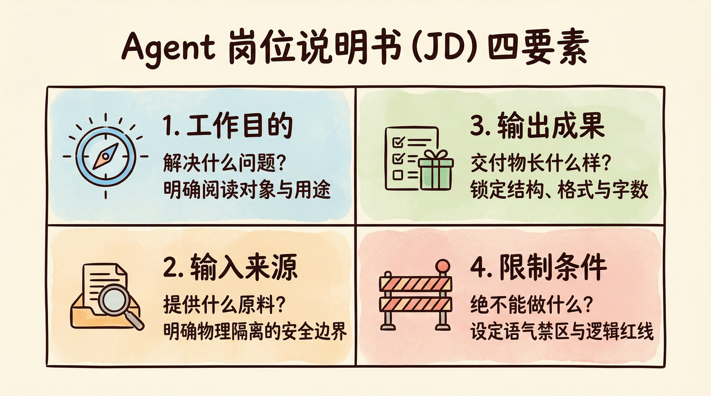

##### 5.2.1 信息类 Agent：负责搜集与整理

**😭 典型翻车现场：**
> 你让它“帮我找找最近有什么 AI 热点，顺便写个短评”。

**💥 结果：**
它给你编造了几个不存在的新闻，还一本正经地评论了一番。你拿去发朋友圈，直接被证伪。

**🛑 管理者思维：**
信息类 Agent 只做一件事：把你写稿需要的材料找齐、理顺、标清来源。
它交付的不是观点，更不是成稿，而是一份你拿来就能用的**「干净资料包」**。
**核心原则：** 哪怕找不到，也不许编。

**📝【通用模板：信息类 Agent】**

| 字段 | 填写说明与示例 |
| :--- | :--- |
| **岗位名称** | **【主题】** 资料搜集 Agent |
| **工作任务** | 为我提供一份「可核对的资料包」，**不输出观点，不写脚本，只陈述事实**。 |
| **检索范围** | **时间**：仅限近 **\[X\]** 天；<br>**来源**：仅限 **\[指定网站/权威媒体\]**；<br>**排除**：排除广告软文、无来源的自媒体转载。 |
| **交付格式** | 输出必须包含两部分：<br>**A 部分 - 原始摘录**：每条摘录必须保留【原文关键句 + 来源链接 + 发布时间】；<br>**B 部分 - 结构化清单**：按主题归类（如“用户痛点”、“行业数据”），每类不超过 5 条。 |
| **红线** | 如果找不到可靠来源，必须明确写「未找到可核对材料」，**不得用猜测补齐**。 |

##### 5.2.2 分析类 Agent：负责判断与结论

**😭 典型翻车现场：**
> 你把一堆杂乱的会议记录丢给它：“帮我分析一下。”

**💥 结果：**
它给你输出了一堆正确的废话，比如“我们要加强沟通”、“我们要提高效率”。看起来很完整，实际毫无执行价值。

**🛑 管理者思维：**
分析类 Agent 的价值不在于「写得像」，而在于**「判断站得住」**。
它必须基于你给的事实，通过你给的逻辑，推导出结论。
**死规矩：** 所有结论必须有据可依，不能凭空「觉得」。

**📝【通用模板：分析类 Agent】**

| 字段 | 填写说明与示例 |
| :--- | :--- |
| **岗位名称** | **【任务】** 深度分析 Agent |
| **输入限制** | 你的分析依据只来自：<br>1. 我提供的 **\[具体材料/数据\]**；<br>2. 我给定的 **\[判断标准/原则\]**。<br>**注意：** 超出材料范围的事实，一律不许引用。 |
| **交付格式** | 你的输出必须包含三个维度：<br>**核心结论**：用 3 个短句概括；<br>**判断依据**：每个结论下方，必须引用原文中的具体句子或数据作为支撑；<br>**风险提示**：指出哪些结论因信息不足而可能存在偏差。 |
| **红线** | 遇到信息缺失导致无法判断时，先列出「我需要补充的问题清单」，不要强行下结论。 |

##### 5.2.3 写作类 Agent：负责内容产出

**😭 典型翻车现场：**
> 你给它一个标题：“帮我写篇关于咖啡的文章。”

**💥 结果：**
它写了一篇“咖啡的历史、种类、好处”的百科全书。文笔没问题，但根本没人看，因为没有观点，没有情绪，也没有对象。

**🛑 管理者思维：**
写作类 Agent 的职责很单一：**把你已经确定的要点，填进固定的结构里。**
它不负责找资料，也不负责想观点。它只负责「戴着镣铐跳舞」。
**死规矩：** 结构第一，文采第二。

**📝【通用模板：写作类 Agent】**

| 字段 | 填写说明与示例 |
| :--- | :--- |
| **岗位名称** | **【平台/类型】** 写作 Agent |
| **输入投喂** | 我会给你提供：<br>**核心观点/选题**：\[一句定调\]；<br>**素材要点**：\[清单\]；<br>**目标读者**：\[谁？想听什么？\]。 |
| **风格设定** | 请模仿 **\[风格关键词，如：毒舌、温情、干练\]** 的口吻。<br>**句式要求**：多用短句，少用形容词，禁止使用“总而言之”、“综上所述”等 AI 味十足的连接词。 |
| **交付结构** | **开头（3秒钩子）**：用一个\[反直觉事实/提问\]开场；<br>**正文（黄金三点）**：分三段论述，每段必须有一个\[具体案例/数据\]；<br>**结尾（行动呼吁）**：引导读者进行\[某个动作\]。 |

#### 5.3 如何判断任务需不需要拆成多个 Agent

很多读者问我：「能不能把搜集、分析、写作、排版全塞进一个 Agent 里？这样省事。」

我的回答永远是：**你可以这么做，但它一定会变笨。**

你决定要不要拆 Agent，不是看任务大不大，而是看**「脑子顺不顺」**。

想象一下，你让一个厨师一边切菜，一边炒菜，还要一边去菜市场买葱。他一定会手忙脚乱，最后把葱买错了，或者把菜炒糊了。
Agent 也是一样。当它在「发散找资料」的时候，你就不能强迫它同时「收敛下结论」。

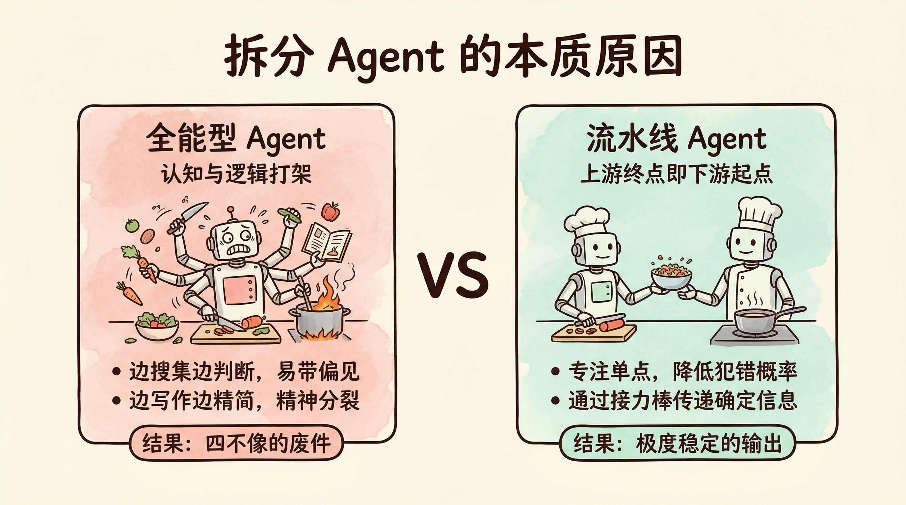

**怎么快速判断？请使用下面这个「关键词检测法」：**

**📝【关键词检测卡】**

| 检查你的「工作目的」描述。如果你不得不使用以下连接词，**请立刻拆分**： |
| :--- |
| **🚩 必须拆分的信号词：** |
| **“然后”**（代表时间先后，需要接力） |
| **“并且”**（代表多线程，容易干扰） |
| **“顺便”**（代表注意力分散，质量必降） |
| **“同时”**（代表角色冲突，逻辑打架） |
| **❌ 错误指令：** “去搜集资料，**然后**分析一下，**顺便**写个周报。” |
| **✅ 正确拆解：** \[搜集员\] -> \[分析师\] -> \[撰稿人\]。 |

##### 5.3.1 将「搜集」与「判断」拆分：避免「自圆其说」

**🛑 为什么必须拆？**
如果你让同一个 Agent 既负责「找证据」，又负责「下判决」，它会天然倾向于「只找能证明自己观点的证据」。这就叫**「认知混流」**。

比如你问它：「喝咖啡对身体有害吗？」它如果先找到了「有害」的文章，后面的分析就会全是负面的。你以为你得到了客观结论，其实你得到的是它的**「偏见回音壁」**。

**🛠️ 拆分方案：**

*   **Agent A（资料员）**：只管把正反两面的信息都搬回来，不许说话，不许评价。
*   **Agent B（法官）**：看着 A 搬回来的材料，进行客观判决。

**📝【拆分示范】**
> **[资料员] 输出：** 10 条原始数据（5 条利好，5 条利空），纯陈述。
> **[分析师] 输入：** 上面那 10 条数据。
> **[分析师] 输出：** “综合来看，风险大于机会，依据是数据 A 和 B。”

##### 5.3.2 将「写作」与「改写」拆分：治疗「精神分裂」

**🛑 为什么必须拆？**
写作需要「发散」，改写需要「克制」。
如果你让 Agent 「写一篇那种很爆款、很严谨、字数又很少的文章」，它会崩溃。因为它刚写了一句觉得不够爆款，想改；改完觉得不够严谨，又改。
最后的结果通常是：**四不像**。 既没有干货，也不好笑，充满了正确的废话。

**🛠️ 拆分方案：**

*   **Agent A（创作者）**：别管字数，别管文采，先把结构填满，把事说清楚。
*   **Agent B（编辑）**：拿着 A 的稿子，只做减法，只做润色。

**📝【拆分示范】**
> **[写作 Agent] 输出：** 一篇 2000 字的初稿，逻辑通顺但啰嗦。
> **[改写 Agent] 指令：** “保留原文所有观点，但把字数压缩到 800 字，把口吻改成‘毒舌’风格。”

##### 5.3.3 拆分后的关键：设计「接力棒」

很多人害怕拆分，是因为觉得「串起来好麻烦」。
其实，只要你定好**「接力棒」**，流程比单个 Agent 还要稳。

这里的秘诀是：**上一个人的终点，必须是下一个人的起点。**
你不需要复杂的编程，只需要在岗位说明书里加一个「交接字段」。

**📝【通用模板：接力棒规则】**

| 角色 | 规则 |
| :--- | :--- |
| **上游 Agent（传棒者）** | 你的最后一行输出，必须包含一个 **\[总结清单\]**。<br>方便下一个 Agent 直接读取。 |
| **下游 Agent（接棒者）** | 你只允许读取上一步输出的 **\[总结清单\]**。<br>如果清单里缺信息，立刻报错，不要自己编。 |

**【举个例子】**

*   **搜集 Agent** 最后必须输出一个：`### 资料摘要清单`
*   **写作 Agent** 的第一句指令是：`读取 ### 资料摘要清单，将其扩写为正文...`

拆分不是为了把事情搞复杂，而是为了让每个环节都**「简单到不会出错」**。

#### 5.4 制作可直接复用的 Agent 岗位说明书

你有没有发现，很多人用 AI 最大的问题是：**一次性**。
今天调试得很好，过了一周忘了当时怎么说的，又得从头来过。这不叫工作流，这叫随机事件。

真正的高手，手里都有一叠**「岗位说明书（JD）」**。下次要做同类任务，只需要把卡片拿出来，替换掉几个关键词，直接丢给 AI，它立马就能进入状态。

这一节我不教你写提示词，而是直接给你一张**「万能填空表」**。请把下面这个模板保存好，这是你未来所有 Agent 的原型。

##### 5.4.1 万能岗位说明书·填空版

以后每创建一个新 Agent，请直接复制下面这段文字，填上你的内容。它包含了让 Agent 听话的所有核心指令。
（注：模板中的 `#` 符号是专门写给 AI 看的「排版指令」，能让 AI 更精准地识别结构）

**📝【可以直接复制的万能 JD 模板】**

```markdown
# Role: [给它起个专业的职位名称]

#### 1. Profile（岗位认知）

- Author: [你的名字]
- Language: 中文
- Description: 你是 **[领域]** 的专家。你的核心任务是根据我提供的 **[输入材料]**，按照 **[特定风格/规则]**，输出一份 **[最终交付物]**。

#### 2. Goals（核心目标）

- 目标 1：[比如：提取所有关键数据]
- 目标 2：[比如：将专业术语转化为大白话]
- 目标 3：[比如：符合 XX 平台的排版规范]

#### 3. Constraints（限制红线）

- [红线 1]：绝不许做的事（例如：不许编造数据、不许使用长难句）。
- [红线 2]：遇到信息缺失，必须 **[停止并询问/留白]**，禁止猜测。
- [红线 3]：输出字数严格控制在 **[X]** 字以内。

#### 4. Input（输入投喂）
我会给你提供：

- [材料 A]
- [材料 B]

#### 5. Workflow（工作流程）
请严格按以下步骤执行，不要跳步：

1. **分析阶段**：先读取输入，提取关键信息...
2. **草稿阶段**：根据提取的信息，撰写初稿...
3. **自查阶段**：检查是否违反了 Constraints 中的红线...
4. **输出阶段**：按指定格式输出最终结果。

#### 6. Output Format（交付格式）
请严格按以下格式输出（不要输出任何多余的寒暄）：

- **板块一**：[内容描述]
- **板块二**：[内容描述]
```

##### 5.4.2 实例拆解：一张「及格」的岗位说明书长什么样？

为了让你看清「普通指令」和「岗位说明书」的巨大差距，我们来做一个真实的 A/B 测试。
假设你的任务是：**为一款「恒温咖啡杯」写一篇带货笔记。**

**❌ 小白写法：**
> “帮我写一篇小红书笔记，推荐一款恒温咖啡杯，要吸引人一点，带点 Emoji 表情。”

**💣 翻车后果：**

*   **AI 味太重**：开头必定是“亲爱的宝子们！今天我要推荐...”，一看就是机器写的。
*   **重点跑偏**：它可能写了一堆“55度恒温技术参数”，却忘了写“冬天喝冷咖啡有多难受”这个痛点。
*   **毫无转化**：结尾没有引导购买，只是一句空洞的“快去买吧”。

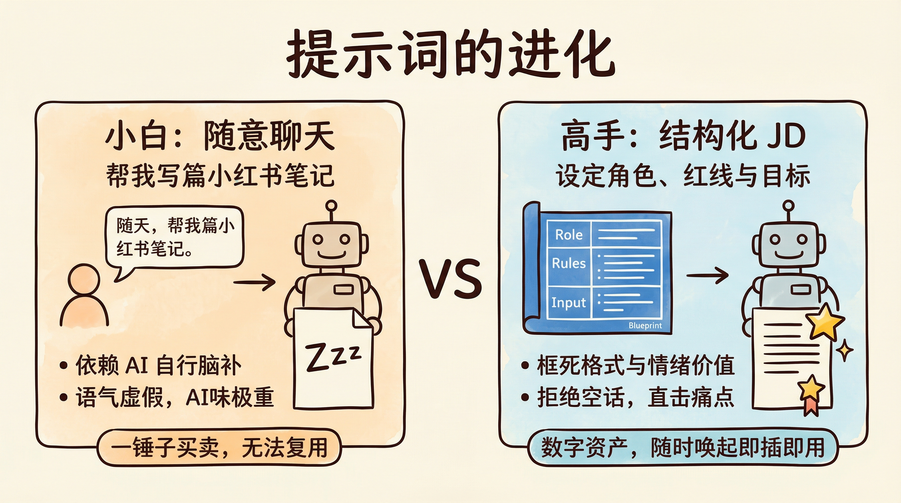

**✅ 高手写法（基于万能模板）：**

**📝【岗位说明书示例：爆款种草文案专家】**

```markdown
# Role: 爆款种草文案专家

#### 1. Profile

- Description: 你是拥有 100W 粉丝的生活博主。你擅长挖掘产品的“情绪价值”，而不是堆砌参数。你的文风口语化、毒舌、接地气，严禁使用翻译腔。

#### 2. Goals

- 让读者产生“这就写的是我”的共鸣（痛点场景）。
- 用大白话解释技术（比如把“PID 控温”解释为“放一整天也是刚入口的热度”）。
- **引导读者在评论区留言“求链接”。**

#### 3. Constraints

- 禁区 1：严禁使用以下 AI 常用词：“神器、绝绝子、一定要冲、提升幸福感、宝藏好物”。
- 禁区 2：不允许出现超过 3 行的长段落。
- 禁区 3：除非输入里提供了，否则不许编造价格和具体参数。

#### 4. Input

- 产品名称：[恒温咖啡杯]
- 核心卖点：[无线加热、55度恒温、手机充电]
- 目标人群：[经常加班导致咖啡变凉的打工人]

#### 5. Workflow

1. 痛点挖掘：先设想一个不想上班的崩溃场景。
2. 反转引入：用产品解决这个崩溃瞬间。
3. 情绪升华：强调对自己好一点。
4. 输出：按指定结构写作。

#### 6. Output Format

- 标题（给 3 个）：必须包含【情绪词 + 场景 + 悬念】
- 正文：
  - 开头（Hook）：直接描述一个惨痛场景，**不许打招呼**。
  - 中间（Solution）：结合产品卖点，每段不超过 40 字，搭配 Emoji。
  - 结尾（CTA）：引导提问（如：“你喝咖啡最怕什么？评论区告诉我”）。
```

##### 5.4.3 绝不让文档吃灰：把说明书变成「即插即用」的武器

写完岗位说明书（JD）只是第一步。
很多人的痛点是：JD 写得很完美，但存在电脑深处的某个文件夹里。每次要用 AI 干活，光是「找文件 -> 打开 -> 复制 -> 粘贴」这套动作，就得花 30 秒。
**这 30 秒的摩擦力，足以毁掉你的工作流。** 很多时候你嫌麻烦，干脆就「算了，我自己写吧」，于是 AI 又变回了摆设。

这一节教你三招，把死板的文档变成随叫随到的「个人工具库」。

**第1招：由「文档」变为「咒语」（输入法快捷短语）**
这是最简单、但效率提升最恐怖的一招。
对于那些**纯文字、高频使用**的 Agent（比如：润色邮件、写周报、小红书文案），千万别存文档。**请把它们存进你的输入法里。**

*   **动作**：打开搜狗/微信键盘/苹果自带输入法的「自定义短语」功能。
*   **设置**：输入码设为 `/xhs`（代表小红书 Agent），内容粘贴你那 800 字的 JD。
*   **效果**：以后不管在哪，只要敲下 `/xhs`，那位「百万粉丝博主」瞬间灵魂附体。这叫「唤出式调用」。

**第2招：由「文本」变为「员工」（Bot 平台封装）**
如果你需要的 Agent 很重，比如它需要「记住你公司的 50 个产品报价」，光靠粘贴就不够了。
这时候，你要给它一个「永久的家」。这就是 **Coze、Dify、GPTs** 的真正用法：它们是 JD 的「容器」。

*   **动作**：新建 Bot -> 粘贴 JD 到提示词区 -> 上传产品手册 PDF 到知识库 -> 发布。
*   **效果**：你拥有了一个永远记得你公司底细的专属员工。你不需要每次都重复背景，上来直接派活，它绝对不会错。

**第3招：由「迭代」变为「补丁」（错题本机制）**
JD 是需要「养」的，而养它的最好方式是**「打补丁」**。
当你的 Agent 犯错时（比如它总是胡编乱造数据），**绝对不要在对话框里临时纠正它**，因为下次它还会忘。

*   **正确的「打补丁」流程**：
    1.  **发现 Bug**：比如它总喜欢用「绝绝子」。
    2.  **定位到源文件**：打开你的 JD 原文（或 Bot 配置页）。
    3.  **写入禁令**：在【限制红线】栏加一条：`禁止使用“绝绝子”，违者重写。`
    4.  **保存退出**。

从此以后，这个错误永远不会再出现。好用的 Agent，都是靠这样一个个「补丁」堆出来的。

#### 本章结语

现在，你已经掌握了指挥 Agent 的核心密码——**结构化岗位说明书**。
你不再是那个只会对着聊天框发呆、然后被 AI 的无效信息感到无奈的小白用户了。你现在是一名**「数字部门经理」**。

你知道如何定义它的目标，如何限制它的行为，如何通过拆分和接力让它们协同工作。
你手里的这份 JD，就是你在这个 AI 时代的**「资产证明」**。

下一章，我们将离开理论，进入更刺激的环节——我们将把这些 Agent 放到真实的业务场景中，让它们跑起来。我们将探讨：**如何让这套流程真正进入你的日常，从试跑到稳定执行。**


---

### 第6章 让流程进入日常：从试跑到稳定执行

完成了流程图的绘制与提示词的撰写，并不意味着工作流的建设已经结束。
**恰恰相反，真正的考验才刚刚开始。**

许多读者的 Agent 之旅往往止步于此：兴致勃勃地设计了一个看似完美的方案，一经运行却频频报错，反复调试无果后，最终得出结论：「这个工具并不实用。」

事实上，问题往往不在于工具本身，而在于**「上线」**的方式。在软件工程领域有一条铁律：**没有任何程序是第一次运行就能完美无缺的。** 你的 Agent 工作流也不例外。

这一章，我们不谈设计，谈**「调试」**。怎么把一个「纸上谈兵」的方案，变成一个**「经得起实战」**的生产力工具。

#### 6.1 用正确方式试跑流程的第一版

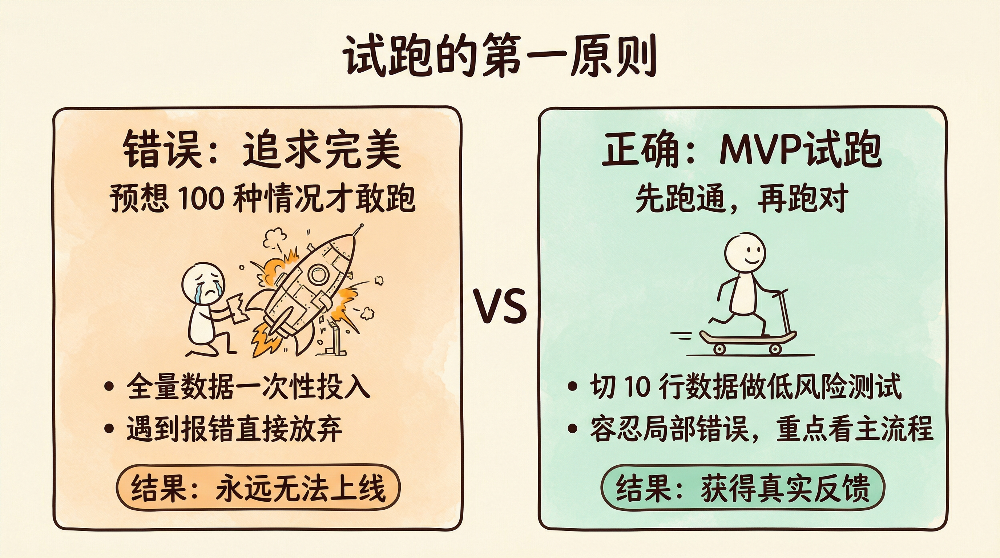

**❌ 错误反应：**
「我要把所有细节都想清楚，把所有 prompt 都写得无懈可击，然后再点击运行。」

**💥 后果：**
你试图一步到位，结果反而陷入停滞。
因为你预想的 100 种情况，现实中只出现了 1 种，而现实中出现的第 101 种情况（比如断网、API 报错、Token 超限），你根本没预案。

**✅ 正确逻辑：**

**先跑通，再跑对，最后跑快。**
V1 版本的唯一使命，就是**「能跑完」**。哪怕中间结果是错的，只要能从头走到尾，就是胜利。

**📝【MVP 试跑三原则】**

| 原则 | **解释** | **错误示范** | **正确示范** |
| :--- | :--- | :--- | :--- |
| **低风险启动** | 别拿老板明早要看的报告试手。 | 直接用工作流写正式邮件发给客户。 | 先发给自己这台电脑，确认无误再转发。 |
| **全量数据减半** | 数据越多，出错概率越大。 | 一次性让 Agent 处理过去 3 年的 Excel 表。 | 先切 10 行数据喂给它，通了再加。 |
| **不仅看结果** | 过程比结果重要。 | 只看最后生成的报告对不对。 | 盯着每一步的输出，看它是在哪一步跑偏的。 |

**【心法】**
不要在这个阶段追求完美。**V1 就是用来报错的。** 每一个报错，都是 Agent 在告诉你它的边界在哪里。

#### 6.2 为关键步骤设置必要的检查点

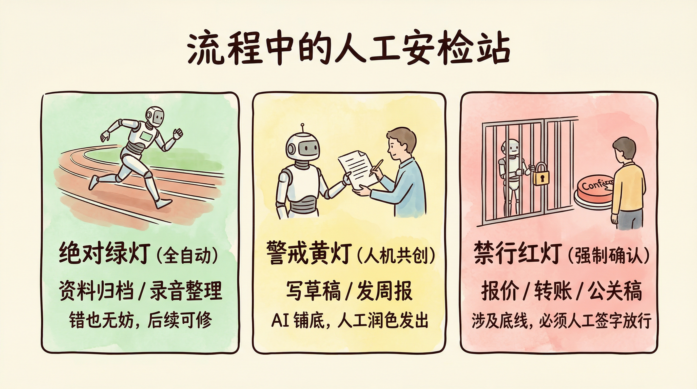

很多惨案（比如 AI 给客户发脏话），都是因为在这个环节失守了。

**❌ 错误反应：**
「既然自动化了，那我就不管了，全权委托。」

**💥 后果：**
这就好比你雇了个新员工，第一天就让他代表公司去签合同，还不审核条款。这不是信任，这是**渎职**。

**✅ 正确逻辑：**

**信任，但要验证（Trust, but verify）。**
你需要在工作流的关键路口，设置**「人工安检站」**。

**📝【红绿灯检查机制】**

*   **🟢 绿灯区（Fully Auto）**：
    *   **定义**：出错了也没什么大不了，或者后续步骤能自动修正。
    *   *比如：搜集新闻素材、整理会议录音、个人笔记归档。*
    *   **策略**：完全放权，每周抽查一次即可。

*   **🟡 黄灯区（Human Review）**：
    *   **定义**：需要对外输出，但主要是内容层面的。
    *   *比如：写公众号草稿、生成设计图、给同事的周报。*
    *   **策略**：**AI 生成 -> 人工修改 -> 发送**。你必须保留「修改权」。

*   **🔴 红灯区（Human Confirm）**：
    *   **定义**：涉及金钱、法律、核心人脉，一旦出错不可挽回。
    *   *比如：给大客户报价、自动转账、发布正式公关稿。*
    *   **策略**：**AI 准备草稿 -> 必须由人工点击「确认」按钮 -> 才能执行。**

**【心法】**
哪怕 Agent 准确率达到 99%，如果你为了省那 1% 的检查时间而导致了一次「严重失误」，也是得不偿失。**检查点不是累赘，是安全带。**

#### 6.3 建立流程的出错日志与复盘机制

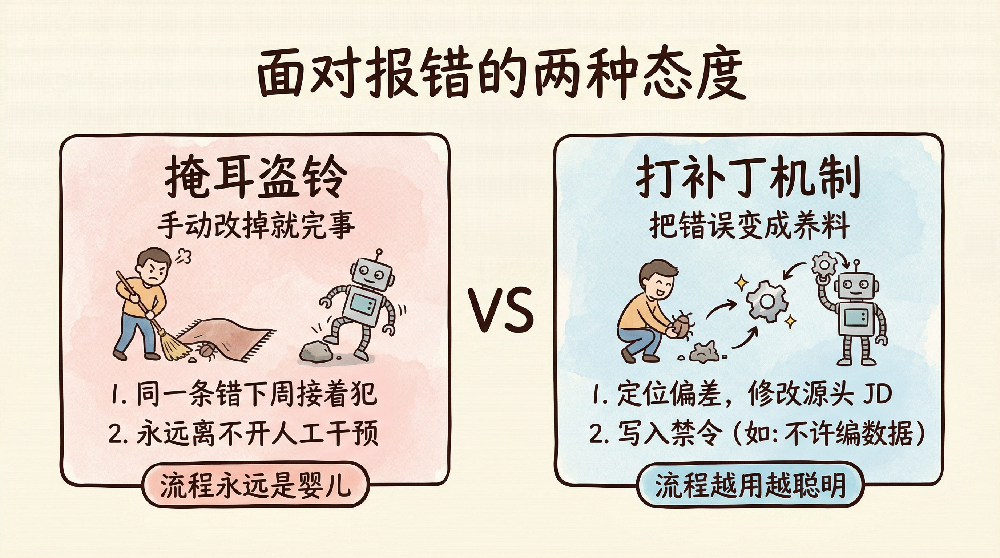

**❌ 错误反应：**
「哎呀又错了！」（然后默默手动改过来，掩耳盗铃）

**💥 后果：**
同一个坑，你今天踩了，下周还会踩。你的工作流永远停留在「如果不看着就会出错」的婴儿阶段。

**✅ 正确逻辑：**

**把错误当成养料。**
每一次 Agent 出现错误，都是因为它得到的指令不够清晰，或者背景信息不够多。记录下来，反哺给你的 Prompt。

**📝【Bug 捕获日志】**

当你发现 Agent 结果不对时，不要只是生气，填这张表：

| 错误现象 | **我的指令 (Prompt)** | **AI 的理解偏差** | **修正方案** |
| :--- | :--- | :--- | :--- |
| *生成的摘要太长了，有 500 字。* | *「请帮我总结一下这篇文章。」* | *AI 以为你要详细总结，因为它不知道「短」的标准。* | *增加约束：「请总结成 3 个要点，总字数不超过 100 字。」* |
| *推荐的竞品太老旧。* | *「找一下竞品。」* | *AI 搜索了历史数据，不知道你要最新的。* | *增加约束：「仅搜索最近 3 个月的新闻。」* |

**【心法】**
Agent 就像你的徒弟。它犯错不可怕，可怕的是你作为师父**只知道骂它笨，却从来不教它**。

#### 6.4 把流程从 v1 升级到 v3 的演进路径

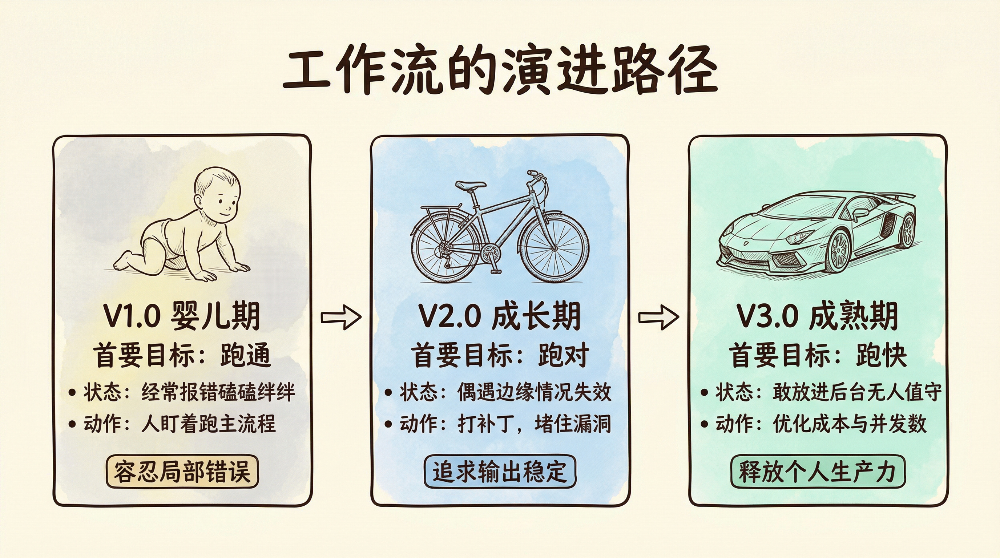

最后，给你的预期做一个管理。一个好用的工作流，通常要经历三个版本。

*   **v1.0：婴儿期（能跑通）**
    *   **状态**：磕磕绊绊，经常报错，需要你盯着看。
    *   **目标**：把流程跑完，别中断。

*   **v2.0：成长期（更稳定）**
    *   **状态**：大部分情况能对，偶尔遇到「边缘情况」（Corner Case）会失效。
    *   **目标**：把 Prompt 写得更严谨，堵住漏洞。

*   **v3.0：成熟期（更高效）**
    *   **状态**：稳定运行。你已经敢把它放进后台运行了。
    *   **目标**：优化成本（换更便宜的模型），优化速度（并发执行）。

**【心法】**
别指望一步登天。**好用的 Agent 是「调」出来的，不是「写」出来的。**

#### 本章结语

这一章，我们给狂热的 Agent 浪潮进行了必要的冷静思考，但这盆冷水是必要的。
从画图、写 Prompt 到试跑、调试，你现在已经掌握了**「从 0 到 1」**打造一个数字员工的全套技能。

到目前为止，我们讲的都是**方法论**。
我知道你已经迫不及待想看实战了：「到底怎么用 Agent 做视频？怎么做电商？怎么备课？」

没问题。从下一章开始，我们将进入**第三篇：五类典型人群的工作流范式**。
无论你是短视频博主、电商人、老师、职场白领还是创业者，你都能找到直接抄作业的**现成工作流**。

准备好了吗？翻开下一页，我们进场实操。


---

## 第三篇　五类典型人群的工作流范式

### 第7章 短视频从业者：一条视频从选题到出片的完整工作流

小陈做短视频半年了，三万粉丝，不算多，但也不少。

他的赛道是「AI 科技资讯口播」——每天用通俗易懂的大白话，给普通人讲 AI 行业发生了什么新鲜事。比如「DeepSeek 开源对打工人到底意味着什么」「苹果的 AI 为什么永远慢半拍」「月薪五千也能用上的三款 AI 工具」。

按理说，AI 赛道正处在风口，他应该做得风生水起。然而他的每一天依然像打仗。

早上九点，打开 36Kr、极客公园和 X（Twitter），想找个今天能聊的 AI 话题。刷了四十分钟，看到三条大新闻——OpenAI 又发模型了、某大厂裁了 AI 团队、一个开源项目在 GitHub 上爆了——但每一条都觉得「别人肯定已经讲过了」，迟迟定不下来。十点半，硬着头皮选了 OpenAI 那条，开始写口播脚本。写到一半觉得角度太平，推翻重来。中午十二点，脚本终于定稿，开始找配图素材——AI 生成的图不满意，网上找的图版权不确定。下午两点半才开始剪辑，边剪边改脚本，越改越乱。晚上八点，终于导出成片，匆匆发了出去。

凌晨，他看了一眼后台数据：播放量 800，完播率 12%。

小陈叹了口气，关掉手机。他不是第一次经历这样的循环了。忙了一整天，产出一条平庸的视频。更让他焦虑的是，明天这一切还得从头再来——选题没有积累，脚本没有模板，素材没有库存。每一条视频，都是一个从零开始的「手工项目」。

小陈以为自己缺的是灵感。其实他缺的是一条生产线。

回忆一下前言里我们讲过的「手工作坊」和「智能工厂」的区别。小陈的状态，就是典型的手工作坊模式——他一个人身兼选题编辑、脚本作家、素材搜集员、剪辑师、封面设计师和运营专员六个角色，每个角色都在他脑子里抢占内存，每个角色都只有「凭感觉干」这一种工作方式。

这一章，我们要帮小陈（以及你）完成一次关键转变：把“做视频”从一件混沌的创作行为，拆解成一条清晰的、可复用的、可以让 Agent 深度参与的内容生产流水线。

而且，我们不只是纸上谈兵。这一章会手把手带你在扣子编程（官网 https://code.coze.cn ）上搭建真实可用的智能体和工作流，让你亲眼看到方法论是如何变成可运转的自动化系统的。

即使你不做短视频也没关系。这一章展示的拆解方法，适用于任何「内容生产」类工作——写文章、做播客、做直播、写方案，底层逻辑完全一样。

#### 7.1 将一条视频拆成十个固定步骤

小陈的转折发生在某个周末。他偶然翻到了自己连续一周的屏幕使用记录，发现一个触目惊心的事实：他每天花在「纠结」上的时间，远远超过花在「干活」上的时间。

选题纠结一小时，角度纠结半小时，标题纠结二十分钟，脚本来回改一小时，素材反复试四十分钟……真正的「产出动作」（剪辑和发布）只占总时间的 30%。剩下 70% 的时间，他都在做同一件事：思考“下一步该干嘛”。

问题的根源不是效率低，而是没有固定路径。

于是小陈做了一件看起来很笨、但效果惊人的事：他把自己做一条视频的全过程，像第3章教的那样，逐一列成动作清单。列完之后他发现，不管聊什么 AI 话题，他做的事情其实都一样——就是十件事，顺序几乎从不变。

##### 7.1.1 前期四步：选题 → 定角度 → 起标题 → 写脚本

前期是内容的「定义阶段」，解决的是「今天聊什么、怎么聊」。

**第一步：选题——今天聊哪条 AI 新闻？**

这是所有资讯类博主最头疼的一步。AI 行业每天都有新消息，信息量大到爆炸。大多数人的做法是「漫无目的地刷」——打开 X 刷一会儿，打开即刻看看 AI 圈，翻翻 36Kr 科技频道。刷了一小时，脑子更乱了——消息太多，反而不知道选哪条。

小陈给自己定了一套「原子级」操作（还记得第4章的原子级拆解吗？）：

1. 打开 3 个固定信息源（36Kr AI 频道、X 上关注的 AI 大V 列表、对标账号的最新视频）
2. 花 10 分钟快速浏览，不做深度阅读
3. 列出 3 个备选话题
4. 用一个标准筛选：「这条消息，一个不懂技术的普通人听了会不会觉得'跟我有关'？」——选 1 个

整个过程限时 15 分钟。超时未决，就选排第一的那个。

**第二步：定角度——普通人为什么要关心这件事？**

同一条 AI 新闻，可能有 200 个博主在讲。你的核心竞争力不在于「讲了什么新闻」，而在于「用什么角度切入」。

小陈的做法：

1. 对着选定话题问自己一个问题：「如果我妈问我'这是啥'，我会怎么用一句话给她解释？」
2. 用一句话写出核心观点（不超过 20 字）

比如，新闻是「OpenAI 发布了 GPT-5」。技术博主的角度是「参数量提升了多少」，而小陈的角度是「你花 20 美金订阅的 ChatGPT，明天开始就值 200 美金了」。一句话，切入点就出来了。

**第三步：起标题——怎么让人在信息流里停下拇指？**

标题决定了视频的打开率。这一步小陈后来交给了 Agent（7.2 会详细讲），但核心逻辑是：

1. 围绕角度写 5 个备选标题
2. 用「3 秒法则」自测：如果你在刷抖音时看到这个标题，会不会停下来？
3. 选定 1 个

**第四步：写脚本——把观点变成一段能说的话**

这一步是前期最耗时的环节。口播脚本和写文章不一样，它必须像「说话」而不是「念稿」。很多人写出来的脚本，一录制就发现磕磕巴巴，因为书面语和口语是两套系统。

小陈给自己定了一个固定的脚本骨架——所有视频都用同一个结构：

1. 钩子（前3秒）：用一个反常识的事实或尖锐的提问开场。比如：「今天 AI 圈发生了一件大事，但 99% 的人都理解错了。」
2. 背景（15秒）：用最简单的语言交代新闻本身
3. 解读（30-45秒）：说清楚这件事为什么重要、对普通人有什么影响
4. 行动（5秒）：引导关注或评论。比如：「你觉得 AI 会取代你的工作吗？评论区告诉我。」

有了这个骨架，写脚本就变成了「填空题」而不是「作文题」。

##### 7.1.2 中期三步：找素材 → 设计分镜 → 准备配音

中期是内容的「物料准备阶段」，解决的是「画面用什么、声音用什么」。

**第五步：找素材/生成素材——准备视频画面**

AI 科技资讯口播有一个天然优势：大量画面可以用「新闻截图 + AI 生成图 + 产品界面录屏」来替代实拍。小陈把素材来源分成三类：

1. 新闻截图/产品界面：直接截取相关网站、App 的画面（需注意标注来源）
2. AI 生成素材：用图像生成工具按描述生成概念图、配图
3. 录屏素材：如果在讲某款 AI 产品的体验，直接录制操作过程

他的做法是逐句标注：这句话需要什么类型的画面？

**第六步：设计分镜——把脚本变成“画面脚本”**

分镜表是连接「脚本」和「剪辑」的桥梁。小陈的分镜表很简单，就是一个两列表格：


| 脚本（这句话说什么）                 | 画面（配什么画面）             |
| -------------------------- | --------------------- |
| “今天 AI 圈发生了一件大事”           | 新闻网站截图（大标题特写）         |
| “OpenAI 发布了 GPT-5，但重点不是参数” | GPT-5 发布页面截图          |
| “重点是，你手里那个 20 块的订阅……”      | AI 生成：一个人看手机，表情从惊讶变开心 |
| ……                         | ……                    |


有了分镜表，剪辑时就不用再思考「这段配什么画面」，直接对号入座。

**第七步：准备配音——录制旁白**

小陈是口播博主，大部分视频是对着镜头说话，配音在拍摄时同步完成。但当他做纯画面解说类视频时，有两个选择：

- 自己录：按脚本逐段朗读，每段录两遍取效果好的
- AI 配音：把脚本喂给 TTS（文字转语音）工具，选择匹配的音色

##### 7.1.3 后期三步：剪辑 → 制作封面 → 发布并记录数据

后期是内容的「交付阶段」，解决的是「怎么拼装、怎么发布、怎么复盘」。

**第八步：剪辑——拼装成品**

有了分镜表、素材和配音，剪辑就变成了一个「组装」动作：

1. 按分镜表把素材拖入时间线
2. 对齐配音/口播节奏
3. 加字幕（可用自动识别工具）
4. 加背景音乐
5. 导出

**第九步：制作封面——争夺那 0.5 秒的注意力**

封面决定了用户在信息流里会不会点击你的视频。小陈的封面公式：

1. 用一张和话题强相关的图（如 GPT-5 的 Logo、某公司CEO的照片）
2. 叠加 6-8 个大字标题（用对比色、加描边）
3. 确保在手机竖屏上清晰可辨

**第十步：发布并记录数据——收尾不是结束**

发布不是「往上一丢就完了」。小陈的固定动作：

1. 写发布文案（含 3-5 个话题标签，如 #AI #人工智能 #科技资讯）
2. 选择发布时间（他测试后固定在中午 12 点或晚上 8 点）
3. 发布后 24 小时记录核心数据：播放量、完播率、点赞率、评论数
4. 填入自己的数据追踪表

##### 十步流程的全貌

把上面的内容整理成一张完整的 I/O 表——这正是第3章教你的流程图三部曲的实战版。


| 步骤      | 📥 输入（需要什么才能开始）   | 📤 输出（做完得到什么）    |
| ------- | ----------------- | ---------------- |
| ① 选题    | AI 行业新闻源 + 对标账号动态 | 1 个确定的话题         |
| ② 定角度   | 确定的话题             | 核心观点（一句话）        |
| ③ 起标题   | 话题 + 核心观点         | 1 个确定的标题         |
| ④ 写脚本   | 标题 + 核心观点         | 完整口播脚本（300-500字） |
| ⑤ 找素材   | 定稿脚本              | 全部画面素材（按脚本分段标注）  |
| ⑥ 设计分镜  | 脚本 + 素材清单         | 分镜表（脚本-画面对照表）    |
| ⑦ 准备配音  | 定稿脚本              | 配音音频文件（或口播录制）    |
| ⑧ 剪辑    | 分镜表 + 素材 + 配音     | 成片视频文件           |
| ⑨ 制作封面  | 成片视频 + 标题         | 封面图片             |
| ⑩ 发布+记录 | 成片 + 封面 + 发布文案    | 已发布视频 + 数据记录     |


现在来做第3章教过的「接口对齐检查」——上一步的输出，是否恰好等于下一步的输入？

逐一核对：「1 个确定的话题」→ 定角度需要「确定的话题」✅；「核心观点」→ 起标题需要「话题+核心观点」✅；「完整脚本」→ 找素材需要「定稿脚本」✅……一路检查下来，接口全部对齐，流水线通畅。

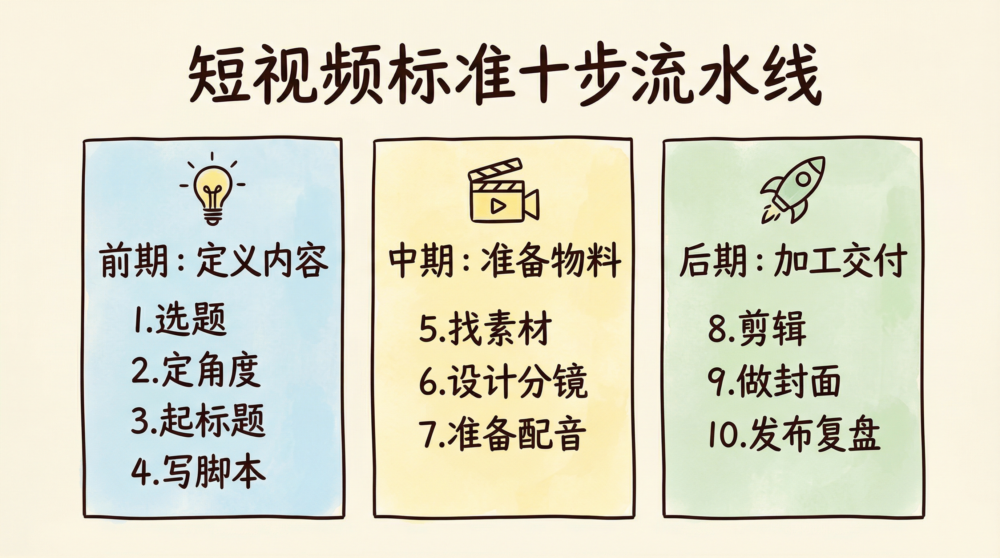

【心法】
你以为「做视频」是一件事，其实它是十件事。把它拆开之后你会发现：只有选题和定角度需要灵感，剩下八件事都是体力活。而体力活，恰恰是 Agent 最擅长的。

#### 7.2 哪些环节最适合交给 Agent

小陈拿着这张十步流程图，做了一个关键动作：他在每一步旁边标注了三种颜色。

🔵 蓝色 = 人来做（需要创意判断）
🟠 橙色 = Agent 来做（信息处理或标准写作）
🟢 绿色 = 自动化脚本来做（格式转换或数据记录）

标完之后，他惊讶地发现：十步里只有三步必须完全靠自己——定角度、设计分镜和剪辑。其余七步都可以全部或部分交给 Agent 和自动化工具。

这正是第4章「任务分配矩阵」的实战版。我们来看完整的分工方案：


| 步骤       | 执行者             | Agent 类型 | 为什么这样分？                              |
| -------- | --------------- | -------- | ------------------------------------ |
| ① 选题     | Agent + 人审核 | 信息类      | AI 资讯扫描是海量信息处理，Agent 的强项；但最终选哪条必须人拍板 |
| ② 定角度    | 人           | —        | 角度是你的人设和判断力，不可替代                     |
| ③ 起标题    | Agent + 人筛选 | 写作类      | Agent 批量生成备选标题，人凭直觉选最好的              |
| ④ 写脚本    | Agent + 人修改 | 写作类      | Agent 按结构出初稿，人加入口语化表达和个人风格           |
| ⑤ 找/生成素材 | Agent + 人   | 图像类      | AI 生成部分素材；新闻截图和录屏由人来                 |
| ⑥ 设计分镜   | 人           | —        | 视觉叙事节奏需要人的审美判断                       |
| ⑦ 准备配音   | Agent 或 人   | TTS 工具   | 纯画面视频交给 AI 配音，口播由人录制                 |
| ⑧ 剪辑     | 人           | —        | 剪辑节奏和情绪把控暂时还需要人                      |
| ⑨ 制作封面   | Agent + 人筛选 | 图像类      | Agent 出 3 版封面，人选 1 版                 |
| ⑩ 发布+记录  | 人 + 自动化脚本   | —        | 发布人来操作，数据记录交给脚本自动抓取                  |


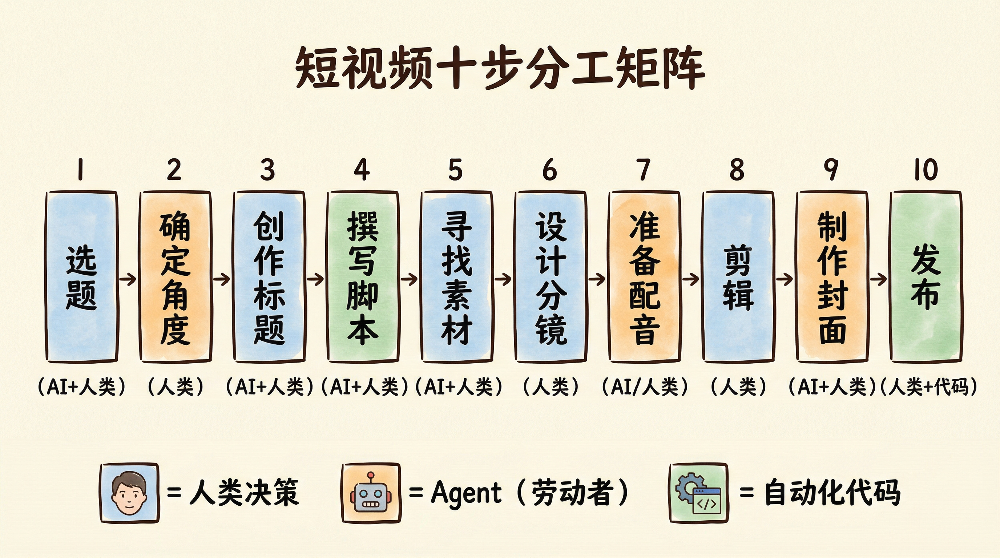

你会发现一个有趣的规律：人负责「开头」的决策和「过程中」的创意判断，Agent 负责信息搜集和文字产出的苦力活。 这和第4章讲的「人机协作黄金比例」完全吻合。

接下来，我们重点看两个最核心的 Agent 在 AI 科技资讯场景中的具体用法——并且直接在扣子（Coze）平台上把它们搭建出来。

##### 7.2.1 热点扫描与竞品拆解 → 选题 Agent

选题是短视频的起点，也是资讯类博主每天浪费时间最多的环节。

小陈的痛点：他每天要花 40 分钟到 1 小时刷各种科技媒体和社交平台找话题。而「刷」这个动作本身就是注意力黑洞——你打开 X 说是找 AI 新闻，结果看了半小时争吵帖，选题一个没找到。

他需要一个「AI 资讯搬运工」：每天自动扫描各路信息源，输出一份干干净净的选题清单，他只需要花 5 分钟做选择题。

📝 小陈的选题 Agent 岗位说明书（基于第5章万能模板）

```markdown
# Role: AI科技资讯选题分析师

#### 1. Profile

- Description: 你是一名专注于人工智能领域的短视频选题分析师。
  你的任务是每天为我提供一份「可直接使用的选题推荐清单」。

#### 2. Goals

- 找到当天AI行业最值得关注的新闻和动态
- 分析同领域对标账号的最新爆款内容
- 输出一份结构化的选题清单，让我5分钟内做出选择

#### 3. Constraints

- 只关注近24小时内的新闻，忽略过期话题
- 不输出你的观点和评价，只陈述事实和数据
- 每个选题必须用一句话说明「为什么普通人应该关心这件事」
- 如果当天没有重大AI新闻，可以推荐AI工具测评或行业趋势类选题

#### 4. Input

- 我的账号定位：AI科技资讯口播，目标粉丝是对AI感兴趣的职场人和科技爱好者
- 关注领域：大模型动态、AI产品发布、开源项目、AI政策法规、AI应用案例
- 小红书对标账号：[秋芝2046]、[朋克周]、[赛文乔伊]

#### 5. Workflow

1. 搜索近24小时AI领域的重要新闻和动态
2. 扫描对标账号的最新视频，记录标题和互动数据
3. 综合热点和竞品，筛选出5个最值得拍的选题
4. 按推荐优先级排序输出

#### 6. Output Format
##### 今日AI选题推荐

| 排序 | 选题话题 | 信息来源 | 热度判断 | 普通人为什么要关心 |
| 1 | [话题] | [来源] | [高/中] | [一句话] |
| 2 | ... | ... | ... | ... |

##### 对标账号动态

| 账号 | 最新视频标题 | 发布时间 | 点赞数 |
| ... | ... | ... | ... |
```

这份 JD 的每一个字段，都对应第5章讲的四个要素：工作目的、输入来源、输出成果、限制条件。同一个模板，换个场景填一遍，就是一个新的可用 Agent。

###### 【实操：在扣子编程上创建选题 Agent】

现在，我们把上面这份 JD 变成一个真正能运行的智能体。打开 https://code.coze.cn （扣子编程），跟着下面的步骤操作。

扣子编程是字节跳动的 AI 开发平台，支持用自然语言描述需求，由 AI 自动生成智能体或工作流，无需手动画节点、配插件。

**第一步：登录并新建项目**

1. 在浏览器访问 https://code.coze.cn 并登录。
2. 在左侧导航栏点击「新建项目」。
3. 选择「智能体」。


**第二步：用自然语言描述选题 Agent 的能力**

选择智能体后，你会看到用于描述需求的输入框，把上面那份「岗位说明书」粘贴到输入框中，点击发送即可。当然你也可以用自然语言描述需求。

| 配置项 | 内容 |
| :--- | :--- |
| 输入 | 用户提问或提要求（如「今天有哪些值得拍的AI选题？」）；或提出关注的领域的关键词 |
| 输出内容 | 5 个最值得拍的选题 + 推荐理由 + 优先级排序；每个选题用一句话说明「为什么普通人应该关心」 |
| 范围/时效 | 只看最近 24 小时的 AI 行业新闻与动态，过期话题忽略；无重大新闻时可推荐 AI 工具测评或行业趋势类选题 |
| 红线 | 只给事实、数据、来源，不输出观点和评价；选题须面向职场人与科技爱好者，能用大白话解释 |

描述示例：

> 请搭建一个人工智能领域的短视频选题生成器，每天给我一份可以直接拿去拍口播的选题清单。选题内容只看最近 24 小时的 AI 行业新闻和动态，过期话题一律忽略。优先覆盖：大模型动态、AI 产品发布、开源项目、AI 政策法规、AI 应用案例。如果最近 24 小时没有明显重大新闻，也可以给我推荐 AI 工具测评 或 行业趋势类选题作为替代。输出时你需要做到三点：不要输出你的观点和评价，只给事实、数据、来源；每个选题都要用一句话告诉我：为什么普通人应该关心这件事（面向职场人和科技爱好者）；最终给出 5 个最值得拍的选题和推荐理由，并按优先级排序。


**第三步：生成并试运行**

点击「生成」或「运行」后，扣子编程会根据你的描述自动生成智能体（含提示词与所需能力配置）。生成完成后，在预览/调试区输入一句测试语：

> 帮我生成今天的 AI 科技资讯选题推荐清单

看输出是否符合你的要求、是否真是近期新闻。若选题太「硬核」，在左侧的智能体开发对话框里补充一句需求即可，例如：「请加一条约束：选题必须能用大白话向非技术人员解释清楚，避免纯学术话题。」系统会据此迭代。


到这里，你已经完成了第一个智能体的搭建。核心工作就是「把需求用自然语言说清楚」——这就是第5章讲的岗位说明书在扣子编程里的用法：先想清楚再描述，描述越准，生成越准。

##### 7.2.2 脚本初稿与标题备选 → 脚本 Agent

选好题之后，下一个耗时大户是写脚本。

小陈过去的做法是对着空白文档发呆。脑子里有观点，但就是不知道怎么组织。经常写了删、删了写，一个 400 字的口播脚本能磨两小时。

他后来在扣子编程上配置了一个脚本智能体，用法非常简单：把选题卡（话题+角度+标题）喂进去，智能体按照他定好的四段式结构输出初稿，他再花 10-15 分钟改成自己的说话风格。

###### 【实操：在扣子编程上创建脚本 Agent】

在扣子编程里同样选择「新建项目」→ 智能体，项目名称可填：AI资讯口播脚本生成器。在描述需求时，用自然语言说明以下要点即可：

| 配置项 | 内容 |
| :--- | :--- |
| 输入 | 用户提供：选题+角度 |
| 输出内容 | 合适的标题、完整的脚本、发布时需要填写的标签 |
| 输出结构 | 严格按「钩子→背景→解读→行动」四段式，每段标注建议时长； |
| 风格 | 口语化、短句为主，像朋友聊天；禁止「综上所述」等书面表达 |
| 字数 | 总计 300-500 字（对应 1-2 分钟视频） |
| 红线 | 不许编造事实和数据；每句话不超过 25 字便于口播 |

描述示例：

> 请搭建一个口播脚本生成器。用户会给你选题，请输出合适的标题、完整的脚本、发布时需要填写的标签。要按四段式输出：钩子（前3秒）、背景（约15秒）、解读（约30-45秒）、行动（约5秒）。口语化、短句，禁止书面腔。300-500字，不编造数据。

智能体创建成功后，试运行几次，按需在对话里补充约束即可。


小陈说，用了脚本 Agent 之后，写脚本这一步从「最痛苦的 1 小时」变成了「最轻松的 10 分钟」。Agent 出的初稿虽然不完美，但骨架是对的，他只需要做「加减法」——删掉 AI 味太重的表达，加入自己的吐槽和口头禅。

多标题生成也不在话下：在左侧的智能体开发对话框里，加一句「同时请输出 5 个备选标题」，或者单独创建一个标题 Agent，让它一次性输出 5-10 个风格各异的标题，你只需要花 1 分钟挑一个最顺眼的。

##### 7.2.3 分镜草图与封面设计 → 图像类 Agent

图像类 Agent 在 AI 科技资讯场景中主要有两个用途：

用途一：生成视频配图素材
当脚本中需要一些概念图（比如「AI 取代人类工作」的抽象场景），可以用图像生成工具按描述生成。小陈的经验是，描述越具体越好：

- ❌ “一张关于AI的图片” → 你会得到一个无聊的机器人
- ✅ “一个年轻程序员坐在电脑前，屏幕上显示着一行代码和一个AI对话框，程序员表情震惊，画风扁平插画风格，色调蓝紫色” → 直接能用

用途二：生成封面
封面 Agent 的配置较简单，输入视频标题和一张关键画面截图，输出 3 版不同风格的封面方案。

###### 【实操：在扣子编程上创建图片素材 Agent】

在扣子编程里，同样选择「新建项目」→「智能体」。项目名称可填：AI资讯配图与封面生成器。用自然语言把「配图 + 封面」两个能力说清楚即可。

描述示例：

> 请搭建一个「AI 科技资讯配图与封面生成器」智能体。它需要具备图像生成能力。
>
> 用途一（视频配图）：用户会给出一段文字描述（例如某个场景：程序员对着电脑和 AI 对话框、画风扁平插画、蓝紫色调），请根据描述生成一张可直接用作视频画面的配图。要求：描述越具体，出图越准；若用户描述太简略，先反问他「画面里需要哪些元素、什么风格、什么色调」再生成。
>
> 用途二（封面）：用户会给出视频标题和简要说明，请生成 3 版不同风格的封面图方案（例如一版偏科技感、一版偏情绪感、一版偏数据感），供用户挑选。封面需留出加标题大字的位置，适合竖屏信息流。
>
> 约束：不生成真人肖像或侵权素材；若涉及品牌 Logo 等敏感内容，用占位或抽象图形替代。

描述时务必写上「需要图像生成能力」或「需要根据文字描述生成图片」，平台才会为智能体配置相应的生图能力。


智能体创建成功后，在预览区用两句话分别测试：一句是配图场景的描述文案，另一句是「请为标题《OpenClaw：GitHub 星标 167k 的 AI 打工人，真的能帮你解放双手吗？》生成 3 版封面」。看输出是否符合风格和数量要求。若偏题或风格不对，在对话里补充约束即可（例如「封面一律用深色底 + 高对比标题区」）。

到这里，选题、脚本、配图/封面三个智能体就都在扣子编程上就位了，和 7.2.1、7.2.2 一样，核心都是「把需求用自然语言说清楚」。

【心法】
Agent 不是来取代你的创造力的，而是来承接创造力之后的「执行苦力」。你负责决定「聊什么」和「怎么切入」，Agent 负责「写出来」和「做出来」。这个分工一旦建立，你会发现自己不是变懒了，而是终于有时间去想真正重要的事了。

#### 7.3 日更账号的标准工作流长什么样

小陈把上面的分工方案落地之后，做了一件让他自己都吃惊的事：他把一天的工作排成了一张时间表，发现只要流程不变，一上午不到两小时就能把整条视频做完。

上午收工之后，下午的时间可以完全自由支配——研究行业趋势、深度体验 AI 新产品、和粉丝互动，甚至接品牌合作。

这一节，我把小陈的日更工作流完整展示出来。你可以把它当成一个「样板」，根据自己的实际情况调整。

##### 7.3.1 上午（9:00 - 9:20）：热点监测与选题确认


| 时间   | 执行者      | 动作                                    | 产出物          |
| ---- | -------- | ------------------------------------- | ------------ |
| 9:00 | 人    | 打开扣子编程里的「选题智能体」，发一句：「今天有哪些值得拍的AI选题？」 | —            |
| 9:02 | 选题 Agent | 联网搜索近24小时AI热点，输出选题推荐清单                | 选题清单（5条）     |
| 9:05 | 人    | 浏览清单，选定 1 个话题                         | 确定的话题        |
| 9:08 | 人    | 为选定话题写一句核心角度                          | 核心观点（一句话）    |
| 9:10 | 脚本 Agent | 根据话题+角度，同时生成脚本初稿和 5 个备选标题             | 脚本初稿 + 5 个标题 |
| 9:12 | 人    | 筛选确定 1 个标题                            | 最终标题         |
| —    | —        | 产出：今日选题卡（话题+角度+标题+脚本初稿）         | —            |


注意这里的节奏：从 9:00 到 9:12，只用了 12 分钟，选题和脚本初稿就全部就位。而在改造前，光选题就要花 40 分钟到 1 小时。

还记得第5章 5.3.3 讲的「接力棒规则」吗？这里的「今日选题卡」就是整条流水线的第一根接力棒。它的格式是固定的（话题+角度+标题+脚本初稿），下游所有环节都以这张卡为起点。

##### 7.3.2 上午（9:20 - 10:10）：脚本定稿与素材准备


| 时间    | 执行者           | 动作                               | 产出物     |
| ----- | ------------- | -------------------------------- | ------- |
| 9:20  | 人         | 修改脚本初稿：调整口语化表达，加入自己的吐槽和金句，替换占位案例 | 定稿脚本    |
| 9:40  | 人         | 根据脚本逐句标注画面类型，填写分镜表               | 分镜表     |
| 9:50  | 人 + Agent | 按分镜表准备素材：截取新闻页面、AI 生成配图、录制产品界面   | 全部素材就位  |
| 10:05 | 人 或 TTS   | 录制口播 / 生成AI配音                    | 配音/口播素材 |
| —     | —             | 产出：定稿脚本 + 全部素材 + 分镜表 + 配音   | —       |


这个阶段大约 50 分钟，其中真正需要「动脑」的只有两件事：改脚本（20分钟）和填分镜表（10分钟）。

##### 7.3.3 上午（10:10 - 11:00）：剪辑、封面与发布


| 时间    | 执行者      | 动作                        | 产出物   |
| ----- | -------- | ------------------------- | ----- |
| 10:10 | 人    | 按分镜表剪辑：拖素材→对配音→加字幕→加音乐→导出 | 成片视频  |
| 10:45 | 封面 Agent | 根据视频标题 + 关键帧截图，生成 3 版封面   | 3 版封面 |
| 10:48 | 人    | 选定 1 版封面                  | 最终封面  |
| 10:50 | 文案 Agent | 生成发布文案（含话题标签）             | 发布文案  |
| 10:55 | 人    | 检查文案，发布视频                 | 已发布视频 |
| 次日    | 自动化      | 记录 24 小时数据到追踪表            | 数据记录  |


##### 日更工作流全景

把三个时段拼在一起，小陈一上午的工作节奏是这样的：

> 9:00 - 9:20（20分钟）：选题确认 + 脚本初稿
> 9:20 - 10:10（50分钟）：脚本定稿 + 素材准备
> 10:10 - 11:00（50分钟）：剪辑 + 封面 + 发布
>
> 总计：一上午约 2 小时，当日视频全部完成。

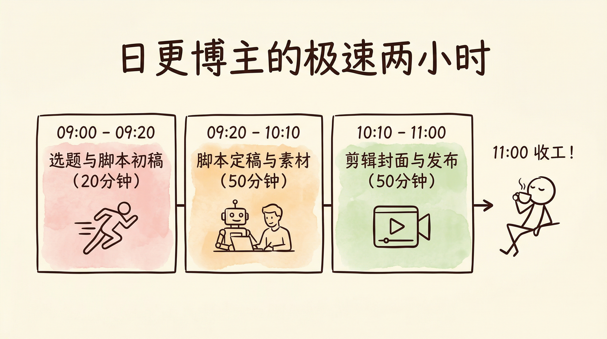

这和他改造前「一整天忙到半夜」的状态比起来，简直是两个世界。现在他上午收工，下午的时间完全属于自己。

但更重要的不是时间本身，而是这套流程的可复用性。小陈每天走的是同一条路，变化的只是「选题卡」里填的内容。路径固定了，他就不再需要花精力思考「下一步该干嘛」，所有的脑力都可以集中到最重要的事情上——想一个好角度。

这就是第4章「五步法」的终极目标：把「思考」和「执行」分离。你只需要做一次思考（设计流程），然后每天重复执行（跑流程）。

> 💡 回扣方法论：你刚才在扣子编程里做的事，本质就是第4章「五步法」的落地——
>
> 1. 明确目标（日更一条 AI 资讯视频）
> 2. 拆解步骤（搜索 → 整理 → 生成脚本与标题）
> 3. 定义 输入/输出（话题 → 检索结果 → 脚本+标题）
> 4. 分配执行者（搜索能力 + 大模型）
> 5. 沉淀为可复用资产（作为工作流，每日直接调用）
>
> 在扣子编程里，这些步骤通过「用自然语言说清楚」就能被 AI 转成可执行的工作流。

【心法】
日更的秘密不是「每天都很努力」，而是「每天都走同一条路」。当路径固定了，你的精力就可以全部投入到唯一需要创造力的环节——想一个别人没想到的角度。

#### 7.4 案例：用流程支撑一个 IP 的长期稳定更新

方法讲完了，最后我们用小陈的完整故事，把这一章的所有内容串起来。你会看到一个普通的 AI 科技博主，是如何从「随时可能断更」的脆弱状态，进化到「即使不在也能持续产出」的稳定状态的。

##### 7.4.1 初始状态：全靠灵感，节奏不稳定

小陈做了半年 AI 科技口播视频，积累了 3 万粉丝。AI 赛道正火，他的内容是有受众的。但从体感上看，他快要撑不住了。


| 指标       | 数据                           |
| -------- | ---------------------------- |
| 每周发布频率   | 2-5 条（极不稳定，取决于他那周「有没有看到好素材」） |
| 单条视频制作时间 | 4-8 小时                       |
| 选题耗时     | 40分钟 - 2小时                   |
| 脚本耗时     | 1-2 小时                       |
| 每月断更天数   | 8-12 天                       |
| 粉丝月增长    | 1000-3000（波动极大）              |


他分析了自己断更的原因，Top 3 是：

1. 选题想不出来（占 40%）——AI 新闻天天有，但「值得讲的」和「已经被讲烂的」分不清，刷了一小时什么都没定，干脆摆烂
2. 脚本写不下去（占 35%）——技术概念太复杂，不知道怎么用大白话讲清楚，对着空白页发呆
3. 剪辑太累不想动（占 25%）——前面两步已经耗完了精力，到剪辑这步已经想放弃

这三个原因有一个共同规律：全都发生在「不知道下一步该怎么办」的时刻。 不是他不想做，是他每次都要从零开始思考「怎么做」，光是思考过程就已经把精力消耗殆尽了。

##### 7.4.2 加入关键流程节点后的明显变化

小陈的改造分三步走，完全对应第6章讲的「从 v1 到 v3 的演进路径」。

**第一步：固化十步流程（用第3章的方法）**

小陈花了一个下午，用 7.1 的方法把做视频的全过程拆成十步，画了流程图，打印贴在电脑旁。

效果立竿见影。光是「贴了一张流程图」这个动作，就让他的断更率下降了一半。原因很简单：以前一坐到电脑前就焦虑「今天该干嘛」，现在一抬头就看到十步流程——不用想了，从第一步开始走就行。

**第二步：在扣子编程上配置核心智能体（用第5章的方法）**

流程图解决了「知道下一步干嘛」的问题，但每一步还是要亲自动手。于是小陈按照 7.2 的方法，在扣子编程上用自然语言描述需求，搭建了三个智能体：

- 选题智能体：每天帮他联网搜索 AI 行业热点，输出选题清单
- 脚本智能体：输入选题卡，输出四段式口播脚本初稿
- 配图智能体：输入标题，输出 3 版封面或配图


**第三步：建立试跑和迭代机制（用第6章的方法）**

前两周并不是一帆风顺的。小陈盯着每一步 Agent 的输出，发现了一堆问题：


| 错误现象                   | 原因分析          | 修正方案（在扣子上打补丁）                                      |
| ---------------------- | ------------- | -------------------------------------------------- |
| 选题太硬核，全是论文和技术架构        | 提示词里没限定受众理解门槛 | 在提示词里加：「选题必须能用大白话向非技术人员解释清楚，避免纯学术话题」 |
| 脚本开头太「端着」，满篇「在当今AI浪潮下」 | 提示词里没禁止书面化表达  | 在风格要求里加：「开头第一句必须像朋友聊天，禁止使用'在当今''随着''众所周知'等开头」      |
| 脚本里出现了编造的融资数据          | 红线写得不够严格      | 在提示词里加：「严禁编造任何数据，如需引用数据请写[待核实：XX数据]」     |


每发现一个问题，小陈就在扣子编程里找到对应的智能体或工作流，用对话补充一句约束（例如「请加一条：选题必须能用大白话向非技术人员解释」）或修改需求描述，让 AI 重新生成一版——这就是第6章讲的「打补丁」机制。不需要推倒重来，只需在原有描述上增加一两条约束即可。


第三周，大部分问题消失了。第四周，他开始真正放手——一上午：20 分钟选题改脚本，50 分钟准备素材和分镜，50 分钟剪辑发布。整条流水线稳定运转，上午收工，日更完成。

改造前后对比：


| 指标       | 改造前        | 改造后                    |
| -------- | ---------- | ---------------------- |
| 每周发布频率   | 2-5 条（不稳定） | 7 条（稳定日更）              |
| 单条视频制作时间 | 4-8 小时     | 1-2 小时                 |
| 选题耗时     | 40分钟-2小时   | 5 分钟（Agent 推荐 + 人筛选）   |
| 脚本耗时     | 1-2 小时     | 10 分钟（Agent 初稿 + 人修改）  |
| 每月断更天数   | 8-12 天     | 0 天                    |
| 粉丝月增长    | 1000-3000  | 5000-8000（更新稳定，算法推荐增加） |


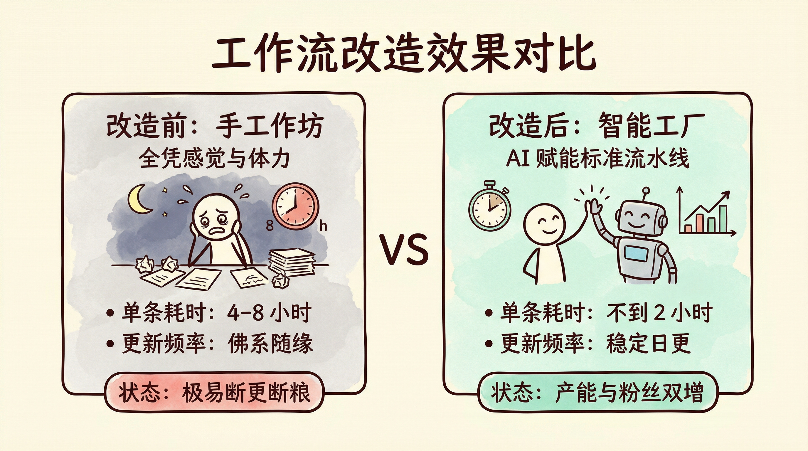

##### 7.4.3 形成可交付给团队执行的内容流水线

小陈的粉丝涨到 10 万之后，开始有 AI 产品的品牌来找他合作。他忙不过来，决定招一名助理。

这时，流程化的价值体现得淋漓尽致。

如果没有流程，他需要花至少两周手把手教助理：「选题你要去看哪些网站……脚本你要用什么结构……什么样的 AI 新闻值得讲，什么样的不值得……」而且教完之后，助理做出来的东西大概率和他想的不一样，因为很多判断标准只存在于小陈的脑子里。

有了流程之后，小陈做了一件事：把「资产三件套」打包发给助理。

还记得第4章讲的「资产化三件套」吗？

1. **一张标准流程图**：十步流程图，标注了每一步的执行者和 I/O 格式
2. **一组经过验证的智能体**：选题、脚本、封面三个智能体都在扣子编程上搭好了，助理登录账号就能用——而且需求描述已经过四周迭代打磨，常见坑都通过「打补丁」堵住了
3. **一条可触发的工作流**：在扣子编程里用开发提示词搭好的「选题+脚本」一体化工作流，输入话题就出结果

助理拿到这套东西，第一天就能按流程产出内容。 质量能达到小陈本人水平的 80%。剩下的 20%——角度的独特性、吐槽的个人风格——小陈只需要在最后审阅环节花 10 分钟调整。

这就是第3章讲的「可交接性」检验标准：如果你休假了，能不能直接把这套东西丢给别人，让他不问你一句就跑出 80% 质量的结果？小陈做到了。

更深一层地说，这也印证了一个很多内容创作者不愿意承认的事实：

95% 的资讯类视频都遵循同样的结构——钩子、背景、解读、引导。真正让你和别人不同的，是那 5% 的独特角度和表达方式。流程化不是把你变成流水线工人——恰恰相反，它帮你把 95% 的体力活甩掉，让你 100% 的脑力都花在那最珍贵的 5% 上。

这才是「创作自由」的真正含义。

#### 本章结语

这一章，我们用「AI 科技资讯口播」这个场景，完整演示了前六章方法论的落地全过程：

- 用第3章的流程图三部曲，把「做视频」拆成了十个步骤，标注了每一步的输入和输出
- 用第4章的任务分配矩阵，确定了哪些步骤交给人、哪些交给 Agent、哪些交给自动化脚本
- 用第5章的 JD 万能模板，为选题、脚本、封面三个核心 Agent 写了岗位说明书

更重要的是，我们不只是纸上谈兵——你已经看到了如何在扣子编程上，用自然语言描述需求，把这些智能体和工作流真正搭建出来。从新建项目、描述选题/脚本智能体能力，到用开发提示词生成「选题+脚本」一体化工作流，再到试运行和用对话打补丁，每一步都对应可执行的实操指引。

短视频只是一个缩影。你会发现，任何内容生产类的工作——写文章、做播客、做直播、写报告——都可以用完全相同的思路去拆解：先列出所有步骤，然后标注 输入/输出，然后分配执行者，然后在扣子上搭出来，跑通、迭代、打补丁。

如果你不做短视频，没关系。下一章我们进入另一个高频场景——电商运营。你会看到同样的方法论和同样的扣子编程，在一个完全不同的行业里，依然能产出惊人的效率提升。

---

### 第8章 电商从业者：商品图到上新的完整工作流

阿珍做电商三年了，主做女装，一家淘宝店、一家拼多多店，都是自己一个人盯。

按理说，选款、拍照、上架、客服、看评价、做活动，每一样她都熟。可她的每一天依然像救火——早上起来先回一堆「什么时候发货」「有没有尺码」的客服消息，接着改主图：老板说「不够高级」，改一版；又说「不够接地气」，再改一版。中午扒拉两口饭，开始扒拉后台评价，想从里面挖点卖点或差评原因，看了两百条眼睛都花了，也没理出个头绪。下午要上新了，商品资料还没整理完，主图、详情、标题、营销语全是临时凑的。晚上报活动，发现竞品已经上了同款且价格更低，只好再调价、改文案。半夜躺下还在想：明天还有两个款要上，主图从哪来？

阿珍以为自己缺的是人手。其实她缺的是一条流水线。

回忆一下前言里我们讲过的「手工作坊」和「智能工厂」的区别。阿珍的状态，就是典型的手工作坊模式——她一个人身兼选款、美工、文案、运营、客服、复盘六个角色，每个角色都在她脑子里抢占内存，每次上新、每次看评价都是「这次再临时想办法」。

这一章，我们要帮阿珍（以及你）完成一次关键转变：把「做商品图、挖评价、上新、复盘」从一堆零散动作，拆解成一条清晰的、可复用的、可以让 Agent 深度参与的电商工作流。

而且，我们不只是纸上谈兵。这一章会手把手带你在扣子编程（官网 https://code.coze.cn ）上搭建真实可用的智能体，让你亲眼看到方法论在电商场景里是如何落地的。

这里先区分两个产品，避免后面搞混：扣子（原名「扣子空间」，官网 https://coze.cn ）是字节旗下类似 Manus 的通用智能体——能生图、做视频、写文案，什么都能干一点，你直接用它完成任务即可。

扣子编程（官网 https://code.coze.cn ）则是用来「搭建智能体」的开发平台——你在上面用自然语言描述需求，生成专属的 Agent，供自己或团队反复使用。本章在扣子编程里建的「主图需求卡 Agent」产出的需求卡，可以直接发给扣子去做生图。

即使你不做电商也没关系。这一章展示的「从资料到素材、从数据到决策」的拆解方法，适用于任何「高频重复、又要一点创意」的岗位——活动运营、用户研究、内容审核，底层逻辑完全一样。

#### 8.1 用扣子生成商品图与模特换装方案

电商的第一眼竞争力，多半在主图和详情图。图不对，点击率、转化率都上不去。但很多小团队没有专职美工，主图要么外包反复改，要么自己用手机随便拍，风格不统一、卖点不清晰。

阿珍的转折，是从「把主图需求说清楚」开始的。她发现，只要先把「要什么风格的图、突出什么卖点、用在什么场景」写成一页需求，再交给扣子（或外包美工）去生图，返工率会大幅下降。而这一页需求，恰恰可以用扣子编程里的智能体来批量生成；生成出来的主图需求卡，可以直接复制给扣子，让扣子按需求出图。

##### 8.1.1 用 RPA 或手工收集商品信息与核心卖点

生成主图之前，必须先有「原料」：商品的基础信息（品名、材质、尺码、颜色）和核心卖点（为什么值得买、和竞品的区别）。

阿珍的做法很直接：

1. 从后台或 ERP 拉出商品资料：品名、类目、属性、成本价、建议零售价。若没有系统，就用 Excel 维护一张「待上新商品表」。
2. 补全「卖点」一栏：每个款用 3～5 句话写清楚——材质/工艺/设计亮点/穿着场景/目标人群。这一步一开始是她自己写，后来交给智能体根据商品资料生成初稿，她只做删改。
3. 输出一份「主图需求卡」：包含商品名、3 个核心卖点、期望风格（如「简约白底」「场景穿搭」「节日氛围」）、尺寸与张数（如主图 1 张 800×800，详情 5 张 750 宽）。

有了需求卡，后面无论是用扣子生成模特换装图、白底图或场景图，还是发给美工，都有据可依。

##### 8.1.2 选择模特与场景风格并生成多版图片

扣子支持「模特换装」「场景图」等生图能力：你可以把主图需求卡里的风格描述、卖点直接发给扣子，或上传服装图/参考图，让扣子按需求生成多版主图/详情图。阿珍的流程是：

1. 根据需求卡定风格：例如「秋冬针织衫」选暖色场景、偏生活化；「通勤衬衫」选简约白底或办公室场景。
2. 把需求卡发给扣子：打开扣子（coze.cn），把主图需求卡的内容粘贴进去，或按扣子界面选择模特与场景风格，生成 3～5 版不同构图/角度。
3. 初筛：先删掉明显不符合的（如比例怪、颜色偏），留下 2～3 版备用。

这一步的重点不是「学会扣子的每个按钮」，而是需求卡稳定、风格统一，这样生成结果才可控。

##### 8.1.3 选定最优组合并输出主图 + 详情图方案

最后一步是「拍板」：从 2～3 版里定主图 1 张、详情图 5～6 张，并按平台要求裁剪、命名、上传。

阿珍会做一张简单的「主图+详情图方案表」：主图用哪张、详情第 1 屏放什么、第 2 屏放什么（卖点/尺码/细节/评价摘要），这样下次同类目商品可以直接套用结构，只换图与文案。

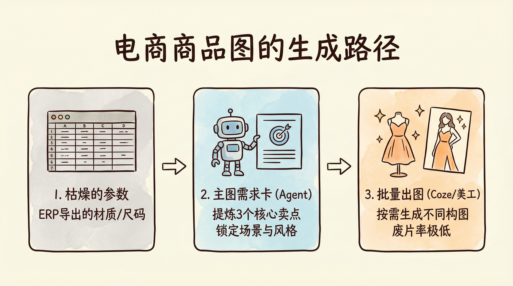

小结：8.1 的本质是「先有需求，再出图」。需求卡越清晰，扣子或美工产出越稳定。而需求卡里的「卖点提炼」「风格描述」，可以用扣子编程里的智能体批量生成；生成出来的主图需求卡，可以直接发给扣子（coze.cn）进行生图，你再微调即可。

###### 【实操：在扣子编程上创建主图需求卡 Agent】

在扣子编程（https://code.coze.cn ）里选择「新建项目」→「智能体」，项目名称可填：电商主图需求卡生成器。在描述需求时，用自然语言说明以下要点即可：

| 配置项 | 内容 |
| :--- | :--- |
| 输入 | 用户提供：商品名、类目、基础属性（如材质、颜色、尺码范围）、成本或零售价（可选） |
| 输出内容 | 一份「主图需求卡」：① 3～5 条核心卖点（可直接用于主图文案或详情）；② 期望主图风格（如白底/场景/节日氛围）；③ 详情图结构建议（第 1 屏放什么、第 2 屏放什么）；④ 建议尺寸与张数（如主图 1 张 800×800，详情 5 张） |
| 红线 | 不编造商品没有的属性；卖点要具体可执行，便于后续发给扣子生图或交美工 |

描述示例：

> 请搭建一个「电商主图需求卡生成器」智能体。用户会提供商品名、类目、基础属性（材质、颜色、尺码等），可选提供成本或零售价。请输出一份主图需求卡，包含：第一，3～5 条核心卖点，方便后续做主图文案或详情首屏；第二，主图风格建议（如简约白底、场景穿搭、节日氛围等）；第三，详情图结构建议（第 1 屏、第 2 屏各放什么内容）；第四，建议的图片尺寸与张数（如主图 1 张 800×800，详情 5 张 750 宽）。不要编造商品没有的属性，卖点要具体可执行。

智能体创建成功后，试运行：输入一个真实商品名和属性，看需求卡是否可直接交给扣子生图或美工使用。若风格选项太泛，在对话里补充「本店主要做女装，风格偏简约/通勤」等约束即可。拿到需求卡后，打开扣子（coze.cn），把需求卡内容发过去，即可让扣子按需求生成主图与详情图。


#### 8.2 用 Agent 挖掘用户评价与痛点

评价区是免费的「用户调研」：买家的夸与骂里，藏着卖点、差评原因和改进方向。但评价往往几百上千条，人工一条条看，既慢又容易遗漏重点。

阿珍需要的是一个「评价分析员」：把近期评价拉出来，按情绪和问题类型分好类，再输出一页「可执行的改进建议」，她只需要做选择和拍板。

##### 8.2.1 拉取近期用户评价并整理原始数据

第一步是拿到「原始数据」。通常有两种方式：

1. 后台导出：淘宝、拼多多等后台支持导出近 7 天/30 天评价，得到 Excel 或 CSV，字段一般包含：商品、评价内容、评分、时间等。
2. RPA 或接口：若平台不提供导出，可用 RPA 工具定期抓取评价页，或通过开放接口（如有）拉取，整理成结构化表格。

阿珍每周一固定导出上一周的评价，存成「评价原始表」，表头包含：商品 ID、商品名、评价内容、评分、时间。这样后续分析都有统一数据源。

##### 8.2.2 用 Agent 完成情绪分类与问题聚类

有了原始表，接下来是「分类 + 聚类」：哪些是好评、中评、差评？差评里又在抱怨什么——质量、尺码、发货慢、描述不符？

阿珍在扣子编程上配置了一个「评价分析智能体」，把整张评价表（或粘贴最近 200 条评价）喂给它，由智能体完成：

- 情绪分类：每条打标签为「正面/中性/负面」；
- 问题聚类：对负面评价做主题归纳，例如「尺码偏小」「线头多」「色差」等，并统计每类出现的次数。

这样她拿到的不是一堆零散差评，而是一张「问题类型 + 出现次数」的清单，一眼能看出当前最该先改什么。

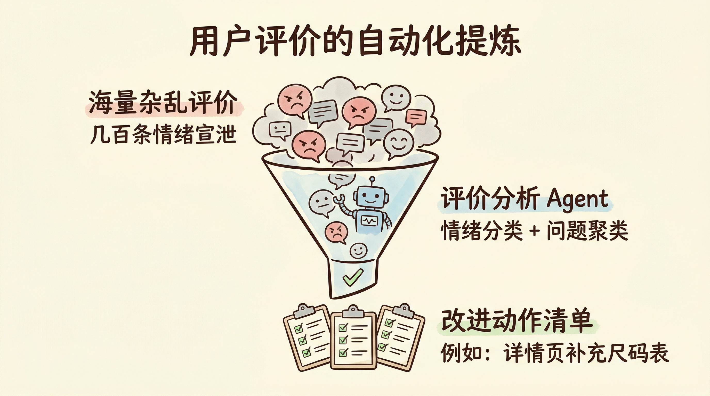

📝 评价分析 Agent 岗位说明书（要点）

| 配置项 | 内容 |
| :--- | :--- |
| 输入 | 用户提供：近期评价原始数据（表格或粘贴文本），可含商品名、评价内容、评分、时间 |
| 输出内容 | ① 情绪分布（正/中/负占比）；② 负面评价问题聚类（类型 + 次数 + 代表原文 1～2 条）；③ 正面评价中的高频夸点（可作卖点参考） |
| 格式 | 结构化列表或表格，便于直接复制到运营文档 |
| 红线 | 不编造评价内容；聚类标签必须能从原文中找到对应表述 |

###### 【实操：在扣子编程上创建评价分析 Agent】

在扣子编程（https://code.coze.cn ）里选择「新建项目」→「智能体」，项目名称可填：电商评价分析助手。在描述需求时，用自然语言说明以下要点即可：

| 配置项 | 内容 |
| :--- | :--- |
| 输入 | 用户提供：近期用户评价原始数据（可粘贴多条，含评价内容、评分、时间等） |
| 输出内容 | ① 情绪分布（正面/中性/负面占比）；② 负面评价的问题聚类（问题类型、出现次数、代表原文 1～2 条）；③ 正面评价中的高频夸点（可作卖点） |
| 格式 | 用清晰的列表或表格输出，便于复制到运营文档 |
| 红线 | 不编造任何评价内容；每个聚类标签必须能从用户提供的原文中找到对应表述 |

描述示例：

> 请搭建一个「电商评价分析助手」智能体。用户会粘贴一批商品评价（可能包含评价内容、评分、时间），请你完成三件事：第一，统计这批评价的情绪分布（正面/中性/负面各占多少）；第二，把所有负面评价做问题聚类，给出「问题类型 + 出现次数 + 1～2 条代表原文」，方便运营一眼看出差评主要在骂什么；第三，从正面评价里提炼出现频率高的夸点，方便做卖点文案。输出请用列表或表格，不要编造评价内容，每个结论都要有原文依据。

智能体创建成功后，试运行几次：粘贴一段真实评价数据，看情绪划分和聚类是否合理。若标签太细或太粗，在对话里补充约束即可（例如「问题类型不要超过 8 个」或「把『发货慢』和『包装差』合并为『物流体验』」）。


##### 8.2.3 根据聚类结果输出可执行的改进建议

评价分析 Agent 的输出，是「问题清单」。要变成「可执行动作」，还需要多一步：针对每一类问题，给出 1～2 条具体改进建议（如「尺码偏小」→ 详情页增加尺码建议表、客服话术里主动提示选大一号）。

阿珍的做法是：在扣子编程里对同一智能体追加一句需求——「在问题聚类后面，为每一类问题给 1～2 条可执行的改进建议，且建议要具体到『谁、在什么环节、做什么』」。这样一份评价分析报告里就同时有「问题」和「改法」，她只需要勾选要落地的项、分配给执行人即可。

【心法】
评价不是用来「看看就完了」的。用 Agent 把零散声音变成「问题类型 + 改进建议」，你才真正把评价区变成了免费的产品与运营改进入口。

#### 8.3 用固定流程完成一款商品的上新动作

上新是电商的高频动作，也是最容易乱的一环：资料不全、主图临时找、标题和营销语现想，结果就是拖延、风格不统一、活动总赶不上趟。

阿珍后来把「一款商品从资料到上架」固定成一条流水线：每一步有输入、有输出、有执行人（自己或 Agent），上新就变成了「按表填空」，不再临时抱佛脚。

##### 8.3.1 从商品资料到图文素材再到上架设置

她把上新拆成一段「标准路径」：

| 步骤 | 📥 输入 | 执行 | 📤 输出 |
| :--- | :--- | :--- | :--- |
| ① 资料整理 | 选款表/ERP 数据 | 人 或 智能体 | 商品资料表（品名、属性、成本、卖点） |
| ② 主图/详情需求 | 商品资料表 | 智能体 | 主图需求卡 + 详情结构要点 |
| ③ 主图/详情图 | 需求卡 + 风格参考 | 扣子 / 美工 | 主图 1 张 + 详情图 5～6 张 |
| ④ 标题与营销语 | 商品资料 + 卖点 + 活动节点 | 智能体 | 标题备选 3～5 个 + 营销短文案 3～5 条 |
| ⑤ 上架设置 | 主图、详情、标题、文案、价格、库存 | 人 | 后台已上架商品 |

这样，每个环节的「输入」都来自上一步的「输出」，接口对齐，就不会出现「图做好了却不知道配什么文案」的断档。

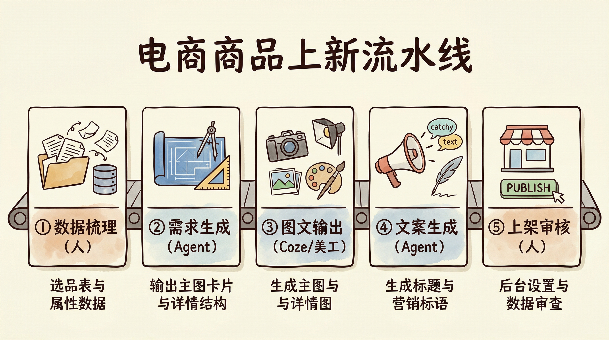

##### 8.3.2 生成营销语与活动方案的多版本备选

标题和营销语（如主图上的促销文案、活动页的卖点句）是影响点击和转化的关键，但很多人要么写得很平，要么每次上新都现想，耗时且不稳定。

阿珍在扣子编程上配置了一个「电商营销文案」智能体：输入商品名、核心卖点、活动节点（如「双 11」「换季清仓」），输出多组标题备选和多条营销短句，她从中挑一条或组合成一条使用。

###### 【实操：在扣子编程上创建营销文案 Agent】

在扣子编程里同样选择「新建项目」→「智能体」，项目名称可填：电商营销文案生成器。在描述需求时，用自然语言说明以下要点即可：

| 配置项 | 内容 |
| :--- | :--- |
| 输入 | 用户提供：商品名、核心卖点（3～5 条）、目标人群或场景、活动节点（若有，如双 11、上新） |
| 输出内容 | ① 商品标题备选 3～5 个（符合平台字数与规范）；② 营销短句 3～5 条（可用于主图文案、详情首屏、活动页） |
| 风格 | 贴合类目与平台调性，避免违禁词和夸张承诺 |
| 红线 | 不编造未提供的卖点；不出现「第一」「最」等极限词 |

描述示例：

> 请搭建一个「电商营销文案生成器」智能体。用户会提供：商品名、3～5 条核心卖点、目标人群或穿着/使用场景、以及可选的活动节点（如双 11、换季清仓）。请输出：第一，3～5 个商品标题备选（符合常见电商平台字数，突出卖点与搜索词）；第二，3～5 条营销短句（可用于主图文案、详情首屏、活动页），每条控制在 15 字以内更佳。风格要贴合女装/日用品等类目，不用「第一」「最」等极限词，不编造用户没给的卖点。

智能体创建成功后，试运行：输入一个真实商品名和卖点，看标题是否可用、营销句是否顺口。若偏长或偏书面，在对话里补充「标题控制在 XX 字内」「营销句要口语化」即可。


##### 8.3.3 上线后一周进行固定化的数据复盘流程

上新不是「上架就结束」。阿珍会在一款商品上架满一周后，做一次固定复盘：看销量、点击率、转化率、评价里新出现的夸与骂，并更新「主图/详情/标题/营销语」的迭代清单。需要的话，她会把这一周的新评价再丢给「评价分析 Agent」，和上一周对比，看问题有没有改善。

复盘结果她会记在一张简单的「上新复盘表」里：商品、上架日、一周数据摘要、待优化点、下次同类款改进动作。这样下次上新同类型商品时，可以直接套用「上次踩的坑别再来」。

> 💡 回扣方法论：8.3 这条上新流水线，本质就是第 4 章「五步法」的落地——
>
> 1. 明确目标（一款商品从资料到可售）
> 2. 拆解步骤（资料 → 需求卡 → 图 → 文案 → 上架 → 复盘）
> 3. 定义 输入/输出（每一步的接口对齐）
> 4. 分配执行者（人做拍板与上架，Agent 做需求卡、评价分析、营销文案）
> 5. 沉淀为可复用资产（需求卡模板、主图详情结构、复盘表）
>
> 在扣子编程里，需求描述、评价分析、营销文案都可以用自然语言说清楚，由 AI 生成智能体来执行。

【心法】
上新不是「这次再想想办法」，而是「每次都走同一条路」。路固定了，你才能把精力用在选款、定价和活动策略这些真正需要判断的事上。

#### 8.4 案例：一个人同时运营三家店的工作流设计

方法讲完了，最后用阿珍的完整故事，把这一章串起来。你会看到一个普通的电商运营，是如何从「一家店都忙不过来」到「一人稳定运营三家店」的。

阿珍最初只做一家淘宝店，主做女装。每天从早忙到晚：回客服、改主图、看评价、上新、报活动。主图经常返工三四轮，评价看了半天也总结不出几条可执行的改进，上新总是拖到最后一刻才凑齐图文。她觉得自己缺人手，但招人成本高，又怕招来的人不熟悉她的款和客群。当时的状态大致是：店铺 1 家、每周上新 2～3 款且不稳定、主图/详情依赖外包或临时做且返工多、评价复盘偶尔做且很少形成改进清单、日均 10～12 小时仍觉得事做不完。

##### 8.4.1 将店铺运营拆成若干个相同的流程模块

阿珍后来想通了一件事：不管是这家店还是下一家店，要做的事其实是一样的——都是「商品资料 → 主图详情 → 标题文案 → 上架 → 评价复盘」。区别只是商品不同、平台规则略有不同。所以她先不急着开新店，而是把「单店单款」的流程固化下来：

1. 资料与需求：每款商品先填齐资料表和卖点，再让智能体生成主图需求卡和详情要点。
2. 图文产出：按需求卡用扣子或美工出图，自己只做「选版」和「微调」——主图需求卡可直接发给扣子（coze.cn）生图。
3. 文案与上架：用营销文案智能体出标题和营销句，自己选一条或改一句，然后上架。
4. 评价与复盘：每周固定把评价导出，丢给评价分析智能体，得到问题聚类和改进建议，再更新复盘表。

她在扣子编程上搭好了三个智能体：主图/详情需求生成（根据商品资料输出需求卡）、评价分析、营销文案。三个都经过几轮「打补丁」（例如「需求卡里必须包含 3 个卖点」「评价聚类不超过 8 类」），输出稳定后，她才考虑接第二家店。

##### 8.4.2 将共性流程交给 Agent，个性化部分自己处理

第二家、第三家店接进来之后，阿珍的节奏是：共性动作全部走流程、用智能体；个性化动作自己来。

- 共性：商品资料表结构、主图需求卡格式、评价分析报告结构、营销文案的输入输出，三家店共用同一套智能体和模板。只是每家店填进去的商品名、卖点、评价数据不同。
- 个性化：选款、定价、最终选哪张主图、哪条标题、活动报不报，这些仍然由她拍板。智能体只负责「多给几版备选」，不替她做最终决策。

这样，她不需要为每家店「重新想一遍流程」，只需要为每家店「执行同一套流程、换不同的数据」。

改造前后对比：

| 指标 | 改造前 | 改造后 |
| :--- | :--- | :--- |
| 店铺数 | 1 家 | 3 家（稳定运营） |
| 每周上新数 | 2～3 款（不稳定） | 每店 2～3 款，共 6～9 款 |
| 主图/详情 | 反复返工、临时凑 | 需求卡 + 扣子/美工，一次通过率高 |
| 评价复盘 | 偶尔看、难总结 | 每周固定跑评价分析 Agent，有改进清单 |
| 日均耗时 | 10～12 小时 | 6～8 小时（流程固定后，重复劳动交给智能体） |

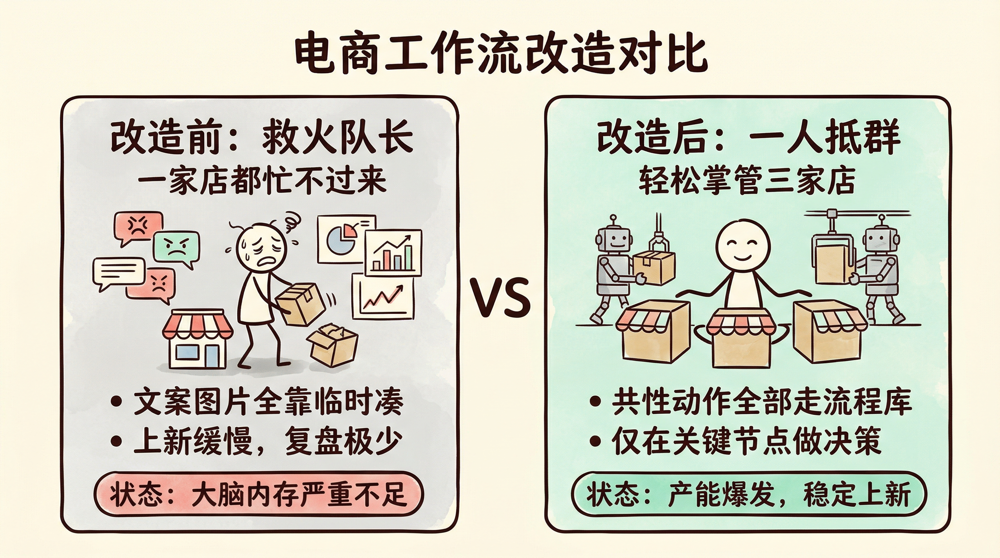

##### 8.4.3 使用工作流后，实现一人运营多店的稳定产能

阿珍没有招人，只是把「一家店的流程」变成了「可复制到多店的流水线」。三家店共用同一套智能体与表格模板，她每天的工作从「什么都自己盯」变成了「盯关键节点」：看需求卡是否过关、选主图与文案、看评价分析报告并勾选要改进的项。稳定性上来了，产能也上来了，她才敢接更多款、更多店。

这就是第 3 章讲的「可交接性」在电商里的体现：若她休假，可以把「评价导出 → 丢给评价分析 Agent → 按报告勾选改进项」这一整段交给兼职或助理执行，对方不需要懂选款，只要会导出评价、会复制粘贴、会按表勾选即可。

资产三件套在电商场景下就是：① 一张「上新流水线」流程图（从资料到上架到复盘）；② 在扣子编程上搭好的三个智能体（需求卡、评价分析、营销文案）；③ 一套固定表格（商品资料表、主图需求卡、复盘表）。有了这三件，开新店或带新人，都是「照着流程跑、换数据不换结构」。

#### 本章结语

这一章，我们用电商场景完整演示了前几章方法论的落地：

- 用第 3 章的流程图思路，把「主图从哪来、评价怎么用、上新怎么走」拆成了可复用的步骤与 输入/输出。
- 用第 4 章的任务分配，把「需求卡、评价分析、营销文案」交给 Agent，把「选款、选图、拍板」留给人。
- 用第 5 章的岗位说明书思路，为评价分析、营销文案等智能体写了清晰的需求描述，并在扣子编程上用自然语言搭建出来。

更重要的是，我们不只是纸上谈兵——你已经看到了如何在扣子编程上，用自然语言描述需求，把「主图需求卡」「评价分析」「营销文案」等智能体真正搭起来；主图需求卡可以直接发给扣子（coze.cn）生图，和你的表格流程组合成一条完整流水线。

电商只是一个缩影。任何「高频、有数据、又要一点创意」的工作——活动运营、用户反馈分析、内容审核——都可以用同样的思路：先拆步骤、定 输入/输出、把能交给 Agent 的环节交给 Agent，人只做决策与拍板。

如果你不做电商，没关系。下一章我们进入教育场景——备课、出题、批改、反馈。你会看到同样的方法论和扣子编程，在老师与培训师的工作流里，依然能产出实实在在的提效与可控。


---

### 第9章 教育工作者：备课、出题、批改、反馈的连贯工作流

林老师教初中数学五年了，带两个班，还兼年级的竞赛辅导。

按理说，备课、出题、批改、反馈，每一样她都熟。可她的每一天依然像打仗——白天上课、盯自习、开会，晚上才能坐下来备课。备到一半发现上一单元有个知识点没讲透，又回去翻教案。周末出周练卷，从选题到排版要花大半天，题目难度和题量全靠自己「感觉」。批改作业时，看到同样的错误反复出现，想给每个孩子写两句针对性反馈，写了两页就写不动了，后面的只好写「加油」「注意审题」敷衍过去。期中期末更夸张：两个班一百多份卷子，批改、登分、写评语，几乎占满整个周末。

林老师以为自己缺的是时间。其实她缺的是一条流水线。

回忆一下前言里我们讲过的「手工作坊」和「智能工厂」的区别。林老师的状态，就是典型的手工作坊模式——她一个人身兼课程设计、出题人、批改员、反馈撰写四个角色，每个角色都在她脑子里抢占内存，每次备课、每次出题、每次批改都是「这次再想想办法」。

这一章，我们要帮林老师（以及你）完成一次关键转变：把「备课、出题、批改、反馈」从一堆靠感觉的零散动作，拆解成一条清晰的、可复用的、可以让 Agent 深度参与的教学工作流。重点在于区分「必须由老师判断的环节」和「可以交给 Agent 出初稿的部分」——这样既提效，又不牺牲教学质量。

而且，我们不只是纸上谈兵。这一章会手把手带你在扣子编程（官网 https://code.coze.cn ）上搭建真实可用的智能体，让你亲眼看到方法论在教育场景里是如何落地的。

即使你不做老师也没关系。这一章展示的「先定目标、再拆步骤、人做判断、Agent 出初稿」的思路，适用于任何「内容+质量把关」类工作——写方案、做评审、写报告，底层逻辑完全一样。

#### 9.1 从教学目标到课程内容的工作流

备课的第一步不是「找课件」或「写教案」，而是想清楚：这一单元要让学生学会什么？能力目标不清晰，后面的内容编排和例题选择都会飘。

林老师的转折，是从「把每单元的能力目标写成一页纸」开始的。目标明确之后，教学结构、知识点顺序、案例安排就有了依据；而「教学结构草案」和「案例建议」恰恰可以用扣子编程里的智能体来生成初稿，她只做筛选和调整。

##### 9.1.1 明确本单元要培养的能力目标

在动笔写教案之前，先回答三个问题：本单元学完后，学生应该能做什么？和上一单元、下一单元如何衔接？重点和难点分别是什么？

林老师的做法很直接：

1. 写出一句话的单元目标：例如「能利用一元一次方程解决实际生活中的行程、工程类问题」，而不是笼统的「掌握一元一次方程」。
2. 列出 3～5 个可检核的能力点：例如「能列方程」「能检验解的合理性」「能区分行程中的相遇与追及」。这些能力点会直接对应后面的练习题和测验题。
3. 标出重点与难点：重点=必须掌握、会反复考；难点=学生容易卡住、需要设计台阶。这样在选例题和出题时就有侧重。

有了这一页「能力目标卡」，后面无论是自己写教案还是让 Agent 生成教学结构草案，都有统一的锚点。

##### 9.1.2 用 Agent 生成多版教学结构草案

教学结构指的是：这一单元分几课时？每课时的主题是什么？知识点按什么顺序出现？每个知识点配什么类型的例题（概念辨析、计算、应用）？

林老师以前全靠经验和教材目录，有时会漏掉衔接或重复。后来她在扣子编程上配置了一个「教学结构助手」：输入单元名称、能力目标、教材版本与章节，智能体根据这些信息生成 2～3 版教学结构草案（如「三课时版」「四课时版」），每版都包含课时划分、每课主题、建议的知识点顺序和例题类型。她从中选一版或合并两版的优点，再微调，大大减少了「从零想结构」的时间。

###### 【实操：在扣子编程上创建教学结构 Agent】

在扣子编程（https://code.coze.cn ）里选择「新建项目」→「智能体」，项目名称可填：教学结构助手。在描述需求时，用自然语言说明以下要点即可：

| 配置项 | 内容 |
| :--- | :--- |
| 输入 | 用户提供：单元/章节名称、本单元要培养的能力目标（一句话或几条）、教材版本与年级（可选） |
| 输出内容 | 2～3 版教学结构草案，每版包含：① 建议课时数及每课主题；② 知识点出现顺序及与能力的对应；③ 每课时建议的例题类型（概念/计算/应用等） |
| 格式 | 用清晰的列表或表格，便于老师勾选、合并、删改 |
| 红线 | 不编造教材中不存在的知识点；结构要符合「先概念后应用」等教学逻辑 |

描述示例：

> 请搭建一个「教学结构助手」智能体。用户会提供某一单元或章节的名称、本单元要培养的能力目标（一句话或几条），以及可选的教材版本与年级。请根据这些信息，输出 2～3 版教学结构草案。每版需包含：第一，建议的课时数与每课时的主题；第二，知识点的出现顺序，并标明与能力目标的对应关系；第三，每课时建议的例题类型（如概念辨析、计算练习、应用题等）。输出请用列表或表格，便于老师选用或合并。不要编造教材中没有的知识点，结构要符合常见的教学逻辑（如先概念后应用）。

智能体创建成功后，试运行：输入一个真实单元名和能力目标，看生成的课时划分和知识点顺序是否合理。若课时偏多或偏少，在对话里补充「我们学校每单元通常 3～4 课时」等约束即可。


##### 9.1.3 确认知识点顺序与案例安排

Agent 给出的是草案，最终拍板的是老师。林老师会拿着选定的那一版结构，对照教材和教参，确认三点：知识点顺序是否和教材一致、有没有漏掉必讲内容、例题类型是否覆盖重点和难点。需要的话，她会手动增删或调序，再把「每课时需要的例题数量与难度」记下来，作为 9.2 出题时的输入。

这样，备课的「骨架」就固定下来了：能力目标 → 教学结构 → 知识点与案例安排。后面出题、写教案、做课件，都沿着这条骨架走，不会跑偏。

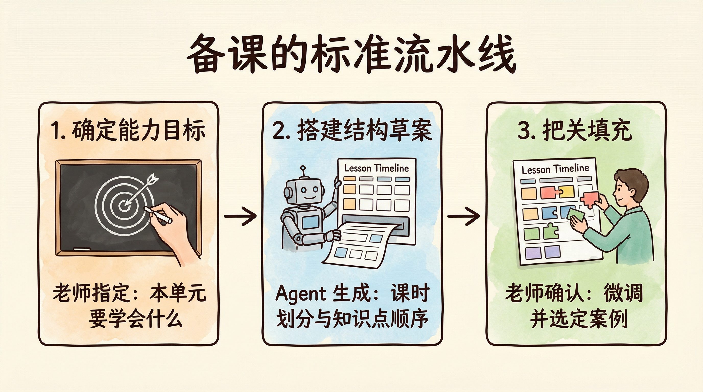

【心法】
备课不是「找一堆材料再拼」。先定能力目标，再要结构草案，最后才填内容。Agent 擅长在既定目标下给出多版结构供你选，你擅长判断哪一版更贴合自己的学生和课时。

#### 9.2 从出题到讲解的成套题制作流程

有了教学结构和每课时的例题需求，下一步就是「出题」：题目本身、难度与题型搭配、标准答案与讲解提纲。这三件事都可以拆开——题目草案和答案讲解可以由 Agent 生成，老师负责筛选、改表述、定最终版。

##### 9.2.1 让 Agent 按难度与题型生成题目草案

林老师的需求很明确：某一课时需要「2 道概念辨析 + 3 道计算 + 2 道应用题」，难度以中等为主、配 1 道稍难。她不再自己翻练习册一道一道挑，而是把「课时主题 + 知识点 + 难度与题型要求」发给在扣子编程上搭好的「出题助手」智能体，由智能体生成一整套题目草案。她再从中筛掉不合适的、改一改表述不清或超纲的，大大缩短了组卷时间。

###### 【实操：在扣子编程上创建出题 Agent】

在扣子编程里同样选择「新建项目」→「智能体」，项目名称可填：出题助手。在描述需求时，用自然语言说明以下要点即可：

| 配置项 | 内容 |
| :--- | :--- |
| 输入 | 用户提供：课时/单元主题、涉及的知识点、需要的题型与数量（如选择题 2 道、填空 3 道、解答 2 道）、难度要求（如以中等为主、含 1 道较难） |
| 输出内容 | 按题型分组的题目草案，每题包含题干、选项（若有）、参考答案（可简写），并标注建议难度 |
| 格式 | 题目编号清晰，便于老师复制到试卷或练习卷中修改 |
| 红线 | 不超出用户给出的知识点范围；题干表述要严谨、无歧义；避免与常见教辅雷同到逐字一致 |

描述示例：

> 请搭建一个「出题助手」智能体。用户会提供：某一课时或单元的主题、涉及的知识点列表、需要的题型及数量（例如选择题 2 道、填空题 3 道、解答题 2 道）、以及难度要求（如以中等为主、含 1 道较难）。请按题型输出题目草案，每题需包含题干、选项（若有）、以及简要参考答案，并标注建议难度（易/中/难）。输出格式要清晰，便于老师复制到试卷中再修改。不要超出用户给出的知识点范围，题干表述要严谨无歧义，避免与常见教辅逐字雷同。

智能体创建成功后，试运行：输入一个真实课时主题和题型要求，看题目是否贴合知识点、难度是否合理。若发现偏难或偏易，在对话里补充「我们班是普通班，难度以中等偏下为主」即可。


##### 9.2.2 由老师筛选题目并修改关键表述

Agent 出的题是草案，不能直接拿来就用。林老师会逐题过一遍：题干有没有歧义、数字是否合理、是否超纲、是否和教材例题过于相似。不合适的删掉或替换，表述不清的改一句话，难度不对的调一调数据。这一步是「人的把关」，不能省，但因为有草案，她只需要做「选择和修改」，而不是「从零想题」。

##### 9.2.3 用 Agent 输出标准答案与讲解提纲

题目定稿之后，还需要标准答案和讲解提纲——改卷时要对照，讲评课时要按提纲讲。林老师在扣子编程上配置了「答案与讲解助手」：把定稿题目（或题目编号 + 题干）发过去，智能体输出每题的参考答案、关键步骤、易错点提醒和 1～2 句讲解要点。她再核对答案是否正确、讲解要点是否贴合自己班上的常见错误，略作修改即可用于改卷和讲评。

###### 【实操：在扣子编程上创建答案与讲解 Agent】

在扣子编程里同样选择「新建项目」→「智能体」，项目名称可填：答案与讲解助手。在描述需求时，用自然语言说明以下要点即可：

| 配置项 | 内容 |
| :--- | :--- |
| 输入 | 用户提供：题目全文（或题干 + 题型），可多题一起提供 |
| 输出内容 | 每题：① 参考答案或标准解法；② 关键步骤（便于给分）；③ 易错点或常见错误提醒；④ 1～2 句讲解提纲（讲评时用） |
| 格式 | 按题号分块，便于对照题目使用 |
| 红线 | 答案必须与题目匹配，不擅自改题；讲解要点要具体，不说空话 |

描述示例：

> 请搭建一个「答案与讲解助手」智能体。用户会提供一道或若干道题目（含题干和题型）。请为每题输出：第一，参考答案或标准解法；第二，关键步骤（便于批改时给分）；第三，易错点或学生常见错误提醒；第四，1～2 句讲解提纲，供讲评课时使用。输出请按题号分块，便于老师对照题目。答案必须与题目严格匹配，不擅自改动题目条件；讲解要点要具体，避免「注意审题」这类空话。

智能体创建成功后，试运行：贴入一道真实题目，看答案是否正确、步骤是否清晰、讲解要点是否可用。若学科有特殊符号或格式，在对话里补充「数学公式用 LaTeX」等约束即可。


【心法】
出题和答案讲解都可以让 Agent 出初稿，但「题目是否合适」「答案对不对」「讲评重点是否贴合学情」必须由老师把关。用 Agent 省下的是「从零构思」的时间，省不下的是「判断与负责」。

#### 9.3 批改与反馈的结构化流程

批改不只是打勾打叉，还要让学生知道「错在哪、为什么错、下次怎么改」。一对一的个性化反馈最能帮助学生，但老师时间有限，很难给每一份作业都写长评语。解决办法是：先把批改结果结构化，再让 Agent 根据结构生成反馈草稿，老师做最后修改和确认。

##### 9.3.1 将批改记录结构化为：对错 → 错因 → 类型

林老师会把每次作业或试卷的批改结果整理成一张简表（或固定格式的笔记）：每道题的对错、错因简述（如「列式错误」「计算失误」「概念混淆」）、以及错因类型（如「审题」「运算」「概念」）。这样既方便统计「这一班在哪个类型上错得多」，也方便下一步让 Agent 按「错因类型 + 具体错因」生成针对性的反馈句。

表格不必复杂，例如：

| 题号 | 对/错 | 错因简述 | 错因类型 |
| :--- | :--- | :--- | :--- |
| 1 | 错 | 移项时未变号 | 运算 |
| 2 | 对 | — | — |
| 3 | 错 | 未理解「相向而行」 | 概念/审题 |

有了这张表，Agent 就有了「输入」：知道学生哪里错了、属于什么类型，才能写出「有的放矢」的反馈草稿。

##### 9.3.2 让 Agent 根据分类生成个性化反馈草稿

林老师在扣子编程上配置了一个「批改反馈助手」：输入学生姓名（或匿名 ID）、本次作业/试卷的批改结构（对错、错因、类型），智能体为这名学生生成一段个性化反馈草稿——既概括本次的主要问题，又按错因类型给 1～2 条具体建议（如「注意移项时变号」「下次先圈出关键词再列式」）。她再根据自己对这名学生的了解，改一两句话或补一句鼓励，然后发给学生或家长。

###### 【实操：在扣子编程上创建批改反馈 Agent】

在扣子编程里同样选择「新建项目」→「智能体」，项目名称可填：批改反馈助手。在描述需求时，用自然语言说明以下要点即可：

| 配置项 | 内容 |
| :--- | :--- |
| 输入 | 用户提供：学生标识（姓名或 ID）、本次批改的结构化信息（每题对错、错因简述、错因类型），可多题 |
| 输出内容 | 一段面向该生的反馈草稿：① 本次整体表现简述；② 按错因类型归纳的主要问题；③ 每条问题对应的 1～2 条具体改进建议；④ 一句简短鼓励（可选） |
| 风格 | 语气温和、具体可执行，避免空洞批评或泛泛表扬 |
| 红线 | 不编造批改记录中没有的错因；建议要和学生实际错误对应 |

描述示例：

> 请搭建一个「批改反馈助手」智能体。用户会提供：学生标识（姓名或匿名 ID）、以及本次作业或试卷的批改结构化信息（每道题的对错、错因简述、错因类型，如审题/运算/概念等）。请根据这些信息，为该生生成一段个性化反馈草稿，包含：第一，本次整体表现的一句话简述；第二，按错因类型归纳的主要问题；第三，针对每个问题给出 1～2 条具体、可执行的改进建议；第四，一句简短的鼓励。语气要温和、建议要具体，不要编造用户未提供的错因，不要写「注意审题」这类空话。

智能体创建成功后，试运行：输入一份真实的批改结构（可匿名），看反馈是否贴合错因、建议是否可执行。若希望反馈更简短或更详细，在对话里补充「反馈控制在 80 字以内」或「每个错因类型都要给建议」即可。


##### 9.3.3 老师进行最后修改并确认反馈内容

Agent 生成的是草稿，最终对学生说的话必须由老师确认。林老师会快速扫一遍：有没有不符合事实的表述、建议是否适合这名学生（例如有的孩子需要更直接的提醒）、语气是否合适。改完再发出去，既保证了个性化，又不会因为逐字写而耗尽时间。

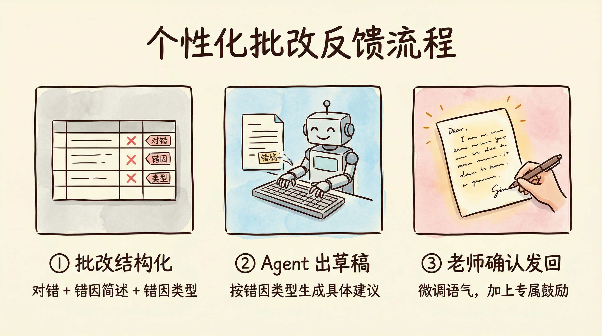

> 💡 回扣方法论：9.1～9.3 这条教学流水线，本质就是第 4 章「五步法」的落地——
>
> 1. 明确目标（本单元学生能做什么、本次作业要反馈什么）
> 2. 拆解步骤（备课：目标→结构→案例；出题：题目→筛选→答案讲解；批改：结构化→反馈草稿→老师确认）
> 3. 定义 输入/输出（每步的接口对齐，例如批改表→反馈草稿）
> 4. 分配执行者（人定目标、选结构、把关题目与反馈；Agent 出结构草案、题目草案、答案讲解、反馈草稿）
> 5. 沉淀为可复用资产（能力目标卡、教学结构模板、出题与反馈的智能体）
>
> 在扣子编程里，教学结构、出题、答案讲解、批改反馈都可以用自然语言说清楚，由 AI 生成智能体来执行初稿，老师把时间花在「判断」和「负责」上。

【心法】
批改反馈不是「写得越多越好」。先结构化批改结果，再让 Agent 按类型生成建议，老师只做最后一道「是否贴合这个孩子」的把关，就能在有限时间里给出更高质量、更可执行的反馈。

#### 9.4 案例：两条流程让一位老师节省 60% 时间

方法讲完了，最后用林老师的完整故事，把这一章串起来。你会看到一位普通老师，是如何从「备课与批改全部挤到晚上和周末」到「两条流程稳住质量、明显省时」的。

##### 9.4.1 之前的状态：备课与批改全部挤到晚上和周末

林老师带两个班，每周正课 10 节，加上自习、会议、竞赛辅导，白天几乎没整块时间。备课只能放在晚上，经常备到十一点；出题和批改集中在周末，有时一份周练卷从选题到排版就要半天，两个班的作业批改加反馈要一整天。她试过减少反馈字数，又觉得对不起学生；试过用现成练习册，又和本校进度、难度不完全匹配。结果就是：要么牺牲睡眠，要么牺牲质量，要么牺牲自己的休息时间。

| 项目 | 改造前（估算） |
| :--- | :--- |
| 每单元备课 | 3～4 小时（含想结构、找例题） |
| 每份周练/小测出题+答案 | 2～3 小时 |
| 每轮作业批改+反馈 | 两个班约 4～5 小时 |
| 周末可用于自己的时间 | 很少，多数被备课和批改占用 |

##### 9.4.2 启用「备课流程」和「批改流程」后的明显变化

林老师没有增加人手，只是把「备课」和「批改反馈」固定成两条流程，并把能出初稿的环节交给扣子编程上的智能体。

备课流程：每单元先写能力目标卡（约 15 分钟）→ 用教学结构助手生成 2～3 版结构草案（约 5 分钟）→ 自己选定一版并微调知识点与案例（约 30 分钟）→ 需要出题时，用出题助手按课时生成题目草案（约 10 分钟）→ 自己筛选和改题（约 30～40 分钟）→ 用答案与讲解助手生成答案和讲解提纲（约 5 分钟）→ 自己核对并略改（约 15 分钟）。整单元备课 + 配套练习从原来的 5～6 小时压到约 2.5 小时，省下来的时间她用来做学情分析和个别辅导。

批改流程：批改时按「对错→错因→类型」记成简表（她已习惯，不额外增加太多时间）→ 把表按学生整理好，分批粘贴给批改反馈助手（约 10 分钟可处理一个班）→ 自己快速过一遍草稿，改一两句或补一句（每生约 1～2 分钟）→ 确认后发给学生或录入家校平台。两个班的反馈从「写不动就敷衍」变成「每人都有针对性建议」，时间反而比之前「想一句写一句」更可控。

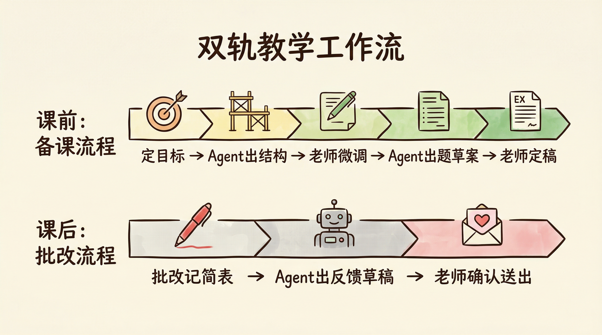

改造前后对比：

| 项目 | 改造前 | 改造后 |
| :--- | :--- | :--- |
| 每单元备课+配套题 | 5～6 小时 | 约 2.5 小时 |
| 每份周练/小测出题+答案 | 2～3 小时 | 约 1 小时 |
| 每轮作业批改+反馈（两班） | 4～5 小时，且后半段敷衍多 | 约 2.5～3 小时，反馈更具体 |
| 周末可用于自己的时间 | 很少 | 明显增加，且质量不降 |

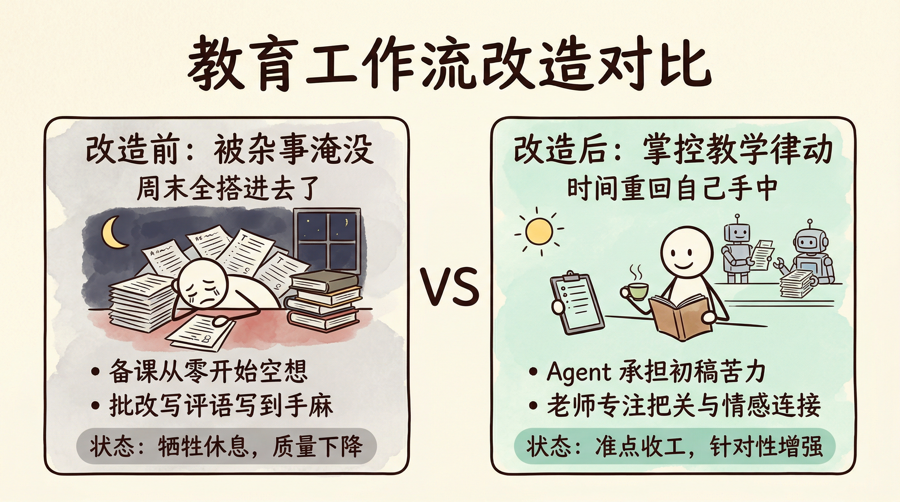

##### 9.4.3 为什么使用工作流后，教学质量反而提高了

林老师最初也担心：用 Agent 出初稿，会不会让备课和反馈变「水」？实践下来发现，恰恰相反。以前时间紧，结构想得不细、题目凑合着用、反馈写不动就写「加油」。现在有了「能力目标→结构→题目→答案」这条线，每一步都有依据；Agent 出的初稿逼着她把「要什么」想清楚，她只做筛选和把关，反而更容易发现题目是否超纲、反馈是否贴合学情。质量从「凭感觉赶工」变成了「有标准、有初稿、有人把关」，学生和家长的反馈也更好。

这就是第 3 章讲的「可交接性」在教育场景的体现：若她请假，代课老师只要会按「能力目标卡 + 教学结构 + 出题/反馈智能体」操作，就能在短时间内接住备课和批改，而不必从零理解她的习惯。

资产三件套在教学场景下就是：① 一条「备课流程」和一条「批改反馈流程」（目标→结构→题目→答案；批改结构化→反馈草稿→老师确认）；② 在扣子编程上搭好的四个智能体（教学结构、出题、答案与讲解、批改反馈）；③ 固定表格与模板（能力目标卡、批改结构表、反馈用语库）。有了这三件，新老师或代课老师也能较快上手，教学质量可复制、可迭代。

#### 本章结语

这一章，我们用教育场景完整演示了前几章方法论的落地：

- 用第 3 章的流程图思路，把「备课、出题、批改、反馈」拆成了可复用的步骤与 输入/输出，并区分了「人做判断」和「Agent 出初稿」的边界。
- 用第 4 章的任务分配，把教学结构草案、题目草案、答案讲解、反馈草稿交给 Agent，把能力目标、结构选定、题目与反馈的最终把关留给人。
- 用第 5 章的岗位说明书思路，为教学结构、出题、答案讲解、批改反馈等智能体写了清晰的需求描述，并在扣子编程上用自然语言搭建出来。

更重要的是，我们不只是纸上谈兵——你已经看到了如何在扣子编程上，用自然语言描述需求，把「教学结构」「出题」「答案与讲解」「批改反馈」四个智能体真正搭起来，让备课和批改从「全部自己扛」变成「有初稿、有把关、有流程」。

教育只是一个缩影。任何「内容+质量把关」类工作——写方案、做评审、写报告、做用户反馈——都可以用同样的思路：先定目标、再拆步骤、让 Agent 出初稿、人做最后判断与负责。

如果你不做老师，没关系。下一章我们进入职场场景——开会、汇报、跨部门沟通。你会看到同样的方法论和扣子编程，在职场人士的日常协作里，依然能产出清晰、可执行的工作流。


---

### 第10章 职场人士：开会、汇报、跨部门沟通的清晰工作流

小周在一家中型公司做产品运营，日常要开会、写周报、和研发、设计、市场跨部门对齐需求。

按理说，会议、汇报、沟通，每一样都是职场基本功。可他的每一天依然像在信息流里打捞——上午开完会，下午就忘了会上到底定了哪几条行动；周五写周报，对着空白文档想半天「这周干了啥」，翻聊天记录和邮件才勉强拼出一版。跨部门要资源或催进度时，要么写一大段话对方看不懂重点，要么口头说了一通对方记不住，事后还要反复扯皮。他觉得自己已经够忙了，可老板还是说「你的进展不够透明」「和别的部门对齐再清楚一点」。

小周以为自己缺的是时间。其实他缺的是一条流水线。

回忆一下前言里我们讲过的「手工作坊」和「智能工厂」的区别。小周的状态，就是典型的手工作坊模式——他一个人身兼会议记录员、周报撰写人、跨部门沟通者多个角色，每个角色都在他脑子里抢占内存，每次开会、每次写周报、每次发邮件都是「这次再临时组织一下」。

这一章，我们要帮小周（以及你）完成一次关键转变：把「开会、汇报、跨部门沟通」从一堆靠感觉的零散动作，拆解成一条清晰的、可复用的、可以让 Agent 深度参与的工作流。通过固定结构与流程节点，让信息表达更清晰，协作成本更低，执行效率更高。

而且，我们不只是纸上谈兵。这一章会手把手带你在扣子编程（官网 https://code.coze.cn ）上搭建真实可用的智能体，让你亲眼看到方法论在职场场景里是如何落地的。

即使你不做产品运营也没关系。这一章展示的「先结构、再填充、人做判断」的思路，适用于任何需要开会、写汇报、做对齐的岗位——项目经理、销售、职能岗，底层逻辑完全一样。

#### 10.1 开会工作流：从录音到行动项清单

开会的价值不在于「开过了」，而在于「谁在什么时间前要做什么」被记下来、被跟进。很多人开完会就散，会议结论和行动项留在各自脑子里，过两天就对不上号。小周的转折，是从「每次开会都有可执行的产出」开始的：录音或笔记 → 转成结构化文字 → 提炼议题、结论与行动项 → 为每个行动项标注负责人与截止时间。其中「转写」和「提炼」都可以交给 Agent 出初稿，他只做核对和补充。

##### 10.1.1 用 Agent 将录音转写成结构化文字

会议一结束，小周的第一件事不是立刻去忙别的，而是把录音（或自己的速记要点）交给在扣子编程上搭好的「会议纪要助手」：输入录音或文字片段，智能体先转写成连贯文字（若输入已是文字则做整理），并按「时间线」或「议题块」做简单分段。这样他就有一份可读的会议底稿，而不是一堆零散的「谁说了啥」。

###### 【实操：在扣子编程上创建会议纪要 Agent】

在扣子编程（https://code.coze.cn ）里选择「新建项目」→「智能体」，项目名称可填：会议纪要助手。在描述需求时，用自然语言说明以下要点即可：

| 配置项 | 内容 |
| :--- | :--- |
| 输入 | 用户提供：会议录音转写文本（或现场速记、语音转写后的原始文字），可含多段、多人发言 |
| 输出内容 | ① 按议题或时间线整理的结构化会议记录；② 每个议题下的主要讨论点与结论；③ 待确认或待跟进事项（若有） |
| 格式 | 分段清晰，便于后续提炼行动项；可要求输出为「议题—讨论—结论」三栏或列表 |
| 红线 | 不编造会议中未出现的内容；若听不清或无法判断，标注「待确认」 |

描述示例：

> 请搭建一个「会议纪要助手」智能体。用户会提供会议录音转写后的文字（或现场速记、语音转写原始稿），可能包含多段、多人发言。请先整理成结构化会议记录：按议题或时间线分段，每个议题下写出主要讨论点和结论；若有待确认或待跟进事项，单独列出。输出格式要清晰，便于下一步提炼行动项。不要编造会议中未出现的内容，无法判断的地方请标注「待确认」。

用户可先用其他转写工具（比如千问/飞书妙记等）得到文字，再粘贴进来。智能体创建成功后，试运行几次：贴入一段真实会议文字，看分段和结论提炼是否合理。若公司有固定会议模板（如「议题—结论—行动项」），在描述中补充即可。


##### 10.1.2 提炼出议题、结论与行动项

有了结构化会议记录，下一步是「提炼」：这场会讨论了哪几个议题？每个议题的结论是什么？有哪些事需要有人去做、谁做、什么时候前完成？小周在扣子编程上对同一智能体（或再建一个「行动项提炼」智能体）追加需求：输入会议记录，输出「议题—结论—行动项」清单。行动项格式为：具体事项 + 负责人 + 截止时间（若记录中未体现则标「待补充」）。这样他拿到的不再是一篇长文，而是一张可直接发给参会人的待办表。

##### 10.1.3 为每个行动项标注负责人与截止时间

Agent 提炼出的行动项里，负责人和截止时间可能不全——会议里有时只说了「这事谁跟一下」没点名，或只说「尽快」没给日期。小周会在这一环节做人工补全：对照参会名单和项目节奏，给每条行动项标上负责人与截止时间，必要时和当事人确认一遍。确认后的清单他会发到会议群或项目文档里，作为后续跟进的依据。这样「开会」和「落地」就打通了：会开完，行动项就出来了；行动项出来了，跟进就有据可查。

【心法】
开会工作流的本质是「信息从无序到有序」。先用 Agent 把录音或杂乱的笔记变成结构化记录，再提炼出议题、结论与行动项，最后人补全负责人与截止时间并发出。你省下的是「从零组织语言」的时间，换来的是「每次会议都有可执行的产出」。

#### 10.2 把周报、月报、复盘写成“填空题”

周报、月报、项目复盘，很多人最头疼的是「不知道写啥」和「写起来像流水账」。小周的解决办法是：先给自己建一个固定结构的模板（就像填空题），再让 Agent 根据他提供的素材（本周完成的事、数据、遇到的问题）辅助填充并优化表述，最后由自己补上关键的个人判断部分（如优先级、风险、下一步重点）。

##### 10.2.1 为自己建立固定结构的周报模板

小周给自己定了一个周报骨架，每周只换内容不换结构。例如：

- 本周完成：3～5 条，每条一句话说清「做了什么、结果如何」（可带关键数据）。
- 进行中：2～3 条，说明当前进度与卡点。
- 下周计划：3～5 条，按优先级排序。
- 需要支持/风险：0～2 条，需要谁配合、有什么风险需要同步。

有了这个骨架，写周报就变成了「往格子里填」：他只需要把本周做过的事、数据、卡点零散地列出来（甚至从聊天记录里复制几句），交给 Agent 去归纳、压缩成符合结构的句子，自己再补上「个人判断」——比如哪条是重点、哪个风险要特别提醒老板。

##### 10.2.2 让 Agent 辅助填充数据并优化表述

小周在扣子编程上配置了一个「周报助手」：输入本周的零散事项（列表或几段话）、关键数据（若有），智能体按用户指定的结构（如上面的「完成—进行中—计划—支持/风险」）输出一版周报草稿，表述简洁、每条控制在合理长度。他再根据实际情况删减、调序、改一两句，最后补上「个人判断」部分（如「下周重点是 XXX，建议优先资源」），一份周报就完成了。

###### 【实操：在扣子编程上创建周报助手 Agent】

在扣子编程里同样选择「新建项目」→「智能体」，项目名称可填：周报助手。在描述需求时，用自然语言说明以下要点即可：

| 配置项 | 内容 |
| :--- | :--- |
| 输入 | 用户提供：本周完成的事项（列表或段落）、进行中的工作及进度/卡点、下周计划要点、需要支持或风险（可选）；可附带关键数据 |
| 输出内容 | 按固定结构输出的周报草稿：本周完成、进行中、下周计划、需要支持/风险，每条简洁、可读 |
| 风格 | 客观、简洁，避免空话；每条一句话说清「做了什么/结果如何」或「计划做什么」 |
| 红线 | 不编造用户未提供的事项；若某类无内容则输出「无」或略过，不凑字数 |

描述示例：

> 请搭建一个「周报助手」智能体。用户会提供：本周完成的事项（可零散列表或几段话）、进行中的工作及进度与卡点、下周计划要点、以及可选的需要支持或风险。请按以下结构输出周报草稿：一、本周完成（3～5 条，每条一句话，可带关键数据）；二、进行中（2～3 条）；三、下周计划（3～5 条，按优先级）；四、需要支持/风险（0～2 条）。表述要客观简洁，不写空话，不编造用户未提供的内容，某类无则标「无」或略过。

智能体创建成功后，试运行：输入一份真实的本周事项（可打码敏感信息），看结构是否清晰、表述是否可用。若公司有统一周报格式，把格式要求写进描述即可。月报、复盘也可用同一思路：先定结构（如「目标—完成情况—差距分析—下阶段重点」），再让 Agent 按结构从用户提供的素材中生成草稿。


##### 10.2.3 由自己补上关键的个人判断部分

Agent 能做好「归纳和表述」，但「哪条最重要」「风险有多大」「下一步该押注哪里」必须由人判断。小周会在周报草稿最后加一小段「个人判断」：本周最大的进展是什么、最需要关注的风险是什么、下周建议优先做哪几件事。这部分不交给 Agent，完全自己写，通常也就两三句话，但能让老板和协作方一眼看到「你的思考」，而不只是「你做了啥」。

【心法】
周报、月报、复盘的价值，一半在「事实与结构」，一半在「判断与优先级」。把事实和结构交给模板和 Agent，把判断和优先级留给自己，既省时间，又突出你的思考。

#### 10.3 跨部门沟通：先理清背景、诉求与配合点，再发送

跨部门要资源、催进度、对齐需求，最怕两件事：对方看不懂你在说什么，对方记不住你要他做什么。小周的解决办法是：先把沟通内容拆成「背景—诉求—配合点」三类，再让 Agent 优化语言、确保简洁清晰，同一件事给不同对象（如研发、设计、老板）可以准备不同版本，但结构一致，重点突出。

##### 10.3.1 将沟通内容拆成背景、诉求与配合点三类

发邮件或发消息前，小周先在心里（或草稿里）过一遍：背景——对方需要知道什么前提（项目进展、为什么现在要沟通）；诉求——你希望对方做什么、什么时候前完成、交付标准是什么；配合点——对方需要你提供什么信息或资源、你会怎么配合。这三类写清楚，再长的需求也不会变成「写了一屏对方还不知道要干啥」。他有时会先把零散的想法列出来，交给 Agent 按「背景—诉求—配合点」重新组织成一版草稿，再自己改一两句发出去。

##### 10.3.2 让 Agent 优化语言，确保简洁清晰

很多人跨部门沟通写得很长，是因为把背景、诉求、配合点混在一起，又加了很多「客气话」和重复解释。小周在扣子编程上配置了一个「跨部门沟通助手」：输入你要表达的核心意思（可以是一段零散的话），智能体按「背景—诉求—配合点」结构重写，语言简洁、一句是一句，并去掉冗余。他再根据对方身份和关系，微调语气（更正式或更简短），然后发送。

###### 【实操：在扣子编程上创建跨部门沟通助手 Agent】

在扣子编程里同样选择「新建项目」→「智能体」，项目名称可填：跨部门沟通助手。在描述需求时，用自然语言说明以下要点即可：

| 配置项 | 内容 |
| :--- | :--- |
| 输入 | 用户提供：本次沟通的核心意思（可零散、可啰嗦），以及沟通对象或场景（如研发/设计/上级，邮件/即时消息） |
| 输出内容 | 按「背景—诉求—配合点」结构重写的一版沟通草稿，简洁清晰，便于对方快速理解并行动 |
| 风格 | 根据对象调整：对同事可简短直接，对上级可稍正式、突出结论与需求 |
| 红线 | 不改变用户的核心诉求与事实；不编造对方未授权承诺的内容 |

描述示例：

> 请搭建一个「跨部门沟通助手」智能体。用户会提供：本次沟通的核心意思（可以是一段零散或啰嗦的表述），以及沟通对象或场景（如研发同事、设计、上级；邮件或即时消息）。请按「背景—诉求—配合点」结构重写：背景用 1～3 句话说清对方需要知道的前提；诉求写清希望对方做什么、何时完成、交付标准；配合点写清对方需要你提供什么、你会如何配合。语言要简洁，一句是一句，便于对方快速理解并行动。根据对象可调整语气（同事可简短，上级可稍正式）。不要改变用户的核心诉求与事实，不要编造对方未授权的内容。

智能体创建成功后，试运行：输入一段真实的需求描述，看结构是否清晰、诉求是否突出。若经常需要「催进度」「要资源」等类型，可在描述中增加「可输出简短版（适合聊天框）或完整版（适合邮件）」等选项。


##### 10.3.3 同一事项为不同对象准备不同版本

同一件事，对研发要说清技术边界和排期，对设计要说清体验目标和交付物，对老板要说清结论、风险和你要什么支持。小周的做法是：先有一份「完整版」（背景—诉求—配合点都写全），再根据对象剪裁或改写。例如给研发发工作消息时只保留「诉求 + 截止时间」，给老板发邮件时保留背景和诉求、加一句「需要您支持的是 XXX」。跨部门沟通助手可以根据「对象」生成不同版本：同一输入，输出「给研发的简短版」和「给上级的正式版」，他选一版或合并使用即可。

> 💡 回扣方法论：10.1～10.3 这条职场工作流，本质就是第 4 章「五步法」的落地——
>
> 1. 明确目标（会议要有行动项、周报要透明、沟通要对方能懂能执行）
> 2. 拆解步骤（会议：转写→提炼→标注负责人与时间；周报：模板→Agent 填充→人补判断；沟通：背景诉求配合点→Agent 优化→按对象出不同版本）
> 3. 定义 输入/输出（每步的接口对齐）
> 4. 分配执行者（人做拍板、补全、判断；Agent 做转写整理、结构填充、语言优化）
> 5. 沉淀为可复用资产（会议纪要模板、周报模板、沟通结构 + 三个智能体）
>
> 在扣子编程里，会议纪要、周报、跨部门沟通都可以用自然语言说清楚，由 AI 生成智能体来执行初稿，人把时间花在「核对」和「判断」上。

【心法】
跨部门沟通不是「说得越多越好」。先理清背景、诉求、配合点，再让 Agent 帮你把话写短、写清楚，同一件事为不同对象准备不同版本。信息清晰了，协作成本自然下来。

#### 10.4 案例：一个普通员工搭建的个人“职场中控台”

方法讲完了，最后用小周的完整故事，把这一章串起来。你会看到一个普通员工，是如何把会议、周报、跨部门沟通收拢成一套简易的「职场中控台」——进度、优先级、下一步都清晰，职场价值更容易被看见。

小周之前的状态是：会议结论记在笔记本里，周报要写时再翻聊天记录和邮件拼凑，跨部门沟通有时口头说了没留痕、有时写很长对方还是问「你到底要啥」。老板问「某某事进展如何」时，他要现找；同事问「上次说的那个需求咋样了」时，他也要现想。信息都在，但分散在会议、邮件、IM、文档里，没有统一入口，也没有固定流程去更新「进度—优先级—下一步」。

##### 10.4.1 将会议、邮件与任务集中到统一入口

小周没有上大系统，只是给自己定了一个「个人中控」习惯：一个地方记会议产出，一个地方记周报与任务，一个地方存跨部门沟通的关键结论。例如：会议一结束就把录音或笔记交给会议纪要助手，得到行动项清单后，把清单贴到自己的任务表（可以是飞书/Notion/Excel，随你习惯）里，并标上负责人和截止时间。周报用固定模板 + 周报助手生成草稿，写完后把「下周计划」里自己负责的几条同步到同一张任务表。跨部门沟通的重要结论（如「设计下周三前给稿」）也记进任务表，并注明「待谁交付」。这样，他的「进度—优先级—下一步」都集中在一张表里，随时可查、可同步给老板或协作方。

##### 10.4.2 用简易流程管理“进度—优先级—下一步”

小周的任务表很简单：事项 | 负责人 | 截止时间 | 状态 | 备注。他每周一根据「上周会议行动项 + 上周周报里的下周计划 + 跨部门沟通的承诺」更新这张表，并标出本周的 3～5 个重点。每天下班前花 5 分钟扫一眼：哪些快到截止时间了、哪些卡住了、明天优先推进哪几件。这样他就不会「忙了一天却说不清自己干了啥」，也不会在老板问进展时临时翻聊天记录。会议纪要助手、周报助手、跨部门沟通助手，都服务于同一目标：让信息从散乱变成「可检索、可跟进、可汇报」的结构化产出。

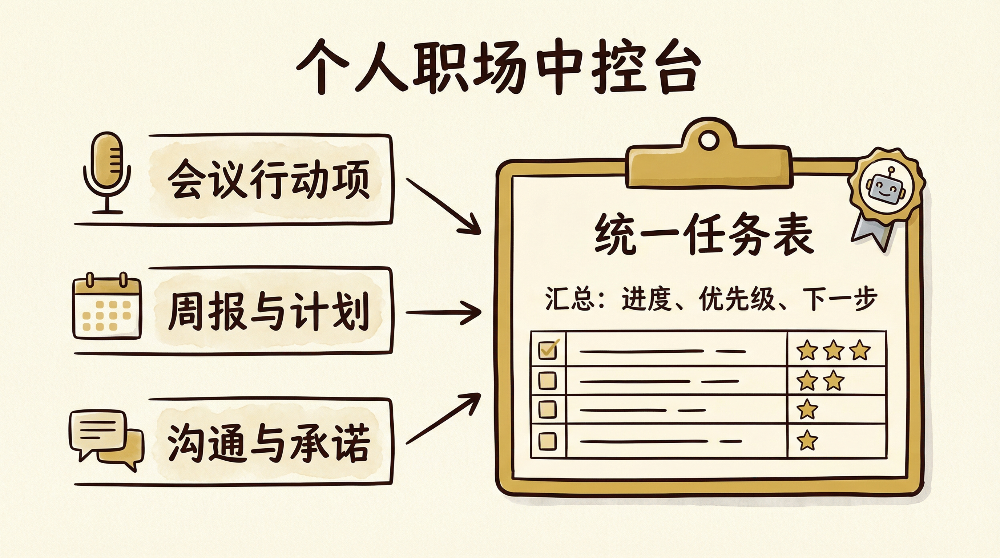

改造前后对比：

| 项目 | 改造前 | 改造后 |
| :--- | :--- | :--- |
| 会议结论与行动项 | 散落在笔记本，易遗漏 | 转写→提炼→清单，进任务表 |
| 周报 | 周五现想、现翻记录，耗时长 | 固定模板 + Agent 填充，人补判断，半小时内完成 |
| 跨部门沟通 | 长文或口头，对方常问「要啥」 | 背景—诉求—配合点 + Agent 优化，按对象出不同版本 |
| 进度与优先级 | 在脑子里，老板问要现找 | 统一任务表，进度—优先级—下一步一目了然 |

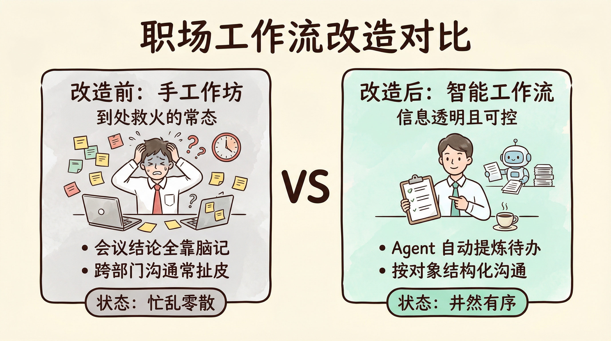

##### 10.4.3 使用工作流后，让自己的职场价值更明显

小周发现，当会议有行动项、周报有结构、沟通有重点之后，老板和协作方更容易看到「他靠谱」：事情有跟进、进展可查、需要配合时说得清楚。他并没有多加班，只是把原来散乱的信息用流程和 Agent 收拢了，把「判断」和「优先级」留给自己表达。这就是第 3 章讲的「可交接性」在职场中的体现：若他休假或转岗，接手的同事只要按同一套「会议→行动项→任务表」「周报模板→周报助手」「沟通结构→沟通助手」操作，就能快速接住他的工作习惯，信息不断档。

资产三件套在职场场景下就是：① 一条「开会工作流」（录音/笔记→转写→提炼行动项→标注负责人与时间→进任务表）和一条「周报/沟通」流程（模板+Agent 填充/优化→人补判断）；② 在扣子编程上搭好的三个智能体（会议纪要、周报助手、跨部门沟通助手）；③ 一张个人任务表（或等价入口），用来集中「进度—优先级—下一步」。有了这三件，你的职场信息流就从「散装」变成「可管理、可展示、可交接」。

#### 本章结语

这一章，我们用职场场景完整演示了前几章方法论的落地：

- 用第 3 章的流程图思路，把「开会、汇报、跨部门沟通」拆成了可复用的步骤与 输入/输出，并让每类任务都有固定结构。
- 用第 4 章的任务分配，把会议转写与提炼、周报填充、沟通语言优化交给 Agent，把行动项确认、个人判断、对象与版本选择留给人。
- 用第 5 章的岗位说明书思路，为会议纪要、周报、跨部门沟通等智能体写了清晰的需求描述，并在扣子编程上用自然语言搭建出来。

更重要的是，我们不只是纸上谈兵——你已经看到了如何在扣子编程上，用自然语言描述需求，把「会议纪要」「周报助手」「跨部门沟通助手」三个智能体真正搭起来，让开会、写周报、做对齐从「临时组织」变成「有结构、有初稿、有跟进」。

职场沟通只是一个缩影。任何需要「把信息整理清楚、把诉求说明白、把进度可追溯」的工作——项目管理、客户对接、内部汇报——都可以用同样的思路：先定结构，再让 Agent 辅助填充和优化，人做判断和拍板。

如果你不做产品运营，没关系。下一章我们进入创业者与管理者场景——信息收集、方案生成、决策推演。你会看到同样的方法论和扣子编程，在决策与复盘场景里，如何让每一次选择都有据可依、可分析、可复用。


---

### 第11章 创业者与管理者：建立可复用的决策流程体系

老杨创业三年，公司二十来人，做企业级 SaaS。他既是创始人也是实际的产品与战略负责人，每天要做一堆「选哪条路、押多少资源、什么时候收手」的决策。

按理说，做决策是管理者的本分。可他的真实状态是：行业信息从投资人、客户、竞品、媒体各处涌来，他来不及整理就堆在脑子里或聊天记录里，真要做重大决策时往往「凭感觉」——上次为什么选了 A 没选 B，半年后自己也说不清。方案也一样：要不要开拓新品类、要不要加大某条产品线的投入、要不要裁掉一条亏损业务线，他经常自己憋一两个方案就拍了板，事后复盘时才发现当时根本没系统想过 B 方案、C 方案长什么样。更头疼的是「万一搞砸了怎么办」：最坏情况想到过，但没写下来、没定好「到什么条件就止损或转向」，真出了事又陷入被动应对。

老杨以为自己缺的是「更多信息」和「更果断」。其实他缺的是一套可复用的决策流程。

回忆一下前言里我们讲过的「手工作坊」和「智能工厂」的区别。老杨的状态，就是典型的手工作坊模式——他一个人身兼信息收集员、方案构思者、风险评估员、拍板人多个角色，每个角色都在他脑子里抢占内存，每次重大决策都是「这次再想想、再问问人、再拍一下」。

这一章，我们要帮老杨（以及你）完成一次关键转变：把「做决策」从一件依赖直觉和零散信息的动作，拆解成三条可复用、可复盘的流程——信息收集、方案生成与筛选、条件推演与应对规则。通过结构化方式降低决策的不确定性，使每一次选择都有据可依、可分析、事后可回溯。

而且，我们不只是纸上谈兵。这一章会手把手带你在扣子编程（官网 https://code.coze.cn ）上搭建真实可用的智能体，让你亲眼看到方法论在决策与管理场景里是如何落地的。

即使你不是创业者或带团队的管理者也没关系。这一章展示的「先收信息、再出多版方案、再推演条件与规则」的思路，适用于任何需要做重要选择的场景——选方向、选资源分配、选合作方、选止损点，底层逻辑完全一样。

#### 11.1 建立结构化的信息收集流程

决策质量首先取决于「你依据什么做判断」。信息散落在各处、没有定期整理，决策时就容易凭印象或最近听到的几句话拍板。老杨的转折，是从「把信息收集固定成每周动作」开始的：让 Agent 每周给出一份行业简报，自己再整理成决策专用的信息文档，并明确「当前这类决策最依赖哪几项关键判断依据」。这样再做方案和拍板时，就有统一的「信息底座」。

##### 11.1.1 让 Agent 每周给你一份行业简报

老杨不可能每天泡在行业报告和新闻里，但他需要持续感知：竞品在做什么、客户在抱怨什么、政策或技术有什么新动向。他在扣子编程上配置了一个「行业简报助手」：每周一输入本周关心的主题（如「本行业融资与并购」「主要竞品功能更新」「客户反馈高频词」），智能体根据这些主题联网检索或基于已有知识生成一份简明简报——每条一两句话，带来源或时间点（若可获取），便于他快速扫一眼抓住重点。他不需要 Agent 替自己下结论，只需要 Agent 把「值得关注的信息」按时、按主题整理好，省下自己到处翻的时间。

###### 【实操：在扣子编程上创建行业简报 Agent】

在扣子编程（https://code.coze.cn ）里选择「新建项目」→「智能体」，项目名称可填：行业简报助手。在描述需求时，用自然语言说明以下要点即可：

| 配置项 | 内容 |
| :--- | :--- |
| 输入 | 用户提供：本周或本阶段关心的主题（如行业融资、竞品动态、客户反馈、政策与技术动向等），可 3～5 个主题；可选提供行业或公司类型以便聚焦 |
| 输出内容 | 一份简明简报：按主题分块，每块下列 3～8 条要点，每条一两句话概括「发生了什么、与谁相关、可能的影响」；若有来源或时间可标注 |
| 格式 | 列表或短段落，便于 5～10 分钟扫读；可要求「每条不超过 50 字」 |
| 红线 | 不编造未核实的事件；若某主题无可靠信息则标注「本周暂无显著动态」 |

描述示例：

> 请搭建一个「行业简报助手」智能体。用户会提供本周或本阶段关心的 3～5 个主题（例如：本行业融资与并购、主要竞品产品/功能更新、客户或用户反馈的高频词、政策或技术新动向），以及可选的行业或公司类型。请按主题输出一份简明简报：每个主题下列 3～8 条要点，每条用一两句话概括「发生了什么、与谁相关、可能的影响」，若有来源或时间可标注。整体格式要便于 5～10 分钟扫读，每条不超过 50 字。不要编造未核实的事件，若某主题本周无可靠信息则标注「本周暂无显著动态」。

智能体创建成功后，试运行几次：输入真实关心的主题，看简报是否聚焦、是否有明显编造。若希望更偏「竞品」或「客户」，在描述中加重对应主题的权重即可。


##### 11.1.2 制作决策专用的信息整理文档

简报是「输入」，但要支撑具体决策，还需要把信息沉淀成「决策专用文档」：当前要做的决策是什么、和它相关的关键事实有哪些、这些事实从哪里来、更新时间是什么。老杨会每周或每双周把简报里的要点、加上自己从客户沟通和内部讨论里听到的关键信息，整理成一张简表或一页文档，按「决策类型」或「当前在做的战略议题」分块。例如：正在考虑「是否加大某条产品线投入」时，文档里就集中放「该产品线近期数据、竞品同类产品动态、客户对该方向的反馈、内部资源与成本约束」。这样开会或独自拍板时，不用再临时翻聊天记录，直接对着这份文档讨论和判断。

##### 11.1.3 明确决策所依赖的三项关键判断依据

同一类决策，往往反复出现（例如「要不要投新渠道」「要不要砍某条业务线」）。老杨给自己定了一个习惯：每做一类重大决策前，先明确「这次决策最依赖哪三项关键判断依据」。例如：投新渠道时，三项依据可能是「渠道 ROI 预估」「团队现有带宽」「与现有渠道的冲突程度」；砍业务线时，可能是「该线现金流与亏损幅度」「战略协同度」「团队与客户影响」。写下来之后，信息收集和方案分析就都有了靶心——Agent 生成的简报和方案，都可以围绕这三项依据来组织和呈现；自己做最终拍板时，也清楚「我是基于哪几件事在选」，事后复盘时能回溯「当时那三项依据分别是什么结论」。

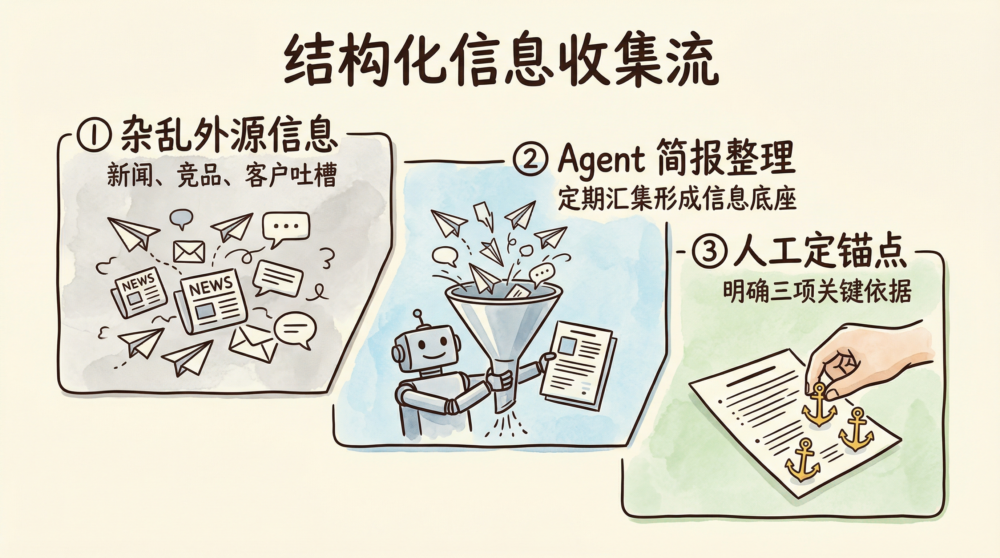

【心法】
决策不是「信息越多越好」，而是「关键依据清晰、信息为依据服务」。用 Agent 做定期简报、用文档沉淀决策相关信息、用「三项关键依据」锁定判断锚点，你就能从「凭感觉」变成「有据可依」。

#### 11.2 生成多版本方案并完成人工筛选

有了信息底座和关键判断依据，下一步是「方案」：不要只憋一个选项，而是让 Agent 生成 A/B/C 多版可行方案，再让 Agent 分析各方案的优势与风险，最后由人做选择和组合。这样既避免「只想到一个方案就拍板」的狭隘，又保留「最终决策必须由人负责」的边界。

##### 11.2.1 让 Agent 生成 A/B/C 多版可行方案

老杨以前做重大选择时，经常只深入想了一个方向，其他选项要么没认真想、要么想得比较浅。后来他在扣子编程上配置了一个「方案生成助手」：输入「当前要做的决策是什么、约束条件是什么、希望看到几版不同思路的方案」，智能体根据用户提供的信息（可结合 11.1 的简报或决策文档）生成 2～3 版可行方案，每版包含：方案概要、主要动作、预期结果、所需资源与时间、前提假设。方案之间要有明显差异（例如 A 偏保守、B 偏激进、C 偏折中），而不是换汤不换药。老杨拿到多版方案后，先快速扫一遍，淘汰明显不符合自己战略或资源的，再对剩下的做深入比较和人工筛选。

###### 【实操：在扣子编程上创建方案生成 Agent】

在扣子编程里同样选择「新建项目」→「智能体」，项目名称可填：方案生成助手。在描述需求时，用自然语言说明以下要点即可：

| 配置项 | 内容 |
| :--- | :--- |
| 输入 | 用户提供：当前要做的决策（一句话）、约束条件（资源、时间、不可突破的红线）、可选的关键信息摘要；以及希望得到的方案数量（如 2～3 版）与差异类型（如保守/激进/折中） |
| 输出内容 | 2～3 版可行方案，每版包含：方案概要、主要动作步骤、预期结果、所需资源与时间、前提假设；各版之间要有清晰差异 |
| 格式 | 分方案编号（A/B/C），每版用列表或短段落，便于对比 |
| 红线 | 不编造用户未提供的约束；方案要在用户给出的约束内可行；若信息不足则标注「需补充 XXX 方可进一步细化」 |

描述示例：

> 请搭建一个「方案生成助手」智能体。用户会提供：当前要做的决策（一句话描述）、约束条件（如预算、时间、团队、不可突破的红线）、以及可选的关键信息摘要（如行业简报要点）。请生成 2～3 版可行方案，每版需包含：方案概要、主要动作步骤、预期结果、所需资源与时间、前提假设。各版之间要有明显差异（例如 A 偏保守、B 偏激进、C 偏折中）。输出请按方案编号（A/B/C）分块，便于对比。不要编造用户未提供的约束，方案必须在用户给出的约束内可行；若信息不足无法细化，请标注「需补充 XXX 方可进一步细化」。

智能体创建成功后，试运行：输入一个真实的决策场景，看生成的方案是否真的「多版」且「有差异」、是否在约束内。若方案过于空泛，在描述中补充「方案要具体到可执行的动作级别」等约束即可。


##### 11.2.2 让 Agent 分析不同方案的优势和风险

多版方案生成之后，还需要系统对比：每个方案的优势在哪、风险在哪、和「三项关键判断依据」的匹配度如何。老杨在扣子编程上配置了一个「方案分析助手」（可与方案生成助手合并或分开）：输入几版方案（或方案概要），智能体输出一份对比分析，包含：各方案优势归纳、各方案主要风险与不确定性、对用户事先给出的「关键判断依据」的满足程度（若用户有提供）、简要建议（如「若更看重 X 则倾向 A，若更看重 Y 则倾向 B」）。老杨不看分析做最终决定，但会借助这份分析补全自己可能没想全的风险点，再做人工决策。

###### 【实操：在扣子编程上创建方案分析 Agent】

在扣子编程里同样选择「新建项目」→「智能体」，项目名称可填：方案分析助手。在描述需求时，用自然语言说明以下要点即可：

| 配置项 | 内容 |
| :--- | :--- |
| 输入 | 用户提供：2～3 版方案（概要或全文）、可选的关键判断依据或决策目标 |
| 输出内容 | 对比分析：各方案优势、各方案主要风险与不确定性、与关键依据的匹配度（若有）、简要倾向建议（注明「仅供参考，最终由人决策」） |
| 格式 | 按方案分块或按维度（优势/风险/匹配度）分块，便于阅读 |
| 红线 | 不替用户做最终决策；风险分析要具体，避免「存在一定风险」等空话 |

描述示例：

> 请搭建一个「方案分析助手」智能体。用户会提供 2～3 版方案（概要或全文），以及可选的关键判断依据或决策目标。请输出对比分析：第一，各方案的优势归纳；第二，各方案的主要风险与不确定性（要具体，避免空话）；第三，若用户提供了关键依据，分析各方案与这些依据的匹配程度；第四，简要倾向建议（如「若更看重 X 则倾向 A」），并注明「仅供参考，最终由人决策」。输出格式要便于对比阅读。不要替用户做最终决策，风险要写到可感知、可讨论的程度。

智能体创建成功后，试运行：输入之前方案生成助手输出的 A/B/C 方案，看分析是否真的在对比、风险是否具体。若分析太笼统，在描述中补充「每个方案至少列出 2～3 条具体风险」即可。


##### 11.2.3 由人工完成决策：选择方案并做组合

Agent 只负责「出方案」和「分析优劣」，不负责「拍板」。老杨会在看完多版方案和分析之后，结合自己的战略判断、团队状态、外部不可控因素，选一个主方案或做组合（例如「主体选 A，但在某某环节采用 B 的做法」）。选定之后，他会把「最终选了啥、主要理由是什么」记下来，放进决策文档或复盘表，方便日后回溯：当时为什么这么选、依据是否变了、若重来会否还选这个。这样决策就从「拍完就忘」变成「可复盘、可迭代」。

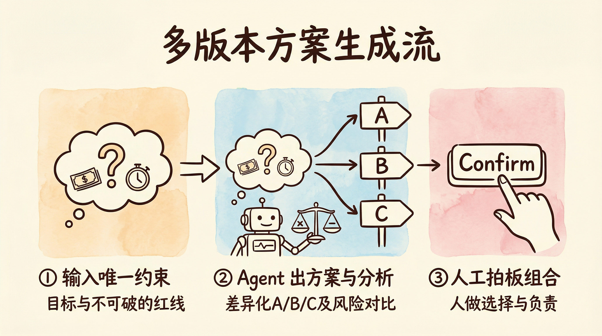

【心法】
方案生成和分析可以交给 Agent，但「选哪条路、押多少、什么时候收手」必须由人负责。用 Agent 拓宽选项、补全风险视角，用人的判断做最终选择并留下记录，决策质量与可复盘性都会上去。

#### 11.3 对关键条件进行推演并制定应对规则

决策做完不等于结束，还要想清楚「万一没按预期走怎么办」：未来几个月可能出现哪些关键情境、最坏情况是什么、触发条件是什么、到了什么条件就执行「止损」或「转向」。老杨会把这类推演固定成流程：先推演未来两三个月的关键情境，再明确最坏情况及其触发条件，最后设定「如果……就……」的可执行规则。其中情境推演和规则草案可以由 Agent 辅助生成，但「哪些情境算关键、哪些规则真的会执行」必须由人定。

##### 11.3.1 推演未来三个月的关键情境

重大决策落地后，环境会变：市场、竞品、政策、内部执行都可能和预期不一致。老杨会定期（例如每季度或每个重大决策后）做一次「情境推演」：未来两三个月，最可能出现的 3～5 种关键情境是什么？每种情境下，当前决策或当前业务会受到什么影响？他在扣子编程上配置了一个「情境推演助手」：输入当前决策或业务重点、时间范围（如未来三个月）、关心的外部与内部变量，智能体输出 3～5 种情境描述（如「竞品推出同质产品且价格更低」「核心客户续约率低于 X%」「某关键人才离职」），并简要说明每种情境对当前决策的影响。老杨再根据自己对行业的理解，删减或补充情境，并挑出「必须提前想好应对」的那几种。

##### 11.3.2 明确最坏情况及其触发条件

在推演出的情境中，要单独把「最坏情况」拎出来：具体是什么、什么信号出现就算「触发了」、触发后会影响多大。老杨会要求自己（或和核心团队一起）把最坏情况写成一两段话，并列出 2～3 个「触发条件」——例如「连续两个月某产品线收入低于 X 万」「某大客户明确表示不续约」。这样一旦后续真的出现这些信号，就不会再临时慌乱，而是按事先想好的规则行动。

##### 11.3.3 设定「如果……就……」的可执行决策规则

有了最坏情况和触发条件，下一步是定规则：「如果出现 A，就做 B」。例如：「如果某产品线连续两季度收入低于 X，就收缩投入并评估是否砍线」；「如果某大客户不续约，就启动 Y 预案并同步调整年度目标」。老杨在扣子编程上配置了一个「决策规则助手」：输入当前决策或业务、已明确的最坏情况与触发条件，智能体生成一版「如果……就……」的规则草案，每条规则要具体到「谁、在什么条件下、做什么动作」。老杨再根据公司实际情况修改或精简，把最终版规则写进决策文档或团队共识，并定期回顾：这些规则是否还适用、有没有新情境需要补充。

###### 【实操：在扣子编程上创建情境推演与决策规则 Agent】

在扣子编程里同样选择「新建项目」→「智能体」，项目名称可填：情境推演与决策规则助手。在描述需求时，用自然语言说明以下要点即可：

| 配置项 | 内容 |
| :--- | :--- |
| 输入 | 用户提供：当前决策或业务重点、推演时间范围（如未来三个月）、关心的外部/内部变量；以及可选的最坏情况描述与触发条件 |
| 输出内容 | ① 3～5 种关键情境描述及对当前决策的影响；② 最坏情况与触发条件归纳（若用户已提供则整理成条）；③ 「如果……就……」的可执行规则草案，每条具体到条件与动作 |
| 格式 | 情境、最坏情况、规则分块列出，便于人删改和定稿 |
| 红线 | 不替用户承诺具体数字或承诺；规则草案需注明「需经人确认后执行」 |

描述示例：

> 请搭建一个「情境推演与决策规则助手」智能体。用户会提供：当前决策或业务重点、推演时间范围（如未来三个月）、关心的外部与内部变量（如竞品、客户、成本、人才）；以及可选的最坏情况描述与触发条件。请输出：第一，3～5 种关键情境描述，并简要说明每种情境对当前决策的影响；第二，最坏情况及其触发条件（若用户已提供则整理成条，若未提供则根据情境归纳建议）；第三，「如果……就……」的可执行规则草案，每条要具体到「在什么条件下、谁、做什么动作」，并注明「需经人确认后执行」。不要替用户承诺具体数字或对外承诺，规则要可操作、可检查。

智能体创建成功后，试运行：输入一个真实的决策或业务重点，看情境是否合理、规则是否具体。若规则太泛，在描述中补充「每条规则必须包含可观察的触发条件和明确动作」即可。


> 💡 回扣方法论：11.1～11.3 这条决策流程，本质就是第 4 章「五步法」的落地——
>
> 1. 明确目标（每次决策要「有据可依、可分析、可复盘」）
> 2. 拆解步骤（信息收集→方案生成与分析→条件推演与规则）
> 3. 定义 输入/输出（简报、决策文档、方案、分析、规则草案）
> 4. 分配执行者（人定关键依据、拍板、定规则；Agent 出简报、多版方案、优劣分析、情境与规则草案）
> 5. 沉淀为可复用资产（简报模板、决策文档结构、方案与规则模板 + 四个智能体）
>
> 在扣子编程里，行业简报、方案生成、方案分析、情境推演与决策规则都可以用自然语言说清楚，由 AI 生成智能体来执行初稿，人把时间花在「判断、选择和负责」上。

【心法】
决策不是「拍完就结束」。把「万一没按预期走」提前推演好，把最坏情况和触发条件写清楚，把「如果……就……」的规则定下来，你就从「被动应对」变成了「有预案、可执行、可复盘」。

#### 11.4 案例：用流程完成一次完整的管理决策

方法讲完了，最后用老杨的一次完整决策经历，把这一章串起来。你会看到一位创业者，是如何从「凭感觉拍板、事后说不清」变成「信息—方案—规则」三条流程走完、决策可复盘的。

##### 11.4.1 原始决策方式的问题与成本

老杨公司有一条产品线做了两年，一直不温不火：有收入但不够覆盖投入，团队也累。要不要继续押注、要不要砍掉、要不要先收缩再观察，他拖了半年没决断。每次想到这个话题，要么信息太杂（客户反馈、竞品数据、内部成本混在一起），要么只想到「再撑一撑」和「干脆砍了」两个极端选项，没有系统想过「中间态」——比如先收缩到最小可维持规模、设一个止损线、到线就砍。事后复盘时他也说不清：当时为什么没早点定规则、为什么没把 A/B/C 方案写出来对比。这种决策方式的问题很典型：信息散、方案少、无推演、无规则，成本和机会成本都高，且无法沉淀成「下次类似决策怎么做的」经验。

##### 11.4.2 三步流程带来的结构化改善

老杨后来用本章的三条流程，对「这条产品线怎么办」做了一次完整决策。

**第一步：信息收集**。他先明确这次决策依赖的三项关键依据：① 该线未来 6 个月的现金流与成本预测；② 与主战略的协同度（资源若腾出来能干什么）；③ 团队与客户若收缩或砍线的影响。然后让行业简报助手按「本行业类似产品线收缩案例」「客户对该线依赖度」等主题生成简报，自己把内部数据、客户反馈整理进决策文档，形成「信息底座」。

**第二步：方案生成与筛选**。他把「当前决策：是否继续/收缩/砍掉该产品线；约束：团队与预算上限、不可影响主战略」输入方案生成助手，得到 A（继续押注）、B（收缩到最小可维持）、C（半年内有序砍线）三版方案。再用方案分析助手得到各版优势与风险对比，自己结合团队心态和战略重心，选了 B（收缩到最小可维持），并写下选择理由：「当前现金流不足以支撑全量投入，但完全砍掉会丢失部分客户与口碑，先收缩到可维持规模，设半年观察期与止损线。」

**第三步：条件推演与规则**。他把「当前决策：收缩该线；时间范围：未来三个月；关心变量：该线收入、主战略资源需求、关键客户续约」输入情境推演与决策规则助手，得到几种情境和规则草案。他从中定稿三条规则：① 若该线连续两季度收入低于 X 万，则启动砍线预案；② 若主战略新项目需要抽调该线核心人员，则优先保证主战略；③ 每季度复盘一次该线数据与规则适用性。写进团队共识文档，并和核心团队同步。

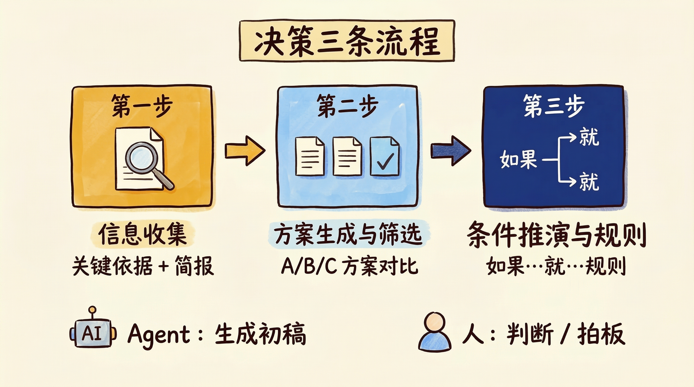

改造前后对比：

| 项目 | 改造前 | 改造后 |
| :--- | :--- | :--- |
| 信息 | 散落在聊天、记忆、零散报告里 | 简报 + 决策文档 + 三项关键依据 |
| 方案 | 多为「再撑」或「砍掉」两个极端 | A/B/C 多版 + 优劣分析，人做选择并记录理由 |
| 风险与规则 | 想到过最坏，但未写清、未定规则 | 情境推演 + 最坏情况与触发条件 + 「如果……就……」规则 |
| 可复盘性 | 事后说不清当时依据与选项 | 决策文档与规则可回溯、可迭代 |

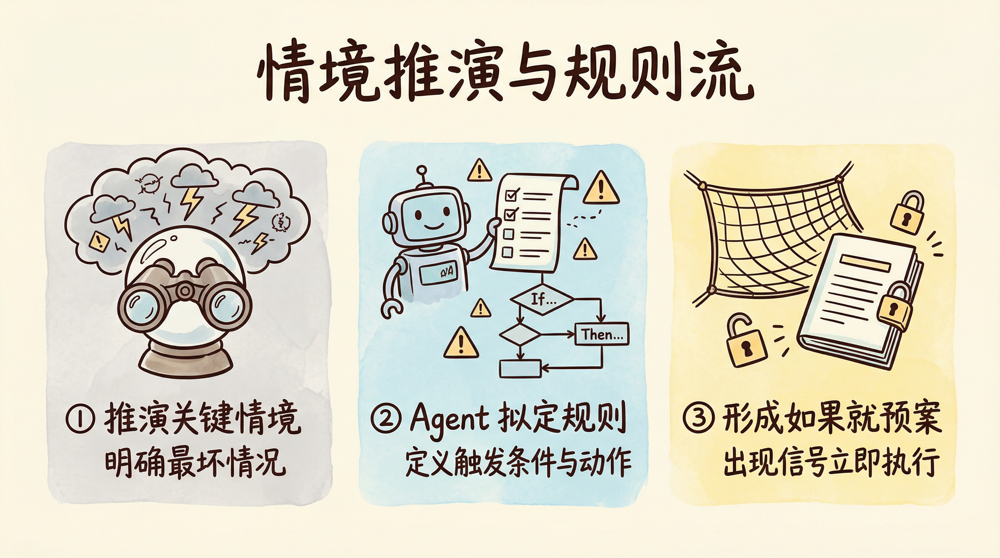

##### 11.4.3 让决策具备可复盘性的具体做法

老杨的决策文档现在会保留几类内容：① 本次决策是什么、三项关键依据是什么；② 当时有哪些方案、选了哪个、主要理由；③ 最坏情况与触发条件、定稿的「如果……就……」规则；④ 决策日期与参与人（若为集体决策）。每季度或每半年，他会翻一遍近期重大决策，看「依据是否变了、规则是否还适用、若重来会否还选同一方案」。这样决策就从一个「一次性动作」变成了「可积累、可复用的流程资产」。

这就是第 3 章讲的「可交接性」在决策场景的体现：若老杨休假或交棒，接手的联合创始人或高管只要按同一套「信息—方案—规则」流程走，就能理解过去决策的逻辑，并在新决策时复用同一套方法，而不是从零凭感觉。

资产三件套在决策与管理场景下就是：① 三条流程（信息收集→方案生成与筛选→条件推演与规则）及对应模板（简报主题、决策文档结构、规则表）；② 在扣子编程上搭好的四个智能体（行业简报、方案生成、方案分析、情境推演与决策规则）；③ 决策与复盘文档（关键依据、方案与选择理由、规则与触发条件）。有了这三件，同类决策可以反复走同一套流程，质量与可复盘性都会上去。

#### 本章结语

这一章，我们用创业者与管理者的决策场景，完整演示了前几章方法论的落地：

- 用第 3 章的流程图思路，把「做决策」拆成了可复用的三条流程（信息收集、方案生成与筛选、条件推演与规则），并让每一步都有 输入/输出 和 执行者。
- 用第 4 章的任务分配，把简报生成、多版方案、方案分析、情境与规则草案交给 Agent，把关键依据、拍板、规则定稿与复盘留给人。
- 用第 5 章的岗位说明书思路，为行业简报、方案生成、方案分析、情境推演与决策规则等智能体写了清晰的需求描述，并在扣子编程上用自然语言搭建出来。

更重要的是，我们不只是纸上谈兵——你已经看到了如何在扣子编程上，用自然语言描述需求，把「行业简报」「方案生成」「方案分析」「情境推演与决策规则」四个智能体真正搭起来，让决策从「凭感觉、难复盘」变成「有信息底座、有多版方案、有规则预案、可回溯可迭代」。

决策与管理只是一个缩影。任何需要「在不确定下做选择、并希望选择有据可依、可分析、可复盘」的场景——战略方向、资源分配、合作与止损——都可以用同样的思路：先收信息、再出多版方案、再推演条件与规则，人做判断与负责，Agent 做初稿与补全视角。

到这里，第三篇「五类人群」的五个章节就全部结束了。从短视频博主、电商从业者、教育工作者、职场人士到创业者与管理者，我们用的都是同一套方法论和同一套扣子编程实操：拆步骤、定 输入/输出、分配执行者、用自然语言搭智能体、人做最终判断与负责。下一章我们会进入第四篇，把你已经拥有的「几条流程」升级成一整套可运转的「个人工作系统」——流程盘点、统一入口、节奏机制与持续进化，让这些流程真正长在你日常工作的节奏里。


---

## 第四篇　把你的 AI Agent 工作流升级成个人工作系统

### 第12章 从「几条流程」到一整套可运转的「个人工作系统」

你在第三篇已经见过各种场景下的智能体，甚至亲手搭过一批智能体。也许你像小陈一样，在扣子编程上创建了选题、脚本、封面三个智能体，每天按「选题→脚本→素材→发布」的节奏走；也许你像阿珍一样，用主图需求卡、评价分析、营销文案三条流程撑起了上新和复盘；也许你像林老师、小周或老杨，把备课批改、会议周报、决策推演都拆成了有 Agent 参与的固定路径。无论你从哪一章来、做了哪几类，你现在拥有的都是「几条可复用的流程」。这一章要做的事只有一件：把这几条流程收拢成一整套可运转的个人工作系统——有盘点、有统一入口、有固定节奏、有稳定嵌入的 Agent 角色。这样，流程才不会散落在各处、想起来才用，而是长在你日常工作的节奏里，可持续、可进化。

本章不要求你再新建一堆智能体，而是帮你在「系统层面」做四件事：盘点你已经拥有的可复用工作流 → 为所有任务建立一个统一入口 → 为你的工作系统设定固定节奏 → 让 Agent 成为流程体系中的固定角色。每一步都会给出可执行的清单和表格，你只要按自己的实际情况填一填、选一选，就能搭出个人工作系统的雏形。

#### 12.1 盘点你已经拥有的可复用工作流

系统搭建的第一步不是「再建什么」，而是「先看清自己已经有什么」。很多人脑子里和工具里其实已经有一条条流程——有的写在文档里，有的只在心里、没写下来；有的在扣子编程上搭了智能体，有的还在用通用 AI 随手问。盘点的作用，就是把这些散落的流程显性化，为后面的统一入口和节奏打基础。盘点不是为了完美无缺，而是为了看得见、选得出、排得出优先级。

##### 12.1.1 整理所有现有流程

先拿出一张表（可以用 Excel、飞书多维表格、Notion 或一张纸），把所有你已经在用、或打算固定下来的「可复用工作流」列出来。每条流程只需要记四类信息：流程名称、主要步骤（不必写全，写主干即可）、使用场景（什么时候会跑这条流程）、当前工具/平台（在哪执行、有没有对应的智能体）。

下面是一张示例表，你可以直接复制结构，按自己的情况填：

| 流程名称       | 主要步骤（主干）           | 使用场景           | 当前工具/平台        |
| :------------- | :------------------------- | :----------------- | :------------------- |
| 日更视频流程   | 选题→脚本→素材→剪辑→发布  | 每天做一条口播     | 扣子编程（选题/脚本/封面）+ 剪辑软件 |
| 商品上新流程   | 资料→需求卡→主图→文案→上架 | 每款新品上线       | 扣子编程（需求卡/评价/文案）+ 店铺后台 |
| 会议纪要流程   | 录音/笔记→转写→提炼行动项→进任务表 | 每次重要会议后     | 扣子编程（会议纪要助手）+ 任务表 |
| 周报流程       | 零散事项→周报助手→人补判断→提交 | 每周五             | 扣子编程（周报助手）+ 公司模板 |
| 决策流程       | 信息→多版方案→分析→选方案→规则 | 重大战略或资源决策 | 扣子编程（简报/方案/分析/规则） |

如果你只做过其中一类（比如只做了会议+周报），就只列这两条；如果你还没在扣子编程上搭任何智能体，但已经有一套「心里有数」的固定步骤（比如每周固定时间看竞品、写复盘），也可以先写下来，工具栏填「暂无」或「手动」。关键是：先列全你认知范围内的可复用路径，不追求一次穷尽，以后可以随时往表里加。

##### 12.1.2 标记流程使用频次

在同一张表里另起一列，为每条流程标上使用频次：是每天都会跑、每周跑、每月跑，还是按需（有任务才跑）。例如：日更视频可能是「日」；商品上新、会议纪要是「按需」但可能很密；周报是「周」；决策流程是「按需」且相对低频。频次的作用有两个：一是后面选「主要流程」时，高频的往往优先；二是设定节奏（后面12.3节会详细讲解）时，你知道哪些流程需要每日留时间、哪些只需每周或按需触发。

##### 12.1.3 为不同流程添加标签

再为每条流程加一两个标签，方便以后筛选和归类。标签可以按场景来：例如「内容生产」「运营/电商」「沟通/汇报」「决策/管理」。也可以按使用角色来：例如「仅自己用」「会跟团队/同事一起用」。这样当你的流程越来越多时，你可以快速找到「所有和沟通相关的流程」或「所有需要团队配合的流程」，便于统一入口（12.2）里按流程归类任务。

##### 12.1.4 选出 3～5 条主要流程

盘点完以后，不要试图「每条都重点照顾」。先从中选出 3～5 条主要流程，作为你个人工作系统的「主菜单」。主要的判断标准可以是：使用频次高（日或周）+ 对结果影响大（不做就会明显影响产出或协作）。例如：若你是内容创作者，可能选「日更视频流程」；若你是电商运营，可能选「商品上新流程」和「评价复盘」；若你是职场人，可能选「会议纪要」和「周报」；若你是管理者，可能选「决策流程」和「周报/汇报」。选出的这几条，会在 12.2 和 12.3 里成为你「统一入口」和「固定节奏」的重点对象；其他流程可以暂时放在表里，需要时再纳入节奏。

盘点不是为了列出一份完美清单，而是为了「看得见、选得出、排得出优先级」。先有一张表、再标频次和标签、再选出 3～5 条主流程，你的系统就有了第一批「在编流程」。

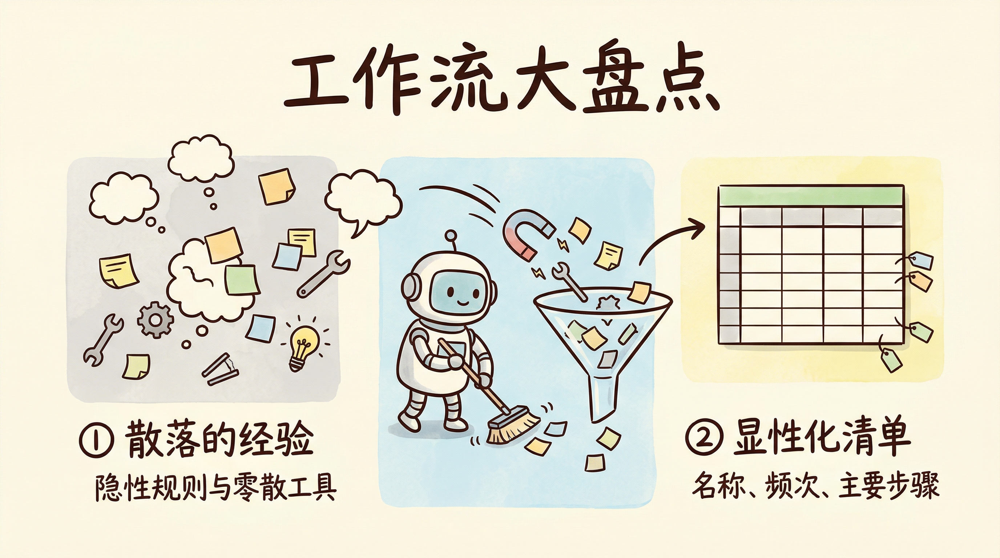

#### 12.2 为所有任务建立一个统一入口

流程盘点是「有什么」；统一入口解决的是「新任务和待办从哪进、从哪看」。如果任务和待办散落在邮件、聊天、脑子、多个 App 里，你就很难回答「今天到底要跑哪几条流程、先做哪几件事」。统一入口的原则很简单：选定一个主入口，所有新任务一律先进入口，在入口里标注任务属于哪条流程，让入口成为你「今天要跑的流程清单」的来源。这样你不是在「多建一个系统」，而是在少一个焦虑源——所有事先进一个门，再在门里分流程、排优先级。

##### 12.2.1 选定你的任务入口工具

先选定一个任务入口工具：可以是一个待办 App（如 Todoist、滴答清单、Things）、一个看板（如 Trello、飞书多维表格的看板视图）、一个文档（如 Notion 的待办列表、飞书文档里的任务表），甚至是一张每天更新的 Excel 或纸质清单。选什么不重要，重要的是：只选一个作为主入口，并约定「所有需要我跟进的事，最后都要出现在这里」。如果你已经在用某个工具记任务，就把它升级为「唯一主入口」，其他渠道（邮件、群消息、会议）只作为「信息来源」，真正要做的动作都汇总到入口里再处理。

不必追求功能最全或最「高级」——能列任务、能标属性（如所属流程、截止时间）、能按条件筛选，就够用。关键是你愿意每天打开它、先从这里看「今天要干嘛」。一旦选定，就尽量坚持用同一处，避免任务又分散到多个 App 里。

##### 12.2.2 所有新任务一律先进入口

定一条简单规则：无论任务从哪来（邮件、会议、老板一句话、自己想到的），先进入口再处理。具体可以是：收到需求或想到一件事时，先花 10 秒在入口里新建一条任务（标题可先写一句话），再决定什么时候做、归到哪条流程。这样你就不会依赖「记得住」——记在入口里，就不会忘；也不会依赖「翻聊天记录」——入口才是你的待办真相。一开始可能会觉得多了一步，习惯之后会发现，少了很多「我是不是漏了什么」的焦虑。

##### 12.2.3 在入口标注任务属于哪条流程

在入口工具里，为每条任务增加一个属性：这条任务属于哪条流程（或「无流程」）。流程名称可以直接用 12.1 盘点表里的名字，例如「日更视频流程」「会议纪要流程」「周报流程」。这样你可以随时筛选「本周所有和会议纪要相关的任务」「今天要跑的上新流程有几件」。任务和流程的对应关系，是后面「今天要跑哪几条流程」的基础：你不需要靠脑子想「今天该做啥」，而是从入口里按流程筛选，就能看到「今天要推进的流程清单」。

##### 12.2.4 让入口成为今天要跑的流程清单

每天（或每周）有一个固定时刻，从入口里「拉出」今天要执行的流程或流程中的步骤。例如：早上开工前花 5 分钟看入口，按「今日要做」或「按流程」筛选，得到「今天要跑：日更视频流程（选题+脚本）、会议纪要流程（昨天那场会）」。把这几条当作当天的「流程清单」，优先安排时间；其他零散任务再插空。这样入口就不只是「待办堆」，而是今天要跑的流程清单的来源，你的工作节奏会自然围绕「流程」转而不是围绕「杂事」转。

【心法】  
统一入口不是「多一个系统」，而是「少一个焦虑源」——所有事先进一个门，再在门里分流程、排优先级。入口 + 流程标注，就是你个人工作系统的「前台」。

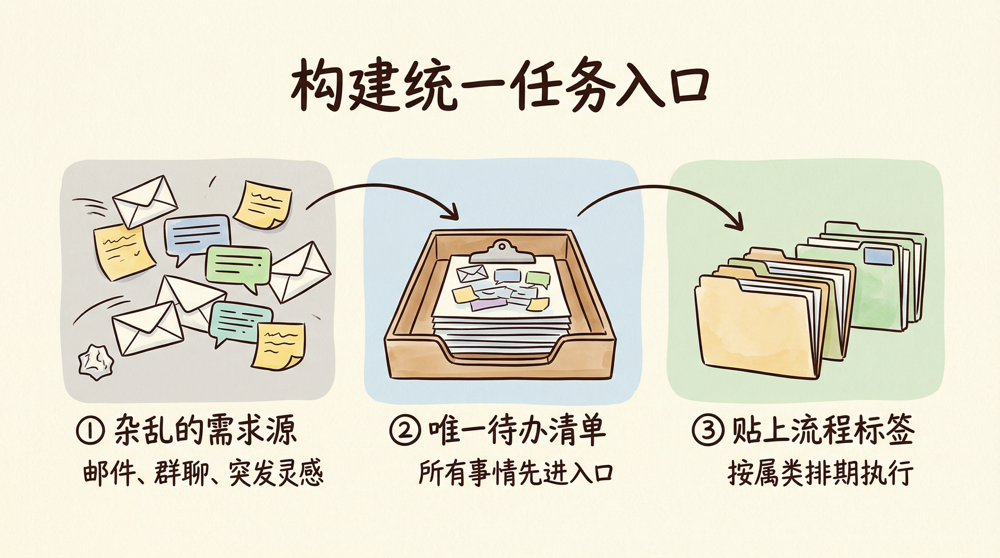

#### 12.3 为你的工作系统设定固定节奏

有流程、有入口，还要有节奏：什么时候做哪类事、什么时候检查流程。否则流程和入口很容易被日常琐事冲散，用一阵就断。固定节奏的作用，是让「系统」而不是「心情」驱动工作——到点就切换、到点就检查，习惯成自然。

##### 12.3.1 设定每天的固定切换时刻

为每一天设定一两个固定切换时刻，把不同流程或不同类型的工作「绑」到固定时间段。例如：上午 9:00～12:00 专注「内容生产类」流程（如日更视频的选题和脚本），下午 14:00～16:00 处理「沟通与汇报」类（会议纪要、周报、跨部门沟通），周五下午留 1 小时做「流程检查」（见 12.3.2）。具体怎么切分可以根据你的主业调整，原则是：同一类流程尽量在固定时段做，减少「现在该干嘛」的纠结，也便于形成节奏感。

如果暂时做不到「每天固定时段」，可以先把「每天有一个固定时刻看入口、勾出今天要跑的流程」定下来——例如每天早上的前 10 分钟，只做一件事：打开入口，按「今日」或「按流程」筛一遍，在心里或纸上列出「今天要跑哪几条流程、每条做到哪一步」。这个小动作本身就会慢慢形成节奏感，再逐步细化到具体时段。

##### 12.3.2 为每周留出一次流程检查时间

每周留出一次流程检查时间（建议 30 分钟～1 小时）：这段时间不执行具体任务，只做一件事——检查本周哪条流程跑了、哪条没跑、为什么。可以对着 12.1 的流程盘点表，逐条过：这条本周跑了几次？如果没跑，是没需求还是忘了、被挤掉了？如果跑了，有没有卡点或断点？检查的目的不是批评自己，而是让「流程状态」可见，为下一步调整（12.3.4）提供依据。

##### 12.3.3 用三个问题检查流程的状态

在流程检查时间里，对每条主流程（你选出的 3～5 条）用三个问题过一遍，并把答案简单记下来（可在流程表旁加一列「本周检查备注」）：

1. 这条流程本周跑了几次？（和预期频次是否一致？）
2. 卡点或断点在哪？（哪一步总拖、哪一步容易忘、哪一步工具不好用？）
3. 需要调整的是步骤、工具还是人？（是流程设计要改、要换/加一个 Agent、还是自己或协作方的习惯要改？）

三个问题问完，你会得到一批「改进点」——有的可以立刻改，有的需要记下来下次迭代。这就是 12.3.4 要做的：把改进点变成入口里的小任务，避免「检查完就忘」。

| 流程名称     | 本周次数 | 卡点/断点           | 待调整（步骤/工具/人） |
| :----------- | :------- | :------------------ | :-------------------- |
| 日更视频流程 | 5/7      | 封面有时来不及做    | 考虑把封面步骤再提前  |
| 会议纪要流程 | 3        | 无                  | —                     |
| 周报流程     | 1        | 周五下午总被挤掉    | 改到周五上午 30 分钟  |

##### 12.3.4 将发现的调整点记成小任务

流程检查得到的「待调整」项，不要只写在表里就结束。每一条都变成入口里的一条小任务，例如：「优化日更流程：把封面步骤提前到脚本之后」「周报时间改为周五上午」。这样下次你有空时，可以从入口里按「流程优化」或「系统维护」筛选，逐条做掉；做完了再在流程表或流程文档里更新一版。节奏 + 检查 + 改进任务，形成闭环，你的工作系统才会持续进化而不是搭完就静止。

【心法】  
节奏比单次完美更重要。固定节奏才能让「系统」而不是「心情」驱动工作；每周检查 + 三问 + 改进任务，让系统可持续、可迭代。

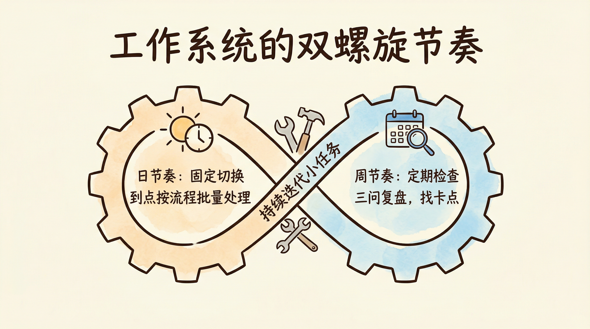

#### 12.4 让 Agent 成为流程体系中的固定角色

你在第 7～11 章在扣子编程上搭好的那些智能体——选题、脚本、封面、主图需求卡、评价分析、营销文案、会议纪要、周报、跨部门沟通、行业简报、方案生成、方案分析、情境推演与决策规则——都不是「偶尔用用的工具」，而应该成为你流程体系里的固定角色。也就是说：在流程的哪一步、由哪个智能体执行、输入输出是什么，都要写进「流程版本」里，每次跑这条流程时都按同一套来，Agent 才真正被纳入系统。这一节讲四件具体的事：标记由 Agent 执行的步骤、统一关键步骤的 Agent 角色、把稳定 Agent 写入流程版本、让 Agent 长期稳定嵌入流程。

##### 12.4.1 标记必须由 Agent 执行的步骤

在 12.1 的流程清单或你画过的流程图里，明确标出「这一步由 XX 智能体执行」。例如：日更视频流程里，「选题」由选题智能体出初稿、「脚本」由脚本智能体出初稿、「封面」由配图/封面智能体出图；会议纪要流程里，「转写与整理」由会议纪要助手完成，「提炼行动项」可以由同一助手或再建一个行动项提炼助手完成。标清楚之后，你就知道：哪些步骤是「人做」、哪些是「Agent 做」、哪些是「人+Agent 协作」（Agent 出初稿、人把关）。这样流程和 Agent 的对应关系一目了然，不会出现「有时用有时不用」的随意状态。

##### 12.4.2 为关键步骤统一 Agent 角色

同一类步骤，尽量用同一个 Agent 角色。例如：所有「周报初稿」都交给周报助手，所有「跨部门沟通草稿」都交给跨部门沟通助手；不要今天用 A 明天用 B，否则你很难形成稳定习惯，流程版本也不好写。所谓「统一角色」，不是说你只能有一个智能体，而是说「同一类任务对应同一类智能体」——这样认知负担小，也便于在流程文档里写「步骤 2：调用周报助手，输入本周事项列表，输出周报草稿」。

##### 12.4.3 将稳定 Agent 写入流程版本

为每条主流程维护一个流程版本（可以是一份短文档或一张表）：写清这条流程的步骤顺序、每一步的输入、输出、执行者（人还是哪个智能体）。例如：

- **步骤 1**：人整理本周完成事项与下周计划要点（输入：零散记录；输出：要点列表）。
- **步骤 2**：调用周报助手，输入要点列表，输出周报草稿（执行者：周报助手）。
- **步骤 3**：人补个人判断与优先级，定稿并提交（执行者：人）。

把智能体的名字、输入输出写进流程版本，有三大好处：一是你自己每次跑流程时不会忘「这一步该开哪个智能体」；二是交接或带人时，对方能按文档操作；三是复盘时能看清「是步骤设计问题还是 Agent 输出问题」。你在扣子编程上搭好的智能体，在这里就是这些「固定角色」；把它们的名字、输入输出写进流程版本，你的系统就真正把 Agent 纳入了。

若你希望「一眼看到所有在用的智能体」，可以在扣子编程里建一个「我的工作流总览」项目：不新建智能体，只新建一个文档或列表，把你在 12.1 盘点表里用到的智能体名称、对应流程、主要输入输出列进去。以后每次加新流程或新智能体时，顺手更新这份总览，和 12.1 的流程盘点表对应起来，你的「系统菜单」就更清晰了。

##### 12.4.4 让 Agent 长期稳定嵌入流程

最后一步是用流程版本约束自己的行为：每次跑这条流程时，都按同一套步骤、同一批 Agent 来执行，不临时换、不跳过。这样 Agent 才是「流程里的固定角色」，而不是「想起来了才用一下」的临时工具。长期稳定嵌入之后，你才会真正体会到「系统」的威力：流程在转、Agent 在固定位置出力、你只需要在关键节点做判断和拍板，而不是每一步都从零想。

【心法】  
Agent 只有写进流程版本、每次跑流程都按同一套调用，才是「系统里的固定角色」。你在第 7～11 章搭好的智能体，在这一章的任务就是「挂进系统」——标记步骤、统一角色、写入流程版本、长期按版本跑。

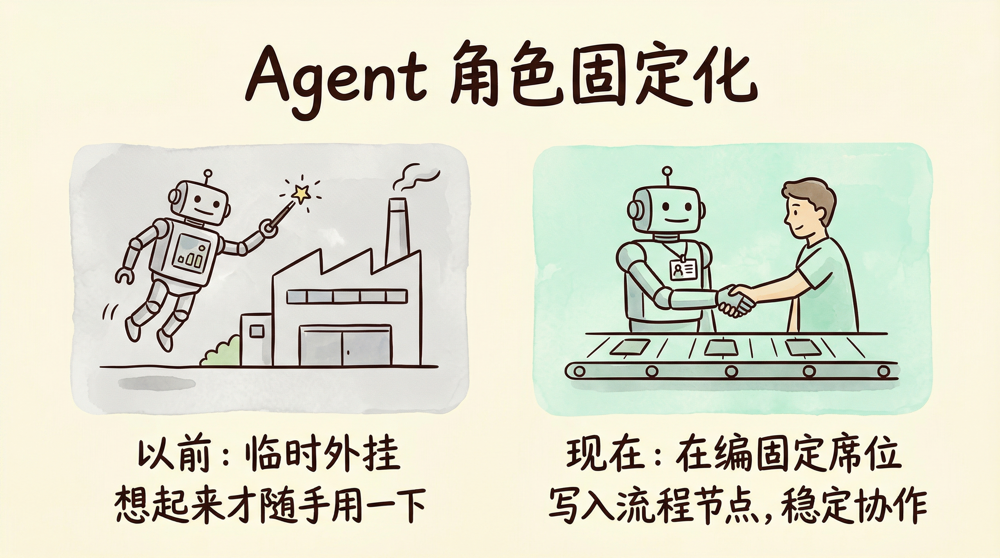

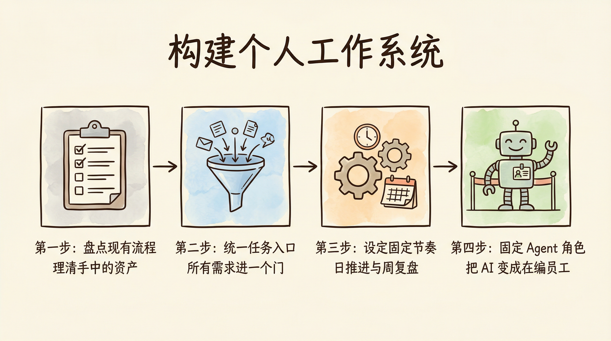

#### 本章结语

这一章我们做了四件事，把「几条流程」升级成了「个人工作系统」的雏形：

1. **盘点**：整理所有现有流程、标频次与标签、选出 3～5 条主流程，让「有什么」可见、可选、可排优先级。
2. **统一入口**：选定一个任务入口、新任务一律先进入口、在入口标注所属流程、让入口成为「今天要跑的流程清单」的来源，少一个焦虑源、多一个控制点。
3. **固定节奏**：设定每日切换时刻、每周留出流程检查时间、用三问检查流程状态、把改进点记成入口里的小任务，让系统而不是心情驱动工作，并可持续迭代。
4. **Agent 固定化**：在流程里标记由 Agent 执行的步骤、统一关键步骤的 Agent 角色、将稳定 Agent 写入流程版本、按版本长期跑，让扣子编程上搭好的智能体真正成为系统里的固定角色。

这四件事合起来，就是「个人工作系统」的骨架：有在编流程、有统一入口、有节奏与检查、有稳定嵌入的 Agent。系统搭起来之后，下一步是让这套方式长在你身上——变成你的默认工作方式、用小动作持续变强、开始影响他人，并且不依赖某一种工具。下一章我们会聊：如何形成「先想流程再动手」的习惯、如何用五分钟复盘和每月优化一条流程让系统变强、如何让你的工作方式成为可复用的价值输出，以及为什么「工具会更新，方法论会留下」——你的工作方式 2.0，将从这里真正开始。


---

### 第13章 从「会做事」到「拥有自己的工作方式」

上一章我们把「几条流程」收拢成了一整套个人工作系统：有盘点、有统一入口、有固定节奏、有稳定嵌入的 Agent。系统搭起来了，接下来要做的事只有一件：让这套方式长在你身上，并开始影响他人。

这一章不再教你「再建一个智能体」或「再画一张表」。我们要聊的是：当工作方式系统化之后，你这个人会怎样变化——思维模式、执行习惯、价值输出。重点在于形成「流程优先」与「方法迁移」的习惯，使个人能力从经验驱动转向系统驱动。最后，我们会回到这本书的起点：工具会更新，但方法论会留下。你带走的不是某一家产品，而是一套可以跟着你走很久的做事方式。

#### 13.1 形成新的默认工作方式

系统搭好之后，最容易出现的状况是「偶尔用用」——忙的时候想不起来、闲的时候才打开流程表。要让系统真正生效，需要把「先想流程、再动手」变成你的默认反应，而不是例外。新的默认不是「所有事都流程」，而是：值得重复的事，先有流程再跑。

##### 13.1.1 先判断是否要沉淀流程

遇到新任务时，先问自己两个问题：这类事以后还会重复吗？值得为它画一张图吗？如果答案是「会重复」且「值得」，就不要立刻埋头开干，而是先花几分钟想清楚：这件事可以拆成哪几步、每步的输入输出是什么、哪一步可以交给 Agent。想不清楚时，哪怕先列三条「第一步、第二步、第三步」再动手，也会比「这次先做了再说」更有积累。很多人的流程不是一次性设计出来的，而是某次做事时多问了一句「这事能变成流程吗」，然后才慢慢沉淀成一张图、一张表。

##### 13.1.2 画流程图后再开始行动

还记得第 3 章说的吗？流程图是结构化工作的起点。哪怕是很简的几步，先有图再执行，和「边做边想」差别很大。先有图，你就知道每一步的接口在哪里、哪里可以接 Agent、哪里必须人把关；边做边想，则容易变成一次性的手工作业。不要求每件事都画成一张标准流程图，但至少养成习惯：遇到重复型任务，先在心里或纸上过一遍「步骤—输入—输出—执行者」，再动工。这个动作本身就会慢慢改变你的默认工作方式：从「接到任务就干」变成「接到任务先想结构」。

##### 13.1.3 让流程化成为你的习惯

不追求一次做全、一次做完美。追求的是：每次多问一句——这事能变成流程吗？能记下来下次直接用吗？能交给 Agent 一步吗？问多了，你就会自然地把「可重复」和「可流程化」当成筛选标准，把零散动作一点点收进系统。习惯成自然之后，你不是在「用」一套系统，而是「活」在这套系统里——该跑哪条流程、该在什么时间检查、该把哪一步交给哪个智能体，都会变成条件反射，而不需要每次重新想。

【心法】
新的默认不是「所有事都流程」，而是「值得重复的事，先有流程再跑」。先判断、再画图、再行动，流程化就会慢慢成为你的习惯。

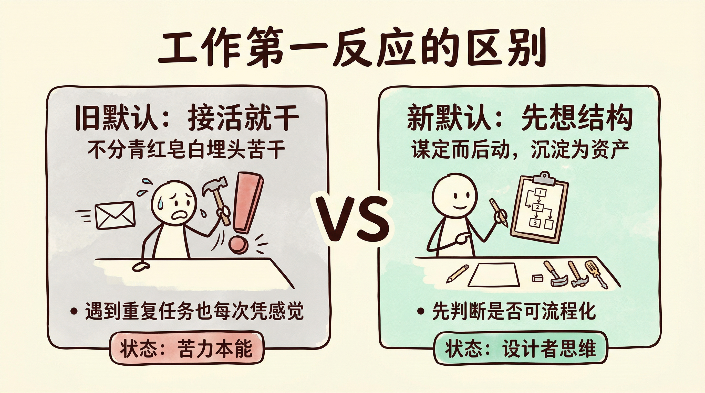

#### 13.2 用小动作持续让系统变强

系统搭完不是终点，而是起点。要让系统持续变强，不需要大动干戈，只需要一些小动作、小节奏，长期坚持。

##### 13.2.1 保留主流程清单

你在第 12 章已经盘过点、选出了 3～5 条主流程。把这份主流程清单保留下来，当作你的「系统菜单」——随时可查、可增删。新加一条流程就补进清单，某条流程很久不用就标成「暂停」或移出主菜单，但不要丢。主流程清单是你个人工作系统的目录，有了它，你就不会忘记「自己还有哪些流程可用」，也不会在忙乱时又退回「想到啥做啥」的旧模式。可以把它放在统一入口的显眼位置，或单独建一页「我的主流程」，每周检查时扫一眼，确认每条流程的状态。

##### 13.2.2 做一次五分钟复盘

每周流程检查时（第 12 章 12.3 的固定节奏），多问一句：这条流程里，有没有一步可以交给 Agent？有没有一步可以合并或删掉？有没有一步总是卡住、需要改一改？不需要立刻改，只要把答案记下来，放进「待优化清单」。例如：发现「写周报时每次都要自己汇总零散记录」，就记一条「周报流程—汇总步骤—可交给 Agent」；发现某步总在等别人反馈才推进，就记「优化接口或提前沟通」。每次只花五分钟，但长期积累下来，你会有一张清晰的「系统可改进点」列表，下次有空时按清单逐条优化即可。系统变强，靠的是这种小步复盘，而不是某一天推倒重来。

##### 13.2.3 记录可交给 Agent 的步骤

在做事或复盘时，一旦发现「这一步好像可以交给 Agent」，就记下来：哪条流程、哪一步、打算用什么类型的 Agent（写作类、信息类、图像类等）。不要求立刻去扣子编程上搭，先记下来就行。积累成「待交给 Agent 的步骤」清单，每月或每季度挑一两步落实，系统就会一点点「变聪明」。这样你既不会因为「想一次做完」而拖延，也不会忘记那些本可以自动化的环节。

##### 13.2.4 每月优化一条流程

不贪多。每月只动一条流程：要么增加一步 Agent、要么简化一步、要么调整顺序或接口。动完就稳下来用一阵，看效果再决定下一步改什么。系统变强靠的是小步迭代，不是推倒重来。每月一条，一年就是十二条优化，足够让一套个人工作系统脱胎换骨。

【心法】
系统变强靠的是「小步迭代」——保留主流程清单、五分钟复盘、记录可交给 Agent 的步骤、每月优化一条。不需要某一天大改，只需要持续小改。


#### 13.3 让你的工作方式开始影响别人

当你的流程和系统稳定运转之后，它们会自然开始「外溢」：同事会问你「这事你怎么做得这么快」，合作方会注意到「和你对接特别清晰」，新人会按你的流程上手。这时，工作方式就不再只是你个人的效率工具，而成了你的价值输出——别人看得见、学得会、协作得上。

##### 13.3.1 用流程回应同事提问

当同事问你「这事怎么做」「你们一般怎么走」时，不要只口头讲一遍。直接给出一张流程图或一份步骤清单：「我们一般这么走：第一步……第二步……这里用 Agent 出初稿，这里人把关。」对方一眼能看懂，你也不用每次重复解释。用流程回应提问，既节省你的时间，也把「我们团队/我们部门是怎么做事的」沉淀下来，新来的人也能按图索骥。例如：别人问「你们会议纪要怎么出的」，你发过去一份「会议纪要流程」——录音转文字稿丢进纪要助手、出草稿后人补重点与待办、按模板分发；对方照做就能对齐你的节奏。

##### 13.3.2 用流程推进合作事项

跨部门、跨团队协作时，最容易出现「你以为我说清楚了、我以为你听懂了」的偏差。用流程推进合作：把协作拆成有步骤、有输入输出、有节点的节奏，对方更容易跟上，你也更容易检查「卡在哪一步」。例如：合作方需要你提供什么、你在什么时间前给、对方在什么时间前反馈，写进一张简表或一条简短流程，大家按同一套节奏走，协作成本就会明显下降。你甚至可以把自己在 12 章建立的「统一入口」思路推广到协作：约定一个共享的协作入口（如一份共享文档、一个任务看板），把「待对方提供」「待我方反馈」标清楚，流程化协作本身也会成为你的影响力。

##### 13.3.3 用可复用的方法带团队成长

还记得第 3 章讲的可交接性吗？当你的流程和 Agent 写进了文档、写进了流程版本，新人就可以按流程上手，而不必完全依赖你口传心授。你可以把主流程清单、关键步骤的输入输出、以及「哪一步用哪个智能体」打包成一份「新人上手指南」，让团队里更多人用同一套方式做事。这样你带的不只是「人」，而是「可复制的工作方式」——人会流动，方式可以留下。

##### 13.3.4 让方式方法成为你的价值输出

你的价值不仅是「做了啥」，还有「你是怎么做的、别人能不能复用」。当你的流程和系统能被别人看懂、复用，你就从「做事的人」多了一个「设计工作方式的人」的维度。这在职场里会逐渐变成一种可辨识的能力：这个人不仅能把事做完，还能把做事的方法沉淀下来、传下去。工作方式系统化之后，这种能力会自然显现。

【心法】
当你的流程和系统能被别人看懂、复用，你就从「做事的人」多了一个「设计工作方式的人」的维度。用流程回应提问、用流程推进合作、用可复用方法带团队，方式方法就会成为你的价值输出。

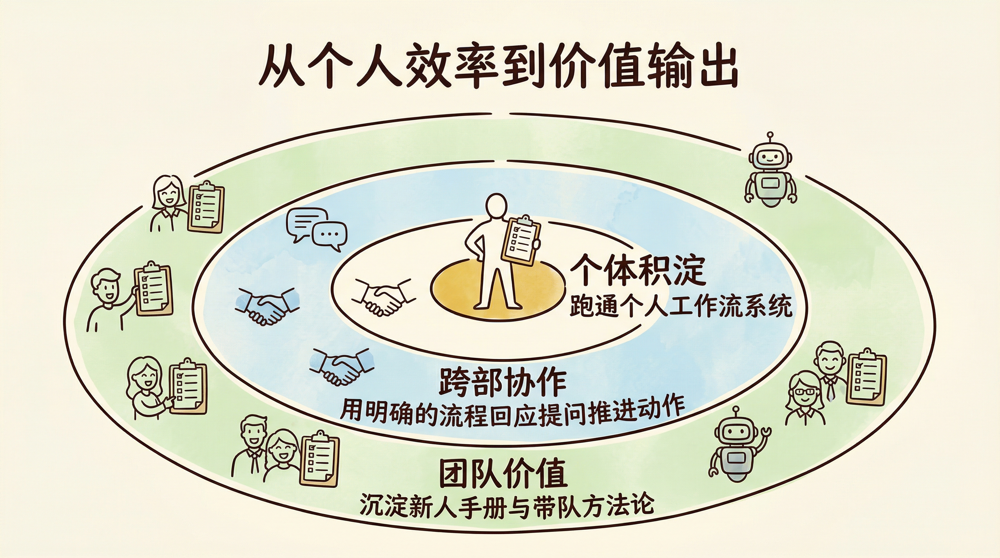

#### 13.4 工具会更新，但方法论会留下

这本书里我们用了扣子编程做实操、用五类人群做了案例，但你要带走的不是某一家产品，而是一套可迁移的做事逻辑。工具会更新、软件会迭代，但方法论会留下。

##### 13.4.1 工具在变，做事逻辑不变

五步法、流程图、输入输出、人机分工——这些逻辑换一个平台一样用。不管将来你用的是扣子、Dify、n8n 还是还没诞生的新工具，只要你心里有「明确目标、拆解步骤、定义接口、分配执行者、沉淀资产」这套逻辑，你就能在新平台上快速复现你的工作系统。工具在变，做事逻辑不变。

##### 13.4.2 软件可换，流程也可迁移

流程是抽象的结构：步骤顺序、每步的输入输出、哪一步由人做、哪一步由 Agent 做。这些信息可以写在一份文档里、一张表里，与具体软件解耦。今天你在扣子编程上搭的智能体，明天你可以用同一份流程描述在别的平台上再搭一遍；今天用的待办 App，明天可以换一个，只要「统一入口、标注流程、按节奏检查」的规则不变，系统就能迁移。软件可换，流程也可迁移。

##### 13.4.3 留下的是方法，不是技巧

技巧会过时——某款产品的按钮怎么点、某个模型的参数怎么调，可能明年就变了。但方法会长期有用：如何把任务拆成步骤、如何定义人与 Agent 的边界、如何用节奏和复盘让系统持续进化、如何把流程写成可交接的文档。这些方法不依赖某一家公司、某一款产品，它们是你自己的「工作方式操作系统」。留下的是方法，不是技巧。

##### 13.4.4 你的「工作方式 2.0」开始了

回忆一下前言里我们讲过的「手工作坊」和「智能工厂」：在手工作坊里，你每次接到任务都从零开始、凭感觉干；在智能工厂里，你有了图纸、有了流水线、有了一批按角色分工的「数字员工」。读完这本书、搭完你的流程和系统之后，你已经有了一张属于自己的「工厂图纸」和一批可用的 Agent。接下来，就是持续运转、迭代、让这套方式长在身上、并开始影响他人。

这不是终点，而是起点。工具会继续更新，你可以随时把新平台、新模型接进原有流程；流程也可以继续增删，你的主流程清单会随着工作重心变化而演化。唯一不变的，是你已经建立起来的「先想结构、再分配执行者、再用节奏和复盘保持系统运转」的思维习惯。你的「工作方式 2.0」已经开始了。

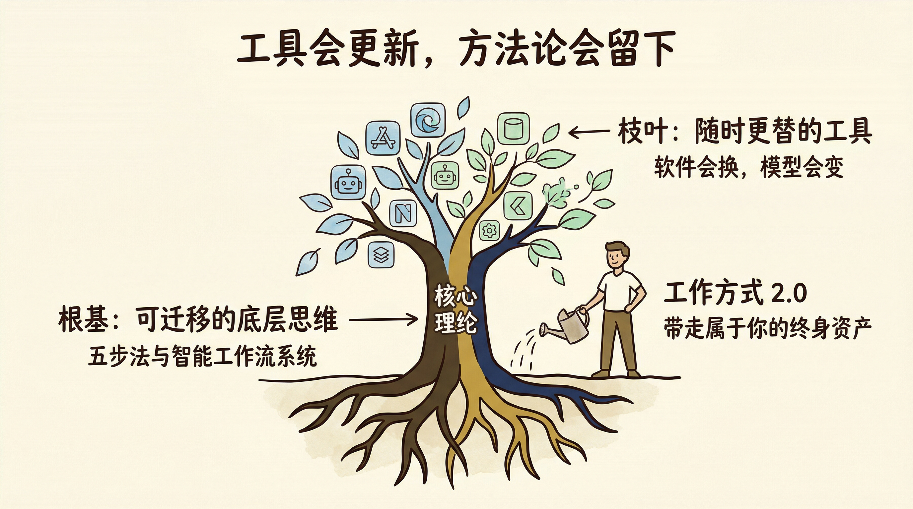

#### 全书结语

写到这里，这本书就要和你告别了。

我们一起走了很长一段路。从厘清 AI、Agent 与工作流的关系开始，到用流程图和五步法把想法变成可执行的流水线，再到在扣子编程上亲手搭出选题、脚本、会议纪要、方案分析……一批真正能用的智能体；最后，把零散的流程收拢成个人工作系统，并聊了系统搭好之后，你这个人会怎样变化——新的习惯、小步迭代、影响他人，以及为什么「工具会更新，方法论会留下」。如果你曾跟着某一章、某一条流程动手做过，哪怕只做过一次，你已经不再是那个只能凭感觉做事的人了。你心里有了一张图，手里有了一批数字员工，你知道「先想结构、再分配、再用节奏保持运转」是怎么一回事。

前言里我说过，希望你能完成三层进化：掌握一套通用的工作流方法论、学会给 Agent 写岗位说明书、建立属于自己的个人智能工作系统。这些不是空话——它们会跟着你走。换一个平台、换一份工作，只要你愿意把「值得重复的事先变成流程」当成习惯，这套方法就会一直在。你带走的，不是某一家产品，而是一套可迁移的做事方式、一批可复用的流程与智能体，以及一种新的默认：先想流程，再动手。

从手工作坊到智能工厂，你已经拿到了自己的图纸。接下来，就在日常工作中反复用、持续练就好。

最后顺便提一句：眼下不少平台（如扣子 2.0）正在推「Skill（技能）」——把某一类能力封装成可复用模块，供多个智能体配置或单独调用。你可以理解为：智能体像你招来的一个员工（有名字、有岗位，你跟他对话、给他派活）；Skill 像公司里谁都能领用的一套标准工具或操作手册（比如「查订单」「生成报表」），同一套可以配给不同的员工，也可以单独拿出来用。二者互补，本书专注教你搭智能体与工作流，Skill 作为平台新方向，留待你在用熟智能体之后再去探索即可。

感谢你一路读到这里，愿这套方法在你手中越用越熟、越用越稳。


---
